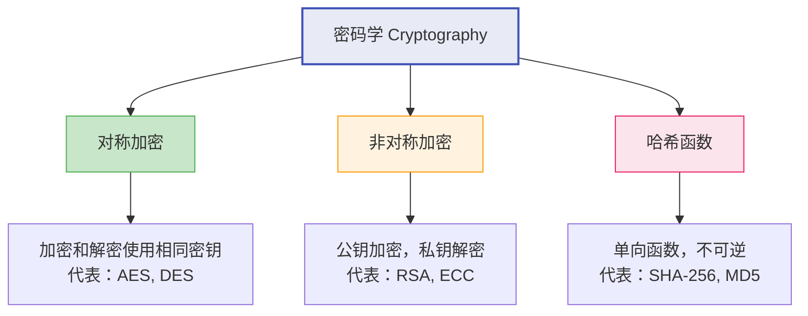
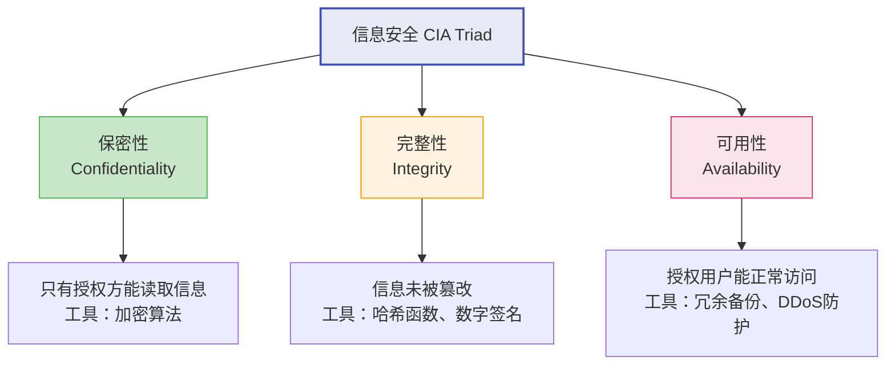
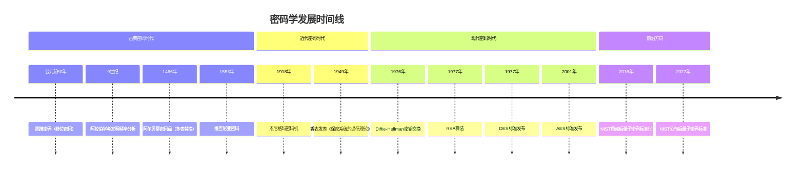

# 密码学概述与历史

## 学习目标

- 理解密码学的定义及其三大核心分支
- 了解密码学从古典到现代的发展历程
- 掌握密码学的基本术语：明文、密文、密钥、加密、解密
- 理解柯克霍夫原则（Kerckhoffs's Principle）的意义
- 认识 CIA 三元组（保密性、完整性、可用性）

## 前置知识

- 基本的计算机科学概念
- 对二进制和十六进制有初步了解（将在下一节详细讲解）

## 核心概念与术语

### 什么是密码学

密码学（Cryptography）一词源自希腊语 *kryptós*（隐藏）和 *gráphein*（书写），字面意思是"隐藏书写的艺术"。在现代语境下，密码学是研究如何在不安全的通信信道中保护信息安全的科学。

!!! info "密码学 vs 密码分析"

    - **密码学（Cryptography）**：设计安全的加密系统
    - **密码分析（Cryptanalysis）**：试图破解加密系统
    - 两者共同构成**密码术（Cryptology）**

### 密码学的三大分支



#### 对称加密（Symmetric Encryption）

发送方和接收方使用**同一把密钥**进行加密和解密。就像你和朋友共用一把钥匙来锁箱子和开箱子。

- **优点**：速度快，适合大量数据加密
- **缺点**：密钥分发困难——如何安全地把钥匙交给对方？

#### 非对称加密（Asymmetric Encryption）

使用**一对密钥**：公钥（public key）和私钥（private key）。公钥可以公开，私钥必须保密。

- **优点**：解决了密钥分发问题
- **缺点**：计算速度较慢

#### 哈希函数（Hash Function）

将任意长度的输入映射为固定长度的输出，且**不可逆**。

- **用途**：数据完整性校验、密码存储、数字签名
- **特点**：微小的输入变化会导致输出完全不同（雪崩效应）

### 基本术语

| 术语 | 英文 | 定义 |
|------|------|------|
| 明文 | Plaintext | 原始的、未加密的消息 |
| 密文 | Ciphertext | 加密后的消息 |
| 密钥 | Key | 控制加密/解密过程的秘密参数 |
| 加密 | Encryption | 将明文转换为密文的过程 |
| 解密 | Decryption | 将密文还原为明文的过程 |
| 算法 | Algorithm / Cipher | 加密/解密使用的数学方法 |

加密和解密可以用数学公式表示：

$$
C = E_K(P)
$$

$$
P = D_K(C)
$$

其中 $P$ 是明文，$C$ 是密文，$K$ 是密钥，$E$ 是加密函数，$D$ 是解密函数。

### 柯克霍夫原则

!!! warning "柯克霍夫原则（Kerckhoffs's Principle）"

    密码系统的安全性应该依赖于**密钥的保密性**，而不是算法的保密性。

    换句话说：即使攻击者知道你的加密算法，只要密钥没有泄露，系统就应该是安全的。

    这个原则由 Auguste Kerckhoffs 在 1883 年提出，至今仍是现代密码学的基石。

为什么这个原则如此重要？因为：

1. **算法很难保密**——一旦被逆向工程，整个系统就崩溃了
2. **密钥可以随时更换**——即使泄露了，换一把新钥匙即可
3. **公开算法可以被广泛审查**——经过全世界密码学家检验的算法更值得信赖

### CIA 三元组

信息安全的三大支柱，也称为安全三要素：



## 密码学历史时间线



!!! example "历史故事：恩尼格玛密码机"

    第二次世界大战中，德国使用的恩尼格玛（Enigma）密码机是历史上最著名的加密设备之一。它通过一系列转子（rotor）实现多表替换加密，理论上可能的密钥组合超过 $10^{16}$ 种。

    然而，由 Alan Turing 领导的英国布莱切利园团队通过数学分析和早期计算机成功破解了恩尼格玛，这被认为是缩短二战的关键因素之一。

    这个故事告诉我们：**没有绝对不可破解的密码，关键在于破解的成本是否超过了信息的价值。**

## 动手实践

### 实验1：用 OpenSSL 体验基本加解密

**使用 OpenSSL 进行 AES 加密：**

```bash
# 创建一个包含明文的文件
echo "Hello Cryptography World" > plaintext.txt

# 使用 AES-256-CBC 加密
openssl enc -aes-256-cbc -salt -in plaintext.txt -out encrypted.bin -pass pass:mysecretpassword

# 查看加密后的文件（二进制，不可读）
xxd encrypted.bin | head -5

# 解密文件
openssl enc -aes-256-cbc -d -in encrypted.bin -out decrypted.txt -pass pass:mysecretpassword

# 验证解密结果
cat decrypted.txt
```

**预期输出：**

```console
Hello Cryptography World
```

!!! note "观察要点"

    注意 `encrypted.bin` 是一堆不可读的二进制数据，而 `decrypted.txt` 恢复了原始的明文。这就是加密和解密的基本过程。

### 实验2：用 CyberChef 体验加密

在 CyberChef 中尝试以下操作：

1. 打开 CyberChef（`CyberChef_v10.19.4.html`）
2. 在 **Input** 区域输入：`Hello Cryptography World`
3. 从右侧 **Operations** 搜索 `To Base64`，拖入 **Recipe** 区域
4. 观察 **Output** 区域的 Base64 编码结果
5. 再添加 `From Base64` 操作，观察还原结果

!!! tip "CyberChef 提示"

    CyberChef 是一个强大的在线编解码和加密工具，被誉为"网络瑞士军刀"。在整个学习过程中，我们会频繁使用它。

## 安全分析与思考

### 古典密码的局限性

古典密码（如凯撒密码、维吉尼亚密码）在今天看来都是**不安全的**，原因是：

1. **密钥空间太小**——凯撒密码只有 25 种可能的密钥
2. **统计特征暴露**——字母频率在密文中仍然可辨
3. **缺乏数学安全性证明**——没有严格的数学基础

### 现代密码的安全标准

现代密码系统需要满足以下条件：

- **足够的密钥空间**——至少 $2^{128}$ 种可能的密钥
- **混淆（Confusion）**——密钥与密文之间的关系应该足够复杂
- **扩散（Diffusion）**——明文的微小变化应该导致密文的巨大变化

!!! info "香农的贡献"

    1949 年，Claude Shannon 发表了划时代的论文《保密系统的通信理论》，将密码学从一门艺术转变为一门科学。他提出了**完善保密性（Perfect Secrecy）**的概念，证明了一次性密码本（One-Time Pad）是理论上不可破解的。

## 练习题

1. **概念题**：用自己的话解释对称加密和非对称加密的区别，并各举一个生活中的类比。
2. **思考题**：为什么柯克霍夫原则要求算法可以公开？如果依赖算法保密会有什么风险？
3. **实践题**：使用 OpenSSL 命令行，尝试用不同的密码加密同一个文件，观察加密结果是否相同。
4. **扩展题**：查找资料，了解"一次一密（One-Time Pad）"的原理，思考为什么它被称为"理论上不可破解"的密码。

## 延伸阅读

- [Crypto101](https://www.crypto101.io/) — 免费的密码学入门课程
- [Simon Singh《码书》](https://simonsingh.net/books/the-code-book/) — 密码学历史的经典科普读物
- [Coursera: Cryptography I](https://www.coursera.org/learn/crypto) — Stanford 大学密码学课程
- [NIST Post-Quantum Cryptography](https://csrc.nist.gov/projects/post-quantum-cryptography) — 后量子密码学标准化项目
