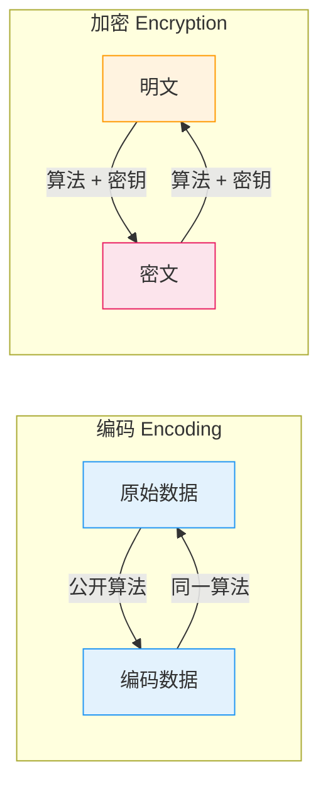
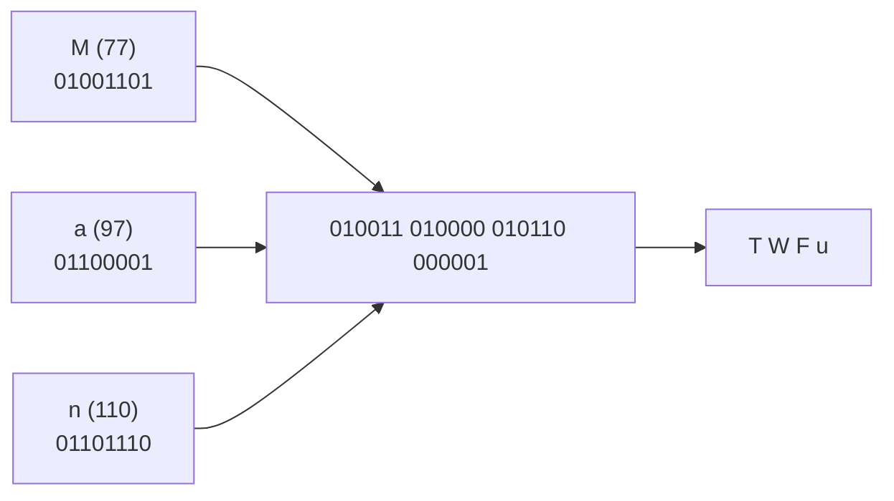

# 编码与加密的本质区别

## 学习目标

- 理解编码（Encoding）和加密（Encryption）的本质区别
- 掌握 Base64 编码的原理和实现
- 了解十六进制编码和 URL 编码
- 能够使用 OpenSSL 和 CyberChef 进行各种编解码操作
- 建立"编码不等于加密"的安全意识

## 前置知识

- [1.1 密码学概述与历史](01-overview.md) 中的基本术语
- 了解二进制和字节的基本概念

## 核心概念与术语

### 编码 vs 加密

!!! warning "核心区别"

    - **编码（Encoding）**：使用公开的算法将数据从一种格式转换为另一种格式，**不需要密钥**，任何人都可以逆向还原。
    - **加密（Encryption）**：使用密钥将明文转换为密文，**需要密钥**才能解密还原。



| 特征 | 编码 | 加密 |
|------|------|------|
| 目的 | 数据格式转换 | 保护数据机密性 |
| 密钥 | 不需要 | 必须有 |
| 可逆性 | 任何人可逆 | 只有持有密钥者可逆 |
| 安全性 | **不提供任何安全性** | 提供机密性保护 |
| 典型例子 | Base64, URL编码 | AES, RSA |

!!! danger "常见误解"

    很多初学者认为 Base64 编码是一种加密方式，这是**完全错误的**。Base64 只是一种编码方式，任何人都可以轻松解码，它**不提供任何安全保护**。

### Base64 编码原理

Base64 编码的目的是将二进制数据转换为 ASCII 文本格式，常用于在只能传输文本的信道中传输二进制数据（如电子邮件附件、URL 中的数据）。

**编码过程：**

1. 将输入数据按 **3 字节（24 位）** 为一组进行分组
2. 将每组 24 位重新划分为 **4 个 6 位** 的单元
3. 每个 6 位单元对应一个 Base64 字符

**Base64 字符表：**

| 值 | 字符 | 值 | 字符 | 值 | 字符 | 值 | 字符 |
|----|------|----|------|----|------|----|------|
| 0 | A | 16 | Q | 32 | g | 48 | w |
| 1 | B | 17 | R | 33 | h | 49 | x |
| 2 | C | 18 | S | 34 | i | 50 | y |
| 3 | D | 19 | T | 35 | j | 51 | z |
| 4 | E | 20 | U | 36 | k | 52 | 0 |
| 5 | F | 21 | V | 37 | l | 53 | 1 |
| 6 | G | 22 | W | 38 | m | 54 | 2 |
| 7 | H | 23 | X | 39 | n | 55 | 3 |
| 8 | I | 24 | Y | 40 | o | 56 | 4 |
| 9 | J | 25 | Z | 41 | p | 57 | 5 |
| 10 | K | 26 | a | 42 | q | 58 | 6 |
| 11 | L | 27 | b | 43 | r | 59 | 7 |
| 12 | M | 28 | c | 44 | s | 60 | 8 |
| 13 | N | 29 | d | 45 | t | 61 | 9 |
| 14 | O | 30 | e | 46 | u | 62 | + |
| 15 | P | 31 | f | 47 | v | 63 | / |

填充字符 `=` 用于当输入数据长度不是 3 的倍数时。

**示例：编码 "Man"**



### 十六进制编码

十六进制（Hex）编码将每个字节转换为两个十六进制字符（0-9, a-f），是最常见的二进制数据表示方式。

```bash
# 示例：字母 'A' 的十六进制表示
# 'A' 的 ASCII 值是 65 = 0x41
```

### URL 编码

URL 编码（也称为百分号编码）将 URL 中的特殊字符转换为 `%XX` 格式：

| 字符 | URL 编码 | 说明 |
|------|----------|------|
| 空格 | `%20` 或 `+` | 空格需要编码 |
| `/` | `%2F` | 路径分隔符 |
| `?` | `%3F` | 查询参数开始 |
| `#` | `%23` | 片段标识符 |
| `@` | `%40` | 电子邮件/URL中的@ |
| 中文字符 | `%XX%XX%XX` | UTF-8编码后每字节分别编码 |

## 动手实践

### 实验1：用 OpenSSL 进行 Base64 编解码

**使用 OpenSSL 命令行：**

```bash
# 创建测试文件
echo -n "Hello, Cryptography!" > test.txt

# Base64 编码
openssl base64 -in test.txt -out encoded.txt

# 查看编码结果
cat encoded.txt

# Base64 解码
openssl base64 -d -in encoded.txt -out decoded.txt

# 验证解码结果
cat decoded.txt
```

**预期输出：**

```console
# 编码结果
SGVsbG8sIENyeXB0b2dyYXBoeSE=

# 解码结果
Hello, Cryptography!
```

**直接在命令行中使用：**

```bash
# 编码
echo -n "Secret Message" | openssl base64

# 解码
echo "U2VjcmV0IE1lc3NhZ2U=" | openssl base64 -d
```

### 实验2：用 CyberChef 进行编解码

=== "Base64 编码"

    1. 打开 CyberChef
    2. 在 **Input** 区域输入：`Hello, Cryptography!`
    3. 搜索并拖入 `To Base64` 操作
    4. **Output** 显示：`SGVsbG8sIENyeXB0b2dyYXBoeSE=`

=== "Base64 解码"

    1. 清空 Input，输入：`SGVsbG8sIENyeXB0b2dyYXBoeSE=`
    2. 将 Recipe 中的 `To Base64` 替换为 `From Base64`
    3. **Output** 显示：`Hello, Cryptography!`

=== "十六进制编码"

    1. 在 **Input** 区域输入：`Hello`
    2. 搜索并拖入 `To Hex` 操作
    3. **Output** 显示：`48656c6c6f`

=== "URL 编码"

    1. 在 **Input** 区域输入：`Hello World & Cryptography!`
    2. 搜索并拖入 `URL Encode` 操作
    3. **Output** 显示：`Hello%20World%20%26%20Cryptography%21`

### 实验3：编码不等于加密

这个实验将清楚地展示编码和加密的区别：

```bash
# 编码（任何人可以解码）
echo -n "Top Secret: nuclear launch codes" | openssl base64
# 输出：VG9wIFNlY3JldDogbnVjbGVhciBsYXVuY2ggY29kZXM=

# 任何人都可以轻松还原
echo "VG9wIFNlY3JldDogbnVjbGVhciBsYXVuY2ggY29kZXM=" | openssl base64 -d
# 输出：Top Secret: nuclear launch codes

# 加密（需要密钥才能解密）
echo -n "Top Secret: nuclear launch codes" | openssl enc -aes-256-cbc -salt -pass pass:mykey -pbkdf2 | openssl base64
# 输出：一堆乱码的 Base64 表示

# 没有密钥无法解密
echo "U2FsdGVkX1..." | openssl base64 -d | openssl enc -aes-256-cbc -d -pass pass:wrongkey -pbkdf2
# 输出：错误！解密失败
```

!!! example "关键结论"

    - Base64 编码的输出可以直接解码还原——**零安全性**
    - AES 加密的输出在没有密钥的情况下无法还原——**真正的安全性**
    - **永远不要用编码来保护敏感数据！**

## 安全分析与思考

### 为什么编码不是加密？

1. **无密钥依赖**：编码算法是公开的、标准化的，不依赖任何秘密信息
2. **完全可逆**：给定编码后的数据，任何人都可以用公开的算法还原
3. **无混淆性**：编码不改变数据的统计特征，相同输入总是产生相同输出

### 编码的正确用途

编码的目的是**数据格式转换**，而非安全保护：

- **Base64**：在文本信道中传输二进制数据（如邮件附件、JSON 中嵌入图片）
- **十六进制**：以可读形式展示二进制数据（如哈希值、内存地址）
- **URL 编码**：确保 URL 中的特殊字符被正确传输
- **UTF-8**：将 Unicode 字符编码为字节序列

### 实际安全案例

!!! warning "真实案例"

    曾有开发者将密码进行 Base64 编码后存入数据库，误以为这是"加密"。攻击者获取数据库后，只需一次 Base64 解码就能获得所有明文密码。

    **正确做法**：使用专门的密码哈希函数（如 bcrypt、Argon2）来存储密码。

## 练习题

1. **概念题**：用自己的话解释编码和加密的区别。举一个编码被误用为加密的场景。
2. **实践题**：使用 CyberChef，将 `I love cryptography` 进行以下编码，并记录结果：
    - Base64 编码
    - 十六进制编码
    - URL 编码
3. **分析题**：给定字符串 `U2VjcmV0TWVzc2FnZQ==`，判断这是编码还是加密？为什么？
4. **思考题**：如果有人声称他们的"加密算法"只是将文本进行了 Base64 编码再反转字符串，这安全吗？为什么？

## 延伸阅读

- [RFC 4648 - Base16, Base32, Base64 Data Encodings](https://tools.ietf.org/html/rfc4648)
- [MDN Web Docs - URL Encoding](https://developer.mozilla.org/en-US/docs/Glossary/percent-encoding)
- [OWASP - Improper Password Storage](https://owasp.org/www-project-web-security-testing-guide/latest/4-Web_Application_Security_Testing/04-Authentication_Testing/07-Testing_for_Weak_Password_Policy)
