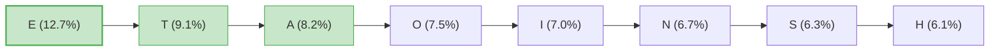

# 凯撒密码与移位密码

## 学习目标

- 理解凯撒密码的历史背景和工作原理
- 掌握移位密码的数学表示方法
- 能够实现凯撒密码的加密和解密
- 理解暴力破解的概念（穷举所有可能的密钥）
- 初步了解频率分析的思想

## 前置知识

- [1.1 密码学概述与历史](01-overview.md) — 基本术语
- [1.2 编码与加密](02-encoding.md) — 编码与加密的区别

## 核心概念与术语

### 历史背景

凯撒密码（Caesar Cipher）是历史上最古老的密码之一，由古罗马统帅尤利乌斯·凯撒（Julius Caesar）在公元前约 50 年使用。他将军事命令中的每个字母向后移动 3 位，以防止敌人截获后直接阅读。

!!! info "历史记载"

    罗马历史学家苏埃托尼乌斯（Suetonius）记载：

    > "如果他有什么需要保密的事，他会用密码书写，方法是改变字母的顺序，使得没有一个词可以被辨认出来。如果有人想解读它们，他必须用字母表中的第四个字母代替第一个字母，即 D 代替 A，以此类推。"

### 移位密码的数学表示

凯撒密码是一种特殊的**移位密码（Shift Cipher）**。其数学表示为：

$$
E(x) = (x + k) \mod 26
$$

$$
D(y) = (y - k) \mod 26
$$

其中：

- $x$ 是明文字母对应的数字（A=0, B=1, ..., Z=25）
- $y$ 是密文字母对应的数字
- $k$ 是移位密钥（凯撒密码固定 $k=3$）
- $\mod 26$ 表示对 26 取模（因为英文字母有 26 个）

### 字母映射表（k=3）

下表展示了凯撒密码（$k=3$）的完整映射关系：

| 明文 | A | B | C | D | E | F | G | H | I | J | K | L | M |
|------|---|---|---|---|---|---|---|---|---|---|---|---|---|
| 密文 | D | E | F | G | H | I | J | K | L | M | N | O | P |

| 明文 | N | O | P | Q | R | S | T | U | V | W | X | Y | Z |
|------|---|---|---|---|---|---|---|---|---|---|---|---|---|
| 密文 | Q | R | S | T | U | V | W | X | Y | Z | A | B | C |

!!! note "移位特性"

    注意 Z 经过移位后变成了 C——这就是"循环移位"的效果，数学上通过 $\mod 26$ 运算实现。

### ROT13

ROT13 是凯撒密码的一个特例，其中 $k=13$。由于英文字母有 26 个，连续应用两次 ROT13 就会恢复原文：

$$
ROT13(ROT13(x)) = (x + 13 + 13) \mod 26 = (x + 26) \mod 26 = x
$$

这意味着 ROT13 的加密和解密使用完全相同的操作——这是一个非常优美的性质。

## 动手实践

### 实验1：用 OpenSSL 体验 ROT13

```bash
# OpenSSL 没有直接的 ROT13，但可以用 tr 命令实现
echo "HELLO CRYPTOGRAPHY" | tr 'A-Za-z' 'N-ZA-Mn-za-m'
# 预期输出：URYYB PELCGBTENCUL

# 再次应用 ROT13 还原
echo "URYYB PELCGBTENCUL" | tr 'A-Za-z' 'N-ZA-Mn-za-m'
# 预期输出：HELLO CRYPTOGRAPHY
```

!!! tip "tr 命令说明"

    `tr` 是 Linux/Unix 的字符转换命令。`tr 'A-Za-z' 'N-ZA-Mn-za-m'` 的含义是：
    - `A-Z` → `N-ZA-M`：大写字母 A 映射到 N，B 映射到 O，...，M 映射到 Z，N 映射到 A
    - `a-z` → `n-za-m`：小写字母同理

### 实验2：用 Python 脚本加解密

运行配套脚本 `scripts/caesar_cipher.py`：

```bash
python scripts/caesar_cipher.py
```

**预期输出：**

```console
========================================
  凯撒密码演示程序
========================================

--- 加密演示 ---
明文: HELLO WORLD
密钥: 3
密文: KHOOR ZRUOG

--- 解密演示 ---
密文: KHOOR ZRUOG
密钥: 3
明文: HELLO WORLD

--- 暴力破解（尝试所有25种密钥） ---
密文: KHOOR ZRUOG
密钥  1: JGNNQ YQTNF
密钥  2: IFMMP XPUME
密钥  3: HELLO WORLD    <-- 找到有意义的明文！
密钥  4: GDKKN VNQKC
密钥  5: FCJJM UMPJB
...
```

### 实验3：用 CyberChef 解密凯撒密码

=== "方法1：ROT13"

    1. 在 **Input** 区域输入密文：`KHOOR ZRUOG`
    2. 搜索并拖入 `ROT13` 操作
    3. 如果密钥恰好是 13，就能直接解密

=== "方法2：ROT Brute Force"

    1. 在 **Input** 区域输入密文：`KHOOR ZRUOG`
    2. 搜索并拖入 `ROT13` 操作
    3. 在 ROT13 的参数中，将 `Amount` 改为不同的值（1-25）
    4. 逐一尝试，找到有意义的明文

=== "方法3：ROT47"

    ROT47 是 ROT13 的扩展版本，处理 ASCII 33-126 范围的字符：
    1. 在 Input 中输入：`KHOOR ZRUOG`
    2. 搜索 `ROT47` 并拖入
    3. 观察输出结果

### 实验4：暴力破解演示

暴力破解（Brute Force Attack）是最简单的攻击方式——尝试所有可能的密钥：

```bash
# 运行脚本的暴力破解功能
python scripts/caesar_cipher.py --bruteforce "KHOOR ZRUOG"
```

**预期输出：**

```console
=== 暴力破解凯撒密码 ===
密文: KHOOR ZRUOG

密钥  0: KHOOR ZRUOG
密钥  1: JGNNQ YQTNF
密钥  2: IFMMP XPUME
密钥  3: HELLO WORLD   ★ 可能的明文
密钥  4: GDKKN VNQKC
密钥  5: FCJJM UMPJB
密钥  6: EBIIL TLOIA
密钥  7: DAHHS SKNHZ
密钥  8: CZGGR RJMGY
密钥  9: BYFFQ QILFX
密钥 10: AXEEP PHKEW
密钥 11: ZWDDO OGJDV
密钥 12: YVCCN NFICU
密钥 13: XUBBM MEHBT
密钥 14: WTAAL LDGAS
密钥 15: VSZZK KCFZR
密钥 16: URYYJ JBEYQ
密钥 17: TQXXI IADXP
密钥 18: SPWHH HZCWO
密钥 19: ROVGG GYBVN
密钥 20: QNUFF FXAUM
密钥 21: PMTEE EWZTL
密钥 22: OLSDD DVYSK
密钥 23: NKRCC CUXRJ
密钥 24: MJQBB BTWQI
密钥 25: LIPAA ASVPH

找到 1 个可能的明文（密钥 = 3）
```

!!! note "为什么暴力破解对凯撒密码有效？"

    凯撒密码只有 **25 种**可能的密钥（密钥 0 等于不加密）。攻击者只需要逐一尝试这 25 种可能性，找到一个读得通的明文即可。在计算机面前，这几乎是瞬间完成的。

## 安全分析与思考

### 密钥空间分析

凯撒密码的密钥空间非常小：

$$
\text{密钥空间} = 26 - 1 = 25
$$

这意味着攻击者最多只需要尝试 25 次就能破解任何密文。

### 频率分析的引入

!!! info "频率分析——密码分析的开端"

    即使不使用暴力破解，我们也可以通过**频率分析（Frequency Analysis）**来破解凯撒密码。

    英语中每个字母的出现频率是不同的。例如，字母 'E' 出现频率最高（约 12.7%），其次是 'T'（约 9.1%）。如果我们统计密文中出现最多的字母，它很可能就是 'E' 对应的密文字母，从而推算出密钥。

    频率分析由 9 世纪的阿拉伯学者 al-Kindi 首次系统描述，是密码分析史上最重要的突破之一。

**英语字母频率参考：**



### 凯撒密码的改进方向

凯撒密码的安全性太低，我们可以从以下几个方向改进：

1. **扩大密钥空间**——从移位密码推广到单表替换密码（$26! \approx 4 \times 10^{26}$ 种可能）
2. **多表替换**——使用不同的密钥对不同的字母位置进行加密（如维吉尼亚密码）
3. **增加密钥长度**——使暴力破解不可行

!!! tip "思考"

    凯撒密码虽然简单，但它包含了现代密码学的核心思想：
    - 明文通过算法和密钥转换为密文
    - 解密需要知道密钥
    - 安全性依赖于密钥的保密性（柯克霍夫原则）

    接下来我们将学习维吉尼亚密码，看看如何通过"多表替换"来增强安全性。

## 练习题

1. **手算题**：使用凯撒密码（密钥 $k=5$）加密字符串 `ATTACKATDAWN`。
2. **编程题**：修改 `caesar_cipher.py`，使其支持对数字也进行移位加密（0-9 循环移位）。
3. **分析题**：给定密文 `FRRPB FDQQRQ`，使用暴力破解找出明文和密钥。
4. **思考题**：如果凯撒密码的密钥空间不是 25 而是 $2^{128}$，暴力破解还可行吗？为什么现代密码使用如此大的密钥空间？

## 延伸阅读

- [Crypto-IT: Caesar Cipher](https://www.cryptool.org/en/cto/caesar)
- [Wikipedia: Caesar Cipher](https://en.wikipedia.org/wiki/Caesar_cipher)
- [Interactive Caesar Cipher](https://www.dcode.fr/caesar-cipher)
- 频率分析将在 [模块5：密码破解实战](../05-cryptanalysis/index.md) 中深入学习
