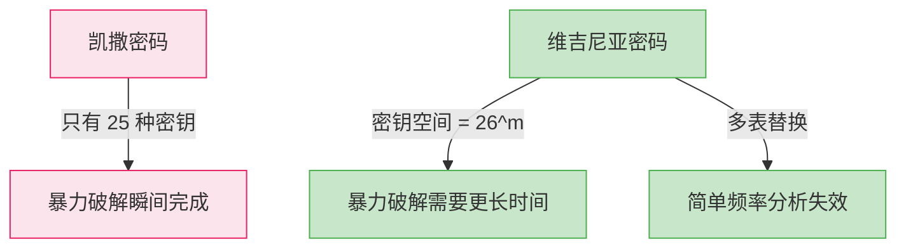

# 维吉尼亚密码

## 学习目标

- 理解维吉尼亚密码的历史背景和"不可破译的密码"之名
- 掌握维吉尼亚密码的数学表示和加密过程
- 认识维吉尼亚方阵表并能手动加解密
- 理解 Kasiski 测试的原理，用于确定密钥长度
- 了解如何通过频率分析破解维吉尼亚密码

## 前置知识

- [1.3 凯撒密码](03-caesar.md) — 移位密码的基本概念
- 频率分析的基本思想

## 核心概念与术语

### 历史背景

维吉尼亚密码（Vigenère Cipher）由法国外交官布莱斯·德·维吉尼亚（Blaise de Vigenère）于 1553 年发明。它是一种**多表替换密码**，使用一个关键词对明文进行循环加密。

!!! info "不可破译的密码"

    维吉尼亚密码在长达 300 多年的时间里被认为是"不可破译的密码"（le chiffre indéchiffrable）。直到 1863 年，普鲁士军官弗里德里希·卡西斯基（Friedrich Kasiski）才发表了系统性的破解方法。

    与凯撒密码的单表替换不同，维吉尼亚密码使用多个替换表，使得简单的频率分析不再有效。

### 数学表示

维吉尼亚密码的加密公式为：

$$
C_i = (P_i + K_{i \mod m}) \mod 26
$$

解密公式为：

$$
P_i = (C_i - K_{i \mod m}) \mod 26
$$

其中：

- $P_i$ 是第 $i$ 个明文字母对应的数字（A=0, B=1, ..., Z=25）
- $C_i$ 是第 $i$ 个密文字母对应的数字
- $K_j$ 是密钥中第 $j$ 个字母对应的数字
- $m$ 是密钥的长度
- $i \mod m$ 表示密钥的循环使用

### 维吉尼亚方阵

维吉尼亚方阵是理解维吉尼亚密码的关键工具。它由 26 行凯撒密码组成，每行对应一个不同的移位量：

```
    A B C D E F G H I J K L M N O P Q R S T U V W X Y Z
    -----------------------------------------------------
A | A B C D E F G H I J K L M N O P Q R S T U V W X Y Z
B | B C D E F G H I J K L M N O P Q R S T U V W X Y Z A
C | C D E F G H I J K L M N O P Q R S T U V W X Y Z A B
D | D E F G H I J K L M N O P Q R S T U V W X Y Z A B C
E | E F G H I J K L M N O P Q R S T U V W X Y Z A B C D
F | F G H I J K L M N O P Q R S T U V W X Y Z A B C D E
G | G H I J K L M N O P Q R S T U V W X Y Z A B C D E F
H | H I J K L M N O P Q R S T U V W X Y Z A B C D E F G
I | I J K L M N O P Q R S T U V W X Y Z A B C D E F G H
J | J K L M N O P Q R S T U V W X Y Z A B C D E F G H I
K | K L M N O P Q R S T U V W X Y Z A B C D E F G H I J
L | L M N O P Q R S T U V W X Y Z A B C D E F G H I J K
M | M N O P Q R S T U V W X Y Z A B C D E F G H I J K L
N | N O P Q R S T U V W X Y Z A B C D E F G H I J K L M
O | O P Q R S T U V W X Y Z A B C D E F G H I J K L M N
P | P Q R S T U V W X Y Z A B C D E F G H I J K L M N O
Q | Q R S T U V W X Y Z A B C D E F G H I J K L M N O P
R | R S T U V W X Y Z A B C D E F G H I J K L M N O P Q
S | S T U V W X Y Z A B C D E F G H I J K L M N O P Q R
T | T U V W X Y Z A B C D E F G H I J K L M N O P Q R S
U | U V W X Y Z A B C D E F G H I J K L M N O P Q R S T
V | V W X Y Z A B C D E F G H I J K L M N O P Q R S T U
W | W X Y Z A B C D E F G H I J K L M N O P Q R S T U V
X | X Y Z A B C D E F G H I J K L M N O P Q R S T U V W
Y | Y Z A B C D E F G H I J K L M N O P Q R S T U V W X
Z | Z A B C D E F G H I J K L M N O P Q R S T U V W X Y
```

**使用方法**：用明文字母找行，用密钥字母找列，交叉点就是密文字母。

### 加密示例

明文：`ATTACKATDAWN`，密钥：`LEMON`

```
明文:  A T T A C K A T D A W N
密钥:  L E M O N L E M O N L E
密文:  L X F O P E L X B N L R
```

逐步推导：

| 位置 | 明文 | 密钥 | 计算 | 密文 |
|------|------|------|------|------|
| 0 | A (0) | L (11) | (0+11) mod 26 = 11 | L |
| 1 | T (19) | E (4) | (19+4) mod 26 = 23 | X |
| 2 | T (19) | M (12) | (19+12) mod 26 = 5 | F |
| 3 | A (0) | O (14) | (0+14) mod 26 = 14 | O |
| 4 | C (2) | N (13) | (2+13) mod 26 = 15 | P |
| 5 | K (10) | L (11) | (10+11) mod 26 = 21 | V |
| ... | ... | ... | ... | ... |

## 动手实践

### 实验1：用 Python 脚本加解密

运行配套脚本 `scripts/vigenere_cipher.py`：

```bash
python scripts/vigenere_cipher.py
```

**预期输出：**

```console
========================================
  维吉尼亚密码演示程序
========================================

--- 加密演示 ---
明文: ATTACKATDAWN
密钥: LEMON
密文: LXFOPVNFHR

--- 解密演示 ---
密文: LXFOPVNFHR
密钥: LEMON
明文: ATTACKATDAWN

--- 维吉尼亚方阵（前6行） ---
    A B C D E F G H I J K L M N O P Q R S T U V W X Y Z
A | A B C D E F G H I J K L M N O P Q R S T U V W X Y Z
B | B C D E F G H I J K L M N O P Q R S T U V W X Y Z A
C | C D E F G H I J K L M N O P Q R S T U V W X Y Z A B
D | D E F G H I J K L M N O P Q R S T U V W X Y Z A B C
E | E F G H I J K L M N O P Q R S T U V W X Y Z A B C D
F | F G H I J K L M N O P Q R S T U V W X Y Z A B C D E
```

### 实验2：用 CyberChef 解密维吉尼亚密码

1. 打开 CyberChef
2. 在 **Input** 区域输入密文：`LXFOPVNFHR`
3. 搜索 `Vigenere Decode` 并拖入 **Recipe** 区域
4. 在 `Key` 参数中输入：`LEMON`
5. **Output** 显示：`ATTACKATDAWN`

!!! tip "CyberChef 的 Vigenere Decode"

    CyberChef 内置了维吉尼亚密码的加解密操作，可以方便地进行验证。

### 实验3：Kasiski 测试

Kasiski 测试是一种确定维吉尼亚密码密钥长度的方法。其核心思想是：

**如果密文中出现重复的片段，它们很可能是由相同的明文片段用相同的密钥部分加密产生的。重复片段之间的距离很可能是密钥长度的倍数。**

```bash
python scripts/vigenere_cipher.py --kasiski "LXFOPVNFHR"
```

**预期输出：**

```console
=== Kasiski 测试 ===
密文: LXFOPVNFHR

查找重复片段...
未找到足够长的重复片段（密文太短）

请使用更长的密文进行测试。

=== 使用重合指数法估算密钥长度 ===
密文长度: 10
密钥长度 1 的重合指数: 0.0667
密钥长度 2 的重合指数: 0.0833
密钥长度 3 的重合指数: 0.1000
密钥长度 4 的重合指数: 0.1250
密钥长度 5 的重合指数: 0.0000

英语的期望重合指数约为 0.065
最可能的密钥长度: 1（重合指数最接近 0.065）
```

!!! note "Kasiski 测试的局限性"

    Kasiski 测试需要足够长的密文才能有效。对于很短的密文，可能找不到重复片段。此时可以使用**重合指数法（Index of Coincidence）**作为补充。

### 实验4：频率分析破解

当密钥长度确定后，维吉尼亚密码可以被分解为多个凯撒密码，然后逐一用频率分析破解：

```bash
python scripts/vigenere_cipher.py --crack "LXFOPVNFHR" --keylen 5
```

## 安全分析与思考

### 为什么维吉尼亚密码比凯撒密码更安全？



密钥空间对比：

| 密码 | 密钥空间 | 5位密钥的可能数 |
|------|----------|----------------|
| 凯撒密码 | 25 | — |
| 维吉尼亚密码 | $26^m$ | $26^5 = 11,881,376$ |

### 维吉尼亚密码的弱点

尽管维吉尼亚密码比凯撒密码安全得多，它仍然可以被破解：

1. **Kasiski 测试**：通过寻找重复密文片段确定密钥长度
2. **重合指数法**：利用英文字母频率的统计特征确定密钥长度
3. **分组频率分析**：确定密钥长度后，对每组使用频率分析

!!! warning "维吉尼亚密码不安全"

    维吉尼亚密码虽然在历史上具有重要意义，但在现代密码学中**完全不安全**。现代密码破解工具可以在毫秒级别内破解维吉尼亚密码。

### 从维吉尼亚密码到现代密码

维吉尼亚密码的思想——**使用密钥控制多表替换**——是现代密码学的重要基础。现代分组密码（如 AES）的核心操作之一 S-Box 替换，本质上就是一种复杂的多表替换。

## 练习题

1. **手算题**：使用维吉尼亚密码，密钥 `KEY`，加密明文 `CRYPTOGRAPHY`。
2. **编程题**：修改 `vigenere_cipher.py`，使其能够自动检测密文是否可能是维吉尼亚密码加密的（通过计算重合指数）。
3. **分析题**：给定密文和已知密钥长度为 4，如何将破解问题分解为 4 个独立的凯撒密码破解？
4. **思考题**：如果密钥长度等于明文长度（即每个字母使用不同的密钥），这种密码安全吗？这引出了什么概念？

## 延伸阅读

- [Wikipedia: Vigenère Cipher](https://en.wikipedia.org/wiki/Vigen%C3%A8re_cipher)
- [Practical Cryptography: Vigenere Cipher](https://practicalcryptography.com/ciphers/vigenere-gronsfeld-and-autokey-cipher/)
- [Cryptool: Vigenère Cipher](https://www.cryptool.org/en/cto/vigenere)
