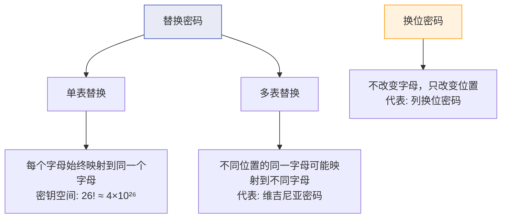
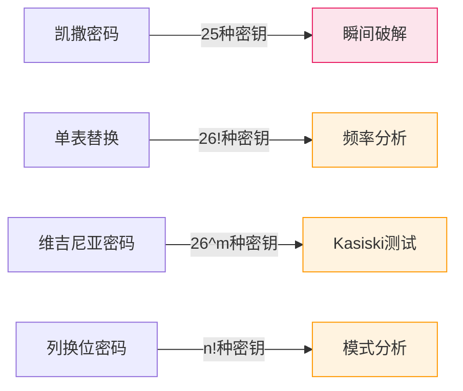

# 替换密码与换位密码

## 学习目标

- 理解单表替换密码的原理和密钥空间
- 了解多表替换密码与单表替换的区别
- 掌握换位密码（特别是列换位密码）的工作原理
- 学会使用频率分析破解单表替换密码
- 能够对比不同古典密码的安全性

## 前置知识

- [1.3 凯撒密码](03-caesar.md) — 移位密码的基本概念
- [1.4 维吉尼亚密码](04-vigenere.md) — 多表替换的概念

## 核心概念与术语

### 替换密码分类

替换密码（Substitution Cipher）是将明文中的每个字符替换为另一个字符的加密方法。根据替换规则的不同，可以分为：



!!! info "两大基本操作"

    古典密码学中的所有密码都可以归结为两种基本操作的组合：
    1. **替换（Substitution）**：改变字符本身
    2. **换位（Transposition）**：改变字符的位置

### 单表替换密码

单表替换密码（Monoalphabetic Substitution Cipher）为字母表中的每个字母指定一个唯一的替换字母。本质上，它是一个字母表的**排列（Permutation）**。

**示例**：

```
明文字母: A B C D E F G H I J K L M N O P Q R S T U V W X Y Z
密文字母: Z Y X W V U T S R Q P O N M L K J I H G F E D C B A
```

上面的例子实际上是一种特殊的单表替换——**逆序替换**。

**一般情况下的密钥空间**：

$$
\text{密钥空间} = 26! = 403,291,461,126,605,635,584,000,000 \approx 4 \times 10^{26}
$$

这是一个天文数字！但单表替换密码仍然可以被频率分析轻松破解。

!!! warning "密钥空间大不等于安全"

    虽然 $26!$ 是一个巨大的数字，但单表替换密码的安全性远不如密钥空间所暗示的那样强。原因是：**每种密钥对应的替换规则都会保留字母的频率特征**。

### 多表替换密码

多表替换密码（Polyalphabetic Substitution Cipher）使用多个替换表，使得同一个字母在不同位置可能被替换为不同的字母。

维吉尼亚密码就是最著名的多表替换密码。在模块 1.4 中我们已经详细学习过。

### 换位密码

换位密码（Transposition Cipher）不改变字母本身，只改变字母的位置。可以把它想象成"洗牌"——牌的花色不变，只是顺序变了。

#### 列换位密码（Columnar Transposition）

列换位密码是最经典的换位密码：

1. 将明文按行写入一个固定列数的矩阵
2. 按照密钥指定的列顺序读出密文

**示例**：明文 `HELLO WORLD`，密钥 `3 1 4 2`

```
密钥:    3  1  4  2
      ┌──┬──┬──┬──┐
第1行: │ H │ E │ L │ L │
      ├──┼──┼──┼──┤
第2行: │ O │ _ │ W │ O │
      ├──┼──┼──┼──┤
第3行: │ R │ L │ D │ _ │
      └──┴──┴──┴──┘

按密钥顺序（第1列, 第2列, 第3列, 第4列）读出:
第1列(key=3): H O R
第2列(key=1): E _ L → 密文分组
第3列(key=4): L W D
第4列(key=2): L O _

密文: E_L HOR LWD LO_
去掉填充: EL HOR LWD LO
```

!!! note "填充（Padding）"

    当明文长度不能被列数整除时，需要用额外字符（如 `_` 或 `X`）填充，使矩阵完整。

## 动手实践

### 实验1：用 Python 脚本实现列换位密码

运行配套脚本 `scripts/transposition_cipher.py`：

```bash
python scripts/transposition_cipher.py
```

**预期输出：**

```console
========================================
  列换位密码演示程序
========================================

--- 加密演示 ---
明文: HELLO WORLD
密钥: [3, 1, 4, 2]

加密矩阵:
  列顺序: [3, 1, 4, 2]
  第 1 行: [H, E, L, L]
  第 2 行: [O, _, W, O]
  第 3 行: [R, L, D, _]

按列读出（按密钥顺序）:
  第 1 列 (原列 0): H, O, R
  第 2 列 (原列 1): E, _, L
  第 3 列 (原列 2): L, W, D
  第 4 列 (原列 3): L, O, _

密文: E LHORLWDL O_

--- 解密演示 ---
密文: E LHORLWDL O_
密钥: [3, 1, 4, 2]
明文: HELLO WORLD

--- 安全性分析 ---
换位密码保持字母频率不变！
密文字母频率分析:
  L: 3 次 (27.3%)
  O: 2 次 (18.2%)
  E: 1 次 (9.1%)
  H: 1 次 (9.1%)
  R: 1 次 (9.1%)
  W: 1 次 (9.1%)
  D: 1 次 (9.1%)
  _: 1 次 (9.1%)
```

### 实验2：用 Python 脚本进行频率分析破解

运行配套脚本 `scripts/frequency_analysis.py`：

```bash
python scripts/frequency_analysis.py
```

**预期输出：**

```console
========================================
  字频分析演示程序
========================================

--- 英语标准字母频率 ---
E: 12.70% ████████████████████████████
T:  9.06% ████████████████████
A:  8.17% ██████████████████
O:  7.51% ████████████████
I:  6.97% ███████████████
N:  6.75% ██████████████
S:  6.33% █████████████
H:  6.09% █████████████
R:  5.99% ████████████
D:  4.25% █████████

--- 分析密文频率 ---
密文: WKLV LV D VHFUHW PHVVDJH
密文字母频率:
  V: 5 次 (21.7%) █████████████████████████
  L: 2 次 (8.7%)  ███████████
  H: 2 次 (8.7%)  ███████████
  W: 2 次 (8.7%)  ███████████
  D: 2 次 (8.7%)  ███████████
  K: 1 次 (4.3%)  █████
  ...

--- 频率分析破解 ---
猜测密钥（密文最高频 → 英语最高频）:
  密文 'V' (21.7%) → 明文 'E' → 偏移量 17
  密文 'L' (8.7%)  → 明文 'T' → 偏移量 13
  ...

最可能的密钥: 3 (基于频率分析)
尝试解密: THIS IS A SECRET MESSAGE
```

### 实验3：用 CyberChef 进行替换和换位

=== "单表替换"

    1. 打开 CyberChef
    2. 在 **Input** 区域输入明文：`HELLO WORLD`
    3. 搜索 `Substitute` 并拖入
    4. 在参数中设置替换表

=== "列换位"

    1. 在 **Input** 区域输入明文：`HELLO WORLD`
    2. 搜索 `Columnar Transposition` 并拖入
    3. 设置密钥参数

### 实验4：频率分析实战

```bash
# 给定一段用单表替换加密的密文
python scripts/frequency_analysis.py --decrypt "WKLV LV D VHFUHW PHVVDJH"
```

**操作步骤**：

1. 统计密文中每个字母的出现频率
2. 将频率最高的字母映射到英语中频率最高的 'E'
3. 将频率次高的字母映射到 'T'
4. 逐步推断出完整的替换表
5. 验证解密结果是否合理

!!! example "频率分析的关键洞察"

    单表替换密码虽然密钥空间巨大（$26!$），但**字母的频率分布特征被完全保留**。密文中出现最多的字母，对应的明文也应该是英语中出现最多的字母之一。

    这就是为什么"密钥空间大 ≠ 安全"——统计特征的泄露可以大幅缩小搜索空间。

## 安全分析与思考

### 古典密码安全性对比



| 密码类型 | 密钥空间 | 主要弱点 | 破解难度 |
|----------|----------|----------|----------|
| 凯撒密码 | 25 | 密钥空间太小 | 暴力破解 |
| 单表替换 | $26!$ | 字母频率不变 | 频率分析 |
| 维吉尼亚密码 | $26^m$ | 重复模式泄露密钥长度 | Kasiski + 频率分析 |
| 列换位密码 | $n!$ | 字母频率不变 | 模式分析 |

### 替换 vs 换位

!!! tip "核心区别"

    - **替换密码**：改变字符本身，保留位置。字母频率特征暴露。
    - **换位密码**：改变位置，保留字符本身。字母频率完全不变。
    - 两者都不安全，但**组合使用**可以增强安全性。

### 从古典到现代

现代密码算法（如 AES）结合了替换和换位两种操作：

- **S-Box（替换盒）**：提供**混淆（Confusion）**——使密钥和密文之间的关系复杂化
- **P-Box（置换盒）**：提供**扩散（Diffusion）**——使明文的影响散布到整个密文

!!! info "香农的混淆与扩散"

    Claude Shannon 在 1949 年提出，安全的密码系统需要同时具备：
    - **混淆**：密钥和密文之间的关系应该尽可能复杂
    - **扩散**：明文的微小变化应该导致密文的巨大变化（雪崩效应）

    AES 的每一轮都包含替换（SubBytes）和换位（ShiftRows + MixColumns）操作，经过 10-14 轮迭代后，实现了高度的混淆和扩散。

## 练习题

1. **手算题**：使用列换位密码，密钥 `[2, 4, 1, 3]`，加密明文 `WE ARE DISCOVERED`。
2. **编程题**：修改 `transposition_cipher.py`，添加双列换位加密功能（对密文再次进行列换位加密）。
3. **分析题**：给定一段密文，通过频率分析判断它是替换密码还是换位密码加密的。给出判断依据。
4. **思考题**：为什么组合替换和换位可以增强安全性？如果只使用替换或只使用换位，各有什么弱点？

## 延伸阅读

- [Wikipedia: Substitution Cipher](https://en.wikipedia.org/wiki/Substitution_cipher)
- [Wikipedia: Transposition Cipher](https://en.wikipedia.org/wiki/Transposition_cipher)
- [Practical Cryptography: Columnar Transposition](https://practicalcryptography.com/ciphers/columnar-transposition-cipher/)
- [Cryptool: Classical Ciphers](https://www.cryptool.org/en/cto-classical)
