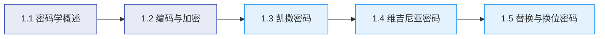

# 模块1：密码学基础与古典密码

!!! abstract "模块概述"

    本模块是密码学学习之旅的起点。我们将从密码学的基本概念出发，了解编码与加密的本质区别，然后深入探索人类历史上最早的一批密码系统——凯撒密码、维吉尼亚密码、替换密码和换位密码。通过动手实践，你将建立对密码学的直觉理解。

## 学习路线

## 主题列表

| 主题 | 核心内容 | 关键工具 |
|------|----------|----------|
| [1.1 密码学概述与历史](01-overview.md) | 密码学定义、三大分支、历史时间线、CIA三元组 | — |
| [1.2 编码与加密](02-encoding.md) | 编码vs加密、Base64、十六进制、URL编码 | OpenSSL, CyberChef |
| [1.3 凯撒密码](03-caesar.md) | 移位密码、数学表示、暴力破解、频率分析初探 | OpenSSL, CyberChef, Python |
| [1.4 维吉尼亚密码](04-vigenere.md) | 多表替换、维吉尼亚方阵、Kasiski测试 | CyberChef, Python |
| [1.5 替换密码与换位密码](05-substitution.md) | 单表替换、多表替换、列换位密码、频率分析破解 | Python |

## 学习目标

完成本模块后，你将能够：

- [x] 理解密码学的定义、分支和核心概念
- [x] 区分编码和加密的本质差异
- [x] 实现凯撒密码的加解密和暴力破解
- [x] 理解维吉尼亚密码的工作原理和破解方法
- [x] 掌握替换密码和换位密码的基本思想
- [x] 初步了解频率分析在密码破解中的作用

## 配套脚本

本模块提供以下 Python 脚本，位于 `scripts/` 目录：

| 脚本 | 用途 | 命令 |
|------|------|------|
| `caesar_cipher.py` | 凯撒密码加解密与暴力破解 | `python scripts/caesar_cipher.py` |
| `vigenere_cipher.py` | 维吉尼亚密码加解密 | `python scripts/vigenere_cipher.py` |
| `frequency_analysis.py` | 英文字频分析与密码破解 | `python scripts/frequency_analysis.py` |
| `transposition_cipher.py` | 列换位密码加解密 | `python scripts/transposition_cipher.py` |

!!! tip "学习建议"

    建议按顺序阅读每个主题，并亲手运行每个实验。密码学是一门实践性很强的学科——只有动手做了，才能真正理解。

## 下一步

准备好了吗？让我们从 [1.1 密码学概述与历史](01-overview.md) 开始吧！
