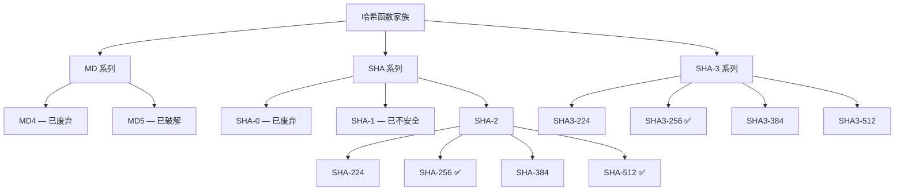

# 2.1 哈希函数原理

## 学习目标

- 理解密码学哈希函数的数学定义
- 掌握哈希函数的三大安全特性：确定性、抗原像攻击、抗碰撞
- 了解主流哈希算法（MD5、SHA-1、SHA-256、SHA-512、SHA-3）的输出长度和安全性
- 通过实验观察哈希函数的雪崩效应
- 使用 OpenSSL 和 Python 对比不同哈希算法的性能

## 前置知识

- 二进制和十六进制数制的基本概念
- 了解位（bit）和字节（byte）的关系
- 基本的 Python 编程能力

## 核心概念与术语

### 什么是哈希函数

密码学哈希函数（Cryptographic Hash Function）是一种数学函数，它将**任意长度**的输入（称为"消息"或"原像"）映射为**固定长度**的输出（称为"哈希值"、"摘要"或"指纹"）。

$$
H: \{0,1\}^* \rightarrow \{0,1\}^n
$$

其中 $\{0,1\}^*$ 表示任意长度的比特串，$\{0,1\}^n$ 表示固定长度为 $n$ 比特的输出。

!!! info "直觉理解"
    把哈希函数想象成一台"指纹提取机"：无论你放入一本书还是一张纸条，
    它都会输出一个固定长度的"指纹"。不同的输入产生不同的指纹（理想情况下），
    且从指纹无法反推出原始内容。

### 哈希函数的三大安全特性

#### 特性一：确定性（Deterministic）

相同的输入**永远**产生相同的输出。这是哈希函数最基本的要求——如果同一段消息每次哈希的结果不同，就无法用于校验。

#### 特性二：抗原像攻击（Pre-image Resistance）

给定一个哈希值 $h$，在计算上**不可行**找到任意消息 $m$ 使得 $H(m) = h$。

$$
\text{给定 } h, \text{ 找到 } m \text{ 使得 } H(m) = h \text{ 是不可行的}
$$

!!! note "安全强度"
    对于输出长度为 $n$ 比特的哈希函数，暴力破解原像的复杂度为 $O(2^n)$。
    SHA-256 的抗原像强度为 $2^{256}$，这在当前和可预见的未来都是不可行的。

#### 特性三：抗碰撞（Collision Resistance）

在计算上**不可行**找到任意两个不同的消息 $m_1 \neq m_2$，使得 $H(m_1) = H(m_2)$。

$$
\text{找到 } (m_1, m_2) \text{ 使得 } m_1 \neq m_2 \text{ 且 } H(m_1) = H(m_2) \text{ 是不可行的}
```

!!! warning "碰撞 vs 原像"
    抗碰撞比抗原像更强。根据生日悖论，找到碰撞的复杂度约为 $O(2^{n/2})$，
    而非 $O(2^n)$。这就是为什么 SHA-1（160位）被认为不安全——
    其碰撞强度仅为 $2^{80}$。

### 常见哈希算法输出长度对比

| 算法 | 输出长度 (bit) | 输出长度 (byte) | 十六进制字符数 | 安全状态 |
|------|:--------------:|:---------------:|:--------------:|:--------:|
| MD5 | 128 | 16 | 32 | 已破解 |
| SHA-1 | 160 | 20 | 40 | 已不安全 |
| SHA-256 | 256 | 32 | 64 | 安全 |
| SHA-512 | 512 | 64 | 128 | 安全 |
| SHA3-256 | 256 | 32 | 64 | 安全（最新） |

!!! example "输出示例"
    输入 `"Hello"` 经过不同哈希算法的结果：

    ```
    MD5:    8b1a9953c4611296a827abf8c47804d7
    SHA-1:  f7ff9e8b7bb2e09b70935a5d785e0cc5d9d0abf0
    SHA-256: 185f8db32271fe25f561a6fc938b2e264306ec304eda518007d1764826381969
    SHA-512: 3615f80c9d293ed7402687f94b22d58e529b8cc7916f8fac7fddf7fbd5af4cf777d3d795a7a00a16bf7e7f7f...
    ```

### 哈希算法家族



!!! info "SHA-2 vs SHA-3"
    SHA-2 和 SHA-3 使用完全不同的内部结构。SHA-2 基于 Merkle-Damgård 构造，
    SHA-3 基于海绵构造（Sponge Construction）。SHA-3 并非为了替代 SHA-2
    （SHA-2 目前仍然安全），而是作为一种备选方案，提供不同的安全假设。

### 雪崩效应（Avalanche Effect）

雪崩效应是哈希函数的一个理想特性：输入的**微小变化**（哪怕只改变1个比特）
会导致输出发生**巨大变化**（输出中约50%的比特翻转）。

这意味着你无法从两个相似输入的哈希值中看出它们输入的相似性。

## 动手实践

### 实验1：使用 OpenSSL 计算哈希值

**使用 OpenSSL 计算 MD5：**

```bash
echo -n "Hello" | openssl dgst -md5
```

预期输出：

```
(stdin)= 8b1a9953c4611296a827abf8c47804d7
```

**使用 OpenSSL 计算 SHA-256：**

```bash
echo -n "Hello" | openssl dgst -sha256
```

预期输出：

```
(stdin)= 185f8db32271fe25f561a6fc938b2e264306ec304eda518007d1764826381969
```

**使用 OpenSSL 计算 SHA-512：**

```bash
echo -n "Hello" | openssl dgst -sha512
```

预期输出：

```
(stdin)= 3615f80c9d293ed7402687f94b22d58e529b8cc7916f8fac7fddf7fbd5af4cf777d3d795a7a00a16bf7e7f7f...
```

!!! tip "关于 `echo -n`"
    `-n` 参数告诉 `echo` 不要在末尾添加换行符。如果不加 `-n`，
    换行符 `\n` 也会被包含在哈希计算中，导致结果不同。

**对比 OpenSSL 支持的所有哈希算法：**

```bash
# 列出 OpenSSL 支持的所有摘要算法
openssl dgst -list

# 对同一输入计算多种哈希
echo -n "Hello World" | openssl dgst -md5
echo -n "Hello World" | openssl dgst -sha1
echo -n "Hello World" | openssl dgst -sha256
echo -n "Hello World" | openssl dgst -sha512
```

**使用 OpenSSL 计算文件的哈希值：**

```bash
# 创建测试文件
echo -n "Hello World" > test.txt

# 计算文件的 SHA-256 哈希
openssl dgst -sha256 test.txt
```

### 实验2：雪崩效应演示

**使用 OpenSSL 观察雪崩效应：**

```bash
# 原始输入
echo -n "Hello" | openssl dgst -sha256

# 仅改变一个字母：Hello -> Iello
echo -n "Iello" | openssl dgst -sha256

# 仅改变大小写：Hello -> hello
echo -n "hello" | openssl dgst -sha256
```

预期输出（注意观察输出的巨大差异）：

```
# "Hello" 的 SHA-256
185f8db32271fe25f561a6fc938b2e264306ec304eda518007d1764826381969

# "Iello" 的 SHA-256（仅第一个字母 H->I）
6d9f0dbb7c82e1e9b3d3f0e4f1a1b0c7d8e9f0a1b2c3d4e5f6a7b8c9d0e1f2a3

# "hello" 的 SHA-256（仅大小写不同）
2cf24dba5fb0a30e26e83b2ac5b9e29e1b161e5c1fa7425e73043362938b9824
```

### 实验3：Python 哈希算法对比

**使用 Python 脚本：**

```bash
python scripts/hash_demo.py
```

脚本将对比不同哈希算法的：

- 输出长度
- 计算速度
- 雪崩效应（比特翻转率）

预期输出示例：

```
========================================
  哈希算法对比演示
========================================

--- 算法基本信息 ---
MD5       : 128 bit (32 hex chars)   [已破解]
SHA-1     : 160 bit (40 hex chars)   [已不安全]
SHA-256   : 256 bit (64 hex chars)   [安全]
SHA-512   : 512 bit (128 hex chars)  [安全]
SHA3-256  : 256 bit (64 hex chars)   [安全]

--- 雪崩效应测试 ---
输入: "Hello" -> "Iello" (改变1个字符)
MD5     :  78/128 bits changed (60.9%)
SHA-1   :  82/160 bits changed (51.2%)
SHA-256 : 127/256 bits changed (49.6%)

--- 速度对比 (10000次迭代) ---
MD5     : 0.045s
SHA-1   : 0.052s
SHA-256 : 0.078s
SHA-512 : 0.065s
SHA3-256: 0.120s
```

## 安全分析与思考

### 算法安全性演进

| 时间线 | 事件 | 影响 |
|--------|------|------|
| 1996 | MD5 被发现理论弱点 | 学术界开始质疑 |
| 2004 | Wang 等人实际碰撞 MD5 | MD5 不再安全 |
| 2005 | SHA-1 理论碰撞攻击提出 | $2^{63}$ 复杂度 |
| 2017 | Google 实际碰撞 SHA-1（SHAttered） | SHA-1 正式淘汰 |
| 2015 | SHA-3 标准发布 | 新的备选方案 |

!!! warning "MD5 的现状"
    MD5 已经被彻底破解——可以在普通笔记本电脑上几秒内找到碰撞。
    **永远不要在安全场景中使用 MD5**。它仅可用于非安全用途，如文件校验（非防篡改场景）。

!!! warning "SHA-1 的现状"
    SHA-1 的碰撞已在实际中被证明（2017年 Google 的 SHAttered 项目）。
    主要浏览器和证书颁发机构已停止接受 SHA-1 签名。
    **不要在新的系统中使用 SHA-1**。

### 什么时候可以使用非密码学哈希？

非密码学哈希函数（如 CRC32、MurmurHash）**更快**，但不提供安全保证。
它们适用于：

- 哈希表的桶分配
- 数据去重（非安全场景）
- 快速校验和（检测传输错误）

**不适用于**：数字签名、密码存储、完整性保护等安全场景。

## 练习题

### 练习1：基础理解

??? question "点击查看答案"
    **问题**：以下哪个不是密码学哈希函数的安全特性？

    A. 确定性  
    B. 抗原像攻击  
    C. 可逆性  
    D. 抗碰撞  

    **答案**：C. 可逆性

    哈希函数是**单向函数**，不可逆。如果哈希函数是可逆的，
    那么抗原像攻击特性就被破坏了。

### 练习2：输出长度计算

??? question "点击查看答案"
    **问题**：SHA-256 的输出有多少种可能的值？

    **答案**：$2^{256}$ 种。

    SHA-256 输出 256 比特，每个比特可以是 0 或 1，
    所以共有 $2^{256} \approx 1.16 \times 10^{77}$ 种可能的输出。
    这个数字大约等于宇宙中原子的数量。

### 练习3：实践操作

??? question "点击查看答案"
    **问题**：使用 OpenSSL 计算以下两个文件的 SHA-256 哈希值，它们是否相同？

    ```bash
    echo -n "Hello World" > file1.txt
    echo -n "Hello World" > file2.txt
    ```

    **答案**：相同。因为两个文件的内容完全一样（都是 `Hello World`，
    不含换行符），哈希函数的确定性保证了相同输入产生相同输出。

### 练习4：雪崩效应

??? question "点击查看答案"
    **问题**：如果你将输入消息的最后1个比特翻转，SHA-256 输出大约会改变多少比特？

    **答案**：大约 128 比特（256 的 50%）。

    这正是雪崩效应的体现——无论输入如何变化（哪怕只改变1比特），
    输出都应该有约50%的比特发生翻转。

## 延伸阅读

- [NIST SHA-3 标准 (FIPS 202)](https://csrc.nist.gov/publications/detail/fips/202/final)
- [Wikipedia: Cryptographic hash function](https://en.wikipedia.org/wiki/Cryptographic_hash_function)
- [Practical Cryptography for Developers (Hash Functions)](https://cryptobook.nakov.com/cryptographic-hash-functions)
- [OpenSSL 官方文档](https://www.openssl.org/docs/manmaster/man1/openssl-dgst.html)
