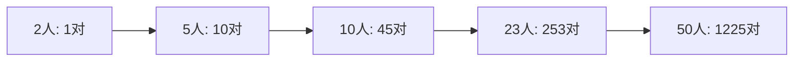
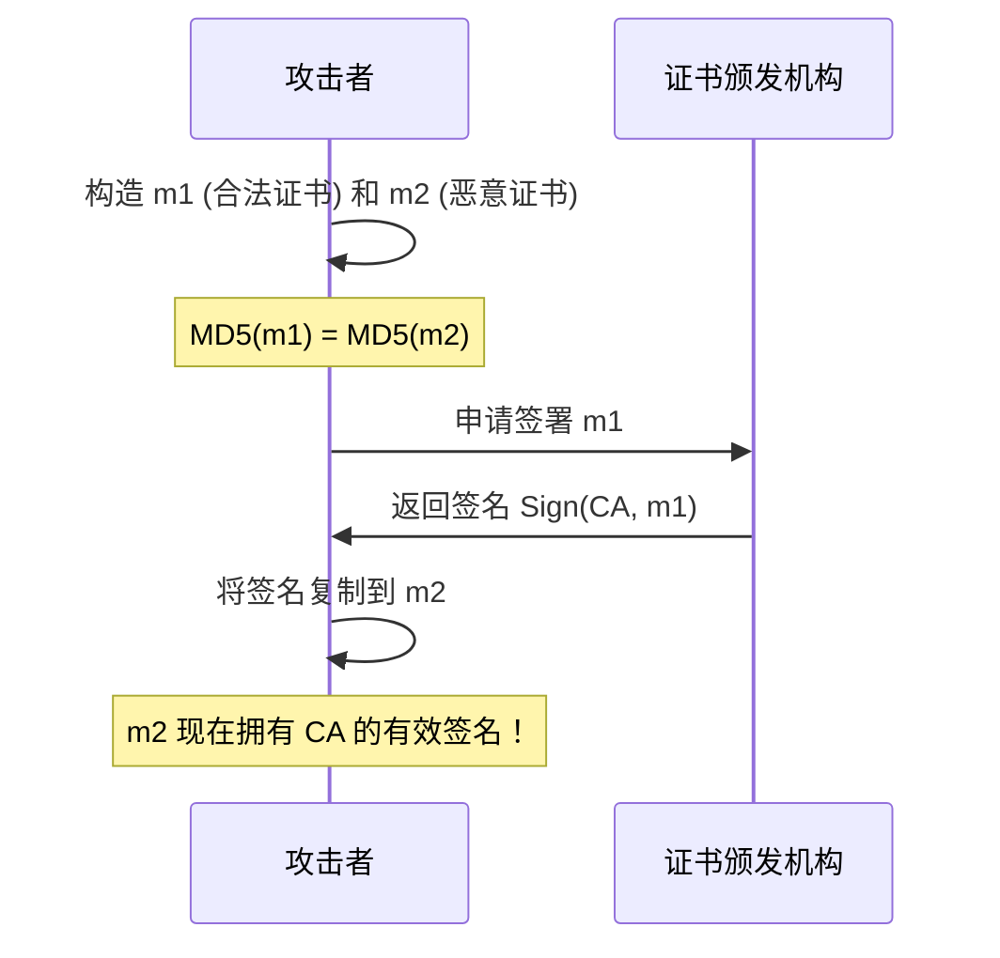
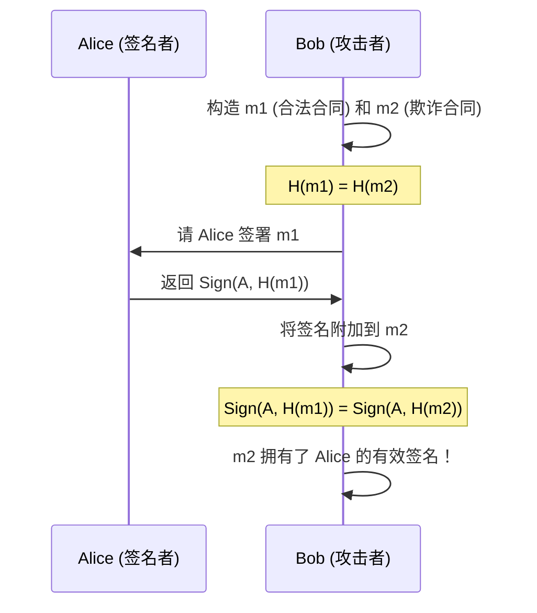

# 2.2 哈希碰撞与安全分析

## 学习目标

- 理解哈希碰撞的数学定义
- 掌握生日悖论的原理及其与碰撞攻击的关系
- 了解生日攻击的计算复杂度 $O(2^{n/2})$
- 了解 MD5 碰撞的实际案例及其安全影响
- 通过 Python 脚本模拟生日攻击过程
- 理解碰撞攻击对数字签名和证书安全的影响

## 前置知识

- [2.1 哈希函数原理](01-hash-functions.md)（哈希函数的定义和三大特性）
- 概率论基础（独立事件、联合概率）
- 基本的 Python 编程能力

## 核心概念与术语

### 哈希碰撞的定义

**哈希碰撞**（Hash Collision）指的是两个不同的输入产生了相同的哈希输出：

$$
\text{碰撞: } \exists \; m_1 \neq m_2 \text{ 使得 } H(m_1) = H(m_2)
$$

根据鸽巢原理（Pigeonhole Principle），碰撞**必然存在**。因为哈希函数将无限大的输入空间映射到有限的输出空间，所以必然存在不同的输入产生相同的输出。

!!! info "鸽巢原理"
    如果有 $n+1$ 只鸽子放入 $n$ 个鸽巢，那么至少有一个鸽巢里有两只鸽子。
    对于哈希函数：如果输出空间大小为 $2^n$，那么在尝试 $2^n + 1$ 个不同输入后，
    必然会发生碰撞。

### 为什么碰撞是"安全问题"？

虽然碰撞必然存在，但密码学哈希函数的安全要求是：**找到碰撞在计算上不可行**。

如果攻击者能找到碰撞 $H(m_1) = H(m_2)$，就可以：

1. **伪造数字签名**：让签名者签署 $m_1$，然后声称该签名也适用于 $m_2$
2. **篡改文件**：生成两个哈希值相同的文件，一个是无害的，另一个是恶意的
3. **伪造证书**：创建两个具有相同哈希值的证书

### 生日悖论（Birthday Paradox）

生日悖论是理解碰撞攻击复杂度的关键。它回答的问题是：

> 在一个房间里，需要多少人才能让至少两人生日相同的概率超过 50%？

直觉上你可能会猜 183（365/2），但实际答案是 **23**！

#### 数学推导

设房间里有 $k$ 个人，所有人生日都不同的概率为：

$$
P(\text{无碰撞}) = \frac{365}{365} \times \frac{364}{365} \times \frac{363}{365} \times \cdots \times \frac{365-k+1}{365}
$$

$$
P(\text{无碰撞}) = \prod_{i=0}^{k-1} \frac{365-i}{365}
$$

至少有两人生日相同的概率为：

$$
P(\text{碰撞}) = 1 - P(\text{无碰撞})
$$

当 $k = 23$ 时：

$$
P(\text{碰撞}) \approx 1 - 0.4927 \approx 0.5073 > 50\%
$$

!!! tip "直觉理解"
    生日悖论的关键在于：我们不是在问"是否有人和**我**生日相同"，
    而是"是否**任意两人**生日相同"。随着人数增加，可能的"配对"数量
    以 $O(k^2)$ 的速度增长——23人有 $\binom{23}{2} = 253$ 种配对！



#### 一般化公式

对于输出空间大小为 $N$ 的哈希函数，找到碰撞大约需要：

$$
k \approx \sqrt{\frac{\pi}{2} \cdot N} \approx 1.177 \sqrt{N}
$$

对于 $n$ 比特的哈希输出（$N = 2^n$）：

$$
k \approx 1.177 \times 2^{n/2}
$$

### 生日攻击的复杂度

| 哈希算法 | 输出长度 | 碰撞复杂度 | 安全强度（bit） |
|----------|:--------:|:----------:|:---------------:|
| MD5 | 128 bit | $2^{64}$ | 64 bit |
| SHA-1 | 160 bit | $2^{80}$ | 80 bit |
| SHA-256 | 256 bit | $2^{128}$ | 128 bit |
| SHA-512 | 512 bit | $2^{256}$ | 256 bit |

!!! warning "为什么 $2^{80}$ 不安全？"
    $2^{64}$ 次操作在现代计算能力下是可行的（特别是使用 GPU 集群）。
    $2^{80}$ 虽然仍然很大，但对于国家级攻击者来说已非不可能。
    安全标准通常要求至少 $2^{128}$ 的碰撞强度。

### MD5 碰撞的实际案例

#### 案例1：Wang 等人的碰撞（2004）

2004年，王小云教授等人展示了如何在实际中找到 MD5 碰撞。
他们能在**不到1小时**内找到两个不同的消息 $m_1$ 和 $m_2$，
使得 $MD5(m_1) = MD5(m_2)$。

#### 案例2：伪造 X.509 证书（2008）

研究人员展示了可以创建两个不同的 X.509 证书，它们具有相同的 MD5 哈希值。
攻击者可以：

1. 申请一个合法的证书（$m_1$，无害内容）
2. 利用碰撞构造一个恶意的中间 CA 证书（$m_2$）
3. 用 CA 对 $m_1$ 的签名来伪造 $m_2$ 的签名



#### 案例3：SHA-1 碰撞 — SHAttered（2017）

2017年，Google 和 CWI Amsterdam 发布了 SHA-1 的首个实际碰撞。
他们生成了两个不同的 PDF 文件，具有相同的 SHA-1 哈希值。

该攻击消耗了约 $2^{63}$ 次 SHA-1 计算，相当于 6500 年的单核 CPU 计算时间。

## 动手实践

### 实验1：理解生日悖论

**使用 Python 验证生日悖论：**

```bash
python -c "
import random

def birthday_experiment(num_people, num_trials=100000):
    collisions = 0
    for _ in range(num_trials):
        birthdays = [random.randint(1, 365) for _ in range(num_people)]
        if len(birthdays) != len(set(birthdays)):
            collisions += 1
    return collisions / num_trials

for k in [10, 15, 20, 23, 30, 40, 50]:
    prob = birthday_experiment(k)
    print(f'{k} people: collision probability = {prob:.2%}')
"
```

预期输出：

```
10 people: collision probability = 11.69%
15 people: collision probability = 25.29%
20 people: collision probability = 41.14%
23 people: collision probability = 50.73%
30 people: collision probability = 70.63%
40 people: collision probability = 89.12%
50 people: collision probability = 97.04%
```

### 实验2：生日攻击模拟

**使用 Python 脚本模拟生日攻击：**

```bash
python scripts/birthday_attack.py
```

该脚本使用**缩短的哈希**（例如 16 比特）来演示生日攻击原理。
在真实场景中，哈希空间是 $2^{128}$ 或 $2^{256}$，无法暴力搜索。

预期输出示例：

```
========================================
  生日攻击模拟演示
========================================

--- 实验1: 生日悖论验证 ---
人数  理论概率   模拟概率
 10    11.69%    11.72%
 23    50.73%    50.68%
 50    97.04%    97.01%

--- 实验2: 缩短哈希的碰撞搜索 ---
使用 16-bit 哈希 (空间大小: 65536)
理论需要尝试: ~362 次
实际尝试次数: 341
碰撞找到! H('msg_247') = H('msg_1089') = a3f2
```

### 实验3：用 CyberChef 观察 MD5 碰撞

!!! example "CyberChef 实验步骤"
    1. 打开 CyberChef（`CyberChef_v10.19.4\CyberChef_v10.19.4.html`）
    2. 在输入框中输入 `Hello World`
    3. 搜索并拖入 `MD5` 操作
    4. 观察输出哈希值
    5. 将输入改为 `Hello World!`（加一个感叹号）
    6. 观察哈希值的**完全变化**

    **进阶实验：**
    - 使用 `SHA2` 操作对比 SHA-256 的输出
    - 尝试输入中文字符，观察不同编码对哈希值的影响
    - 使用 `Fork` 操作同时计算多种哈希算法

### 实验4：文件碰撞演示

**使用 OpenSSL 创建两个哈希值不同的文件并观察差异：**

```bash
# 创建两个相似但不同的文件
echo -n "This is the original message." > original.txt
echo -n "This is the modified message." > modified.txt

# 计算它们的哈希值
openssl dgst -sha256 original.txt
openssl dgst -sha256 modified.txt

# 观察：即使内容只差一个词，哈希值也完全不同
```

## 安全分析与思考

### 碰撞攻击的三种类型

| 攻击类型 | 描述 | 复杂度 | 严重程度 |
|----------|------|:------:|:--------:|
| **碰撞攻击** | 找到任意 $m_1 \neq m_2$ 使得 $H(m_1)=H(m_2)$ | $O(2^{n/2})$ | 中 |
| **第二原像攻击** | 给定 $m_1$，找到 $m_2 \neq m_1$ 使得 $H(m_1)=H(m_2)$ | $O(2^n)$ | 高 |
| **原像攻击** | 给定 $h$，找到 $m$ 使得 $H(m)=h$ | $O(2^n)$ | 极高 |

!!! warning "第二原像攻击比碰撞攻击更危险"
    在碰撞攻击中，攻击者可以自由选择两个消息。
    在第二原像攻击中，目标消息是给定的——攻击者需要找到与特定消息碰撞的另一个消息。
    这在实际攻击中更为常见和危险。

### 对实际系统的影响

#### 数字签名伪造



#### 代码签名攻击

如果代码仓库使用不安全的哈希函数：

1. 攻击者提交一个无害的代码变更 $m_1$
2. 经过代码审查后，$m_1$ 被合并并获得哈希签名
3. 攻击者用碰撞的恶意版本 $m_2$ 替换 $m_1$
4. 由于 $H(m_1) = H(m_2)$，签名验证仍然通过

### 防御措施

!!! tip "如何防御碰撞攻击"
    1. **使用安全的哈希算法**：至少使用 SHA-256
    2. **避免使用 MD5 和 SHA-1**：它们已被证明不安全
    3. **使用 HMAC**：即使哈希函数存在弱点，HMAC 也能提供额外保护
    4. **增加输出长度**：更长的哈希输出意味着更高的碰撞复杂度
    5. **定期更新**：关注密码学社区的安全公告

### 哈希截断的风险

有时系统会截断哈希值（例如只使用前 64 位）来节省空间。
这会**大幅降低**碰撞安全性：

| 截断长度 | 碰撞复杂度 | 安全评估 |
|:--------:|:----------:|:--------:|
| 64 bit | $2^{32}$ | 极不安全（几秒内可破解） |
| 128 bit | $2^{64}$ | 不安全（GPU可破解） |
| 160 bit | $2^{80}$ | 临界（国家级攻击者可行） |
| 256 bit | $2^{128}$ | 安全 |

## 练习题

### 练习1：生日悖论计算

??? question "点击查看答案"
    **问题**：在一个哈希输出为 40 比特的系统中，大约需要多少次哈希计算才能找到碰撞？

    **答案**：大约 $2^{20} = 1,048,576$ 次。

    根据生日攻击公式，碰撞复杂度为 $O(2^{n/2})$，其中 $n = 40$。
    所以需要约 $2^{20}$ 次计算——在现代计算机上不到1秒。

### 练习2：安全强度评估

??? question "点击查看答案"
    **问题**：一个系统使用 SHA-256 但只取前 80 位作为哈希值。这个系统的碰撞安全强度是多少？

    **答案**：$2^{40}$，即约 $1.1 \times 10^{12}$ 次计算。

    碰撞安全强度是输出长度的一半：$80/2 = 40$ 比特。
    这个强度在现代 GPU 上可以在几分钟内破解——非常不安全！

### 练习3：攻击类型识别

??? question "点击查看答案"
    **问题**：以下场景分别对应哪种攻击类型？

    1. 攻击者想找到任意两个产生相同哈希的文件
    2. 攻击者想找到与特定软件包哈希相同的恶意软件包
    3. 攻击者想根据哈希值反推出原始密码

    **答案**：
    1. **碰撞攻击** — 目标是找到任意一对碰撞
    2. **第二原像攻击** — 目标消息（软件包）是给定的
    3. **原像攻击** — 目标是找到产生给定哈希值的输入

### 练习4：实践分析

??? question "点击查看答案"
    **问题**：为什么 Git 从 SHA-1 迁移到 SHA-256？这与碰撞攻击有什么关系？

    **答案**：Git 使用 SHA-1 来标识提交（commit）和对象。
    如果 SHA-1 存在碰撞，攻击者可以：

    1. 创建两个不同的 Git 对象（如两个不同的源代码文件）具有相同的 SHA-1 哈希
    2. 提交无害版本，然后在不改变哈希的情况下替换为恶意版本
    3. 这会导致仓库的完整性被破坏

    Git 从 2.29 版本开始实验性支持 SHA-256，以应对这一风险。

## 延伸阅读

- [Wang et al., "Collisions for Hash Functions MD4, MD5, HAVAL-128 and RIPEMD" (2004)](https://link.springer.com/chapter/10.1007/978-3-540-30539-2_3)
- [SHAttered — SHA-1 碰撞演示](https://shattered.io/)
- [Wikipedia: Birthday attack](https://en.wikipedia.org/wiki/Birthday_attack)
- [NIST: Transitioning the Use of Cryptographic Algorithms and Key Lengths](https://csrc.nist.gov/publications/detail/sp/800-131a/rev-2/final)
