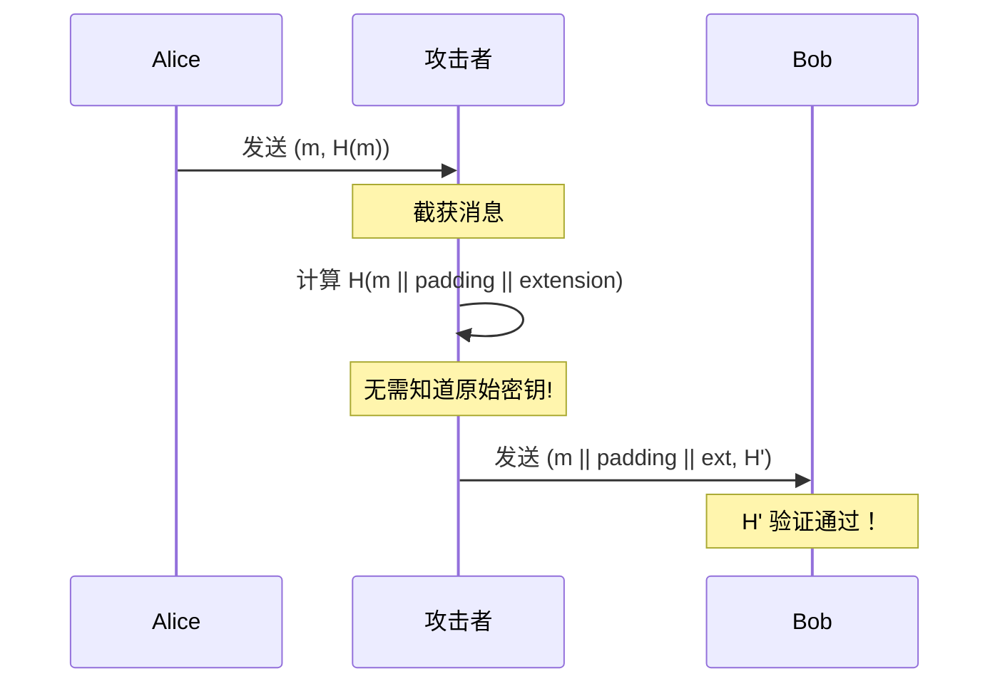
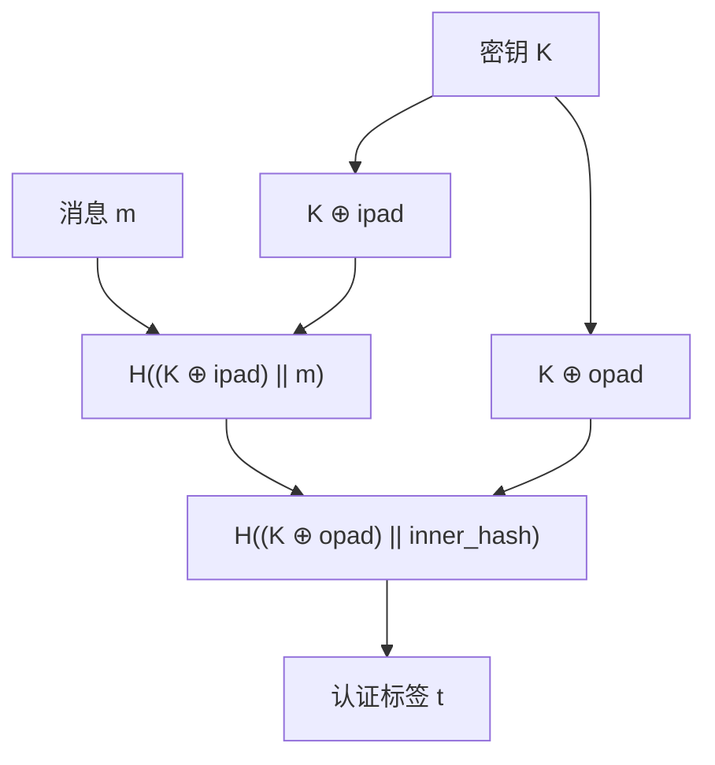

# 2.3 HMAC与消息认证码

## 学习目标

- 理解为什么单纯哈希不能保证消息认证
- 了解长度扩展攻击的原理
- 掌握 MAC（消息认证码）的概念和作用
- 理解 HMAC 的双层哈希构造
- 使用 OpenSSL 和 Python 生成和验证 HMAC
- 区分加密、哈希和认证三者的不同

## 前置知识

- [2.1 哈希函数原理](01-hash-functions.md)（哈希函数的基本概念）
- [2.2 哈希碰撞与安全分析](02-collision.md)（了解碰撞概念）
- 二进制运算基础（异或 XOR）

## 核心概念与术语

### 为什么单纯哈希不够？

你可能认为，要验证消息完整性，只需计算 $H(m)$ 即可。但这存在严重问题：

#### 问题1：长度扩展攻击（Length Extension Attack）

基于 Merkle-Damgård 构造的哈希函数（MD5、SHA-1、SHA-256）存在长度扩展漏洞。

攻击场景：

1. Alice 发送消息 $m$ 和 $H(m)$ 给 Bob
2. 攻击者截获 $(m, H(m))$
3. 攻击者可以计算 $H(m \parallel \text{padding} \parallel \text{extension})$ 而**不需要知道 $m$**
4. 攻击者发送 $(m \parallel \text{padding} \parallel \text{extension}, H')$ 给 Bob
5. Bob 验证 $H'$ 通过——因为他只看到 $m \parallel \text{padding} \parallel \text{extension}$



!!! warning "长度扩展攻击的根源"
    Merkle-Damgård 构造的哈希函数将消息分块处理，
    最后一个块的状态就是哈希输出。攻击者可以从这个中间状态继续"扩展"哈希计算，
    仿佛原始消息后面附加了新内容。

#### 问题2：无法区分意外损坏和恶意篡改

纯哈希无法证明消息的来源——任何人都可以计算 $H(m)$。
如果攻击者同时修改了消息和哈希值，接收方无法检测到篡改。

### 消息认证码（MAC）

**消息认证码**（Message Authentication Code, MAC）是一种密码学原语，它使用**共享密钥**来验证消息的**完整性**和**真实性**。

$$
\text{MAC}: (K, m) \rightarrow t
$$

其中：

- $K$ — 共享密钥（只有通信双方知道）
- $m$ — 消息
- $t$ — 认证标签（tag）

验证过程：

$$
\text{Verify}(K, m, t) = \begin{cases} \text{接受} & \text{if } \text{MAC}(K, m) = t \\ \text{拒绝} & \text{otherwise} \end{cases}
$$

!!! info "MAC vs 加密 vs 哈希"
    | 特性 | 哈希 | MAC | 加密 |
    |------|:----:|:---:|:----:|
    | 保密性 | ❌ | ❌ | ✅ |
    | 完整性 | ✅ | ✅ | ❌ |
    | 认证性 | ❌ | ✅ | ❌ |
    | 需要密钥 | ❌ | ✅ | ✅ |

### HMAC 的构造

**HMAC**（Hash-based Message Authentication Code）是最广泛使用的 MAC 构造方式，
由 Mihir Bellare、Ran Canetti 和 Hugo Krawczyk 于 1996 年提出。

HMAC 使用一个哈希函数 $H$ 和一个密钥 $K$ 来构造 MAC：

$$
\text{HMAC}(K, m) = H\Big((K \oplus \text{opad}) \;\|\; H\big((K \oplus \text{ipad}) \;\|\; m\big)\Big)
$$

其中：

- $\text{ipad} = \texttt{0x36}$ 重复至块大小（inner padding）
- $\text{opad} = \texttt{0x5c}$ 重复至块大小（outer padding）
- $\oplus$ 表示按位异或（XOR）
- $\|$ 表示拼接



!!! info "为什么用两层哈希？"
    两层哈希的构造提供了以下安全保证：

    1. **内层哈希**：将密钥和消息混合，确保消息被密钥"保护"
    2. **外层哈希**：将密钥再次混合到内层哈希的结果中，防止长度扩展攻击
    3. **ipad/opad 的异或**：确保内外层使用不同的"密钥版本"，即使底层哈希函数有某些弱点

    这种构造的安全性可以被证明：如果底层哈希函数是安全的（作为伪随机函数），
    那么 HMAC 也是安全的 MAC。

### HMAC 的安全性质

- **抗伪造**：没有密钥，在计算上不可行伪造有效的 $(m, t)$ 对
- **抗重放**：可以通过在消息中包含时间戳或序列号来防止重放
- **不提供保密性**：HMAC 不加密消息，仅提供完整性验证

### HMAC 与数字签名的区别

| 特性 | HMAC | 数字签名 |
|------|:----:|:--------:|
| 密钥类型 | 对称（共享密钥） | 非对称（公私钥对） |
| 计算速度 | 快 | 慢 |
| 不可否认性 | ❌ | ✅ |
| 适用场景 | 网络协议、API认证 | 数字证书、法律文件 |

## 动手实践

### 实验1：使用 OpenSSL 生成 HMAC

**创建测试消息：**

```bash
echo -n "Hello, this is a secret message." > message.txt
```

**使用 OpenSSL 生成 HMAC-SHA256：**

```bash
openssl dgst -sha256 -hmac "my_secret_key" message.txt
```

预期输出：

```
HMAC-SHA256(message.txt)= a1b2c3d4e5f6...（64个十六进制字符）
```

**使用不同的哈希算法生成 HMAC：**

```bash
# HMAC-MD5
openssl dgst -md5 -hmac "my_secret_key" message.txt

# HMAC-SHA1
openssl dgst -sha1 -hmac "my_secret_key" message.txt

# HMAC-SHA512
openssl dgst -sha512 -hmac "my_secret_key" message.txt
```

**验证 HMAC（通过重新计算并比较）：**

```bash
# 计算 HMAC 并保存
openssl dgst -sha256 -hmac "my_secret_key" -out hmac.txt message.txt

# 使用正确的密钥验证
openssl dgst -sha256 -hmac "my_secret_key" message.txt

# 使用错误的密钥验证（结果不同！）
openssl dgst -sha256 -hmac "wrong_key" message.txt
```

### 实验2：HMAC 的密钥敏感性

```bash
# 使用密钥 A
echo -n "Test message" | openssl dgst -sha256 -hmac "key_A"

# 使用密钥 B（仅一个字符不同）
echo -n "Test message" | openssl dgst -sha256 -hmac "key_B"

# 观察：两个 HMAC 值完全不同
```

### 实验3：Python HMAC 演示

**使用 Python 脚本：**

```bash
python scripts/hmac_demo.py
```

脚本演示内容：

- 使用 Python `hmac` 标准库生成 HMAC
- HMAC 的正确验证和篡改检测
- 密钥错误时的验证失败
- 不同哈希算法的 HMAC 对比

预期输出示例：

```
========================================
  HMAC 消息认证码演示
========================================

--- 实验1: HMAC 基本操作 ---
消息: Hello, this is a secret message.
密钥: my_secret_key

HMAC-MD5   : 7a8b9c0d1e2f...
HMAC-SHA1  : a1b2c3d4e5f6...
HMAC-SHA256: 1a2b3c4d5e6f...

--- 实验2: HMAC 验证 ---
使用正确密钥验证: ✅ 通过
使用错误密钥验证: ❌ 失败
篡改消息后验证:  ❌ 失败

--- 实验3: 长度扩展攻击防护 ---
普通哈希 H(key || msg):       可能被长度扩展攻击
HMAC(key, msg):               安全，不受长度扩展攻击影响
```

### 实验4：HMAC 在 API 认证中的应用

很多 Web API 使用 HMAC 来认证请求。以下是典型的 API HMAC 认证流程：

```python
# API HMAC 认证示例（概念演示）
import hmac
import hashlib
import time

api_key = "user_api_key"
api_secret = "super_secret_key"

# 构造签名消息
timestamp = str(int(time.time()))
message = f"{api_key}:{timestamp}"

# 计算签名
signature = hmac.new(
    api_secret.encode(),
    message.encode(),
    hashlib.sha256
).hexdigest()

# 发送请求时携带:
# Header: Authorization: HMAC-SHA256 {api_key}:{timestamp}:{signature}
```

## 安全分析与思考

### HMAC 密钥管理

!!! warning "密钥安全要点"
    1. **密钥长度**：至少与哈希函数输出长度相同（SHA-256 → 256位密钥）
    2. **密钥生成**：使用密码学安全的随机数生成器
    3. **密钥存储**：不要硬编码在源代码中，使用环境变量或密钥管理服务
    4. **密钥轮换**：定期更换密钥，限制密钥泄露的影响范围
    5. **密钥销毁**：不再使用的密钥应安全销毁

### 常见错误

#### 错误1：自己拼接密钥和消息

```python
# ❌ 错误做法：容易受到长度扩展攻击
hash_value = hashlib.sha256((key + message).encode()).hexdigest()

# ✅ 正确做法：使用 HMAC
hash_value = hmac.new(key.encode(), message.encode(), hashlib.sha256).hexdigest()
```

#### 错误2：比较时使用普通字符串比较

```python
# ❌ 错误做法：可能受到时序攻击
if received_mac == computed_mac:
    accept()

# ✅ 正确做法：使用常量时间比较
if hmac.compare_digest(received_mac, computed_mac):
    accept()
```

!!! warning "时序攻击"
    普通的字符串比较（`==`）在发现第一个不匹配字符时就会返回。
    攻击者可以通过测量响应时间来逐字节猜测正确的 MAC 值。
    `hmac.compare_digest()` 使用常量时间比较，防止此类攻击。

### HMAC 的实际应用

| 应用场景 | 说明 |
|----------|------|
| TLS/SSL | 保护通信的完整性 |
| JWT (JSON Web Token) | `HS256`, `HS384`, `HS512` 算法 |
| AWS API 签名 | `AWS4-HMAC-SHA256` |
| IPsec | 数据包完整性校验 |
| SSH | 连接完整性保护 |

## 练习题

### 练习1：基本概念

??? question "点击查看答案"
    **问题**：以下哪个操作能防止长度扩展攻击？

    A. $H(K \parallel m)$  
    B. $H(m \parallel K)$  
    C. $\text{HMAC}(K, m)$  
    D. $H(m)$  

    **答案**：C. $\text{HMAC}(K, m)$

    - A 和 B 都容易受到长度扩展攻击
    - D 没有使用密钥，根本不是 MAC
    - HMAC 的双层哈希构造专门设计来防止长度扩展攻击

### 练习2：安全强度

??? question "点击查看答案"
    **问题**：HMAC-SHA256 的安全强度是多少比特？

    **答案**：128 比特。

    HMAC 的安全强度受两个因素限制：
    1. 密钥空间的大小
    2. 碰撞攻击的复杂度 $O(2^{n/2})$

    对于 HMAC-SHA256：$\min(256, 256/2) = 128$ 比特安全强度。

### 练习3：时序攻击

??? question "点击查看答案"
    **问题**：为什么在比较 HMAC 值时必须使用常量时间比较？

    **答案**：如果使用普通的字符串比较（如 Python 的 `==`），
    比较操作会在发现第一个不匹配的字节时立即返回。
    这导致处理时间与正确字节数成正比。

    攻击者可以利用这个时间差来逐字节猜测正确的 HMAC 值：
    - 猜对第1字节 → 响应时间稍长
    - 猜对前2字节 → 响应时间更长
    - 以此类推...

    使用 `hmac.compare_digest()` 可以确保无论匹配多少字节，
    比较时间都是恒定的。

### 练习4：实践操作

??? question "点击查看答案"
    **问题**：使用 OpenSSL 计算以下 HMAC，并验证使用不同密钥会产生不同结果：

    ```
    消息: "transfer $100 to Alice"
    密钥1: "bank_secret_1"
    密钥2: "bank_secret_2"
    算法: HMAC-SHA256
    ```

    **答案**：

    ```bash
    echo -n "transfer $100 to Alice" > transfer.txt
    openssl dgst -sha256 -hmac "bank_secret_1" transfer.txt
    openssl dgst -sha256 -hmac "bank_secret_2" transfer.txt
    ```

    两个结果完全不同，证明了密钥的敏感性——即使密钥只有一个字符不同，
    HMAC 的输出也会完全不同。

## 延伸阅读

- [RFC 2104: HMAC: Keyed-Hashing for Message Authentication](https://tools.ietf.org/html/rfc2104)
- [RFC 4868: Using HMAC-SHA-256, HMAC-SHA-384, and HMAC-SHA-512 with IPsec](https://tools.ietf.org/html/rfc4868)
- [NIST SP 800-95B: Recommendation for Key Derivation](https://csrc.nist.gov/publications/detail/sp/800-108/final)
- [JWT.io: JSON Web Tokens](https://jwt.io/)
