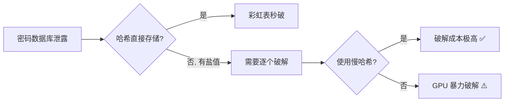
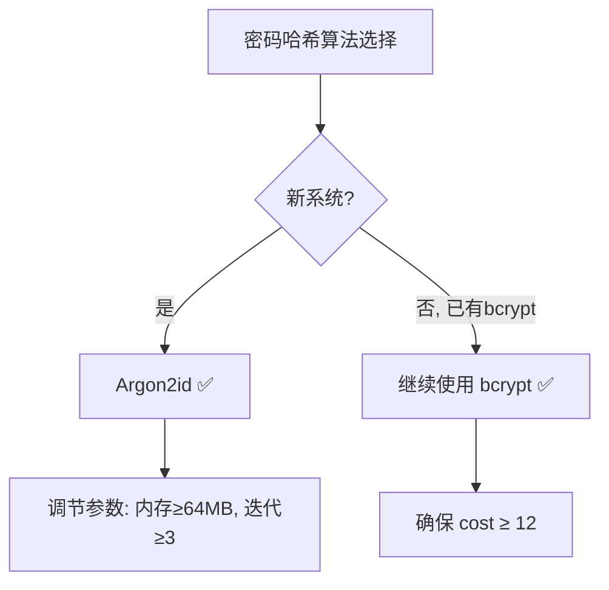

# 2.4 密码哈希与盐值

## 学习目标

- 理解为什么不能直接存储密码的哈希值
- 了解彩虹表攻击的原理和危害
- 掌握盐值（Salt）的作用和正确使用方法
- 了解慢哈希函数（bcrypt、scrypt、Argon2）的设计理念
- 使用 Python 进行密码哈希和验证
- 掌握密码存储的最佳实践

## 前置知识

- [2.1 哈希函数原理](01-hash-functions.md)（哈希函数基本概念）
- [2.2 哈希碰撞与安全分析](02-collision.md)（了解碰撞概念）
- 基本的 Python 编程能力

## 核心概念与术语

### 为什么不能直接存储密码哈希？

初学者最常见的错误就是直接存储密码的 SHA-256 哈希值：

```
用户密码: "password123"
存储值:   SHA256("password123") = "ef92b778bafe771e89245b89ecbc08a44a4e166c06659911881f383d4473e94f"
```

这种做法存在**严重的安全问题**：

#### 问题1：彩虹表攻击

**彩虹表**（Rainbow Table）是预先计算好的"密码 → 哈希值"查找表。
攻击者只需一次查找操作就能将哈希值反推为原始密码。

!!! info "彩虹表示例"
    | 哈希值 (SHA-256) | 密码 |
    |------------------|------|
    | `ef92b778...` | `password123` |
    | `5e884898...` | `password` |
    | `e10adc39...` | `123456` |
    | `098f6bcd...` | `test` |
    | ... | ... |

    在线彩虹表数据库包含**数十亿**常见密码的哈希值。

#### 问题2：相同密码产生相同哈希

如果两个用户都使用 `password123`，数据库中会有两条相同的哈希记录。
攻击者一旦破解一个，就知道所有使用相同密码的用户。

#### 问题3：GPU 加速暴力破解

现代 GPU 可以每秒计算**数十亿次** SHA-256 哈希。
对于 8 位以下的纯数字密码，GPU 可以在几秒内穷举所有可能。



### 盐值（Salt）

**盐值**是一个随机生成的字符串，在哈希之前附加到密码上：

$$
\text{存储值} = H(\text{salt} \parallel \text{password})
$$

盐值的作用：

1. **抵御彩虹表**：每个用户的盐值不同，彩虹表需要为每个盐值重新计算
2. **相同密码不同哈希**：即使两个用户密码相同，由于盐值不同，存储的哈希值也不同
3. **增加攻击成本**：攻击者必须为每个用户单独破解

!!! example "盐值的效果"
    ```
    用户A: password="password123", salt="a1b2c3"
    存储: SHA256("a1b2c3" + "password123") = "7f3a..."

    用户B: password="password123", salt="x9y8z7"
    存储: SHA256("x9y8z7" + "password123") = "2d8e..."

    两个用户密码相同，但存储值完全不同！
    ```

#### 盐值的正确使用

!!! warning "盐值使用规则"
    1. **每个用户唯一的盐值**：绝不能所有用户共用一个盐值
    2. **密码学安全随机数**：使用 `os.urandom()` 或 `secrets` 模块生成
    3. **足够长**：至少 16 字节（128 位）
    4. **可以明文存储**：盐值不需要保密，可以和哈希值一起存储在数据库中
    5. **永久不变**：一旦设定，不要更改（除非用户改密码）

### 慢哈希函数

即使使用了盐值，普通哈希函数（如 SHA-256）仍然**太快**。
攻击者可以使用 GPU 每秒尝试数十亿个密码。

**慢哈希函数**（Key Derivation Functions, KDF）通过**故意降低计算速度**
来增加暴力破解的成本。

#### bcrypt

- 设计于 1999 年，基于 Blowfish 加密算法
- 可调节的"工作因子"（cost factor），默认 cost=12
- 每次 cost 增加 1，计算时间翻倍
- 输出格式：`$2b$12$salt22chars.hash31chars`

```
$2b$12$LJ3m4ys1bQ2R5vXqQK5z5eXqQK5z5eXqQK5z5eXqQK5z5eXqQK5z
 ↑  ↑  ↑                ↑
 |  |  salt              hash
 |  cost factor
 bcrypt version
```

#### scrypt

- 设计于 2009 年，由 Colin Percival 提出
- 不仅消耗 CPU 时间，还消耗大量**内存**
- 对 GPU/ASIC 攻击的抵抗力更强
- 参数：N（CPU/内存成本）、r（块大小）、p（并行度）

#### Argon2

- 2015 年密码哈希竞赛（PHC）的获胜者
- 目前**推荐**的密码哈希算法
- 三个变体：Argon2d（抗 GPU）、Argon2i（抗侧信道）、Argon2id（推荐）
- 可独立调节 CPU、内存和并行度



!!! tip "算法选择建议"
    | 场景 | 推荐算法 | 理由 |
    |------|----------|------|
    | 新项目 | Argon2id | 最现代、最灵活 |
    | 已有 bcrypt | bcrypt | 足够安全，无需迁移 |
    | 资源受限 | bcrypt | 内存需求较低 |
    | 高安全需求 | Argon2id | 可调节内存和并行度 |

### PBKDF2

**PBKDF2**（Password-Based Key Derivation Function 2）是另一种常用的密钥派生函数：

$$
DK = \text{PBKDF2}(PRF, Password, Salt, c, dkLen)
$$

其中：

- $PRF$ — 伪随机函数（通常是 HMAC-SHA256）
- $c$ — 迭代次数
- $dkLen$ — 输出密钥长度

PBKDF2 被 NIST 推荐，广泛用于政府和企业系统。
但与 bcrypt/Argon2 相比，它**不消耗额外内存**，对 GPU 攻击的抵抗力较弱。

## 动手实践

### 实验1：不安全的密码存储

**使用 OpenSSL 直接哈希密码（不安全做法）：**

```bash
# 直接计算密码的 SHA-256（不安全！）
echo -n "password123" | openssl dgst -sha256

# 两个用户使用相同密码 → 相同哈希值
echo -n "password123" | openssl dgst -sha256
echo -n "password123" | openssl dgst -sha256
```

**在线彩虹表查询：**

访问在线 MD5/SHA-256 解密网站，输入哈希值 `ef92b778bafe771e89245b89ecbc08a44a4e166c06659911881f383d4473e94f`，可以瞬间得到原始密码 `password123`。

!!! warning "不要在生产系统中使用"
    以上仅为演示不安全做法。**永远不要**在生产系统中直接存储密码的普通哈希值。

### 实验2：使用盐值

**使用 OpenSSL 加盐哈希：**

```bash
# 生成随机盐值（16字节）
SALT=$(openssl rand -hex 16)
echo "Salt: $SALT"

# 使用盐值计算哈希
echo -n "${SALT}password123" | openssl dgst -sha256

# 使用不同的盐值（不同用户）
SALT2=$(openssl rand -hex 16)
echo "Salt2: $SALT2"
echo -n "${SALT2}password123" | openssl dgst -sha256

# 观察：相同密码，不同盐值 → 不同哈希
```

### 实验3：使用 bcrypt 进行密码哈希

**使用 Python 脚本：**

```bash
python scripts/hash_demo.py --bcrypt
```

或者直接在 Python 交互环境中：

```python
import bcrypt

# 哈希密码
password = b"password123"
hashed = bcrypt.hashpw(password, bcrypt.gensalt(rounds=12))
print(f"Hashed: {hashed}")

# 验证密码
print(f"Correct password: {bcrypt.checkpw(password, hashed)}")
print(f"Wrong password:   {bcrypt.checkpw(b'wrong_password', hashed)}")
```

预期输出：

```
Hashed: $2b$12$LJ3m4ys1bQ2R5vXqQK5z5e...
Correct password: True
Wrong password:   False
```

### 实验4：使用 OpenSSL 进行 PBKDF2 密钥派生

```bash
# PBKDF2 密钥派生（SHA-256, 10000次迭代）
openssl kdf -keylen 32 -kdfopt digest:SHA256 -kdfopt pass:password -kdfopt salt:salt -kdfopt iter:10000 PBKDF2

# 增加迭代次数到 100000
openssl kdf -keylen 32 -kdfopt digest:SHA256 -kdfopt pass:password -kdfopt salt:salt -kdfopt iter:100000 PBKDF2
```

!!! tip "观察迭代次数的影响"
    尝试不同的迭代次数（1000, 10000, 100000），
    观察计算时间的显著差异。这正是慢哈希函数的核心思想：
    合法用户只计算一次（登录时），而攻击者需要计算数十亿次。

### 实验5：密码哈希算法速度对比

**使用 Python 脚本对比不同算法的速度：**

```bash
python scripts/hash_demo.py --compare
```

预期输出示例：

```
========================================
  密码哈希算法速度对比
========================================

算法            单次耗时     1000次耗时    每秒可计算
SHA-256         0.0001ms     0.1ms         10,000,000
PBKDF2-10k      45ms         45s           22
bcrypt-10       120ms        120s          8
bcrypt-12       480ms        480s          2
Argon2id-64MB   650ms        650s          1.5

结论：bcrypt/Argon2 比 SHA-256 慢数百万倍，
      这使得暴力破解的成本极高。
```

## 安全分析与思考

### 密码存储最佳实践

!!! example "密码存储清单"
    1. **✅ 使用慢哈希函数**：Argon2id（首选）或 bcrypt
    2. **✅ 每个用户唯一盐值**：至少 16 字节随机盐
    3. **✅ 适当的工作参数**：
       - Argon2id: 内存 ≥ 64MB, 迭代 ≥ 3, 并行度 ≥ 1
       - bcrypt: cost ≥ 12
       - PBKDF2: 迭代 ≥ 600,000 (SHA-256)
    4. **✅ 常量时间比较**：验证时使用 `hmac.compare_digest()`
    5. **❌ 不要使用**：MD5、SHA-1、SHA-256（直接使用）、SHA-3（直接使用）
    6. **❌ 不要自己发明**密码哈希方案

### 工作参数的选择

选择工作参数时需要在**安全性**和**用户体验**之间平衡：

| 参数 | 目标 | 建议 |
|------|------|------|
| 单次哈希时间 | 用户登录时可接受 | 250ms - 1000ms |
| 内存消耗 | 增加 GPU 攻击成本 | ≥ 64MB（Argon2id） |
| 迭代次数 | 增加暴力破解成本 | 根据硬件调整 |

!!! tip "参数调优建议"
    在你的目标硬件上测试：

    ```python
    import time
    import bcrypt

    for cost in [10, 11, 12, 13, 14]:
        start = time.time()
        bcrypt.hashpw(b"test", bcrypt.gensalt(rounds=cost))
        elapsed = time.time() - start
        print(f"cost={cost}: {elapsed:.3f}s")
    ```

    选择使哈希时间在 250ms-1000ms 之间的最高 cost 值。

### 密码策略

除了正确存储密码外，还应考虑：

1. **密码复杂度要求**：最低长度、字符类型要求
2. **密码泄露检测**：检查 Have I Been Pwned 等数据库
3. **多因素认证**：即使密码泄露，也需要第二因素
4. **密码重置机制**：安全的密码重置流程
5. **登录失败限制**：防止暴力破解的账户锁定

### 前向安全性

即使使用了正确的密码哈希，如果攻击者获得了数据库，
他们仍然可以针对特定用户进行暴力破解。

**密钥强化**（Pepper）是一种额外的保护措施：

$$
\text{存储值} = H(\text{pepper} \parallel \text{salt} \parallel \text{password})
$$

其中 `pepper` 是存储在应用配置中（而非数据库中）的秘密值。
即使数据库泄露，没有 pepper 也无法验证密码。

## 练习题

### 练习1：盐值理解

??? question "点击查看答案"
    **问题**：以下哪种盐值使用方式是正确的？

    A. 所有用户使用相同的盐值  
    B. 每个用户的盐值等于其用户名  
    C. 每个用户使用密码学安全随机生成的唯一盐值  
    D. 不使用盐值，直接哈希密码  

    **答案**：C

    - A：共用盐值无法防御彩虹表
    - B：用户名是可预测的，攻击者可以预先计算
    - C：✅ 正确做法
    - D：完全不安全

### 练习2：安全评估

??? question "点击查看答案"
    **问题**：以下哪种密码存储方案最安全？

    A. `SHA-256(password)`  
    B. `SHA-256(salt + password)`  
    C. `bcrypt(password, cost=10)`  
    D. `Argon2id(password, salt, memory=64MB, iterations=3)`  

    **答案**：D

    - A：无盐值，不安全
    - B：有盐值但哈希太快，GPU可暴力破解
    - C：bcrypt 已经很好
    - D：✅ 最佳选择，Argon2id 提供最全面的保护

### 练习3：迭代次数计算

??? question "点击查看答案"
    **问题**：如果 PBKDF2-HMAC-SHA256 单次迭代需要 0.005ms，
    那么要使暴力破解 10000 个密码需要 1 年时间，需要设置多少次迭代？

    **答案**：

    设迭代次数为 $c$，每个密码的哈希时间为 $c \times 0.005\text{ms}$。

    1年 ≈ $3.15 \times 10^7$ 秒

    总计算量 = $10000 \times c$ 次迭代

    $10000 \times c \times 0.005\text{ms} = 3.15 \times 10^7 \times 1000\text{ms}$

    $c = \frac{3.15 \times 10^{10}}{50} = 6.3 \times 10^8 \approx 630,000,000$

    需要约 6.3 亿次迭代。这说明即使使用很高的迭代次数，
    对于只针对单个用户的定向攻击，仍然可能被破解。
    这就是为什么 Argon2id 的内存消耗特性非常重要。

### 练习4：实践操作

??? question "点击查看答案"
    **问题**：使用 Python 的 `bcrypt` 库完成以下任务：

    1. 为密码 `"MySecurePass123!"` 生成哈希（cost=12）
    2. 验证正确密码
    3. 验证错误密码
    4. 为同一密码生成第二个哈希，比较两个哈希是否相同

    **答案**：

    ```python
    import bcrypt

    password = b"MySecurePass123!"

    # 1. 生成哈希
    hash1 = bcrypt.hashpw(password, bcrypt.gensalt(rounds=12))
    print(f"Hash 1: {hash1}")

    # 2. 验证正确密码
    print(f"Correct: {bcrypt.checkpw(password, hash1)}")  # True

    # 3. 验证错误密码
    print(f"Wrong: {bcrypt.checkpw(b'wrong', hash1)}")     # False

    # 4. 生成第二个哈希
    hash2 = bcrypt.hashpw(password, bcrypt.gensalt(rounds=12))
    print(f"Hash 2: {hash2}")
    print(f"Same? {hash1 == hash2}")  # False（盐值不同）
    ```

## 延伸阅读

- [OWASP: Password Storage Cheat Sheet](https://cheatsheetseries.owasp.org/cheatsheets/Password_Storage_Cheat_Sheet.html)
- [Argon2 官方网站](https://www.argon2.io/)
- [NIST SP 800-63B: Digital Identity Guidelines](https://pages.nist.gov/800-63-3/sp800-63b.html)
- [Have I Been Pwned](https://haveibeenpwned.com/)
- [bcrypt Wikipedia](https://en.wikipedia.org/wiki/Bcrypt)
