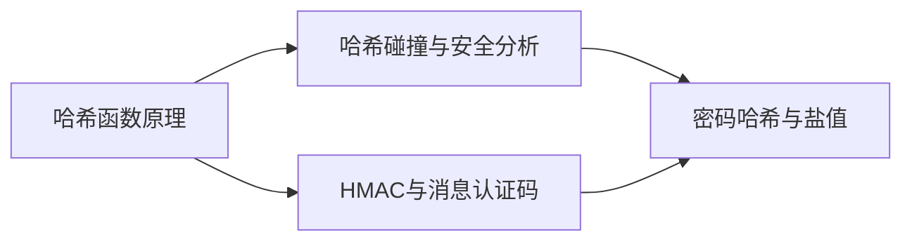

# 模块2：哈希函数与消息完整性

## 模块概述

哈希函数是现代密码学的基石之一。它将任意长度的输入映射为固定长度的输出，
广泛应用于数据完整性校验、数字签名、密码存储和区块链等领域。
本模块将带你从哈希函数的基本原理出发，逐步深入到碰撞攻击、HMAC消息认证
和密码安全存储等核心主题。

## 学习路线



## 模块内容

| 序号 | 主题 | 关键词 | 预计时长 |
|:----:|------|--------|:--------:|
| 2.1 | [哈希函数原理](01-hash-functions.md) | MD5, SHA-256, 雪崩效应 | 40分钟 |
| 2.2 | [哈希碰撞与安全分析](02-collision.md) | 生日悖论, 生日攻击, MD5碰撞 | 45分钟 |
| 2.3 | [HMAC与消息认证码](03-hmac.md) | HMAC, MAC, 长度扩展攻击 | 35分钟 |
| 2.4 | [密码哈希与盐值](04-password-hashing.md) | bcrypt, Argon2, 彩虹表 | 40分钟 |

## 配套脚本

| 脚本 | 说明 |
|------|------|
| `scripts/hash_demo.py` | 各种哈希算法对比演示（速度、输出长度、雪崩效应） |
| `scripts/birthday_attack.py` | 生日攻击模拟演示（简化版短哈希碰撞） |
| `scripts/hmac_demo.py` | HMAC生成与验证演示 |

## 学习目标

完成本模块后，你将能够：

- 理解哈希函数的数学定义和三大安全特性
- 区分 MD5、SHA-1、SHA-256 和 SHA-3 的安全性差异
- 解释生日悖论并计算哈希碰撞的理论复杂度
- 理解 HMAC 的构造原理及其抵御长度扩展攻击的能力
- 掌握密码存储的最佳实践：盐值、慢哈希函数和密钥派生

## 前置知识

- [模块1：密码学基础与古典密码](../01-foundations/index.md)（可选）
- 基本的编程概念（Python 基础）
- 二进制与十六进制数制的转换

## 工具准备

确保你已安装以下工具：

```bash
# 检查 OpenSSL 版本
openssl version

# 检查 Python 版本
python --version

# 安装所需 Python 库
pip install bcrypt pycryptodome
```

!!! tip "学习建议"
    本模块的四个主题之间有递进关系，建议按顺序学习。
    每个主题都配有动手实验，请务必亲自运行代码，观察输出结果。
