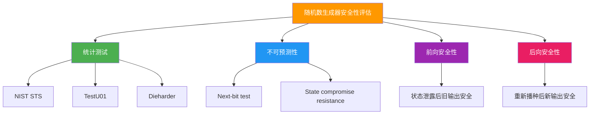

# 随机性基础：TRNG、PRNG与CSPRNG

## 学习目标

- 理解随机性的三个核心特性：不可预测性、均匀分布、独立性
- 区分真随机数生成器（TRNG）、伪随机数生成器（PRNG）和密码学安全伪随机数生成器（CSPRNG）
- 理解熵（Entropy）的概念及其在密码学中的重要性
- 认识为什么密码学必须使用CSPRNG而非普通PRNG
- 掌握使用OpenSSL和Python生成随机数的基本方法

## 前置知识

- 基本的编程概念（Python基础）
- 对哈希函数有基本了解（模块02）
- 了解二进制和十六进制表示

## 核心概念与术语

### 什么是随机性？

在密码学中，随机性（Randomness）指的是一种**不可预测性**。一个真正的随机序列具有以下三个关键特性：

1. **不可预测性（Unpredictability）**：即使知道序列的前n个值，也无法以高于随机猜测的概率预测第n+1个值
2. **均匀分布（Uniform Distribution）**：每个可能的值出现的概率相等
3. **独立性（Independence）**：序列中各个值之间没有相关性

!!! info "直觉理解"
    想象掷一个公平的骰子：每次掷出的点数不可预测（不可预测性），1-6每个面出现的概率都是1/6（均匀分布），连续掷出的点数之间没有关联（独立性）。

### 随机数生成器的分类

#### 1. 真随机数生成器（TRNG - True Random Number Generator）

TRNG从物理世界中的随机现象获取随机性，如：

- 放射性衰变
- 电子热噪声
- 大气噪声
- 量子现象

**特点**：

- 输出是真正随机的，不可预测
- 速度较慢，需要物理过程
- 通常用于生成种子（seed）

#### 2. 伪随机数生成器（PRNG - Pseudo-Random Number Generator）

PRNG使用确定性算法从初始种子生成看似随机的序列。

**特点**：

- 给定相同的种子，总是产生相同的序列
- 速度非常快
- 输出具有良好的统计特性（均匀分布等）
- **但输出可预测**（如果知道算法和种子）

#### 3. 密码学安全伪随机数生成器（CSPRNG - Cryptographically Secure PRNG）

CSPRNG是一种特殊的PRNG，满足密码学安全要求。

**特点**：

- 即使知道部分输出，也无法预测后续输出（前向安全性）
- 即使知道部分输出，也无法推断之前的输出（后向安全性）
- 速度较快（比TRNG快，比普通PRNG稍慢）
- 用于所有密码学操作

### 三类随机数生成器对比表

| 特性 | TRNG | PRNG | CSPRNG |
|------|------|------|--------|
| **熵源** | 物理噪声 | 种子 | 种子（来自TRNG） |
| **可预测性** | 不可预测 | 可预测 | 不可预测（无种子泄露） |
| **速度** | 慢 | 快 | 快 |
| **确定性** | 非确定 | 确定 | 确定 |
| **用途** | 密钥生成、种子 | 模拟、游戏、测试 | 密码学操作 |
| **统计质量** | 优秀 | 优秀 | 优秀 |
| **密码学安全** | 是（如果熵源好） | 否 | 是 |
| **典型例子** | 硬件RNG | `random`模块（Python） | `secrets`模块（Python） |

### 为什么密码学需要CSPRNG？

普通PRNG（如Python的`random`模块）虽然能产生统计上随机的序列，但存在致命弱点：

1. **可预测性**：知道算法和部分输出，可以推断内部状态
2. **种子空间小**：通常使用时间戳作为种子，搜索空间有限
3. **缺乏前向安全性**：内部状态泄露后，所有输出都可预测

!!! warning "安全警告"
    在密码学中使用普通PRNG就像用纸做保险箱：看起来像保险箱，但一捅就破。

## 动手实践

### 实验1：Python `random`模块的可预测性演示

Python的`random`模块使用梅森旋转算法（Mersenne Twister），这是一个高质量的PRNG，但不是CSPRNG。

**Mersenne Twister 内部状态**：

- 状态大小：624个32位整数 = 19968位
- 周期：$2^{19937}-1$
- 仅需观察624个连续输出即可完全恢复内部状态

**使用 Python 脚本:**
```bash
python scripts/random_demo.py
```

**预期输出：**
```
=== PRNG (random模块) 可预测性演示 ===
生成前10个随机数：
[0.1457, 0.9977, 0.5015, 0.3619, 0.3927, 0.0165, 0.7012, 0.1492, 0.4278, 0.2509]

已知这些输出，可以推断内部状态并预测后续输出...
预测的后续5个随机数：
[0.8845, 0.3832, 0.3218, 0.5862, 0.9867]

实际生成的后续5个随机数：
[0.8845, 0.3832, 0.3218, 0.5862, 0.9867]

结论：PRNG输出完全可预测！
```

### 实验2：CSPRNG (`secrets`模块) 的安全性

**使用 Python 脚本:**
```bash
python scripts/random_demo.py
```

**预期输出：**
```
=== CSPRNG (secrets模块) 安全性演示 ===
生成前10个随机数（0到1之间）：
[0.8234, 0.1928, 0.5512, 0.8847, 0.3301, 0.9456, 0.2178, 0.6634, 0.0912, 0.4789]

无法从这些输出推断内部状态或预测后续输出。
每次运行都会产生完全不同的序列。
```

### 实验3：OpenSSL生成随机数据

**使用 OpenSSL:**

```bash
# 生成16字节随机十六进制字符串（32个十六进制字符）
openssl rand -hex 16

# 生成32字节随机Base64编码字符串
openssl rand -base64 32

# 生成256位（32字节）随机密钥
openssl rand -hex 32

# 生成随机字节并保存到文件
openssl rand -out random_bytes.bin 1024
```

**预期输出示例：**
```console
$ openssl rand -hex 16
a3f5b8c2d1e4f6a7b9c0d2e3f5a8b1c4

$ openssl rand -base64 32
K7x2mP9qR4sT6vY8zA1bC3dE5fG7hI9jK1lM3nO5pQ=

$ openssl rand -hex 32
1a2b3c4d5e6f7a8b9c0d1e2f3a4b5c6d7e8f9a0b1c2d3e4f5a6b7c8d9e0f1a2b
```

!!! tip "OpenSSL 随机数用途"
    - `-hex`：适合日志、配置文件中的密钥表示
    - `-base64`：适合URL、API Token等场景
    - 生成的随机数由 OpenSSL 的 CSPRNG（RAND_bytes）提供

### 实验4：熵与熵源

#### 什么是熵？

熵（Entropy）是衡量随机性不确定性的度量单位，通常以比特为单位：

$$
H = -\sum_{i=1}^{n} p_i \log_2 p_i
$$

其中 $p_i$ 是第i个可能结果的概率。

- 一个公平硬币有1比特熵：$H = -\frac{1}{2}\log_2\frac{1}{2} - \frac{1}{2}\log_2\frac{1}{2} = 1$
- 一个公平骰子有 $\log_2 6 \approx 2.58$ 比特熵
- 一个完全可预测的事件有0比特熵

#### 最小熵（Min-Entropy）

在密码学中，我们更关心**最小熵**，它衡量最可能结果的概率：

$$
H_{\infty} = -\log_2(\max_i p_i)
$$

最小熵给出了攻击者单次猜测成功的最坏情况。

#### 操作系统如何收集熵？

现代操作系统从多个来源收集熵：

1. **硬件中断**：键盘、鼠标、磁盘、网络中断的精确时序
2. **环境噪声**：CPU热噪声、时钟抖动
3. **用户交互**：击键间隔、鼠标移动轨迹
4. **系统事件**：网络包到达时间、进程调度

!!! note "熵池"
    操作系统维护一个"熵池"，将各种熵源混合在一起。当需要随机数时，从熵池中提取。

#### Linux 熵池状态查看

```bash
# 查看当前熵池大小
cat /proc/sys/kernel/random/entropy_avail

# 查看熵池详细信息
cat /proc/sys/kernel/random/poolsize

# 查看随机数设备信息
cat /proc/sys/kernel/random/read_wakeup_threshold
cat /proc/sys/kernel/random/write_wakeup_threshold
```

#### `/dev/random` vs `/dev/urandom`（Linux）

| 特性 | `/dev/random` | `/dev/urandom` |
|------|---------------|----------------|
| 阻塞行为 | 熵池耗尽时阻塞 | 永不阻塞 |
| 输出质量 | 高（但争议大） | 高（现代内核） |
| 适用场景 | 长期密钥生成 | 大多数密码学应用 |
| 速度 | 慢 | 快 |
| 推荐度 | 特殊场景 | **推荐** |

!!! tip "现代观点"
    在现代Linux内核（5.6+）中，`/dev/random`和`/dev/urandom`的区别已经变得不重要。两者都使用ChaCha20-based CSPRNG，只是在熵不足时的行为不同。对于大多数应用，`/dev/urandom`是更好的选择。

### 实验5：Python中`random`与`secrets`的输出分布对比

**使用 Python 脚本:**
```bash
python scripts/random_demo.py
```

**预期输出：**
```
=== 输出分布对比 ===
生成10000个随机整数（0-99），统计分布：

PRNG (random模块) 分布：
值 0: 出现102次 (1.02%)
值 1: 出现98次 (0.98%)
值 2: 出现105次 (1.05%)
...
值 99: 出现97次 (0.97%)

CSPRNG (secrets模块) 分布：
值 0: 出现101次 (1.01%)
值 1: 出现99次 (0.99%)
值 2: 出现103次 (1.03%)
...
值 99: 出现98次 (0.98%)

两者都呈现均匀分布，但CSPRNG的输出不可预测。
```

## 安全分析与思考

### 随机数在密码学中的应用

随机数在密码学中无处不在：

1. **密钥生成**：对称加密密钥、非对称加密私钥
2. **初始化向量（IV）**：CBC、CTR等模式需要的随机IV
3. **Nonce**：防止重放攻击的随机数
4. **盐值（Salt）**：密码哈希中使用的随机盐
5. **挑战-响应协议**：随机挑战值
6. **数字签名**：ECDSA等签名算法需要的随机k值

### 弱随机性的后果

如果随机数生成器不安全，可能导致：

- **密钥可预测**：攻击者可以猜测或暴力破解密钥
- **IV重用**：破坏加密的语义安全性
- **Nonce重用**：导致密钥泄露（如ECDSA）
- **盐值可预测**：使彩虹表攻击成为可能

!!! danger "真实案例"
    2012年，研究人员发现某些嵌入式设备的随机数生成器熵不足，导致生成的RSA密钥可以被分解。这影响了数百万设备。

### 如何判断随机数生成器是否安全？

一个密码学安全的随机数生成器必须满足：

1. **通过统计测试**：如NIST STS、TestU01等测试套件
2. **不可预测性**：即使知道所有之前的输出，也无法预测下一个输出
3. **前向安全性**：内部状态泄露后，之前的输出仍安全
4. **后向安全性**：内部状态恢复后，后续输出安全



## 练习题

### 练习1：概念理解

1. 解释为什么`random`模块不适合用于密码学，而`secrets`模块适合。
2. 描述TRNG、PRNG、CSPRNG的主要区别。
3. 解释熵的概念，并举例说明一个高熵事件和一个低熵事件。

### 练习2：实践操作

1. 使用OpenSSL生成一个256位的随机密钥，并解释为什么这个密钥是安全的。
2. 编写Python脚本，比较`random.randint()`和`secrets.randbelow()`的性能差异。
3. 在Linux系统上，检查`/dev/random`和`/dev/urandom`的熵池状态。

### 练习3：安全分析

1. 分析以下场景的安全性：一个Web应用使用`time.time()`作为种子生成会话ID。
2. 讨论在虚拟机或容器环境中，熵源可能存在的问题及解决方案。
3. 解释为什么"看起来随机"不等于"密码学安全"。

!!! example "练习提示"
    对于练习3.1，考虑以下Python代码的安全性：
    ```python
    import random
    import time
    
    # 不安全的会话ID生成
    random.seed(time.time())
    session_id = ''.join([str(random.randint(0, 9)) for _ in range(32)])
    ```
    思考：攻击者如何预测这个session_id？

## 延伸阅读

### 标准文档
- [NIST SP 800-90A Rev. 1](https://csrc.nist.gov/publications/detail/sp/800-90a/rev-1/final)：推荐的随机数生成器标准
- [FIPS 140-3](https://csrc.nist.gov/publications/detail/fips/140/3/final)：密码模块安全要求
- [RFC 4086: Randomness Requirements for Security](https://tools.ietf.org/html/rfc4086)：安全随机性需求

### 学术资源
- [Mersenne Twister](https://en.wikipedia.org/wiki/Mersenne_Twister)：Python `random`模块使用的算法
- [Cryptographically secure pseudorandom number generator](https://en.wikipedia.org/wiki/Cryptographically_secure_pseudorandom_number_generator)：维基百科CSPRNG条目

### 工具与测试
- [NIST Statistical Test Suite](https://csrc.nist.gov/projects/random-bit-generation/documentation-and-software)：随机数统计测试套件
- [Dieharder](https://webhome.phy.duke.edu/~rgb/General/dieharder.php)：随机数测试工具
- [TestU01](http://simul.iro.umontreal.ca/testu01/tu01.html)：随机数测试框架

### 代码示例
- [Python `secrets`模块文档](https://docs.python.org/3/library/secrets.html)
- [OpenSSL `rand`命令手册](https://www.openssl.org/docs/man1.1.1/man1/rand.html)

## 下一步

学习完随机性基础后，建议继续学习：

1. [02-csprng-algorithms.md](02-csprng-algorithms.md)：深入了解CSPRNG的算法细节
2. [03-randomness-attacks.md](03-randomness-attacks.md)：分析真实的随机数漏洞案例
3. 模块03：对称加密 — 学习如何使用随机生成的密钥进行加密
