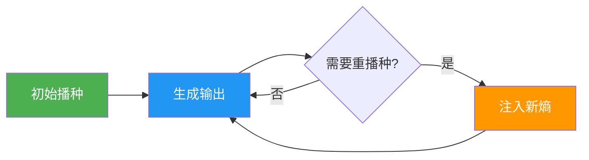
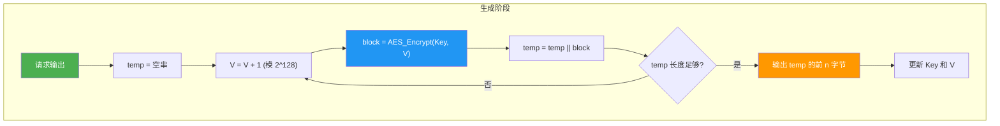

# CSPRNG算法详解

## 学习目标

- 理解CSPRNG的设计原则：前向安全性、后向安全性、重播种机制
- 掌握HMAC-DRBG算法的工作原理和流程
- 了解CTR-DRBG和ChaCha20-based CSPRNG的基本结构
- 比较各操作系统和编程语言中的CSPRNG实现
- 能够使用Python实现简化的HMAC-DRBG

## 前置知识

- 随机性基础（01-random-basics.md）
- 哈希函数和HMAC（模块02）
- AES加密基本概念（模块03，可选）

## 核心概念与术语

### CSPRNG的设计原则

一个安全的CSPRNG必须满足以下安全属性：

#### 1. 前向安全性（Forward Security）

如果攻击者在时间 $t$ 获取了CSPRNG的内部状态，他**不能**推断出时间 $t$ 之前生成的任何输出。

$$
\text{State}_t \not\Rightarrow \text{Output}_{t-1}, \text{Output}_{t-2}, ...
$$

#### 2. 后向安全性（Backward Security / Resilience）

如果攻击者在时间 $t$ 获取了CSPRNG的内部状态，在CSPRNG重新播种（reseed）后，他**不能**推断出时间 $t'$（$t' > t$）之后生成的输出。

$$
\text{State}_t + \text{Reseed}_{t'} \not\Rightarrow \text{Output}_{t'+1}, \text{Output}_{t'+2}, ...
$$

#### 3. 重播种机制（Reseeding）

CSPRNG应该支持在运行过程中注入新的熵，以：
- 恢复被泄露的状态
- 增加输出的不可预测性
- 应对熵源退化



### NIST SP 800-90A 标准

NIST（美国国家标准与技术研究院）定义了三种标准CSPRNG算法：

| 算法 | 底层原语 | 状态大小 | 安全强度 |
|------|----------|----------|----------|
| HMAC-DRBG | HMAC（SHA-1/SHA-256/SHA-384/SHA-512） | 取决于哈希输出 | 取决于哈希 |
| CTR-DRBG | AES-128/AES-192/AES-256 | 128-256位 | 128-256位 |
| Hash-DRBG | SHA-1/SHA-256/SHA-512 | 取决于哈希输出 | 取决于哈希 |

!!! note "DRBG"
    DRBG = Deterministic Random Bit Generator，即确定性随机比特生成器，是NIST对CSPRNG的术语。

## 算法详解

### HMAC-DRBG

HMAC-DRBG是目前最广泛使用的CSPRNG算法之一，基于HMAC构造。

#### 内部状态

HMAC-DRBG维护两个变量：

- **V**：当前值（Value），长度等于HMAC的输出长度
- **Key**：密钥，长度等于HMAC的密钥长度

#### 算法流程



```mermaid
graph TD
    subgraph 播种阶段
        S1[输入: 种子材料 seed_material] --> S2[Key = 0x00 * key_len]
        S2 --> S3[V = 0x01 * out_len]
        S3 --> S4["Key = HMAC(Key, V || 0x00 || seed_material)"]
        S4 --> S5["V = HMAC(Key, V)"]
        S5 --> S6["Key = HMAC(Key, V || 0x01 || seed_material)"]
        S6 --> S7["V = HMAC(Key, V)"]
    end
    
    subgraph 生成阶段
        G1[请求 n 字节输出] --> G2["temp = 空串"]
        G2 --> G3["V = HMAC(Key, V)"]
        G3 --> G4["temp = temp || V"]
        G4 --> G5{temp 长度 >= n?}
        G5 -->|否| G3
        G5 -->|是| G6["返回 temp 的前 n 字节"]
        G6 --> G7["Key = HMAC(Key, V || 0x00)"]
        G7 --> G8["V = HMAC(Key, V)"]
    end
    
    style S1 fill:#4CAF50,color:#fff
    style G1 fill:#2196F3,color:#fff
    style G6 fill:#FF9800,color:#fff
```

#### HMAC-DRBG 核心公式

**播种**：

$$
\text{Key} = \text{HMAC}(\text{Key}, V \| 0x00 \| \text{seed\_material})
$$

$$
V = \text{HMAC}(\text{Key}, V)
$$

**生成**：

$$
V_i = \text{HMAC}(\text{Key}, V_{i-1})
$$

$$
\text{output} = V_1 \| V_2 \| ... \| V_k
$$

**更新**：

$$
\text{Key} = \text{HMAC}(\text{Key}, V \| 0x00)
$$

$$
V = \text{HMAC}(\text{Key}, V)
$$

### CTR-DRBG

CTR-DRBG基于AES的计数器模式构造。

#### 内部状态

- **V**：计数器值，128位
- **Key**：AES密钥，128/192/256位
- **reseed_counter**：重播种计数器

#### 算法流程



**核心操作**：

$$
\text{block}_i = \text{AES}_{\text{Key}}(V + i)
$$

$$
\text{output} = \text{block}_1 \| \text{block}_2 \| ... \| \text{block}_k
$$

### ChaCha20-based CSPRNG

ChaCha20是一种流密码，也被用作CSPRNG的核心算法（如Linux内核的`/dev/urandom`）。

#### 优势

- 软件实现速度快（尤其在没有AES-NI的平台上）
- 简单且易于正确实现
- 抗侧信道攻击

#### Linux内核的实现

Linux内核从5.6版本开始使用ChaCha20作为`/dev/urandom`的核心：

```
初始状态: ChaCha20(key, counter, nonce)
输出: ChaCha20_block(state)
更新: counter += 1
重播种: 使用新熵更新key
```

## 各平台CSPRNG实现

### 操作系统级别

| 平台 | API | 底层算法 | 特点 |
|------|-----|----------|------|
| Linux | `/dev/urandom`, `getrandom()` | ChaCha20 | 内核级，高效 |
| Windows | `BCryptGenRandom()` | 基于AES的CTR-DRBG | 系统级CNG |
| macOS | `SecRandomCopyBytes()` | 基于Fortuna | Security框架 |
| FreeBSD | `arc4random()` | ChaCha20 | 用户级 |

### 编程语言级别

| 语言 | 安全API | 底层实现 |
|------|---------|----------|
| Python | `secrets` 模块 | 操作系统CSPRNG |
| Node.js | `crypto.randomBytes()` | OpenSSL RAND_bytes |
| Java | `SecureRandom` | 平台相关（SHA1PRNG, Windows-PRNG） |
| Go | `crypto/rand` | 操作系统CSPRNG |
| Rust | `rand::rngs::OsRng` | 操作系统CSPRNG |

!!! warning "常见陷阱"
    - Python: 使用 `secrets`，不要用 `random`
    - JavaScript: 使用 `crypto.randomBytes()`，不要用 `Math.random()`
    - Java: 使用 `SecureRandom`，不要用 `java.util.Random`

## 动手实践

### 实验1：Python实现简化HMAC-DRBG

**使用 Python 脚本:**
```bash
python scripts/csprng_demo.py
```

脚本实现了简化版的HMAC-DRBG，展示核心算法逻辑。

### 实验2：各平台CSPRNG调用对比

**Python示例：**
```python
import secrets

# 生成随机字节
random_bytes = secrets.token_bytes(32)

# 生成随机十六进制字符串
random_hex = secrets.token_hex(16)

# 生成随机URL安全字符串
random_url = secrets.token_urlsafe(24)

# 从范围中选择随机整数
random_int = secrets.randbelow(100)

print(f"随机字节: {random_bytes.hex()}")
print(f"随机十六进制: {random_hex}")
print(f"URL安全字符串: {random_url}")
print(f"随机整数: {random_int}")
```

**Node.js示例：**
```javascript
const crypto = require('crypto');

// 生成随机字节
const randomBytes = crypto.randomBytes(32);
console.log('随机字节:', randomBytes.toString('hex'));

// 生成随机整数
const randomInt = crypto.randomInt(100);
console.log('随机整数:', randomInt);

// 生成UUID
const uuid = crypto.randomUUID();
console.log('UUID:', uuid);
```

**OpenSSL命令行：**
```bash
# 生成不同类型和长度的随机数
openssl rand -hex 16      # 16字节十六进制
openssl rand -base64 32   # 32字节Base64
openssl rand -out file.bin 64  # 64字节写入文件
```

### 实验3：HMAC-DRBG重播种演示

**使用 Python 脚本:**
```bash
python scripts/csprng_demo.py
```

演示重播种如何恢复被泄露的内部状态。

## 安全分析与思考

### 各算法的安全强度

| 算法 | 安全强度（比特） | 适用场景 |
|------|-----------------|----------|
| HMAC-DRBG-SHA256 | 256 | 通用，RSA/ECC密钥生成 |
| HMAC-DRBG-SHA512 | 256 | 高安全需求 |
| CTR-DRBG-AES128 | 128 | 一般安全需求 |
| CTR-DRBG-AES256 | 256 | 高安全需求 |
| ChaCha20 | 256 | 高性能场景 |

### 选择建议

!!! tip "实际建议"
    1. **大多数应用**：使用操作系统提供的CSPRNG（Python `secrets`、Node.js `crypto.randomBytes()`）
    2. **嵌入式系统**：确保有足够的熵源，考虑使用硬件RNG
    3. **高性能需求**：考虑ChaCha20-based实现
    4. **合规要求**：遵循NIST SP 800-90A标准

### 常见实现错误

1. **种子不足**：使用低熵种子（如时间戳）初始化CSPRNG
2. **不重播种**：长期运行的程序不更新熵源
3. **状态泄露**：将内部状态暴露给不可信代码
4. **使用非密码学安全PRNG**：如Python `random`、C `rand()`

## 练习题

### 练习1：算法理解

1. 解释HMAC-DRBG中Key和V的作用，以及为什么需要两个变量。
2. 描述前向安全性和后向安全性的区别，并举例说明。
3. 为什么CTR-DRBG需要reseed_counter？

### 练习2：实现练习

1. 修改`csprng_demo.py`中的HMAC-DRBG实现，使用SHA-512代替SHA-256。
2. 编写一个函数，从HMAC-DRBG中生成指定范围内的随机整数。
3. 实现一个简单的熵收集器，从系统时间、进程ID等收集熵。

### 练习3：安全分析

1. 分析以下代码的安全问题：
   ```python
   import random
   random.seed(os.urandom(16))  # 使用安全种子
   key = random.getrandbits(256)  # 生成密钥
   ```
2. 讨论在容器化环境中CSPRNG可能面临的挑战。

!!! example "练习提示"
    对于练习3.1，虽然种子是安全的，但`random`模块本身不是CSPRNG，其内部状态可以被恢复。

## 延伸阅读

### 标准文档
- [NIST SP 800-90A Rev. 1](https://csrc.nist.gov/publications/detail/sp/800-90a/rev-1/final)：DRBG标准
- [NIST SP 800-90B](https://csrc.nist.gov/publications/detail/sp/800-90b/final)：熵源建议
- [NIST SP 800-90C](https://csrc.nist.gov/publications/detail/sp/800-90c/final)：RBG构造

### 实现参考
- [OpenSSL RAND_bytes实现](https://github.com/openssl/openssl/blob/master/crypto/rand/rand_lib.c)
- [Linux内核random.c](https://github.com/torvalds/linux/blob/master/drivers/char/random.c)
- [Python secrets模块](https://github.com/python/cpython/blob/main/Lib/secrets.py)

### 学术资源
- [HMAC-DRBG安全性证明](https://eprint.iacr.org/2006/379.pdf)
- [CTR-DRBG安全性分析](https://csrc.nist.gov/publications/detail/sp/800-90a/rev-1/final)

## 下一步

- [03-randomness-attacks.md](03-randomness-attacks.md)：分析真实的随机数漏洞案例
- 模块03：对称加密 — 学习如何使用随机生成的密钥进行加密
