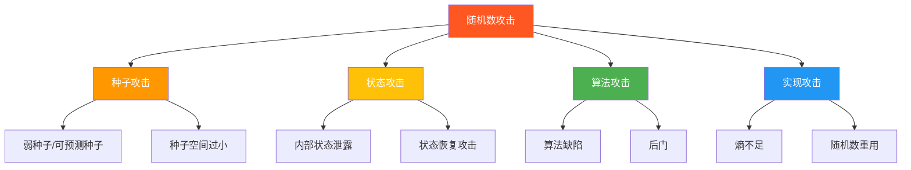

# 随机数漏洞与真实攻击案例

## 学习目标

- 理解弱随机数如何导致密码系统被攻破
- 掌握ECDSA签名中k值重用的数学原理和攻击方法
- 了解历史上著名的随机数漏洞事件
- 能够识别代码中的随机数安全问题
- 学习如何避免随机数相关的安全漏洞

## 前置知识

- 随机性基础（01-random-basics.md）
- CSPRNG算法（02-csprng-algorithms.md）
- 数字签名基础（模块04，可选）
- 模运算基础

## 核心概念与术语

### 随机数攻击的分类



### 攻击后果

随机数漏洞可能导致：

1. **私钥泄露**：从签名中恢复私钥
2. **密钥可预测**：直接猜测密钥
3. **会话劫持**：预测会话令牌
4. **加密失效**：IV/nonce重用破坏语义安全

## 真实攻击案例

### 案例1：Sony PS3 ECDSA k值重用（2010）

#### 背景

ECDSA（椭圆曲线数字签名算法）是广泛使用的数字签名算法。签名过程需要一个随机数 $k$：

$$
s = k^{-1}(z + r \cdot d) \mod n
$$

其中：
- $k$：随机数（必须保密且不重复）
- $z$：消息哈希
- $r$：签名的x坐标
- $d$：私钥
- $n$：曲线阶

#### 漏洞

Sony在PS3的签名实现中使用了**固定的 $k=4$**，这意味着所有签名使用相同的随机数。

#### 攻击原理

假设有两个使用相同 $k$ 值的签名 $(r, s_1)$ 和 $(r, s_2)$，对应消息哈希 $z_1$ 和 $z_2$：

$$
s_1 = k^{-1}(z_1 + r \cdot d) \mod n
$$

$$
s_2 = k^{-1}(z_2 + r \cdot d) \mod n
$$

两式相减：

$$
s_1 - s_2 = k^{-1}(z_1 - z_2) \mod n
$$

解出 $k$：

$$
k = (z_1 - z_2)(s_1 - s_2)^{-1} \mod n
$$

然后可以从任一签名中恢复私钥 $d$：

$$
d = r^{-1}(s \cdot k - z) \mod n
$$

#### 攻击脚本

**使用 Python 脚本:**
```bash
python scripts/randomness_attack.py
```

#### 数学推导详解

$$
\begin{aligned}
s_1 &= k^{-1}(z_1 + r \cdot d) \mod n \\
s_2 &= k^{-1}(z_2 + r \cdot d) \mod n \\
\\
s_1 - s_2 &= k^{-1}(z_1 - z_2) \mod n \\
k(s_1 - s_2) &= z_1 - z_2 \mod n \\
k &= (z_1 - z_2)(s_1 - s_2)^{-1} \mod n
\end{aligned}
$$

一旦获得 $k$，从第一个方程解出 $d$：

$$
\begin{aligned}
s_1 \cdot k &= z_1 + r \cdot d \mod n \\
r \cdot d &= s_1 \cdot k - z_1 \mod n \\
d &= r^{-1}(s_1 \cdot k - z_1) \mod n
\end{aligned}
$$

!!! danger "教训"
    ECDSA签名中的随机数 $k$ 必须是密码学安全的随机数，且**绝不能重复使用**。RFC 6979建议使用确定性k值生成方案。

### 案例2：Debian OpenSSL熵不足漏洞（2008）

#### 背景

2006年，Debian开发者在修复OpenSSL代码中的一个Valgrind警告时，删除了两行"看似无用"的代码。

#### 漏洞详情

被删除的代码负责从以下来源收集熵：

```c
// 被删除的代码（简化）
MD_Update(&m, buf, j);     // 从缓冲区收集熵
MD_Update(&m, &(md_c[0]), sizeof(md_c));  // 从计数器收集熵
```

删除后，OpenSSL的随机数生成器**仅使用进程ID（PID）作为种子**。

#### 影响

- **密钥空间极小**：PID范围通常为1-32768，仅32768种可能
- **受影响密钥**：所有在此期间生成的SSH密钥、SSL证书、DNSSEC密钥等
- **持续时间**：2006年9月至2008年5月（约20个月）
- **影响范围**：所有使用Debian OpenSSL的系统

#### 演示

```python
import hashlib
import os

def vulnerable_random_bytes(n):
    """模拟Debian漏洞：仅用PID作为种子"""
    pid = os.getpid()
    seed = str(pid).encode()
    
    result = b''
    counter = 0
    while len(result) < n:
        data = seed + counter.to_bytes(4, 'big')
        result += hashlib.md5(data).digest()
        counter += 1
    
    return result[:n]

# 生成"随机"密钥
key = vulnerable_random_bytes(16)
print(f"生成的密钥: {key.hex()}")
print(f"注意：相同PID总是生成相同的密钥！")
```

!!! warning "教训"
    1. 不要删除"看似无用"的代码，尤其是涉及安全的代码
    2. 熵源必须多样化
    3. 代码审查需要安全专家参与

### 案例3：Netscape SSL可预测种子（1995）

#### 背景

早期Netscape浏览器的SSL实现使用以下信息作为随机种子：

- 当前时间（微秒级）
- 进程ID
- 父进程ID

#### 漏洞

攻击者可以：
1. 猜测大致的时间范围（误差几秒）
2. 猜测进程ID（通常较小）

这大大缩小了搜索空间，使暴力破解成为可能。

#### 后续改进

Netscape后来改进了随机数生成，增加了更多熵源。

### 案例4：Android SecureRandom漏洞（2013）

#### 背景

Android的Java加密架构（JCA）中，`SecureRandom`的默认实现存在严重缺陷。

#### 漏洞详情

- **默认PRNG**：Android使用OpenSSL的PRNG，但初始化不当
- **种子问题**：某些设备在启动时熵不足
- **状态不更新**：PRNG状态在fork后不重新初始化

#### 影响

- 比特币钱包密钥可预测
- 加密密钥可被猜测
- 影响数百万Android设备

#### 修复

Google发布了安全补丁，并建议开发者：
1. 显式播种`SecureRandom`
2. 使用`LinuxPRNGSecureRandom`替代默认实现

## 其他随机数漏洞

### 嵌入式设备熵不足（2012）

研究人员发现某些路由器和嵌入式设备：
- 使用固定的默认种子
- 在启动时没有足够的熵
- 导致生成的RSA密钥可以被分解

### Dual_EC_DRBG 后门（2013）

NSA被曝在Dual_EC_DRBG算法中植入后门：
- 算法使用椭圆曲线
- 存在一个隐藏的陷门，可以预测输出
- NIST后来撤销了该算法的推荐

!!! danger "教训"
    使用标准化的、经过充分审查的算法，避免使用可能存在后门的算法。

## 防御措施

### 1. 使用正确的API

```python
# 正确：使用secrets模块
import secrets
key = secrets.token_bytes(32)

# 错误：使用random模块
import random
key = bytes([random.randint(0, 255) for _ in range(32)])
```

### 2. 确保足够的熵

- 使用操作系统提供的CSPRNG
- 在虚拟机/容器中确保熵源
- 考虑使用硬件RNG

### 3. 避免随机数重用

- 每次签名使用不同的随机数（ECDSA）
- 使用确定性k值生成（RFC 6979）
- 每次加密使用新的IV/nonce

### 4. 定期重新播种

- 长期运行的程序定期更新熵源
- 在fork后重新初始化PRNG
- 在关键时刻（如密钥生成）注入新熵

## 练习题

### 练习1：数学推导

1. 推导ECDSA中从两个使用相同k值的签名恢复私钥的完整过程。
2. 解释为什么$k$必须是均匀随机的，而不能是可预测的序列。

### 练习2：攻击模拟

1. 运行`randomness_attack.py`脚本，观察k值重用攻击的过程。
2. 修改脚本，尝试使用不同的曲线参数。

### 练习3：防御设计

1. 设计一个安全的随机数生成方案，考虑熵源、播种、重播种等因素。
2. 分析你常用的应用程序中随机数的使用情况。

!!! example "练习提示"
    对于练习1.1，从ECDSA签名方程开始，假设两个签名使用相同的k值，通过消元法求解k和d。

## 延伸阅读

### 学术论文
- [Nonce-Disrespecting Adversaries](https://eprint.iacr.org/2016/475.pdf)：TLS中的nonce重用问题
- [Mining Your Ps and Qs](https://factorable.net/weakkeys12.extended.pdf)：嵌入式设备弱密钥研究

### 漏洞报告
- [Debian Security Advisory DSA-1571](https://www.debian.org/security/2008/dsa-1571)：Debian OpenSSL漏洞
- [Android Security Advisory 2013](https://android-developers.googleblog.com/2013/08/some-securerandom-thoughts.html)

### 标准文档
- [RFC 6979: Deterministic Usage of DSA and ECDSA](https://datatracker.ietf.org/doc/html/rfc6979)：确定性k值生成
- [NIST SP 800-90A](https://csrc.nist.gov/publications/detail/sp/800-90a/rev-1/final)：DRBG标准

### 工具
- [ECDSA Private Key Recovery](https://github.com/tintinweb/ecdsa-private-key-recovery)：ECDSA私钥恢复工具

## 下一步

- 模块03：对称加密 — 学习如何安全地使用随机生成的密钥
- 模块04：非对称加密 — 深入理解ECDSA、RSA等算法中的随机数
- 模块05：密码分析 — 学习更多密码系统攻击技术
