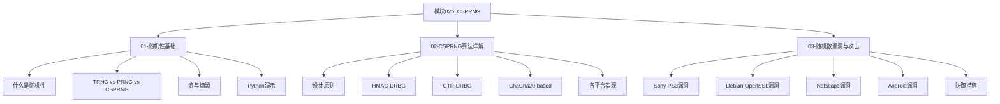
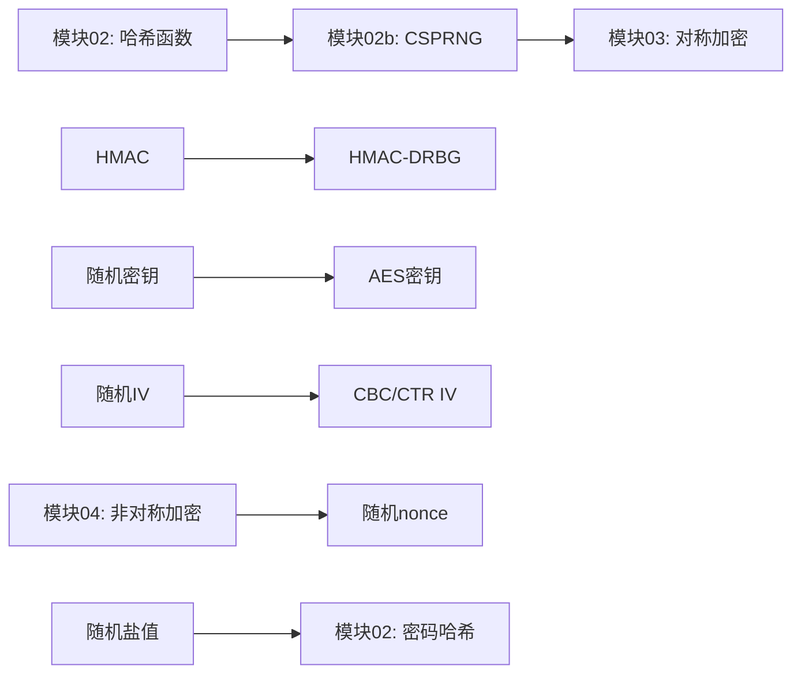

# 模块 02b：密码学安全随机数生成 (CSPRNG)

!!! info "模块概述"
    随机数是密码学的基石。密钥生成、初始化向量 (IV)、nonce、盐值 (salt) 等安全参数都依赖高质量的随机数。
    本模块深入探讨随机性的本质、CSPRNG 算法原理，以及因随机数缺陷导致的真实安全事件。

## 学习路线


## 本模块内容

| 序号 | 主题 | 核心内容 | 配套脚本 |
|:---:|------|----------|----------|
| 01 | [随机性基础](01-random-basics.md) | TRNG/PRNG/CSPRNG 区别、熵、Python random 可预测性 | `random_demo.py` |
| 02 | [CSPRNG 算法详解](02-csprng-algorithms.md) | HMAC-DRBG、CTR-DRBG、ChaCha20、各平台实现 | `csprng_demo.py` |
| 03 | [随机数漏洞与攻击](03-randomness-attacks.md) | PS3 ECDSA、Debian 漏洞、弱种子攻击 | `randomness_attack.py` |

## 学习目标

完成本模块后，你将能够：

- [x] 理解 TRNG、PRNG、CSPRNG 的本质区别
- [x] 掌握熵的概念及其在随机数生成中的作用
- [x] 了解主流 CSPRNG 算法的工作原理
- [x] 识别代码中的随机数安全漏洞
- [x] 在实际项目中正确使用密码学安全的随机数

## 前置知识

!!! note "建议先学习"
    - 模块 01：密码学基础与古典密码
    - 模块 02：哈希函数与消息认证
    - 基本的 Python 编程能力
    - 二进制与十六进制转换

## 核心概念速览

!!! tip "关键术语"
    - **熵 (Entropy)**：衡量随机性不可预测性的指标，单位为比特
    - **TRNG**：真随机数生成器，基于物理噪声源
    - **PRNG**：伪随机数生成器，基于确定性算法
    - **CSPRNG**：密码学安全伪随机数生成器，满足密码学安全要求
    - **播种 (Seeding)**：用初始熵初始化 PRNG 状态

## 快速实验

在终端中尝试以下命令，感受随机数生成：

```bash
# OpenSSL 生成随机十六进制串
openssl rand -hex 16

# OpenSSL 生成 Base64 编码的随机数据
openssl rand -base64 32

# 生成随机 UUID
python -c "import secrets; print(secrets.token_hex(16))"
```

## 为什么随机数如此重要？

!!! danger "一个数字决定安全"
    在 ECDSA 签名中，每次签名需要一个随机数 $k$。如果 $k$ 被重用或可预测，
    攻击者可以从两个签名中直接计算出私钥：

    $$
    k = \frac{z_1 - z_2}{s_1 - s_2} \mod n
    $$

    这正是 2010 年 Sony PS3 被攻破的原因——他们使用了固定的 $k=4$。

## 内容结构总览



## 配套脚本

| 脚本 | 功能 | 运行方式 |
|------|------|----------|
| `scripts/random_demo.py` | PRNG vs CSPRNG 对比演示 | `python scripts/random_demo.py` |
| `scripts/csprng_demo.py` | 各种 CSPRNG 实现演示 | `python scripts/csprng_demo.py` |
| `scripts/randomness_attack.py` | 弱随机数攻击模拟 | `python scripts/randomness_attack.py` |

## 快速开始

### 1. 运行 Python 演示

```bash
# 进入项目目录
cd crypto-tutorial/docs

# 运行 PRNG vs CSPRNG 对比
python scripts/random_demo.py

# 运行 CSPRNG 实现演示
python scripts/csprng_demo.py

# 运行随机数攻击模拟
python scripts/randomness_attack.py
```

### 2. 使用 OpenSSL 生成随机数

```bash
# 生成 16 字节十六进制随机数
openssl rand -hex 16

# 生成 32 字节 Base64 编码随机数
openssl rand -base64 32

# 生成 256 位随机密钥
openssl rand -hex 32
```

### 3. 关键记忆要点

!!! tip "安全准则"
    1. **永远不要**在密码学中使用 `random` 模块（Python）、`Math.random()`（JavaScript）等非密码学安全 PRNG
    2. **始终使用**操作系统提供的 CSPRNG：Python 的 `secrets`、Node.js 的 `crypto.randomBytes()`
    3. **不要自己实现**随机数生成器，除非你是密码学专家
    4. **确保足够的熵**：在虚拟机、容器等环境中注意熵源问题

## 真实世界的影响

随机数漏洞可能导致：

- **密钥泄露**：弱随机密钥可被暴力破解
- **签名伪造**：重复使用的 nonce 导致私钥泄露
- **会话劫持**：可预测的会话 ID
- **加密失效**：可预测的 IV 破坏语义安全

!!! danger "历史教训"
    2008 年 Debian OpenSSL 漏洞影响了数百万系统，根源仅仅是一个开发者删除了两行"看似无用"的熵收集代码。

## 与其他模块的关系



## 延伸阅读

- [NIST SP 800-90A Rev. 1](https://csrc.nist.gov/publications/detail/sp/800-90a/rev-1/final)：推荐的随机数生成器标准
- [RFC 4086: Randomness Requirements for Security](https://datatracker.ietf.org/doc/html/rfc4086)：安全随机性需求
- [Cryptographic Right Answers (Latacora)](https://latacora.micro.blog/2018/04/03/cryptographic-right-answers.html)：密码学最佳实践

## 下一步

完成本模块后，建议继续学习：

- **模块 03：对称加密** — 学习如何使用随机生成的密钥进行加密
- **模块 04：非对称加密** — 理解随机数在 RSA、ECC 中的作用
- **模块 05：密码分析** — 分析随机数弱点如何被利用
