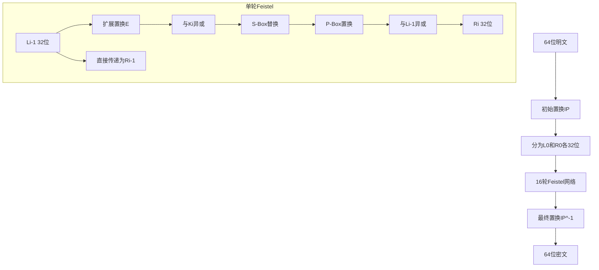

# DES算法详解

## 学习目标

完成本节后，你将能够：

- 理解DES算法的历史背景和设计原理
- 掌握Feistel网络结构及其在DES中的应用
- 了解DES的16轮加密过程，包括S-Box替换和P-Box置换
- 理解DES的密钥调度机制和56位有效密钥
- 使用OpenSSL和Python进行DES加解密操作
- 分析DES的安全弱点和被淘汰的原因

## 前置知识

- 二进制运算基础
- 对称加密的基本概念
- [密码学基础](../01-foundations/index.md)中的基本术语

## 核心概念与术语

### 数据加密标准（DES）

DES（Data Encryption Standard）是由IBM公司在1970年代开发的分组密码算法，1977年被美国国家标准与技术研究院（NIST）采纳为联邦信息处理标准（FIPS 46）。

**历史背景**：
- 1973年：NIST征求国家密码标准
- 1975年：IBM的Lucifer算法被选中
- 1977年：DES正式成为标准
- 1999年：DES被暴力破解
- 2001年：AES取代DES

### Feistel网络结构

DES采用Feistel网络结构，这是一种对称结构，使得加密和解密可以使用相同的算法，只需要反转密钥顺序。



**Feistel网络的特点**：
1. 将输入分为左右两半
2. 每轮只处理右半部分
3. 使用轮函数F进行混淆
4. 左右部分交换
5. 加密和解密结构相同

### DES的详细加密过程

#### 1. 初始置换（IP）

64位明文首先经过初始置换表重新排列位顺序：

```
IP置换表：
58 50 42 34 26 18 10 2
60 52 44 36 28 20 12 4
62 54 46 38 30 22 14 6
64 56 48 40 32 24 16 8
57 49 41 33 25 17  9 1
59 51 43 35 27 19 11 3
61 53 45 37 29 21 13 5
63 55 47 39 31 23 15 7
```

#### 2. 16轮Feistel网络

每轮加密过程：

1. **扩展置换E**：将32位右半部分扩展为48位
2. **轮密钥加**：与48位轮密钥进行异或
3. **S-Box替换**：8个S-Box将48位压缩为32位
4. **P-Box置换**：对32位结果进行置换
5. **异或**：与左半部分异或
6. **交换**：左右部分交换

#### 3. S-Box替换

S-Box（Substitution Box）是DES的核心非线性组件，提供混淆性：

- 8个S-Box，每个S-Box输入6位，输出4位
- 每个S-Box是一个4×16的查找表
- S-Box的设计原则：改变输入1位，输出至少改变2位

**S-Box 1示例**：
```
S1:
14  4 13  1  2 15 11  8  3 10  6 12  5  9  0  7
 0 15  7  4 14  2 13  1 10  6 12 11  9  5  3  8
 4  1 14  8 13  6  2 11 15 12  9  7  3 10  5  0
15 12  8  2  4  9  1  7  5 11  3 14 10  0  6 13
```

#### 4. P-Box置换

P-Box（Permutation Box）对S-Box的输出进行位重排：

```
P置换表：
16  7 20 21 29 12 28 17
 1 15 23 26  5 18 31 10
 2  8 24 14 32 27  3  9
19 13 30  6 22 11  4 25
```

#### 5. 最终置换（IP⁻¹）

经过16轮后，进行初始置换的逆置换：

```
IP^-1置换表：
40 8 48 16 56 24 64 32
39 7 47 15 55 23 63 31
38 6 46 14 54 22 62 30
37 5 45 13 53 21 61 29
36 4 44 12 52 20 60 28
35 3 43 11 51 19 59 27
34 2 42 10 50 18 58 26
33 1 41  9 49 17 57 25
```

### DES的密钥调度

DES使用56位有效密钥（64位密钥中每字节的第8位是奇偶校验位）。

#### 密钥生成过程：

1. **PC-1置换**：从64位密钥中选择56位，去除奇偶校验位
2. **分为C0和D0**：各28位
3. **16轮左移**：每轮左移1位或2位
4. **PC-2置换**：从56位中选择48位作为轮密钥

**左移位数表**：
```
轮次: 1  2  3  4  5  6  7  8  9 10 11 12 13 14 15 16
左移: 1  1  2  2  2  2  2  2  1  2  2  2  2  2  2  1
```

### DES的数学表示

DES加密过程可以用以下公式表示：

$$
L_i = R_{i-1}
$$

$$
R_i = L_{i-1} \oplus F(R_{i-1}, K_i)
$$

其中：
- $L_i$ 和 $R_i$ 是第i轮的左右两半
- $F$ 是轮函数
- $K_i$ 是第i轮的48位轮密钥
- $\oplus$ 是异或运算

## 动手实践

### 实验1：使用OpenSSL进行DES加解密

#### 准备测试数据

首先创建测试文件：

```bash
# 创建测试明文文件
echo "Hello, DES Encryption!" > plaintext.txt

# 查看文件内容
cat plaintext.txt
```

#### 使用OpenSSL进行DES-ECB加密

!!! warning "OpenSSL 3.x 兼容性说明"
    在 OpenSSL 3.x 中，DES 算法默认不再支持（因为 DES 是不安全的）。要使用 DES，需要加载 `legacy` 提供程序。
    
    以下命令仅适用于 OpenSSL 1.x 版本，或需要在 OpenSSL 3.x 中加载 legacy 提供程序：

```bash
# 生成随机密钥（16个十六进制字符 = 8字节 = 64位）
openssl rand -hex 8

# 使用DES-ECB模式加密 - 仅适用于 OpenSSL 1.x
openssl enc -des-ecb -in plaintext.txt -out encrypted.bin -K 0123456789ABCDEF

# 查看加密后的文件（二进制）
xxd encrypted.bin | head -5
```

#### 使用OpenSSL进行DES-ECB解密

```bash
# 解密文件 - 仅适用于 OpenSSL 1.x
openssl enc -d -des-ecb -in encrypted.bin -out decrypted.txt -K 0123456789ABCDEF

# 验证解密结果
cat decrypted.txt
```

#### 使用OpenSSL进行DES-CBC加密

```bash
# CBC模式需要初始向量（IV）- 仅适用于 OpenSSL 1.x
openssl enc -des-cbc -in plaintext.txt -out encrypted_cbc.bin -K 0123456789ABCDEF -iv 1234567890ABCDEF

# 解密CBC模式 - 仅适用于 OpenSSL 1.x
openssl enc -d -des-cbc -in encrypted_cbc.bin -out decrypted_cbc.txt -K 0123456789ABCDEF -iv 1234567890ABCDEF
```

!!! note "OpenSSL参数说明"
    - `-des-ecb`：使用DES算法的ECB模式
    - `-des-cbc`：使用DES算法的CBC模式
    - `-K`：指定密钥（十六进制格式）
    - `-iv`：指定初始向量（CBC模式需要）
    - `-in`：输入文件
    - `-out`：输出文件

### 实验2：使用CyberChef进行DES操作

#### 在CyberChef中加密

1. 打开CyberChef：https://gchq.github.io/CyberChef/
2. 在左侧"Operations"面板搜索"DES"
3. 拖拽"DES Encrypt"到"Recipe"区域
4. 配置参数：
   - Key: `0123456789ABCDEF`
   - Mode: ECB
   - Input: UTF-8
   - Output: Hex
5. 在"Input"区域输入：`Hello, DES Encryption!`
6. 查看"Output"区域的加密结果

#### 在CyberChef中解密

1. 使用"DES Decrypt"操作
2. 使用相同的密钥和模式
3. 输入密文（十六进制格式）
4. 验证解密结果

### 实验3：Python脚本演示DES

我们将使用Python的`pycryptodome`库进行DES加解密演示。

#### 安装依赖

```bash
pip install pycryptodome
```

#### 运行演示脚本

```bash
python scripts/des_demo.py
```

**预期输出**：

```
=== DES Encryption Demo ===

Original text: Hello, DES Encryption!
Key (hex): 0123456789abcdef

--- DES-ECB Mode ---
Encrypted (hex): [加密后的十六进制数据]
Decrypted: Hello, DES Encryption!

--- DES-CBC Mode ---
IV (hex): [初始向量十六进制]
Encrypted (hex): [加密后的十六进制数据]
Decrypted: Hello, DES Encryption!

=== DES Key Analysis ===
64-bit key: 0123456789abcdef
56-bit effective key: [去除奇偶校验位后的密钥]
Parity bits: [奇偶校验位]

=== DES Security Analysis ===
Key space size: 2^56 = 72057594037927936
Time to brute force (1 billion keys/sec): ~2.28 years
```

## 安全分析与思考

### DES的安全弱点

#### 1. 密钥长度太短

DES使用56位有效密钥，密钥空间为$2^{56} \approx 7.2 \times 10^{16}$。

**暴力破解时间估算**：
- 1977年：需要数千年
- 1998年：EFF的"Deep Crack"在56小时内破解
- 1999年：22小时破解
- 2024年：现代GPU可在数小时内破解

#### 2. S-Box设计问题

虽然S-Box提供了非线性，但存在一些弱点：
- 差分密码分析可以利用S-Box的特性
- 线性密码分析可以找到线性近似

#### 3. ECB模式问题

ECB模式下，相同的明文块产生相同的密文块，泄露模式信息。

### 3DES（Triple DES）

为了延长DES的使用寿命，提出了3DES方案：

#### 3DES加密过程

$$
C = E_{K_3}(D_{K_2}(E_{K_1}(P)))
$$

其中：
- $E$ 表示加密
- $D$ 表示解密
- $K_1, K_2, K_3$ 是三个不同的密钥

#### 3DES的密钥选项

1. **密钥选项1**：三个独立密钥（168位有效）
2. **密钥选项2**：$K_1 = K_3$（112位有效）
3. **密钥选项3**：三个相同密钥（退化为单DES）

#### 3DES的优缺点

**优点**：
- 比单DES安全得多
- 向后兼容DES

**缺点**：
- 速度比DES慢三倍
- 64位块大小仍然存在安全问题
- 已被AES取代

### 现代替代方案

DES已被以下算法取代：

1. **AES**：当前标准，支持128/192/256位密钥
2. **ChaCha20**：流密码，用于TLS 1.3
3. **Camellia**：与AES安全性相当

!!! warning "安全警告"
    **永远不要在实际应用中使用DES**。即使是3DES也应逐步淘汰。现代应用应使用AES-256或ChaCha20。

## 练习题

### 基础题

1. **DES的基本参数**：
   - DES的块大小是多少位？
   - DES的有效密钥长度是多少位？
   - DES使用多少轮加密？

2. **Feistel网络**：
   - 解释Feistel网络的基本结构
   - 为什么Feistel网络的加密和解密可以使用相同结构？

3. **S-Box的作用**：
   - S-Box在DES中起什么作用？
   - 为什么S-Box是非线性的？

### 进阶题

4. **密钥调度**：
   - 描述DES的密钥调度过程
   - 为什么64位密钥只有56位有效？

5. **安全性分析**：
   - 计算DES密钥空间的大小
   - 如果每秒能测试$10^9$个密钥，暴力破解DES需要多长时间？

6. **3DES**：
   - 解释3DES的加密过程
   - 为什么3DES使用"加密-解密-加密"而不是"加密-加密-加密"？

### 实践题

7. **OpenSSL实践**：
   使用OpenSSL完成以下任务：
   - 用DES-ECB加密一个文件
   - 用DES-CBC加密同一个文件
   - 比较两种模式的输出有何不同

8. **Python编程**：
   编写Python脚本实现：
   - DES加密函数
   - DES解密函数
   - 测试加密解密是否正确

9. **密码分析**：
   - 尝试用不同密钥加密相同明文
   - 观察密文的变化
   - 分析DES对密钥变化的敏感性

## 延伸阅读

### 官方文档

- [FIPS 46-3: DES标准](https://csrc.nist.gov/publications/detail/fips/46/3/final)
- [NIST对称加密标准](https://csrc.nist.gov/projects/cryptographic-standards-and-guidelines)

### 学术论文

- Horst Feistel, "Cryptography and Computer Privacy," Scientific American, 1973
- Eli Biham, Adi Shamir, "Differential Cryptanalysis of the Data Encryption Standard," 1993

### 在线资源

- [DES算法动画演示](https://www.youtube.com/watch?v=X5VbzpgZjgI)
- [CryptoHack DES挑战](https://cryptohack.org/challenges/des/)

### 相关工具

- [OpenSSL文档](https://www.openssl.org/docs/)
- [pycryptodome文档](https://pycryptodome.readthedocs.io/)
- [CyberChef](https://gchq.github.io/CyberChef/)

---

**下一步**：学习 [AES算法详解](02-aes.md)