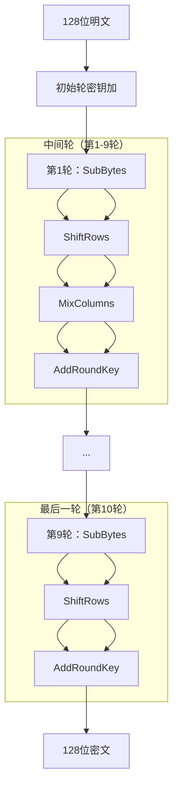

# AES算法详解

## 学习目标

完成本节后，你将能够：

- 理解AES算法的历史背景和设计目标
- 掌握AES的状态矩阵结构和四种轮操作
- 了解AES-128、AES-192和AES-256的区别
- 使用OpenSSL、CyberChef和Python进行AES加解密操作
- 分析AES的安全特性和应用场景

## 前置知识

- [DES算法详解](01-des.md)中的分组密码概念
- 有限域$GF(2^8)$的基本运算
- 矩阵运算基础

## 核心概念与术语

### 高级加密标准（AES）

AES（Advanced Encryption Standard）是当前最广泛使用的对称加密标准，由比利时密码学家Joan Daemen和Vincent Rijmen设计的Rijndael算法演变而来。

**历史背景**：
- 1997年：NIST征集AES候选算法
- 1998年：15个候选算法进入第一轮评估
- 2000年：Rijndael被选为AES
- 2001年：AES成为FIPS 197标准
- 2023年：AES仍然是最安全的对称加密算法之一

### AES与DES的对比

| 特性 | DES | AES |
|------|-----|-----|
| 块大小 | 64位 | 128位 |
| 密钥长度 | 56位 | 128/192/256位 |
| 加密轮数 | 16轮 | 10/12/14轮 |
| 设计结构 | Feistel网络 | 替换-置换网络（SPN） |
| 安全状态 | 已淘汰 | 当前标准 |
| 性能 | 较慢 | 较快（硬件加速） |

### AES的状态矩阵

AES将128位输入组织成4×4的字节矩阵，称为"状态"（State）：

```
输入字节：b0 b1 b2 b3 ... b15

状态矩阵：
┌────┬────┬────┬────┐
│ b0 │ b4 │ b8 │ b12│
├────┼────┼────┼────┤
│ b1 │ b5 │ b9 │ b13│
├────┼────┼────┼────┤
│ b2 │ b6 │ b10│ b14│
├────┼────┼────┼────┤
│ b3 │ b7 │ b11│ b15│
└────┴────┴────┴────┘
```

**字节排列顺序**：列优先（column-major），与行优先不同。

### AES的轮操作

AES的每轮包含四个操作（最后一轮略有不同）：

#### 1. SubBytes（字节替换）

SubBytes是AES唯一的非线性操作，使用S-Box进行字节替换：

- 输入：8位字节
- 输出：8位字节
- S-Box基于有限域$GF(2^8)$的乘法逆元

**S-Box的构造**：
1. 计算输入字节在$GF(2^8)$中的乘法逆元
2. 进行仿射变换
3. 加上常数0x63

**S-Box示例**（部分）：
```
    0  1  2  3  4  5  6  7  8  9  a  b  c  d  e  f
00: 63 7c 77 7b f2 6b 6f c5 30 01 67 2b fe d7 ab 76
10: ca 82 c9 7d fa 59 47 f0 ad d4 a2 af 9c a4 72 c0
20: b7 fd 93 26 36 3f f7 cc 34 a5 e5 f1 71 d8 31 15
30: 04 c7 23 c3 18 96 05 9a 07 12 80 e2 eb 27 b2 75
```

#### 2. ShiftRows（行移位）

ShiftRows对状态矩阵的每一行进行循环左移：

- 第0行：不移位
- 第1行：循环左移1字节
- 第2行：循环左移2字节
- 第3行：循环左移3字节

**示例**：
```
输入：                输出：
┌────┬────┬────┬────┐  ┌────┬────┬────┬────┐
│ a0 │ a4 │ a8 │ a12│  │ a0 │ a4 │ a8 │ a12│  (不移位)
├────┼────┼────┼────┤  ├────┼────┼────┼────┤
│ a1 │ a5 │ a9 │ a13│  │ a5 │ a9 │ a13│ a1 │  (左移1)
├────┼────┼────┼────┤  ├────┼────┼────┼────┤
│ a2 │ a6 │ a10│ a14│  │ a10│ a14│ a2 │ a6 │  (左移2)
├────┼────┼────┼────┤  ├────┼────┼────┼────┤
│ a3 │ a7 │ a11│ a15│  │ a15│ a3 │ a7 │ a11│  (左移3)
└────┴────┴────┴────┘  └────┴────┴────┴────┘
```

#### 3. MixColumns（列混合）

MixColumns对状态矩阵的每一列进行线性变换：

- 使用$GF(2^8)$上的矩阵乘法
- 每列独立处理
- 提供扩散性

**MixColumns矩阵**：
$$
\begin{bmatrix}
2 & 3 & 1 & 1 \\
1 & 2 & 3 & 1 \\
1 & 1 & 2 & 3 \\
3 & 1 & 1 & 2
\end{bmatrix}
$$

**数学公式**：
$$
s'_i = (2 \cdot s_i) \oplus (3 \cdot s_{i+1}) \oplus s_{i+2} \oplus s_{i+3}
$$

其中乘法是在$GF(2^8)$上进行的。

#### 4. AddRoundKey（轮密钥加）

AddRoundKey将轮密钥与状态矩阵进行异或：

- 轮密钥通过密钥调度算法生成
- 每轮使用不同的轮密钥
- 这是AES中唯一的线性操作

**示例**：
```
状态矩阵：          轮密钥：              结果：
┌────┬────┬────┬────┐  ┌────┬────┬────┬────┐  ┌────┬────┬────┬────┐
│ s0 │ s4 │ s8 │ s12│  │ k0 │ k4 │ k8 │ k12│  │ s0⊕k0│ s4⊕k4│ s8⊕k8│ s12⊕k12│
├────┼────┼────┼────┤  ├────┼────┼────┼────┤  ├────┼────┼────┼────┤
│ s1 │ s5 │ s9 │ s13│  │ k1 │ k5 │ k9 │ k13│  │ s1⊕k1│ s5⊕k5│ s9⊕k9│ s13⊕k13│
├────┼────┼────┼────┤  ├────┼────┼────┼────┤  ├────┼────┼────┼────┤
│ s2 │ s6 │ s10│ s14│  │ k2 │ k6 │ k10│ k14│  │ s2⊕k2│ s6⊕k6│ s10⊕k10│ s14⊕k14│
├────┼────┼────┼────┤  ├────┼────┼────┼────┤  ├────┼────┼────┼────┤
│ s3 │ s7 │ s11│ s15│  │ k3 │ k7 │ k11│ k15│  │ s3⊕k3│ s7⊕k7│ s11⊕k11│ s15⊕k15│
└────┴────┴────┴────┘  └────┴────┴────┴────┘  └────┴────┴────┴────┘
```

### AES的密钥调度

AES的密钥调度算法生成轮密钥：

#### AES-128密钥调度

- 输入：128位密钥（4个32位字）
- 输出：11个轮密钥（每轮128位）
- 每轮生成4个32位字

**密钥扩展过程**：
1. 前4个字直接来自密钥
2. 后续字通过递归计算
3. 每4个字进行一次Rcon（轮常数）操作

#### AES-192和AES-256

| 变种 | 密钥长度 | 块大小 | 轮数 | 轮密钥数 |
|------|----------|--------|------|----------|
| AES-128 | 128位 | 128位 | 10轮 | 11个 |
| AES-192 | 192位 | 128位 | 12轮 | 13个 |
| AES-256 | 256位 | 128位 | 14轮 | 15个 |

### AES的数学基础

#### 有限域$GF(2^8)$

AES使用有限域$GF(2^8)$进行字节运算：

- 不可约多项式：$m(x) = x^8 + x^4 + x^3 + x + 1$
- 字节表示为多项式系数
- 乘法为多项式乘法模$m(x)$

**示例**：
$$
\{57\} \cdot \{83\} = \{C1\}
$$

计算过程：
1. $\{57\} = x^6 + x^4 + x^2 + x + 1$
2. $\{83\} = x^7 + x + 1$
3. 乘积模$m(x)$得到$\{C1\}$

### AES的完整加密过程



**加密过程**：
1. 初始轮密钥加：$State = Plaintext \oplus K_0$
2. 中间轮（第1-9轮）：SubBytes → ShiftRows → MixColumns → AddRoundKey
3. 最后一轮（第10轮）：SubBytes → ShiftRows → AddRoundKey（无MixColumns）

### AES的解密过程

AES解密是加密的逆过程：

1. 逆轮密钥加
2. 逆ShiftRows
3. 逆SubBytes
4. 逆MixColumns（前9轮）

**解密顺序**：
$$
Decrypt: AddRoundKey^{-1} \rightarrow MixColumns^{-1} \rightarrow ShiftRows^{-1} \rightarrow SubBytes^{-1}
$$

## 动手实践

### 实验1：使用OpenSSL进行AES加解密

#### 准备测试数据

```bash
# 创建测试文件
echo "Hello, AES Encryption! This is a secret message." > plaintext.txt

# 查看文件内容
cat plaintext.txt
```

#### AES-128-CBC加密

```bash
# 使用密码派生密钥
openssl enc -aes-128-cbc -in plaintext.txt -out encrypted_aes128.bin -pass pass:mypassword

# 查看加密结果
xxd encrypted_aes128.bin | head -10
```

#### AES-256-CBC加密

```bash
# 使用AES-256-CBC加密
openssl enc -aes-256-cbc -in plaintext.txt -out encrypted_aes256.bin -pass pass:mypassword

# 解密文件
openssl enc -d -aes-256-cbc -in encrypted_aes256.bin -out decrypted_aes256.txt -pass pass:mypassword

# 验证解密结果
cat decrypted_aes256.txt
```

#### AES-GCM加密（认证加密）

!!! warning "OpenSSL 3.x 兼容性说明"
    在 OpenSSL 3.x 中，`openssl enc` 命令不再支持 AEAD 模式（如 GCM）。要使用 GCM 模式，需要使用 OpenSSL 的 EVP API 或其他工具（如 Python 的 `cryptography` 库）。
    
    以下命令仅适用于 OpenSSL 1.x 版本：

```bash
# AES-GCM提供认证加密 - 仅适用于 OpenSSL 1.x
openssl enc -aes-256-gcm -in plaintext.txt -out encrypted_gcm.bin -pass pass:mypassword

# 解密并验证 - 仅适用于 OpenSSL 1.x
openssl enc -d -aes-256-gcm -in encrypted_gcm.bin -out decrypted_gcm.txt -pass pass:mypassword
```

!!! tip "OpenSSL AES参数"
    - `-aes-128-cbc`：AES-128 CBC模式
    - `-aes-256-cbc`：AES-256 CBC模式  
    - `-aes-256-gcm`：AES-256 GCM模式（认证加密）
    - `-pass pass:password`：使用密码派生密钥
    - `-pbkdf2`：使用PBKDF2密钥派生（推荐）

### 实验2：使用CyberChef进行AES操作

#### AES加密步骤

1. 打开CyberChef：https://gchq.github.io/CyberChef/
2. 搜索"AES Encrypt"操作
3. 配置参数：
   - Key: `00112233445566778899AABBCCDDEEFF`（32个十六进制字符 = 16字节）
   - IV: `00000000000000000000000000000000`（CBC模式需要）
   - Mode: CBC
   - Input: Raw
   - Output: Hex
4. 输入明文：`Hello, AES Encryption!`
5. 查看加密结果

#### AES解密步骤

1. 使用"AES Decrypt"操作
2. 使用相同的密钥、IV和模式
3. 输入密文（十六进制）
4. 验证解密结果

### 实验3：Python脚本演示AES

我们将使用Python的`cryptography`库进行AES加解密演示。

#### 安装依赖

```bash
pip install cryptography
```

#### 运行演示脚本

```bash
python scripts/aes_demo.py
```

**预期输出**：

```
=== AES Encryption Demo ===

Original text: Hello, AES Encryption! This is a secret message.

--- AES-128-CBC ---
Key (16 bytes): [密钥十六进制]
IV (16 bytes): [初始向量十六进制]
Encrypted (hex): [加密数据十六进制]
Decrypted: Hello, AES Encryption! This is a secret message.

--- AES-256-CBC ---
Key (32 bytes): [密钥十六进制]
IV (16 bytes): [初始向量十六进制]
Encrypted (hex): [加密数据十六进制]
Decrypted: Hello, AES Encryption! This is a secret message.

--- AES-256-GCM (Authenticated Encryption) ---
Key (32 bytes): [密钥十六进制]
Nonce (12 bytes): [随机数十六进制]
Encrypted (hex): [加密数据十六进制]
Tag (16 bytes): [认证标签十六进制]
Decrypted: Hello, AES Encryption! This is a secret message.

=== AES Key Schedule Demo ===
AES-128 Master Key: [主密钥十六进制]
Round Key 0: [轮密钥0十六进制]
Round Key 1: [轮密钥1十六进制]
...
Round Key 10: [轮密钥10十六进制]

=== AES Performance Test ===
AES-128-CBC: 1000 encryptions in 0.123 seconds
AES-256-CBC: 1000 encryptions in 0.156 seconds
AES-256-GCM: 1000 encryptions in 0.098 seconds
```

## 安全分析与思考

### AES的安全特性

#### 1. 抗差分密码分析

AES的设计能够抵抗差分密码分析：
- S-Box的最大差分概率为$2^{-6}$
- 4轮AES的差分特征概率不超过$2^{-150}$

#### 2. 抗线性密码分析

AES的线性近似概率很低：
- S-Box的最大线性偏差为$2^{-3}$
- 4轮AES的线性特征概率不超过$2^{-75}$

#### 3. 抗旁路攻击

现代AES实现使用常数时间算法和掩码技术抵抗：
- 时间攻击
- 缓存攻击
- 功耗分析

### AES的攻击历史

尽管AES设计精良，仍有一些理论攻击：

1. **相关密钥攻击**（2009）：对AES-192和AES-256的理论攻击
2. **旁路攻击**：针对特定实现的攻击
3. **量子计算威胁**：Grover算法将AES-128的安全性降至64位

**实际影响**：这些攻击大多是理论性的，实际应用中AES仍然安全。

### AES的应用场景

#### 1. 数据加密

- 磁盘加密（BitLocker、FileVault）
- 文件加密
- 数据库加密

#### 2. 网络安全

- TLS/SSL协议
- VPN加密
- Wi-Fi安全（WPA2/WPA3）

#### 3. 应用层加密

- 消息加密（Signal、WhatsApp）
- 密码管理器
- 云存储加密

### 密钥长度选择指南

| 安全级别 | 推荐密钥 | 说明 |
|----------|----------|------|
| 一般用途 | AES-128 | 足够安全，性能最佳 |
| 高安全 | AES-192 | 政府和军事用途 |
| 最高安全 | AES-256 | 长期数据保护，抗量子计算 |

!!! warning "安全警告"
    - 永远不要自行实现AES算法，使用经过验证的库
    - 密钥管理比算法选择更重要
    - 认证加密（AEAD）比单纯加密更安全

## 练习题

### 基础题

1. **AES基本参数**：
   - AES的块大小是多少位？
   - AES-128、AES-192、AES-256的密钥长度分别是多少？
   - AES-128需要多少轮加密？

2. **状态矩阵**：
   - AES的状态矩阵大小是多少？
   - 字节是如何排列到状态矩阵中的？

3. **轮操作**：
   - 列出AES每轮的四个操作
   - 哪个操作是非线性的？

### 进阶题

4. **S-Box构造**：
   - AES的S-Box是如何构造的？
   - 为什么选择$GF(2^8)$的乘法逆元？

5. **MixColumns**：
   - MixColumns使用什么矩阵？
   - 为什么最后一轮没有MixColumns？

6. **密钥调度**：
   - AES-128的密钥调度过程是什么？
   - Rcon常数的作用是什么？

### 实践题

7. **OpenSSL实践**：
   使用OpenSSL完成以下任务：
   - 用AES-128-CBC加密文件
   - 用AES-256-CBC加密同一文件
   - 用AES-256-GCM加密同一文件
   - 比较三种加密的结果

8. **Python编程**：
   编写Python脚本实现：
   - AES加密函数（支持不同密钥长度）
   - AES解密函数
   - 测试不同模式的加密解密

9. **性能测试**：
   - 测试AES-128、AES-192、AES-256的加密速度
   - 比较CBC和GCM模式的性能
   - 分析密钥长度对性能的影响

## 延伸阅读

### 官方文档

- [FIPS 197: AES标准](https://csrc.nist.gov/publications/detail/fips/197/final)
- [NIST对称加密标准](https://csrc.nist.gov/projects/cryptographic-standards-and-guidelines)

### 学术论文

- Joan Daemen, Vincent Rijmen, "AES Proposal: Rijndael," 1999
- Joan Daemen, Vincent Rijmen, "The Design of Rijndael," 2002

### 在线资源

- [AES算法动画演示](https://www.youtube.com/watch?v=O4xNJsjtN6E)
- [CryptoHack AES挑战](https://cryptohack.org/challenges/aes/)

### 相关工具

- [OpenSSL文档](https://www.openssl.org/docs/)
- [cryptography库文档](https://cryptography.io/)
- [CyberChef](https://gchq.github.io/CyberChef/)

---

**下一步**：学习 [分组密码模式](03-block-modes.md)