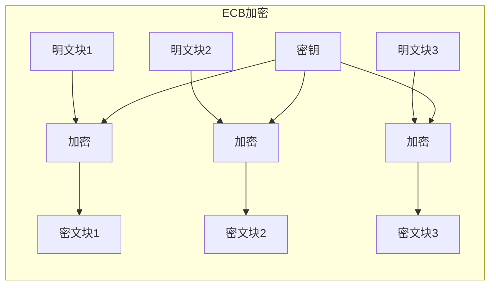
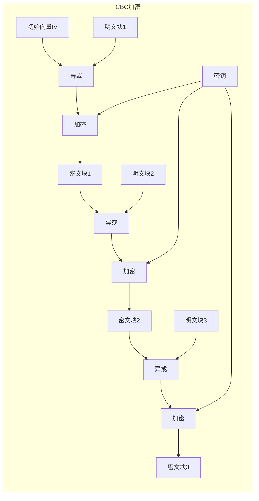
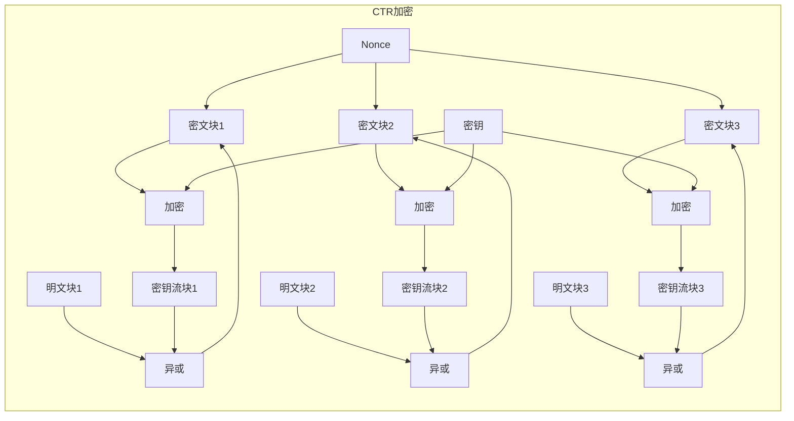
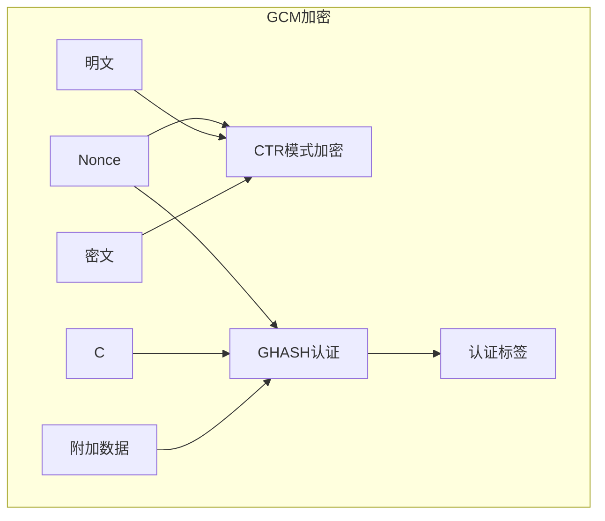

# 分组密码模式

## 学习目标

完成本节后，你将能够：

- 理解为什么需要分组密码模式
- 掌握ECB、CBC、CTR、GCM四种模式的工作原理
- 了解各种模式的安全特性和应用场景
- 使用OpenSSL和Python进行不同模式的加密操作
- 分析模式选择对安全性的影响

## 前置知识

- [DES算法详解](01-des.md)或[AES算法详解](02-aes.md)中的分组密码概念
- 初始向量（IV）和随机数（Nonce）的概念
- 填充（Padding）的基本概念

## 核心概念与术语

### 为什么需要分组密码模式？

分组密码（如AES、DES）只能加密固定长度的数据块（AES为128位，DES为64位）。但实际应用中需要加密任意长度的数据，这就需要"分组密码模式"来扩展分组密码的功能。

**分组密码模式解决的问题**：
1. 如何加密长于单个块的数据
2. 如何处理不完整块的数据
3. 如何提供不同的安全特性（如认证、并行处理等）

### 常见分组密码模式

| 模式 | 全称 | 特点 | 安全性 | 应用场景 |
|------|------|------|--------|----------|
| ECB | Electronic Codebook | 简单，不安全 | 低 | 仅用于短数据 |
| CBC | Cipher Block Chaining | 需要IV，串行处理 | 中 | 通用加密 |
| CTR | Counter | 变成流密码，可并行 | 高 | 高性能加密 |
| GCM | Galois/Counter Mode | 认证加密，可并行 | 高 | 现代标准 |

## 详细解析

### 1. ECB模式（电子密码本）

#### 工作原理

ECB模式是最简单的分组模式，每个块独立加密：



**数学表示**：
$$
C_i = E_K(P_i)
$$
$$
P_i = D_K(C_i)
$$

其中：
- $P_i$ 是第i个明文块
- $C_i$ 是第i个密文块
- $E_K$ 是使用密钥K的加密函数
- $D_K$ 是使用密钥K的解密函数

#### ECB模式的安全问题

**致命弱点**：相同的明文块总是产生相同的密文块。

**经典案例：ECB加密的企鹅**

原始图片：清晰的Linux企鹅标志  
ECB加密后：企鹅的轮廓仍然可见！

这是因为图片中有大量重复的像素块，ECB模式下这些相同的块产生相同的密文，泄露了图片的模式信息。

**攻击示例**：
```python
# 假设攻击者知道明文"HELLO"的密文是"XK39F"
# 当看到密文"XK39F"出现多次时
# 攻击者可以推断出对应明文是"HELLO"
```

#### ECB模式的优缺点

**优点**：
- 简单，易于实现
- 块之间独立，可并行处理
- 不需要初始向量（IV）

**缺点**：
- 相同明文产生相同密文，泄露模式
- 不适合加密长数据
- 不能提供语义安全性

!!! warning "ECB模式警告"
    **永远不要使用ECB模式加密敏感数据**。它只能用于加密随机数据或短消息。

### 2. CBC模式（密码块链接）

#### 工作原理

CBC模式通过将每个明文块与前一个密文块异或来解决ECB的问题：



**数学表示**：
$$
C_i = E_K(P_i \oplus C_{i-1})
$$
$$
P_i = D_K(C_i) \oplus C_{i-1}
$$

其中$C_0 = IV$（初始向量）。

#### 初始向量（IV）

IV（Initialization Vector）是CBC模式的重要参数：
- 必须是随机的、不可预测的
- 不需要保密，可以明文传输
- 每次加密必须使用不同的IV
- 大小等于块大小（AES为128位）

#### PKCS7填充

由于分组密码需要完整块，当数据不是块大小的整数倍时需要填充：

**PKCS7填充规则**：
- 填充字节的值等于需要填充的字节数
- 例如：需要填充3字节，则填充`03 03 03`
- 如果数据恰好是块大小的整数倍，需要填充一个完整的块

**示例**：
```
块大小：16字节
数据：  "HELLO" (5字节)
需要填充：11字节
填充后：  "HELLO\x0b\x0b\x0b\x0b\x0b\x0b\x0b\x0b\x0b\x0b\x0b"
```

#### CBC模式的优缺点

**优点**：
- 相同明文产生不同密文（依赖IV）
- 比ECB安全得多
- 广泛支持

**缺点**：
- 加密必须串行处理（不能并行）
- 解密可以并行处理
- 需要管理IV
- 容易受到填充预言攻击（Padding Oracle Attack）

### 3. CTR模式（计数器模式）

#### 工作原理

CTR模式将分组密码变成流密码，使用计数器生成密钥流：



**数学表示**：
$$
Keystream_i = E_K(Nonce || Counter_i)
$$
$$
C_i = P_i \oplus Keystream_i
$$

#### Nonce（随机数）

Nonce是CTR模式的关键参数：
- 必须唯一（每次加密不同）
- 不需要保密
- 通常由随机数和计数器组成
- 大小通常为96位（12字节）

#### CTR模式的优缺点

**优点**：
- 可并行加密和解密
- 不需要填充
- 随机访问（可以解密任意块）
- 性能好

**缺点**：
- Nonce必须唯一，重复会导致密钥重用
- 不提供认证（需要额外机制）
- 必须小心管理Nonce

!!! tip "CTR模式优势"
    CTR模式是现代加密的首选模式之一，特别适合需要高性能和随机访问的场景。

### 4. GCM模式（伽罗瓦/计数器模式）

#### 工作原理

GCM结合了CTR模式的加密和GMAC的认证，提供认证加密（AEAD）：



**GCM的组成部分**：
1. **CTR模式**：用于加密
2. **GHASH**：基于伽罗瓦域的哈希函数，用于认证

#### 认证加密（AEAD）

AEAD（Authenticated Encryption with Associated Data）提供：
- **机密性**：加密数据
- **完整性**：验证数据未被篡改
- **认证性**：验证数据来源
- **关联数据**：可以认证但不加密的数据（如头部信息）

#### GCM的参数

- **Nonce**：96位（12字节），必须唯一
- **密钥**：128/192/256位
- **附加数据**：需要认证但不加密的数据
- **认证标签**：128位（16字节），用于验证完整性

#### GCM的优缺点

**优点**：
- 同时提供加密和认证
- 可并行处理
- 性能优秀（硬件加速）
- 广泛支持

**缺点**：
- Nonce重复会导致严重安全问题
- 认证标签长度有限制
- 实现复杂

!!! info "GCM安全性"
    GCM是目前最推荐的认证加密模式，被TLS 1.3、IPsec等标准采用。但必须确保Nonce唯一。

## 动手实践

### 实验1：使用OpenSSL演示各种模式

#### 准备测试数据

```bash
# 创建测试文件
echo "This is a test message for block cipher modes demonstration." > plaintext.txt

# 查看文件大小（应该是60字节）
ls -l plaintext.txt
```

#### ECB模式演示

```bash
# ECB加密（不推荐使用）
openssl enc -aes-128-ecb -in plaintext.txt -out encrypted_ecb.bin -K 0123456789ABCDEF0123456789ABCDEF

# ECB解密
openssl enc -d -aes-128-ecb -in encrypted_ecb.bin -out decrypted_ecb.txt -K 0123456789ABCDEF0123456789ABCDEF

# 查看加密结果（二进制）
xxd encrypted_ecb.bin
```

#### CBC模式演示

```bash
# CBC加密（需要IV）
openssl enc -aes-128-cbc -in plaintext.txt -out encrypted_cbc.bin \
    -K 0123456789ABCDEF0123456789ABCDEF \
    -iv 0123456789ABCDEF0123456789ABCDEF

# CBC解密
openssl enc -d -aes-128-cbc -in encrypted_cbc.bin -out decrypted_cbc.txt \
    -K 0123456789ABCDEF0123456789ABCDEF \
    -iv 0123456789ABCDEF0123456789ABCDEF

# 查看加密结果
xxd encrypted_cbc.bin
```

#### CTR模式演示

```bash
# CTR加密（需要Nonce/IV）
openssl enc -aes-128-ctr -in plaintext.txt -out encrypted_ctr.bin \
    -K 0123456789ABCDEF0123456789ABCDEF \
    -iv 0123456789ABCDEF0123456789ABCDEF

# CTR解密
openssl enc -d -aes-128-ctr -in encrypted_ctr.bin -out decrypted_ctr.txt \
    -K 0123456789ABCDEF0123456789ABCDEF \
    -iv 0123456789ABCDEF0123456789ABCDEF

# 查看加密结果
xxd encrypted_ctr.bin
```

#### GCM模式演示

!!! warning "OpenSSL 3.x 兼容性说明"
    在 OpenSSL 3.x 中，`openssl enc` 命令不再支持 AEAD 模式（如 GCM）。要使用 GCM 模式，需要使用 OpenSSL 的 EVP API 或其他工具（如 Python 的 `cryptography` 库）。
    
    以下命令仅适用于 OpenSSL 1.x 版本：

```bash
# GCM加密（认证加密）- 仅适用于 OpenSSL 1.x
openssl enc -aes-256-gcm -in plaintext.txt -out encrypted_gcm.bin \
    -K 0123456789ABCDEF0123456789ABCDEF0123456789ABCDEF0123456789ABCDEF \
    -iv 0123456789ABCDEF01234567

# GCM解密（自动验证认证标签）- 仅适用于 OpenSSL 1.x
openssl enc -d -aes-256-gcm -in encrypted_gcm.bin -out decrypted_gcm.txt \
    -K 0123456789ABCDEF0123456789ABCDEF0123456789ABCDEF0123456789ABCDEF \
    -iv 0123456789ABCDEF01234567
```

!!! note "OpenSSL模式参数"
    - `-aes-128-ecb`：AES-128 ECB模式
    - `-aes-128-cbc`：AES-128 CBC模式
    - `-aes-128-ctr`：AES-128 CTR模式
    - `-aes-256-gcm`：AES-256 GCM模式

### 实验2：ECB模式问题演示

#### 图像加密演示

```bash
# 下载测试图片（Linux企鹅）
wget https://upload.wikimedia.org/wikipedia/commons/thumb/3/35/Tux.svg/200px-Tux.svg.png -o tux.png

# 使用ECB模式加密图片
openssl enc -aes-128-ecb -in tux.png -out tux_ecb.png -K 0123456789ABCDEF0123456789ABCDEF

# 使用CBC模式加密图片
openssl enc -aes-128-cbc -in tux.png -out tux_cbc.png \
    -K 0123456789ABCDEF0123456789ABCDEF \
    -iv 0123456789ABCDEF0123456789ABCDEF
```

**观察结果**：
- `tux_ecb.png`：仍然可以看到企鹅的轮廓
- `tux_cbc.png`：完全随机的噪声，看不到任何模式

### 实验3：Python脚本演示各种模式

我们将使用Python的`cryptography`库进行各种模式的演示。

#### 运行演示脚本

```bash
python scripts/block_modes_demo.py
```

**预期输出**：

```
=== Block Cipher Modes Demo ===

Original text: This is a test message for block cipher modes demonstration.
Block size: 16 bytes

--- ECB Mode (Electronic Codebook) ---
Encrypted (hex): [加密数据]
Note: Same blocks produce same ciphertext!
  Block 1 encrypted twice: [相同密文] (identical)

--- CBC Mode (Cipher Block Chaining) ---
IV: [初始向量]
Encrypted (hex): [加密数据]
Note: Same blocks produce different ciphertext due to chaining.

--- CTR Mode (Counter) ---
Nonce: [随机数]
Encrypted (hex): [加密数据]
Note: Acts as stream cipher, no padding needed.

--- GCM Mode (Galois/Counter Mode) ---
Nonce: [随机数]
Encrypted (hex): [加密数据]
Tag: [认证标签]
Note: Provides both encryption and authentication.

=== ECB Mode Weakness Demo ===
Encrypting 'AAAAAAAAAAAAAAAA' twice:
First encryption:  [密文]
Second encryption: [密文] (identical!)

=== Padding Demo ===
Data: 'HELLO' (5 bytes)
PKCS7 padded: 'HELLO\x0b\x0b\x0b\x0b\x0b\x0b\x0b\x0b\x0b\x0b\x0b' (16 bytes)

=== Performance Comparison ===
ECB: 0.123 seconds for 1000 encryptions
CBC: 0.145 seconds for 1000 encryptions
CTR: 0.098 seconds for 1000 encryptions
GCM: 0.112 seconds for 1000 encryptions
```

## 安全分析与思考

### 各模式安全性对比

| 安全特性 | ECB | CBC | CTR | GCM |
|----------|-----|-----|-----|-----|
| 机密性 | 低 | 中 | 高 | 高 |
| 完整性 | 无 | 无 | 无 | 有 |
| 认证性 | 无 | 无 | 无 | 有 |
| 并行加密 | 是 | 否 | 是 | 是 |
| 并行解密 | 是 | 是 | 是 | 是 |
| 随机访问 | 是 | 否 | 是 | 是 |
| 需要IV/Nonce | 否 | 是 | 是 | 是 |
| 需要填充 | 是 | 是 | 否 | 否 |

### 常见攻击

#### 1. ECB模式攻击

**模式泄露**：相同明文块产生相同密文块，泄露数据模式。

**重排攻击**：攻击者可以重新排列密文块，解密后明文块顺序改变。

#### 2. CBC模式攻击

**填充预言攻击（Padding Oracle Attack）**：
- 攻击者可以逐字节破解明文
- 通过观察解密时的填充错误
- 代表攻击：POODLE、Lucky 13

**CBC比特翻转攻击**：
- 修改密文块可以预测性地改变下一个明文块
- 用于构造恶意明文

#### 3. CTR模式攻击

**Nonce重用攻击**：
- 如果Nonce重复，密钥流重复
- 两个密文异或等于两个明文异或
- 这就是"两次密码本"问题

#### 4. GCM模式攻击

**Nonce重用攻击**：
- 与CTR类似，但更严重
- 可能泄露认证密钥
- 导致认证完全失效

**短认证标签攻击**：
- 认证标签太短容易碰撞
- 推荐使用128位标签

### 模式选择指南

#### 场景1：通用数据加密

**推荐**：AES-256-GCM 或 AES-256-CBC + HMAC

**理由**：
- GCM提供认证加密，一步到位
- CBC + HMAC更灵活，但需要管理两个密钥

#### 场景2：高性能需求

**推荐**：AES-256-CTR + HMAC

**理由**：
- CTR可并行处理，性能好
- HMAC提供完整性保护

#### 场景3：磁盘加密

**推荐**：AES-256-XTS

**理由**：
- XTS模式专为磁盘加密设计
- 支持随机访问
- 不需要认证（磁盘有自己的完整性机制）

#### 场景4：网络协议

**推荐**：AES-256-GCM 或 ChaCha20-Poly1305

**理由**：
- TLS 1.3的标准选择
- 提供认证加密
- 高性能

!!! warning "模式选择警告"
    - 永远不要使用ECB模式
    - CBC模式需要正确实现填充和IV管理
    - CTR和GCM模式必须确保Nonce唯一
    - 认证加密（AEAD）优于加密+MAC

## 练习题

### 基础题

1. **ECB模式**：
   - 为什么ECB模式不安全？
   - 举一个ECB模式安全问题的例子。

2. **CBC模式**：
   - CBC模式中的IV有什么作用？
   - 为什么CBC模式需要填充？

3. **CTR模式**：
   - CTR模式如何将分组密码变成流密码？
   - CTR模式的Nonce有什么要求？

4. **GCM模式**：
   - GCM模式提供什么安全特性？
   - 什么是认证加密（AEAD）？

### 进阶题

5. **模式对比**：
   - 比较ECB、CBC、CTR、GCM的并行处理能力
   - 分析各种模式对随机访问的支持

6. **填充预言攻击**：
   - 解释填充预言攻击的基本原理
   - 如何防御这种攻击？

7. **Nonce管理**：
   - 为什么Nonce重复会导致安全问题？
   - 如何确保Nonce的唯一性？

### 实践题

8. **OpenSSL实践**：
   使用OpenSSL完成以下任务：
   - 用ECB模式加密一个文件，观察结果
   - 用CBC模式加密同一文件，比较结果
   - 用CTR模式加密，分析性能差异

9. **Python编程**：
   编写Python脚本实现：
   - ECB模式加密函数
   - CBC模式加密函数
   - CTR模式加密函数
   - GCM模式加密函数
   - 比较各种模式的特点

10. **图像加密实验**：
    - 用ECB模式加密一张图片
    - 用CBC模式加密同一张图片
    - 观察并解释结果差异

## 延伸阅读

### 官方文档

- [NIST SP 800-38A: 分组密码模式](https://csrc.nist.gov/publications/detail/sp/800-38a/final)
- [NIST SP 800-38D: GCM模式](https://csrc.nist.gov/publications/detail/sp/800-38d/final)

### 学术论文

- Bellare, M., Namprempre, C., "Authenticated Encryption: Relations among notions and analysis of the generic composition paradigm," 2000
- McGrew, D., Viega, J., "The Galois/Counter Mode of Operation (GCM)," 2004

### 在线资源

- [分组密码模式动画演示](https://www.youtube.com/watch?v=Rk0NIQfEXBA)
- [CryptoHack分组模式挑战](https://cryptohack.org/challenges/block-ciphers/)

### 相关工具

- [OpenSSL文档](https://www.openssl.org/docs/)
- [cryptography库文档](https://cryptography.io/)
- [CyberChef](https://gchq.github.io/CyberChef/)

---

**下一步**：学习 [流密码与异或加密](04-stream-cipher.md)