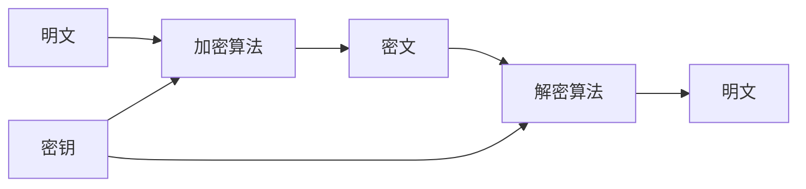

# 模块3：对称加密

## 学习目标

完成本模块后，你将能够：

- 理解对称加密的基本原理和应用场景
- 掌握DES和AES算法的核心结构和差异
- 理解分组密码模式（ECB、CBC、CTR、GCM）的工作原理和安全特性
- 了解流密码与分组密码的区别，以及异或加密的原理
- 使用OpenSSL、CyberChef和Python进行对称加密操作
- 分析对称加密算法的安全性和潜在弱点

## 前置知识

开始本模块前，请确保你已经掌握：

- [模块1：密码学基础](../01-foundations/index.md)中的基本概念
- [模块2：哈希函数](../02-hashing/index.md)中的哈希算法原理
- 二进制运算基础（特别是异或运算）
- Python基础编程能力

## 模块概述

对称加密是密码学中最基础、最广泛使用的加密方式。与非对称加密不同，对称加密使用相同的密钥进行加密和解密，这使得它在处理大量数据时具有显著的性能优势。

### 什么是对称加密？

对称加密（Symmetric Encryption）是一种加密方法，其中加密和解密使用相同的密钥。发送方和接收方必须事先共享这个密钥，这被称为"密钥分发问题"。



### 对称加密的分类

对称加密算法主要分为两类：

1. **分组密码（Block Cipher）**：将明文分成固定大小的块（如64位或128位），逐块加密
2. **流密码（Stream Cipher）**：逐位或逐字节加密，通常通过生成密钥流实现

### 主要算法时间线

| 年份 | 算法 | 密钥长度 | 状态 |
|------|------|----------|------|
| 1977 | DES | 56位 | 已淘汰 |
| 1998 | 3DES | 112/168位 | 逐步淘汰 |
| 2001 | AES | 128/192/256位 | 当前标准 |
| 2013 | ChaCha20 | 256位 | 新兴标准 |

## 模块内容

### 主题文档

1. **[DES算法详解](01-des.md)**
   - DES的历史背景和Feistel网络结构
   - 16轮加密过程和S-Box替换
   - DES的安全弱点和3DES过渡方案

2. **[AES算法详解](02-aes.md)**
   - AES的诞生背景（Rijndael算法）
   - AES的状态矩阵和轮操作
   - AES-128/192/256的密钥长度选择

3. **[分组密码模式](03-block-modes.md)**
   - ECB、CBC、CTR、GCM模式的工作原理
   - 各模式的安全特性和应用场景
   - 认证加密（AEAD）的概念

4. **[流密码与异或加密](04-stream-cipher.md)**
   - 流密码与分组密码的区别
   - 一次性密码本（OTP）的完美保密性
   - 密钥重用攻击和RC4的教训

### 配套脚本

每个主题都配有Python演示脚本：

- `scripts/des_demo.py` — DES加解密演示
- `scripts/aes_demo.py` — AES加解密演示
- `scripts/block_modes_demo.py` — 各种分组模式对比演示
- `scripts/xor_cipher.py` — 异或加密演示

## 工具准备

本模块将使用以下工具进行实践：

### OpenSSL

OpenSSL是一个强大的加密工具库，支持各种对称加密算法：

```bash
# 检查OpenSSL版本
openssl version

# 查看支持的加密算法
openssl enc -help
```

### CyberChef

CyberChef是一个基于Web的加密工具，提供可视化操作界面：

- 访问地址：[CyberChef](https://gchq.github.io/CyberChef/)
- 本模块将演示如何使用CyberChef进行AES、DES等加解密操作

### Python库

我们将使用两个主要的Python加密库：

```bash
# 安装pycryptodome
pip install pycryptodome

# 安装cryptography
pip install cryptography
```

## 学习路径

建议按以下顺序学习本模块：

1. **从DES开始**：理解分组密码的基本结构
2. **学习AES**：掌握现代加密标准
3. **探索分组模式**：了解如何将分组密码用于实际场景
4. **研究流密码**：对比不同的加密方式

!!! tip "学习建议"
    对称加密是密码学的基石。建议通过动手实践来加深理解，特别是使用不同的工具和库进行加密操作，观察加密结果的变化。

## 实践项目

完成所有主题后，尝试以下实践项目：

1. **文件加密工具**：使用AES-GCM模式创建一个简单的文件加密工具
2. **加密模式对比**：编写脚本对比不同加密模式的性能和安全性
3. **密码强度分析**：分析不同密钥长度对加密强度的影响

## 安全注意事项

!!! warning "安全警告"
    - 本模块中的演示代码仅用于教学目的，不应直接用于生产环境
    - 实际应用中应使用经过验证的加密库，避免自行实现加密算法
    - 密钥管理是加密安全的关键，密钥的安全存储和分发同样重要

## 评估标准

完成本模块后，你应该能够回答以下问题：

1. 为什么DES被AES取代？
2. ECB模式为什么不适合加密图像？
3. CBC和CTR模式的主要区别是什么？
4. 什么是一次性密码本？为什么它在实践中难以实现？
5. 什么是认证加密？GCM模式如何提供认证？

## 延伸阅读

- [NIST对称加密标准](https://csrc.nist.gov/projects/cryptographic-standards-and-guidelines)
- [AES算法官方文档](https://csrc.nist.gov/publications/detail/fips/197/final)
- [分组密码模式详解](https://en.wikipedia.org/wiki/Block_cipher_mode_of_operation)

---

**下一步**：开始学习 [DES算法详解](01-des.md)