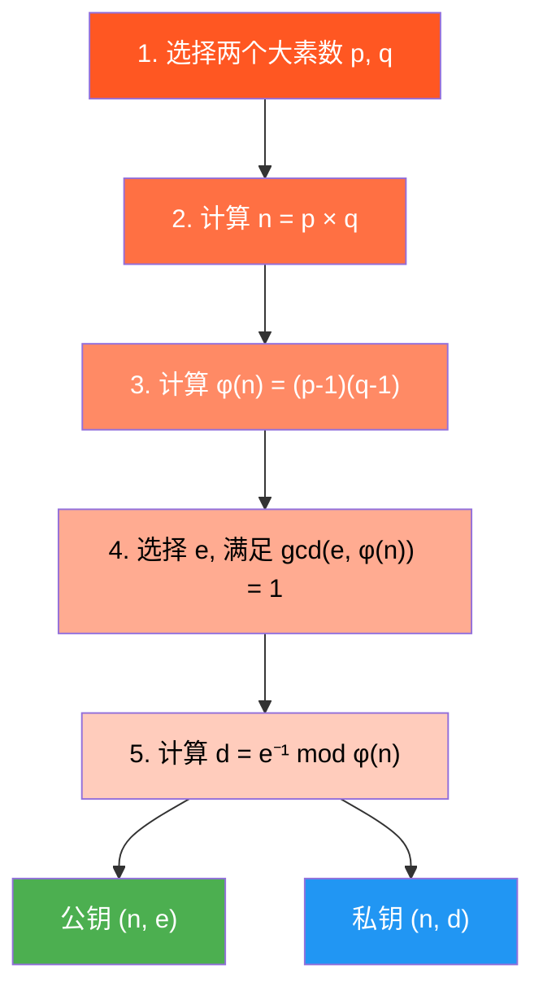
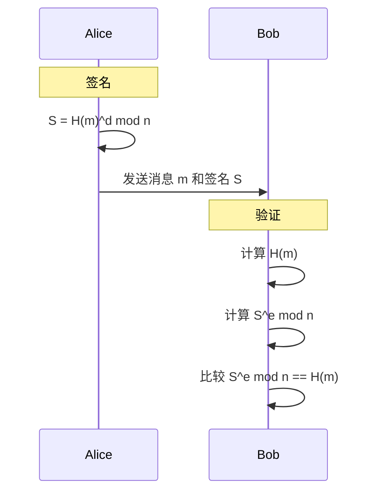

# :material-lock: 4.2 RSA 算法全流程详解

> **RSA — Rivest-Shamir-Adleman Algorithm**

RSA 是世界上第一个也是最广泛使用的公钥加密算法。自 1977 年发明以来，它一直是互联网安全的基石——HTTPS、SSH、PGP 等协议都依赖于 RSA。本节将从历史背景出发，完整讲解 RSA 的密钥生成、加解密、数学证明和实际应用。

---

## :material-target: 学习目标

- 了解 RSA 算法的历史背景和发明者
- 掌握 RSA 密钥生成的完整五个步骤
- 理解 RSA 加密和解密的数学公式
- 能够证明 RSA 的数学正确性
- 能够使用 OpenSSL 生成 RSA 密钥对并进行加解密
- 能够用 Python 从零实现 RSA 算法
- 理解 RSA 数字签名的原理

---

## :material-book-open: 前置知识

- [4.1 数论基础](01-number-theory.md)：模运算、欧拉函数、模逆元、费马小定理
- 基本的指数运算规则

---

## :material-history: RSA 的历史

1977 年，MIT 的三位教授 **Ron Rivest**、**Adi Shamir** 和 **Leonard Adleman** 发明了 RSA 算法。算法名称取自三人姓氏的首字母。

!!! info "RSA 的发明故事"

    1976 年，Diffie-Hellman 提出了公钥密码学的概念，但只解决了密钥交换问题。Rivest、Shamir 和 Adleman 受此启发，试图构建一个能直接进行加密和签名的公钥系统。
    
    据说 Rivest 在一个晚宴上想到了 RSA 的核心思想，第二天早上就写出了完整的算法。三人在 1977 年发表了论文《A Method for Obtaining Digital Signatures and Public-Key Cryptosystems》。
    
    RSA 的专利（US Patent 4,405,829）于 1983 年获得，2000 年到期。现在 RSA 算法是完全公开和免费使用的。

---

## :material-school: 核心概念与术语

### RSA 密钥生成

RSA 的安全性依赖于**大整数分解问题**：给定两个大素数的乘积 $n = p \times q$，要分解 $n$ 在计算上是困难的。



#### 步骤详解

**步骤1：选择两个大素数 $p$ 和 $q$**

- 在实际应用中，$p$ 和 $q$ 通常是 1024 位或更大的随机素数
- $p$ 和 $q$ 必须不同，且不能太接近（防止 Fermat 分解）

**步骤2：计算模数 $n$**

$$
n = p \times q
$$

- $n$ 是公钥和私钥的共同组成部分
- $n$ 的位数决定了 RSA 密钥的长度（如 2048 位 RSA 密钥 = 两个 1024 位素数）

**步骤3：计算欧拉函数 $\varphi(n)$**

$$
\varphi(n) = (p-1)(q-1)
$$

- $\varphi(n)$ 表示小于 $n$ 且与 $n$ 互素的正整数个数
- 只有知道 $p$ 和 $q$ 才能计算 $\varphi(n)$（这是 RSA 的"陷门"）

**步骤4：选择公钥指数 $e$**

- $e$ 必须满足 $1 < e < \varphi(n)$ 且 $\gcd(e, \varphi(n)) = 1$
- 常用选择：$e = 65537 = 2^{16} + 1$（这是素数，二进制只有两个 1，加密效率高）
- 其他常见值：$e = 3$（更快但需要注意 padding）、$e = 17$

**步骤5：计算私钥指数 $d$**

$$
d \equiv e^{-1} \pmod{\varphi(n)}
$$

- 即 $d$ 是 $e$ 模 $\varphi(n)$ 的逆元
- 使用扩展欧几里得算法计算

**最终结果：**

$$
\text{公钥} = (n, e)
$$

$$
\text{私钥} = (n, d)
$$

!!! tip "为什么 $e$ 的逆元一定存在？"

    因为 $\gcd(e, \varphi(n)) = 1$（步骤4的条件），根据数论定理，$e$ 模 $\varphi(n)$ 的逆元一定存在。

---

### RSA 加密与解密

#### 加密

给定明文 $M$（$0 \leq M < n$），加密公式为：

$$
C = M^e \bmod n
$$

其中 $C$ 是密文，$(n, e)$ 是接收者的公钥。

#### 解密

给定密文 $C$，解密公式为：

$$
M = C^d \bmod n
$$

其中 $(n, d)$ 是接收者的私钥。

#### 简单示例

我们用小数字演示 RSA 的完整流程（**实际中绝不使用这么小的数字**）：

| 步骤 | 计算 | 结果 |
|------|------|------|
| 选择素数 | $p = 61, q = 53$ | |
| 计算 $n$ | $61 \times 53$ | $n = 3233$ |
| 计算 $\varphi(n)$ | $60 \times 52$ | $\varphi(n) = 3120$ |
| 选择 $e$ | $\gcd(17, 3120) = 1$ | $e = 17$ |
| 计算 $d$ | $17^{-1} \bmod 3120$ | $d = 2753$ |
| **公钥** | $(3233, 17)$ | |
| **私钥** | $(3233, 2753)$ | |

**加密** $M = 65$：

$$
C = 65^{17} \bmod 3233 = 2790
$$

**解密** $C = 2790$：

$$
M = 2790^{2753} \bmod 3233 = 65 \quad \checkmark
$$

---

### RSA 数学正确性证明

**要证明：** $C^d \equiv M \pmod{n}$，即 $(M^e)^d \equiv M \pmod{n}$。

**证明：** 需要证明 $M^{ed} \equiv M \pmod{n}$。

由密钥生成过程，$ed \equiv 1 \pmod{\varphi(n)}$，即存在整数 $k$ 使得：

$$
ed = 1 + k \cdot \varphi(n)
$$

**情况1：** $\gcd(M, n) = 1$

由欧拉定理：$M^{\varphi(n)} \equiv 1 \pmod{n}$

$$
M^{ed} = M^{1 + k\varphi(n)} = M \cdot (M^{\varphi(n)})^k \equiv M \cdot 1^k \equiv M \pmod{n}
$$

**情况2：** $\gcd(M, n) \neq 1$

由于 $n = pq$ 且 $0 \leq M < n$，不妨设 $M = cp$（$c < q$，$p \nmid M$）。

由费马小定理：$M^{p-1} \equiv 1 \pmod{p}$

$$
M^{ed} = M \cdot M^{k(p-1)(q-1)} = M \cdot (M^{p-1})^{k(q-1)} \equiv M \cdot 1^{k(q-1)} \equiv M \pmod{p}
$$

同理 $M^{ed} \equiv M \pmod{q}$。

由于 $\gcd(p, q) = 1$，由中国剩余定理：$M^{ed} \equiv M \pmod{n}$。

**证毕。** $\blacksquare$

!!! info "中国剩余定理（CRT）简述"

    如果 $\gcd(m, n) = 1$，则：
    
    $$
    \begin{cases} x \equiv a \pmod{m} \\ x \equiv b \pmod{n} \end{cases}
    $$
    
    在模 $mn$ 下有唯一解。
    
    在 RSA 中，CRT 用于加速解密运算，可以将一次大模数运算拆分为两次小模数运算。

---

### RSA 数字签名

RSA 不仅可以加密，还可以用于**数字签名**——证明消息确实来自持有私钥的人。

#### 签名过程

$$
S = M^d \bmod n
$$

发送者用自己的**私钥**对消息（或消息的哈希值）进行"解密"操作。

#### 验证过程

$$
M' = S^e \bmod n
$$

接收者用发送者的**公钥**对签名进行"加密"操作，如果结果等于原始消息，则签名有效。



!!! warning "实际中的 RSA 签名"

    实际应用中，RSA 签名不是直接对消息签名，而是对消息的**哈希值**签名。这是因为：
    
    1. RSA 只能签名小于 $n$ 的数据
    2. 对哈希值签名更高效
    3. 使用安全的填充方案（如 PSS）可以防止多种攻击
    
    常用的 RSA 签名方案：**RSA-PSS**（推荐）和 **PKCS#1 v1.5**

---

## :material-hammer-wrench: 动手实践

### 实验1：使用 OpenSSL 进行 RSA 操作

=== "生成 RSA 密钥对"

    ```bash
    # 生成 2048 位 RSA 私钥
    openssl genrsa -out private.pem 2048

    # 查看私钥内容
    openssl rsa -in private.pem -text -noout

    # 从私钥提取公钥
    openssl rsa -in private.pem -pubout -out public.pem

    # 查看公钥内容
    openssl rsa -in public.pem -pubin -text -noout
    ```

    **预期输出（密钥信息摘要）：**

    ```
    RSA Private-Key: (2048 bit, 2 primes)
    Modulus:
        00:b0:65:...（2048位大数）
    Public Exponent: 65537 (0x10001)
    privateExponent:
        5a:3f:...（私钥指数 d）
    ```

=== "RSA 加密与解密"

    ```bash
    # 创建测试文件
    echo "Hello RSA Encryption!" > plaintext.txt

    # 使用公钥加密
    openssl pkeyutl -encrypt -inkey public.pem -pubin -in plaintext.txt -out encrypted.bin

    # 使用私钥解密
    openssl pkeyutl -decrypt -inkey private.pem -in encrypted.bin -out decrypted.txt

    # 查看解密结果
    cat decrypted.txt
    ```

    **预期输出：**

    ```
    Hello RSA Encryption!
    ```

=== "RSA 数字签名"

    ```bash
    # 创建测试文件
    echo "This message needs to be signed." > message.txt

    # 使用私钥签名（PKCS#1 v1.5）
    openssl dgst -sha256 -sign private.pem -out signature.bin message.txt

    # 使用公钥验证签名
    openssl dgst -sha256 -verify public.pem -signature signature.bin message.txt

    # 使用 PSS 签名（更安全）
    openssl dgst -sha256 -sign private.pem -sigopt rsa_padding_mode:pss -out sig_pss.bin message.txt

    # 验证 PSS 签名
    openssl dgst -sha256 -verify public.pem -sigopt rsa_padding_mode:pss -signature sig_pss.bin message.txt
    ```

    **预期输出：**

    ```
    Verified OK
    ```

=== "查看 RSA 密钥详细信息"

    ```bash
    # 查看模数 n 和公钥指数 e
    openssl rsa -in private.pem -text -noout | head -5

    # 单独提取模数（十六进制）
    openssl rsa -in public.pem -pubin -modulus -noout

    # 查看密钥长度
    openssl rsa -in private.pem -text -noout | grep "Private-Key"
    ```

---

### 实验2：使用 SageMath 验证 RSA 数学

=== "完整 RSA 流程"

    ```bash
    sage -c "
    # RSA Demo with SageMath
    p, q = 61, 53
    n = p * q
    phi_n = (p - 1) * (q - 1)
    e = 17
    d = inverse_mod(e, phi_n)

    print(f'p = {p}, q = {q}')
    print(f'n = {n}')
    print(f'phi(n) = {phi_n}')
    print(f'e = {e}')
    print(f'd = {d}')
    print(f'e * d mod phi(n) = {(e * d) % phi_n}')

    # Encrypt
    M = 65
    C = power_mod(M, e, n)
    print(f'\\nEncrypt M={M}: C = {M}^{e} mod {n} = {C}')

    # Decrypt
    M2 = power_mod(C, d, n)
    print(f'Decrypt C={C}: M = {C}^{d} mod {n} = {M2}')
    print(f'Result matches: {M == M2}')
    "
    ```

    **预期输出：**

    ```
    p = 61, q = 53
    n = 3233
    phi(n) = 3120
    e = 17
    d = 2753
    e * d mod phi(n) = 1

    Encrypt M=65: C = 65^17 mod 3233 = 2790
    Decrypt C=2790: M = 2790^2753 mod 3233 = 65
    Result matches: True
    ```

=== "验证数学正确性"

    ```bash
    sage -c "
    # Verify RSA correctness for multiple messages
    p, q = 61, 53
    n = p * q
    phi_n = (p - 1) * (q - 1)
    e = 17
    d = inverse_mod(e, phi_n)

    print('Verifying M^(ed) ≡ M (mod n) for multiple M values:')
    for M in range(1, 20):
        encrypted = power_mod(M, e, n)
        decrypted = power_mod(encrypted, d, n)
        status = '✓' if decrypted == M else '✗'
        print(f'  M={M:2d} -> C={encrypted:4d} -> M\'={decrypted:2d}  {status}')
    "
    ```

    **预期输出：**

    ```
    Verifying M^(ed) ≡ M (mod n) for multiple M values:
      M= 1 -> C=   1 -> M'= 1  ✓
      M= 2 -> C=2530 -> M'= 2  ✓
      M= 3 -> C=1514 -> M'= 3  ✓
      ...
      M=19 -> C= 251 -> M'=19  ✓
    ```

---

### 实验3：使用 Python 脚本完整实现 RSA

使用配套的 Python 脚本，可以观察 RSA 从小数字到实际大小的完整实现。

```bash
python scripts/rsa_demo.py
```

**预期输出：**

```
=== RSA Algorithm Demo ===

--- Small Number RSA ---
p = 61, q = 53
n = 3233
phi(n) = 3120
e = 17, d = 2753
Public key:  (3233, 17)
Private key: (3233, 2753)

Encrypt M=65:  C = 65^17 mod 3233 = 2790
Decrypt C=2790: M = 2790^2753 mod 3233 = 65
Correct: True

--- Full RSA with Real Keys (2048-bit) ---
Key generation time: 0.35 seconds
Public exponent e = 65537
Key size: 2048 bits

Encrypting 'Hello RSA!' ...
Ciphertext (hex): a3f2b1...
Decrypting ...
Decrypted: Hello RSA!
Correct: True

--- RSA Digital Signature ---
Signing message 'Important document' ...
Signature (hex): 8c4d1e...
Verifying signature ...
Signature valid: True

--- RSA Performance ---
Key generation (2048-bit): 0.35s
Encryption:               0.001s
Decryption:               0.05s
Signing:                  0.05s
Verification:             0.001s
```

---

### 实验4：使用 CyberChef 进行 RSA 解密

CyberChef 提供了 RSA 解密的可视化操作。

!!! tip "CyberChef RSA 操作步骤"

    1. 打开 CyberChef：`CyberChef_v10.19.4.html`
    2. 在 Operations 搜索栏中输入 "RSA"
    3. 拖拽 **RSA Decrypt** 操作到 Recipe 区域
    4. 在 Input 区域粘贴密文（十六进制或 Base64）
    5. 在 RSA Decrypt 的参数中输入私钥（DER 或 PEM 格式）
    6. Output 区域将显示解密后的明文

    **RSA Decrypt 操作参数：**

    | 参数 | 说明 |
    |------|------|
    | Input format | 密文格式（Hex / Base64 / Raw） |
    | Key | RSA 私钥（PEM 或 DER 格式） |

---

## :material-shield-alert: 安全分析与思考

### RSA 安全性基础

RSA 的安全性依赖于以下假设：

!!! info "RSA 问题（RSAP）"

    给定 $n = pq$（$p, q$ 为大素数）、$e$ 和 $C = M^e \bmod n$，在不知道 $d$ 的情况下恢复 $M$ 是计算上不可行的。
    
    这等价于**大整数分解问题**：如果能分解 $n$，就能计算 $\varphi(n)$，进而计算 $d$。

### 常见攻击与防御

| 攻击方法 | 原理 | 防御措施 |
|---------|------|---------|
| **暴力分解** | 尝试分解 $n$ | 使用 2048 位以上密钥 |
| **Fermat 分解** | 当 $p, q$ 接近时有效 | 选择差距大的 $p, q$ |
| **Pollard's p-1** | 当 $p-1$ 有小因子时有效 | 使用安全素数 |
| **Wiener 攻击** | 当 $d$ 太小时有效 | 使用足够大的 $d$ |
| **共模攻击** | 同一 $n$ 不同 $e$ 加密同一消息 | 不同用户使用不同密钥 |
| **Padding Oracle** | 填充信息泄露 | 使用 OAEP 填充 |

### 密钥长度建议

| 密钥长度 | 安全级别 | 建议 |
|---------|---------|------|
| 1024 位 | 80 位 | ❌ 已不安全，2013 年起被 NIST 弃用 |
| 2048 位 | 112 位 | ✅ 当前最低推荐 |
| 3072 位 | 128 位 | ✅ 推荐用于 2030 年后 |
| 4096 位 | 140 位 | ✅ 高安全需求 |

!!! warning "RSA 的未来"

    量子计算机使用 **Shor 算法** 可以在多项式时间内分解大整数，这将彻底打破 RSA 的安全性。
    
    后量子密码学正在研究替代方案（如格基密码学），但在大规模量子计算机出现之前，RSA 仍然是安全的。

### Padding 的重要性

!!! danger "不要使用教科书式 RSA"

    教科书中的 RSA（$C = M^e \bmod n$）是**不安全**的，因为它：
    
    1. **确定性加密**：同一明文总是产生同一密文
    2. **同态性**：$E(M_1) \times E(M_2) = E(M_1 \times M_2)$
    3. **对小消息不安全**：如果 $M^e < n$，可以直接开 $e$ 次方根
    
    实际中必须使用填充方案：
    
    - **OAEP**（Optimal Asymmetric Encryption Padding）：用于加密
    - **PSS**（Probabilistic Signature Scheme）：用于签名

---

## :material-pencil: 练习题

### 基础题

**题目1：** 按照 RSA 密钥生成步骤，使用 $p = 17, q = 23, e = 5$ 计算完整的公钥和私钥。

??? tip "参考答案"

    $n = 17 \times 23 = 391$
    
    $\varphi(n) = 16 \times 22 = 352$
    
    $\gcd(5, 352) = 1$ ✓
    
    $d = 5^{-1} \bmod 352 = 281$（验证：$5 \times 281 = 1405 = 4 \times 352 + 1$）
    
    公钥：$(391, 5)$，私钥：$(391, 281)$

**题目2：** 使用题目1的密钥，加密消息 $M = 88$ 并验证解密结果。

??? tip "参考答案"

    加密：$C = 88^5 \bmod 391 = 215$
    
    解密：$M = 215^{281} \bmod 391 = 88$ ✓

### 进阶题

**题目3：** 解释为什么 RSA 中不能选择 $e = 1$ 或 $e = \varphi(n)$。

??? tip "参考答案"

    - $e = 1$：$C = M^1 = M$，加密不改变明文，完全没有安全性
    - $e = \varphi(n)$：$\gcd(e, \varphi(n)) = \varphi(n) \neq 1$，逆元不存在，无法计算 $d$

**题目4：** 如果 Bob 的 RSA 公钥是 $(n, e) = (55, 3)$，Alice 用同一个密钥加密了 $M_1 = 9$ 和 $M_2 = 10$。攻击者截获了 $C_1 = 14$ 和 $C_2 = 10$。攻击者能否利用 RSA 的同态性质获取 $M_1 \times M_2$ 的密文？

??? tip "参考答案"

    RSA 的同态性：$C_1 \times C_2 \equiv M_1^e \times M_2^e \equiv (M_1 M_2)^e \pmod{n}$
    
    $C_1 \times C_2 = 14 \times 10 = 140 \equiv 30 \pmod{55}$
    
    验证：$(9 \times 10)^3 = 90^3 = 729000$，$729000 \bmod 55 = 30$ ✓
    
    这就是为什么实际中必须使用 OAEP 填充——它破坏了同态性。

### 挑战题

**题目5：** 证明：如果攻击者能够分解 $n = pq$，那么他们可以在多项式时间内恢复私钥 $d$。

??? tip "参考答案"

    1. 分解 $n$ 得到 $p$ 和 $q$
    2. 计算 $\varphi(n) = (p-1)(q-1)$
    3. 使用扩展欧几里得算法计算 $d = e^{-1} \bmod \varphi(n)$
    
    每一步都是多项式时间运算，因此分解 $n$ 可以在多项式时间内恢复 $d$。

---

## :material-bookshelf: 延伸阅读

- **原始论文**：Rivest, Shamir, Adleman. *A Method for Obtaining Digital Signatures and Public-Key Cryptosystems.* 1978.
- **教材**：《Understanding Cryptography》— Christof Paar & Jan Pelzl（第4-6章）
- **在线工具**：[Cryptool](https://www.cryptool.org/) — 可视化 RSA 学习
- **NIST 标准**：[FIPS 186-5](https://csrc.nist.gov/publications/detail/fips/186/5/final) — 数字签名标准
- **Wikipedia**：[RSA (cryptosystem)](https://en.wikipedia.org/wiki/RSA_(cryptosystem))
- **下一站**：[4.3 椭圆曲线密码学](03-ecc.md) — 用更短的密钥实现同等安全性
