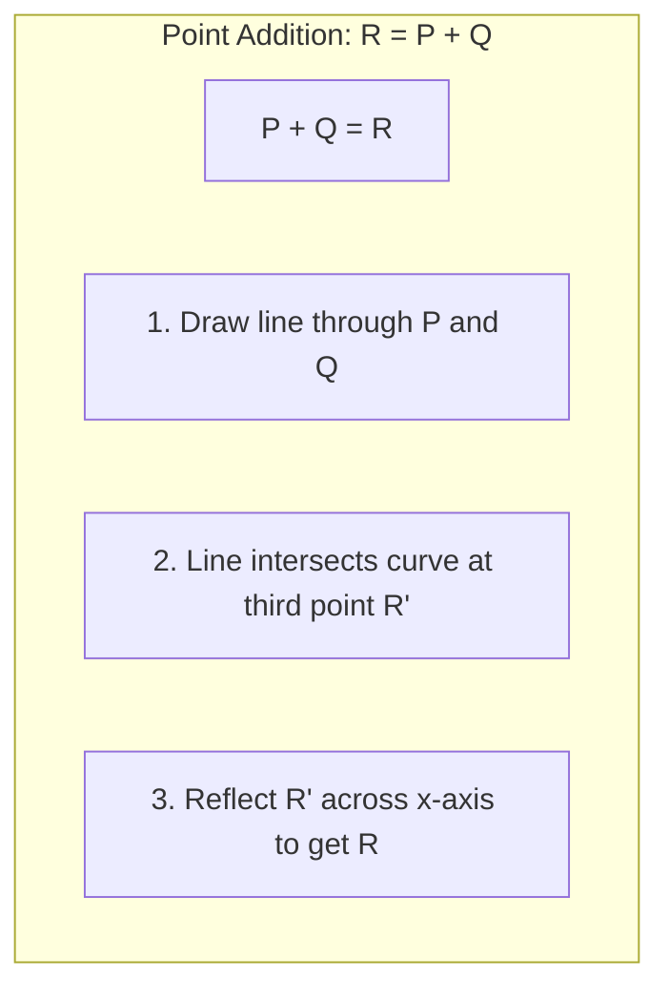

# :material-vector-curve: 4.3 椭圆曲线密码学

> **Elliptic Curve Cryptography (ECC) — 以更短的密钥实现更强的安全性**

椭圆曲线密码学（ECC）是现代密码学的重要组成部分。与 RSA 相比，ECC 能用**更短的密钥**实现**同等甚至更高的安全性**——256 位 ECC 密钥的安全性相当于 3072 位 RSA 密钥。这使得 ECC 特别适合资源受限的环境（如移动设备、物联网）。比特币、TLS 1.3 和 Signal 协议都广泛使用 ECC。

---

## :material-target: 学习目标

- 理解为什么需要 ECC（RSA 的局限性）
- 掌握椭圆曲线方程及其参数
- 理解椭圆曲线上的点加法和标量乘法
- 理解椭圆曲线离散对数问题（ECDLP）的困难性
- 了解常用的椭圆曲线标准（secp256k1、P-256）
- 能够使用 SageMath 和 Python 进行椭圆曲线运算
- 理解 ECC 与 RSA 的密钥长度对比

---

## :material-book-open: 前置知识

- [4.1 数论基础](01-number-theory.md)：模运算、模逆元
- [4.2 RSA 算法](02-rsa.md)：理解公钥密码学的基本概念
- 基本的代数和几何知识

---

## :material-school: 核心概念与术语

### 1. 为什么需要 ECC？

RSA 的安全性依赖于大整数分解问题，但随着计算能力的提升，RSA 密钥需要越来越长才能保持安全。这带来了以下问题：

| 问题 | 说明 |
|------|------|
| **存储开销** | 3072 位 RSA 密钥占用 384 字节 |
| **计算开销** | 大数运算速度慢 |
| **带宽开销** | 密钥交换和签名传输量大 |
| **功耗开销** | 移动设备和 IoT 设备难以承受 |

ECC 通过使用椭圆曲线上的数学难题，在更短的密钥长度下提供同等安全性。

#### ECC vs RSA 密钥长度对比

| 安全级别（位） | RSA 密钥长度 | ECC 密钥长度 | 比率 |
|--------------|-------------|-------------|------|
| 80 | 1024 位 | 160 位 | 6.4x |
| 112 | 2048 位 | 224 位 | 9.1x |
| 128 | 3072 位 | 256 位 | 12x |
| 192 | 7680 位 | 384 位 | 20x |
| 256 | 15360 位 | 512 位 | 30x |

!!! tip "ECC 的优势"

    - **更短的密钥**：256 位 ECC ≈ 3072 位 RSA
    - **更快的运算**：签名和验证速度更快
    - **更小的带宽**：适合移动网络和 IoT
    - **更少的存储**：证书和密钥更小
    
    ECC 在 TLS 1.3 中已成为首选算法。

---

### 2. 椭圆曲线方程

密码学中使用的椭圆曲线定义在**有限域**上，其方程为：

$$
y^2 \equiv x^3 + ax + b \pmod{p}
$$

其中 $a, b$ 是曲线参数，$p$ 是素数（定义有限域 $\mathbb{F}_p$）。

**判别式条件：** 为了保证曲线是"非奇异"的（没有尖点或自交点），必须满足：

$$
4a^3 + 27b^2 \not\equiv 0 \pmod{p}
$$

**示例：** 在 $\mathbb{F}_{97}$ 上的椭圆曲线 $y^2 = x^3 + 2x + 3$

验证判别式：$4(2)^3 + 27(3)^2 = 32 + 243 = 275$，$275 \bmod 97 = 81 \neq 0$ ✓

**无穷远点（Point at Infinity）：** 椭圆曲线群中有一个特殊的"单位元"，记作 $\mathcal{O}$（大写的 O）。它在几何上可以理解为"位于无穷远处的点"，在代数上满足：

$$
P + \mathcal{O} = \mathcal{O} + P = P
$$

对曲线上的任意点 $P$。

---

### 3. 椭圆曲线上的点加法

椭圆曲线上的点构成一个**阿贝尔群**（交换群），点加法是群运算。

#### 几何解释（实数域上）

给定曲线上的两个点 $P$ 和 $Q$，计算 $R = P + Q$ 的规则如下：

**情况1：$P \neq Q$（点加法）**

1. 画一条通过 $P$ 和 $Q$ 的直线
2. 该直线与曲线交于第三点 $R'$
3. $R$ 是 $R'$ 关于 x 轴的对称点



**情况2：$P = Q$（点倍乘）**

1. 画曲线在 $P$ 点的切线
2. 切线与曲线交于第二点 $R'$
3. $R$ 是 $R'$ 关于 x 轴的对称点

**情况3：$P = -Q$（互为逆元）**

$P + Q = \mathcal{O}$（无穷远点）

#### 代数公式（有限域 $\mathbb{F}_p$ 上）

**点加法** $R = P + Q$，其中 $P = (x_1, y_1)$，$Q = (x_2, y_2)$，$R = (x_3, y_3)$：

当 $P \neq Q$ 时：

$$
\lambda = \frac{y_2 - y_1}{x_2 - x_1} \bmod p
$$

$$
x_3 = \lambda^2 - x_1 - x_2 \bmod p
$$

$$
y_3 = \lambda(x_1 - x_3) - y_1 \bmod p
$$

**点倍乘** $R = 2P$（$P = (x_1, y_1)$）：

$$
\lambda = \frac{3x_1^2 + a}{2y_1} \bmod p
$$

$$
x_3 = \lambda^2 - 2x_1 \bmod p
$$

$$
y_3 = \lambda(x_1 - x_3) - y_1 \bmod p
$$

!!! note "除法即乘以逆元"

    在有限域上，"$\frac{a}{b}$" 实际上是 "$a \times b^{-1} \bmod p$"，其中 $b^{-1}$ 是 $b$ 模 $p$ 的逆元。

---

### 4. 标量乘法与离散对数问题

#### 标量乘法

给定椭圆曲线上的点 $P$ 和整数 $k$，标量乘法定义为：

$$
Q = kP = \underbrace{P + P + \cdots + P}_{k \text{ times}}
$$

**计算方法：** 使用"倍加法"（Double-and-Add），类似快速幂算法。

```
计算 11P（11 = 1011₂）：
P → 2P → 4P → 5P (= 4P + P) → 10P (= 2 × 5P) → 11P (= 10P + P)
```

时间复杂度：$O(\log k)$ 次点加法/倍乘。

#### 椭圆曲线离散对数问题（ECDLP）

**问题定义：** 给定椭圆曲线上的点 $P$ 和 $Q = kP$，求 $k$。

$$
\text{已知 } P \text{ 和 } Q = kP，\text{求 } k = ?
$$

这就是 ECC 的**单向陷门函数**：

- **正向**（标量乘法）：$Q = kP$ — 容易，$O(\log k)$
- **逆向**（离散对数）：从 $Q$ 和 $P$ 求 $k$ — 困难，目前已知最快算法为 $O(\sqrt{p})$

!!! info "为什么 ECDLP 是困难的？"

    对于精心选择的椭圆曲线（如 P-256），目前已知最好的通用攻击算法是：
    
    - **Pollard's rho 算法**：$O(\sqrt{n})$，其中 $n$ 是基点 $P$ 的阶
    - 对于 256 位曲线，$\sqrt{n} \approx 2^{128}$，需要约 $2^{128}$ 次运算
    
    这远超当前计算能力（全球最快超算约 $2^{60}$ 次运算/年）。

---

### 5. 常用椭圆曲线标准

密码学中使用的椭圆曲线必须经过精心选择，以避免各种攻击。

#### secp256k1（比特币曲线）

$$
y^2 = x^3 + 7 \pmod{p}
$$

其中 $p = 2^{256} - 2^{32} - 977$

**参数：**

| 参数 | 值 |
|------|-----|
| $a$ | $0$ |
| $b$ | $7$ |
| $p$ | $2^{256} - 2^{32} - 977$ |
| 基点 $G$ | 特定的 256 位点 |
| 阶 $n$ | 特定的 256 位素数 |

**使用者：** Bitcoin、Ethereum

#### P-256（NIST 曲线，又称 prime256v1 / secp256r1）

**参数：** 由 NIST 在 FIPS 186-4 中定义

**使用者：** TLS 1.3、SSH、IPsec、Apple Secure Enclave

#### 对比

| 特性 | secp256k1 | P-256 |
|------|-----------|-------|
| 定义 | $y^2 = x^3 + 7$ | 更复杂的参数 |
| 设计 | 透明、可验证 | NIST 标准 |
| 主要用途 | 区块链 | 通用安全协议 |
| 安全级别 | 128 位 | 128 位 |

---

### 6. ECC 的安全性条件

不是所有椭圆曲线都适合密码学使用。安全的椭圆曲线必须满足：

!!! warning "椭圆曲线安全要求"

    1. **非奇异**：$4a^3 + 27b^2 \neq 0$
    2. **大素数阶群**：曲线上的点数应该是素数或包含大素因子
    3. **MOV 攻击抵抗**：嵌入度（embedding degree）应该足够大
    4. **异常曲线抵抗**：曲线上的点数 $\neq p$（避免 Smart 攻击）
    5. **扭曲曲线抵抗**：扭曲曲线也应该有大素数阶
    
    使用标准化的曲线（如 P-256、secp256k1）可以避免这些问题。

---

## :material-hammer-wrench: 动手实践

### 实验1：使用 SageMath 进行椭圆曲线运算

=== "基本点运算"

    ```bash
    sage -c "
    # Define elliptic curve over GF(97)
    E = EllipticCurve(GF(97), [2, 3])
    print(f'Curve: y^2 = x^3 + 2x + 3 over GF(97)')
    print(f'Number of points on curve: {E.order()}')

    # Define a point
    P = E(3, 6)
    print(f'P = {P}')

    # Point doubling
    Q = 2 * P
    print(f'2P = {Q}')

    # Scalar multiplication
    R = 5 * P
    print(f'5P = {R}')

    # Point at infinity
    O = E(0)
    print(f'Point at infinity: {O}')
    "
    ```

    **预期输出：**

    ```
    Curve: y^2 = x^3 + 2x + 3 over GF(97)
    Number of points on curve: 97
    P = (3 : 6 : 1)
    2P = (80 : 10 : 1)
    5P = (49 : 69 : 1)
    Point at infinity: (0 : 1 : 0)
    ```

=== "验证点加法"

    ```bash
    sage -c "
    E = EllipticCurve(GF(97), [2, 3])
    P = E(3, 6)
    Q = E(80, 10)

    # Verify: P + Q should give a point on the curve
    R = P + Q
    print(f'P = {P}')
    print(f'Q = {Q}')
    print(f'P + Q = {R}')

    # Verify: 2P = P + P
    print(f'2P = {2 * P}')
    print(f'P + P = {P + P}')
    print(f'2P == P + P: {2*P == P + P}')

    # Verify associativity: (P + Q) + R = P + (Q + R)
    S = E(15, 26)
    print(f'\\nAssociativity check:')
    print(f'(P+Q)+S = {(P+Q)+S}')
    print(f'P+(Q+S) = {P+(Q+S)}')
    print(f'Equal: {(P+Q)+S == P+(Q+S)}')
    "
    ```

    **预期输出：**

    ```
    P = (3 : 6 : 1)
    Q = (80 : 10 : 1)
    P + Q = (49 : 28 : 1)
    2P = (80 : 10 : 1)
    P + P = (80 : 10 : 1)
    2P == P + P: True

    Associativity check:
    (P+Q)+S = (34 : 43 : 1)
    P+(Q+S) = (34 : 43 : 1)
    Equal: True
    ```

=== "离散对数问题"

    ```bash
    sage -c "
    E = EllipticCurve(GF(97), [2, 3])
    P = E(3, 6)

    # Given k, compute Q = kP (easy)
    k = 15
    Q = k * P
    print(f'P = {P}')
    print(f'k = {k}')
    print(f'Q = kP = {Q}')

    # Given P and Q, find k (hard in general, but easy for small curves)
    k_found = discrete_log(Q, P, operation='+')
    print(f'\\nDiscrete log: k = {k_found}')
    print(f'Verification: {k_found} * P = {k_found * P}')
    print(f'Correct: {k_found * P == Q}')
    "
    ```

    **预期输出：**

    ```
    P = (3 : 6 : 1)
    k = 15
    Q = kP = (36 : 53 : 1)

    Discrete log: k = 15
    Verification: 15 * P = (36 : 53 : 1)
    Correct: True
    ```

=== "使用标准曲线 P-256"

    ```bash
    sage -c "
    # Use NIST P-256 curve
    p = 2^256 - 2^224 + 2^192 + 2^96 - 1
    a = p - 3
    b = 41058363725152142129326129780047268409114441015993725554835256314039467401291
    E = EllipticCurve(GF(p), [a, b])

    print(f'P-256 curve defined over GF(p)')
    print(f'p = {hex(p)[:20]}...')
    print(f'Order of curve = {E.order()}')
    print(f'Order is prime: {is_prime(E.order())}')
    "
    ```

---

### 实验2：使用 OpenSSL 查看 ECC 密钥

=== "生成 ECC 密钥"

    ```bash
    # Generate ECC private key using P-256 curve
    openssl ecparam -genkey -name prime256v1 -out ec_private.pem

    # View private key details
    openssl ec -in ec_private.pem -text -noout

    # Extract public key
    openssl ec -in ec_private.pem -pubout -out ec_public.pem

    # View public key
    openssl ec -in ec_public.pem -pubin -text -noout
    ```

    **预期输出（私钥信息）：**

    ```
    ASN1 OID: prime256v1
    NIST CURVE: P-256
    Private-Key: (256 bit)
    priv:
        xx:xx:xx:...:xx
    pub:
        xx:xx:xx:...:xx
    ```

=== "比较 RSA 和 ECC 密钥大小"

    ```bash
    # Generate RSA key
    openssl genrsa -out rsa_key.pem 2048

    # Generate ECC key
    openssl ecparam -genkey -name prime256v1 -out ecc_key.pem

    # Compare file sizes
    ls -la rsa_key.pem ecc_key.pem

    # Compare key details
    echo "=== RSA Key ==="
    openssl rsa -in rsa_key.pem -text -noout | head -3
    echo ""
    echo "=== ECC Key ==="
    openssl ec -in ecc_key.pem -text -noout | head -3
    ```

    **预期输出：**

    ```
    === RSA Key ===
    RSA Private-Key: (2048 bit, 2 primes)

    === ECC Key ===
    Private-Key: (256 bit)
    ```

---

### 实验3：使用 Python 脚本进行 ECC 运算

使用配套的 Python 脚本，可以观察 ECC 的完整运算过程。

```bash
python scripts/ecc_demo.py
```

**预期输出：**

```
=== ECC Demo ===

--- Elliptic Curve Definition ---
Curve: y^2 = x^3 + 2x + 3 (mod 97)
Discriminant: 81 (non-zero, curve is non-singular)

--- Point Operations ---
P = (3, 6) on curve
Q = 2P = (80, 10)
R = 3P = (80, 87)
5P = (49, 69)

--- Point Addition Verification ---
P = (3, 6), Q = (80, 10)
P + Q = (49, 28)
Q + P = (49, 28)
Commutative: True

--- Scalar Multiplication ---
k=1: (3, 6)
k=2: (80, 10)
k=3: (80, 87)
k=4: (3, 91)
k=5: (49, 69)

--- Discrete Logarithm Problem ---
Given P = (3, 6), Q = (49, 69)
Find k such that Q = kP
k = 5
Verification: 5P = (49, 69) ✓

--- Key Size Comparison ---
Security  | RSA Size | ECC Size | Ratio
80-bit    | 1024 bit | 160 bit  | 6.4x
128-bit   | 3072 bit | 256 bit  | 12.0x
192-bit   | 7680 bit | 384 bit  | 20.0x
256-bit   | 15360 bit| 512 bit  | 30.0x
```

---

## :material-shield-alert: 安全分析与思考

### ECDLP 的困难性

ECC 的安全性完全依赖于 ECDLP 的困难性。目前最好的通用攻击算法是：

| 算法 | 复杂度 | 适用场景 |
|------|--------|---------|
| **Pollard's rho** | $O(\sqrt{n})$ | 通用，最常用 |
| **Pohlig-Hellman** | 取决于 $n$ 的因子 | 当 $n$ 有小因子时有效 |
| **Baby-step Giant-step** | $O(\sqrt{n})$ | 理论上等价于 Pollard's rho |
| **MOV 攻击** | 取决于嵌入度 | 嵌入度小时有效 |
| **Smart 攻击** | $O(p)$ | 异常曲线 |

!!! warning "ECC 的潜在威胁"

    1. **量子计算机**：Shor 算法可以解决 ECDLP，比分解大整数更容易。256 位 ECC 在量子计算机面前只提供约 128 位安全性。
    
    2. **弱曲线**：不是所有椭圆曲线都是安全的。必须使用经过验证的标准曲线。
    
    3. **侧信道攻击**：通过测量计算时间或功耗来推断私钥。需要使用常数时间实现。

### ECC vs RSA 综合对比

| 特性 | RSA | ECC |
|------|-----|-----|
| 安全基础 | 大整数分解 | 椭圆曲线离散对数 |
| 128 位安全密钥长度 | 3072 位 | 256 位 |
| 密钥生成速度 | 慢（需要素数生成） | 快 |
| 签名验证速度 | 快（$e=65537$） | 快 |
| 签名生成速度 | 慢 | 快 |
| 密钥协商 | 不直接支持 | ECDH |
| 前向保密 | 需要额外协议 | 原生支持（ECDHE） |
| 量子安全 | ❌ 不安全 | ❌ 不安全 |

!!! tip "实际应用中的选择"

    - **新项目**：优先选择 ECC（特别是 ECDHE 用于密钥交换）
    - **兼容性需求**：RSA 仍然广泛支持
    - **区块链**：几乎全部使用 secp256k1
    - **TLS 1.3**：强制支持 ECDHE，RSA 加密已移除

---

## :material-pencil: 练习题

### 基础题

**题目1：** 对于椭圆曲线 $y^2 = x^3 + 2x + 3 \pmod{97}$，验证点 $(3, 6)$ 在曲线上。

??? tip "参考答案"

    代入方程：
    
    左边：$y^2 = 6^2 = 36$
    
    右边：$x^3 + 2x + 3 = 27 + 6 + 3 = 36$
    
    $36 \equiv 36 \pmod{97}$ ✓，点 $(3, 6)$ 在曲线上。

**题目2：** 使用点加法公式，计算 $(3, 6) + (80, 10)$ 在曲线 $y^2 = x^3 + 2x + 3 \pmod{97}$ 上的结果。

??? tip "参考答案"

    $\lambda = \frac{10 - 6}{80 - 3} = \frac{4}{77} \bmod 97$
    
    $77^{-1} \bmod 97$：$77 \times 56 = 4312 = 44 \times 97 + 44$... 需要计算 $77^{-1} \bmod 97 = 75$
    
    $\lambda = 4 \times 75 = 300 \equiv 9 \pmod{97}$
    
    $x_3 = 9^2 - 3 - 80 = 81 - 83 = -2 \equiv 95 \pmod{97}$
    
    实际计算可能需要更精确的步骤，建议用 SageMath 验证。

### 进阶题

**题目3：** 解释为什么在 ECC 中，知道 $P$ 和 $Q = kP$ 不能直接计算 $k$，但在普通整数算术中，知道 $a$ 和 $b = k \times a$ 可以直接计算 $k = b/a$。

??? tip "参考答案"

    在普通整数算术中，$b = k \times a$ 意味着 $k = b / a$，除法是乘法的逆运算，且计算简单。
    
    在椭圆曲线群中，群运算是"点加法"，不是普通的乘法。虽然标量乘法 $Q = kP$ 可以高效计算（倍加法），但"除法"（离散对数）没有对应的高效算法。这类似于知道 $2^k \bmod p = c$ 很难求 $k$，但知道 $k$ 很容易算 $c$。

### 挑战题

**题目4：** 为什么比特币选择 secp256k1（$y^2 = x^3 + 7$）而不是 NIST P-256？

??? tip "参考答案"

    1. **可验证的随机性**：secp256k1 的参数选择是"透明的"（$a=0, b=7$ 是简单数字），而 NIST P-256 的参数是通过"种子"生成的，存在潜在的后门疑虑（Dual_EC_DRBG 事件的影响）。
    
    2. **效率**：secp256k1 的参数 $a=0$ 使得某些运算更高效。
    
    3. **信任**：比特币社区更信任"透明"的参数选择，而非 NSA 参与制定的标准。

---

## :material-bookshelf: 延伸阅读

- **教材**：《Elliptic Curves: Number Theory and Cryptography》— Lawrence Washington
- **在线资源**：[Cloudflare's ECC Tutorial](https://blog.cloudflare.com/a-relatively-easy-to-understand-primer-on-elliptic-curve-cryptography/)
- **标准**：[SEC 2: Recommended Elliptic Curve Domain Parameters](https://www.secg.org/sec2-v2.pdf)
- **NIST 标准**：[FIPS 186-5](https://csrc.nist.gov/publications/detail/fips/186/5/final)
- **Wikipedia**：[Elliptic-curve cryptography](https://en.wikipedia.org/wiki/Elliptic-curve_cryptography)
- **可视化**：[Elliptic Curve Visualizer](https://cdn.rawgit.com/andreacorbellini/ecc/920b29a/interactive/reals-add.html)
- **下一站**：[4.4 Diffie-Hellman 密钥交换](04-dh.md) — 使用 ECC 进行密钥交换
