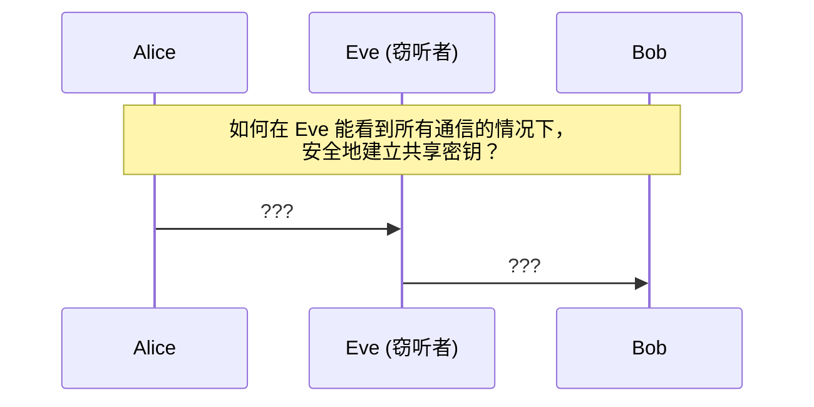
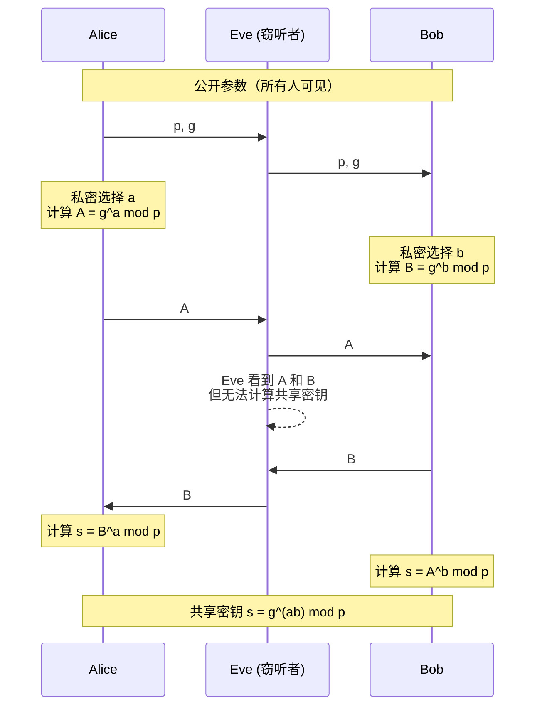
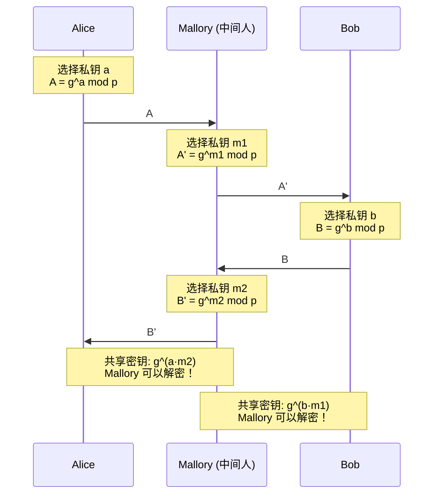
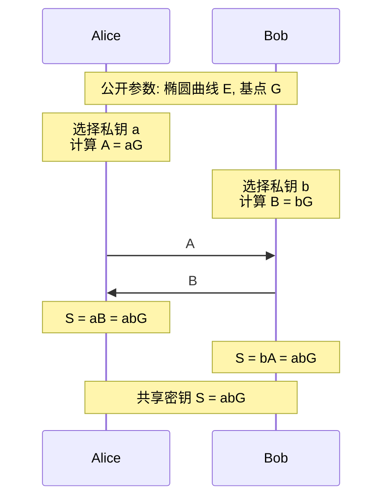

# :material-key-change: 4.4 Diffie-Hellman 密钥交换

> **Diffie-Hellman Key Exchange — 在不安全信道上安全协商密钥**

1976 年，Whitfield Diffie 和 Martin Hellman 发表了革命性的论文《New Directions in Cryptography》，提出了**公钥密码学**的概念和第一个实用的密钥交换协议。Diffie-Hellman（DH）协议允许两方在完全公开的信道上协商出一个共享密钥，而窃听者无法计算出这个密钥。

---

## :material-target: 学习目标

- 理解密钥交换问题的本质
- 掌握 Diffie-Hellman 协议的完整流程
- 理解 DH 的数学原理（离散对数问题）
- 能够用 Python 完整模拟 DH 密钥交换
- 理解中间人攻击（MITM）及其防御方法
- 了解 ECDH（椭圆曲线 Diffie-Hellman）
- 理解前向保密（Forward Secrecy）的概念

---

## :material-book-open: 前置知识

- [4.1 数论基础](01-number-theory.md)：模运算、模幂运算
- [4.3 椭圆曲线密码学](03-ecc.md)：椭圆曲线点运算（理解 ECDH 时需要）
- 对称加密的基本概念（[模块3](../03-symmetric/index.md)）

---

## :material-school: 核心概念与术语

### 1. 密钥交换问题

在对称加密中，通信双方必须共享同一个密钥。但如何在不安全的网络上安全地建立这个共享密钥？

**问题场景：**



!!! info "历史上的解决方案"

    **传统方法：** 人工传递密钥（如 USB 密钥、面对面交换）
    
    **问题：** 不可扩展、不实用
    
    **RSA 方法：** Bob 发送公钥给 Alice，Alice 用公钥加密对称密钥
    
    **问题：** 需要公钥基础设施（PKI），Bob 需要事先拥有 RSA 密钥对
    
    **DH 方法：** 双方实时协商密钥，无需事先共享秘密

---

### 2. Diffie-Hellman 协议

#### 协议流程



#### 详细步骤

**公开参数：**

- $p$：一个大素数
- $g$：模 $p$ 的生成元（primitive root）

**Alice 的操作：**

1. 随机选择私钥 $a$（$1 < a < p-1$）
2. 计算公钥 $A = g^a \bmod p$
3. 将 $A$ 发送给 Bob

**Bob 的操作：**

1. 随机选择私钥 $b$（$1 < b < p-1$）
2. 计算公钥 $B = g^b \bmod p$
3. 将 $B$ 发送给 Alice

**共享密钥计算：**

- Alice 计算：$s = B^a \bmod p = (g^b)^a \bmod p = g^{ab} \bmod p$
- Bob 计算：$s = A^b \bmod p = (g^a)^b \bmod p = g^{ab} \bmod p$

双方得到相同的共享密钥 $s = g^{ab} \bmod p$。

#### 数学原理

$$
s = B^a \equiv (g^b)^a \equiv g^{ab} \equiv (g^a)^b \equiv A^b \pmod{p}
$$

关键性质：**指数运算满足交换律**——$(g^a)^b = (g^b)^a = g^{ab}$。

---

### 3. 具体数值示例

我们用小数字演示 DH 协议的完整流程：

**公开参数：** $p = 23$, $g = 5$

| 步骤 | Alice | Bob |
|------|-------|-----|
| 选择私钥 | $a = 6$ | $b = 15$ |
| 计算公钥 | $A = 5^6 \bmod 23 = 8$ | $B = 5^{15} \bmod 23 = 19$ |
| 发送公钥 | → 发送 $A=8$ → | ← 发送 $B=19$ ← |
| 计算共享密钥 | $s = 19^6 \bmod 23 = 2$ | $s = 8^{15} \bmod 23 = 2$ |

**验证：**

- $5^6 = 15625 = 679 \times 23 + 8$，所以 $A = 8$ ✓
- $5^{15} \bmod 23 = 19$ ✓
- $19^6 \bmod 23 = 2$ ✓
- $8^{15} \bmod 23 = 2$ ✓
- 双方共享密钥 $s = 2$ ✓

**窃听者 Eve 看到的信息：** $p=23$, $g=5$, $A=8$, $B=19$

**Eve 需要解决的问题：** 从 $A = g^a \bmod p$ 求 $a$，即求解 $5^a \equiv 8 \pmod{23}$

这就是**离散对数问题**，对于小数字容易求解，但对于大数字（如 2048 位）是计算上不可行的。

---

### 4. DH 安全性基础

DH 的安全性依赖于**计算性 Diffie-Hellman 问题（CDH）**和**判定性 Diffie-Hellman 问题（DDH）**。

**CDH 问题：** 给定 $g$, $g^a$, $g^b$，计算 $g^{ab}$。

**DDH 问题：** 给定 $g$, $g^a$, $g^b$，判断 $g^{ab}$ 与随机值 $g^c$ 是否可区分。

这两个问题都与**离散对数问题（DLP）**密切相关：

$$
\text{DLP} \leq_p \text{CDH} \leq_p \text{DDH}
$$

如果 DLP 是困难的，则 CDH 和 DDH 也是困难的。

---

### 5. 中间人攻击（MITM）

DH 协议本身**不提供身份认证**——它无法防止中间人攻击。



**攻击过程：**

1. Alice 发送 $A = g^a$ 给 Bob，但被 Mallory 拦截
2. Mallory 生成自己的私钥 $m_1$，发送 $A' = g^{m_1}$ 给 Bob
3. Bob 发送 $B = g^b$ 给 Alice，但被 Mallory 拦截
4. Mallory 生成自己的私钥 $m_2$，发送 $B' = g^{m_2}$ 给 Alice
5. Alice 和 Mallory 共享密钥 $g^{a \cdot m_2}$
6. Mallory 和 Bob 共享密钥 $g^{b \cdot m_1}$
7. Mallory 可以解密并重新加密所有通信

**防御方法：**

| 方法 | 说明 |
|------|------|
| **数字签名** | 用 RSA/ECC 签名 DH 公钥 |
| **证书** | 通过 PKI 验证对方身份 |
| **SAS（Short Authentication String）** | 双方口头验证短字符串（如 Signal 协议） |
| **PSK（Pre-Shared Key）** | 事先共享密钥用于认证 |

!!! warning "密钥交换 ≠ 身份认证"

    DH 只能保证密钥的**机密性**（窃听者无法计算共享密钥），但不能保证**身份认证**（无法确认对方是谁）。
    
    实际协议中，DH 通常与身份认证机制结合使用：
    
    - **TLS**：DH + 证书认证
    - **Signal**：DH + SAS + 公钥指纹
    - **SSH**：DH + 主机密钥指纹

---

### 6. ECDH（椭圆曲线 Diffie-Hellman）

ECDH 是 DH 的椭圆曲线版本，使用椭圆曲线上的标量乘法代替模幂运算。

#### ECDH 流程

**公开参数：** 椭圆曲线 $E$ 和基点 $G$

**Alice：**

1. 随机选择私钥 $a$
2. 计算公钥 $A = aG$（椭圆曲线标量乘法）
3. 发送 $A$ 给 Bob

**Bob：**

1. 随机选择私钥 $b$
2. 计算公钥 $B = bG$
3. 发送 $B$ 给 Alice

**共享密钥：**

- Alice：$S = aB = a(bG) = (ab)G$
- Bob：$S = bA = b(aG) = (ab)G$



#### ECDH vs DH 对比

| 特性 | DH | ECDH |
|------|-----|------|
| 数学基础 | 模幂运算 | 椭圆曲线标量乘法 |
| 安全基础 | 离散对数问题 | 椭圆曲线离散对数问题 |
| 128 位安全密钥长度 | 3072 位 | 256 位 |
| 计算速度 | 较慢 | 较快 |
| 带宽需求 | 大 | 小 |

---

### 7. 前向保密（Forward Secrecy）

**前向保密**（也称完美前向保密，PFS）是指：即使长期私钥被泄露，过去的会话密钥仍然安全。

**为什么需要前向保密？**

如果使用 RSA 密钥交换：

1. Alice 用 Bob 的 RSA 公钥加密对称密钥
2. 如果 Bob 的 RSA 私钥后来被泄露，攻击者可以解密所有历史通信

如果使用 DHE/ECDHE（临时 DH）：

1. 每次会话都生成新的临时 DH 密钥对
2. 会话结束后，临时私钥被销毁
3. 即使长期私钥被泄露，也无法恢复历史会话密钥

!!! tip "DHE vs DH"

    - **DH（静态）**：使用固定的 DH 密钥对，不提供前向保密
    - **DHE（临时）**：每次会话生成新的 DH 密钥对，提供前向保密
    - **ECDHE**：椭圆曲线版本的 DHE，TLS 1.3 的默认选择
    
    TLS 1.3 **强制**使用 (EC)DHE，不再支持 RSA 密钥交换。

---

## :material-hammer-wrench: 动手实践

### 实验1：使用 Python 脚本模拟 DH 密钥交换

使用配套的 Python 脚本，可以完整观察 DH 密钥交换过程。

```bash
python scripts/dh_demo.py
```

**预期输出：**

```
=== Diffie-Hellman Key Exchange Demo ===

--- Basic DH with Small Numbers ---
Public parameters: p = 23, g = 5

Alice:
  Private key a = 6
  Public key A = g^a mod p = 5^6 mod 23 = 8

Bob:
  Private key b = 15
  Public key B = g^b mod p = 5^15 mod 23 = 19

Key Exchange:
  Alice sends A = 8 to Bob
  Bob sends B = 19 to Alice

Shared Secret Computation:
  Alice: s = B^a mod p = 19^6 mod 23 = 2
  Bob:   s = A^b mod p = 8^15 mod 23 = 2

  Shared secret matches: True
  Shared secret = 2

--- DH with Larger Parameters ---
Public parameters: p (2048-bit), g = 2

Alice private key: [256-bit random]
Bob private key: [256-bit random]

Key exchange time: 0.05s
Shared secret: [2048-bit shared secret]
Shared secrets match: True

--- MITM Attack Demonstration ---
[Shows how Mallory intercepts and impersonates]

--- ECDH Demonstration ---
Curve: y^2 = x^3 + 2x + 3 (mod 97)
Base point G = (3, 6)

Alice private key: a = 7, public key: A = 7G = (80, 87)
Bob private key: b = 11, public key: B = 11G = (3, 91)

Alice shared: aB = 7*(3,91) = (49, 69)
Bob shared:   bA = 11*(80,87) = (49, 69)
Shared point matches: True

--- Forward Secrecy Comparison ---
RSA Key Exchange:
  - Bob's RSA key compromised → all past sessions decryptable
  - No forward secrecy

(ECDHE) Key Exchange:
  - Temporary keys destroyed after each session
  - Long-term key compromise does not affect past sessions
  - Forward secrecy achieved
```

---

### 实验2：使用 SageMath 验证 DH

=== "基本 DH 计算"

    ```bash
    sage -c "
    # DH Key Exchange with SageMath
    p = 23
    g = 5

    print(f'Public parameters: p = {p}, g = {g}')

    # Alice
    a = 6
    A = power_mod(g, a, p)
    print(f'\\nAlice: a = {a}, A = {g}^{a} mod {p} = {A}')

    # Bob
    b = 15
    B = power_mod(g, b, p)
    print(f'Bob:   b = {b}, B = {g}^{b} mod {p} = {B}')

    # Shared secret
    s_alice = power_mod(B, a, p)
    s_bob = power_mod(A, b, p)
    print(f'\\nAlice computes: s = {B}^{a} mod {p} = {s_alice}')
    print(f'Bob computes:   s = {A}^{b} mod {p} = {s_bob}')
    print(f'Match: {s_alice == s_bob}')
    "
    ```

    **预期输出：**

    ```
    Public parameters: p = 23, g = 5

    Alice: a = 6, A = 5^6 mod 23 = 8
    Bob:   b = 15, B = 5^15 mod 23 = 19

    Alice computes: s = 19^6 mod 23 = 2
    Bob computes:   s = 8^15 mod 23 = 2
    Match: True
    ```

=== "验证离散对数困难性"

    ```bash
    sage -c "
    # Demonstrate discrete log difficulty
    p = 104729  # A prime
    g = 2       # Generator

    # Alice's secret
    a = 12345
    A = power_mod(g, a, p)

    print(f'p = {p}, g = {g}')
    print(f'Alice secret a = {a}')
    print(f'Alice public A = g^a mod p = {A}')
    print(f'\\nTo find a, attacker must solve discrete log...')
    print(f'Discrete log of {A} base {g} mod {p} = {discrete_log(Mod(A, p), Mod(g, p))}')
    "
    ```

    **预期输出：**

    ```
    p = 104729, g = 2
    Alice secret a = 12345
    Alice public A = g^a mod p = 74618

    To find a, attacker must solve discrete log...
    Discrete log of 74618 base 2 mod 104729 = 12345
    ```

=== "ECDH 演示"

    ```bash
    sage -c "
    # ECDH with SageMath
    E = EllipticCurve(GF(97), [2, 3])
    G = E(3, 6)  # Base point

    # Alice
    a = 7
    A = a * G

    # Bob
    b = 11
    B = b * G

    print(f'Curve: y^2 = x^3 + 2x + 3 (mod 97)')
    print(f'Base point G = {G}')
    print(f'\\nAlice: a = {a}, A = aG = {A}')
    print(f'Bob:   b = {b}, B = bG = {B}')

    # Shared secret
    S_alice = a * B
    S_bob = b * A
    print(f'\\nAlice: S = aB = {S_alice}')
    print(f'Bob:   S = bA = {S_bob}')
    print(f'Match: {S_alice == S_bob}')
    "
    ```

---

### 实验3：使用 OpenSSL 生成 DH 参数

=== "生成 DH 参数"

    ```bash
    # Generate DH parameters (512-bit for demo, use 2048+ in production)
    openssl dhparam -out dhparam.pem 512

    # View DH parameters
    openssl dhparam -in dhparam.pem -text -noout

    # Generate 2048-bit DH parameters (takes longer)
    openssl dhparam -out dhparam_2048.pem 2048
    ```

    **预期输出（512-bit）：**

    ```
    DH Parameters: (512 bit)
        P:
            xx:xx:xx:...:xx
        G:
            02 (2)
    ```

=== "使用 OpenSSL 进行 ECDH"

    ```bash
    # Generate ECDH key pair (Alice)
    openssl ecparam -genkey -name prime256v1 -out alice_ec.pem

    # Generate ECDH key pair (Bob)
    openssl ecparam -genkey -name prime256v1 -out bob_ec.pem

    # In practice, ECDH is performed automatically by TLS
    # Here we can view the key parameters
    echo "=== Alice's Key ==="
    openssl ec -in alice_ec.pem -text -noout | head -5
    echo ""
    echo "=== Bob's Key ==="
    openssl ec -in bob_ec.pem -text -noout | head -5
    ```

---

## :material-shield-alert: 安全分析与思考

### DH 参数选择的安全要求

!!! warning "安全参数要求"

    **素数 $p$ 的要求：**
    
    - 至少 2048 位（NIST 推荐）
    - 应使用**安全素数**（$p = 2q + 1$，$q$ 也是素数）以抵抗 Pohlig-Hellman 攻击
    - 或使用 DSA 素数（$p-1$ 有大素因子 $q$）
    
    **生成元 $g$ 的要求：**
    
    - 应是模 $p$ 的原根（primitive root）
    - 或至少生成一个大素数阶子群
    
    **私钥的要求：**
    
    - 必须是密码学安全的随机数
    - 每次会话应重新生成（提供前向保密）

### 常见攻击

| 攻击 | 原理 | 防御 |
|------|------|------|
| **离散对数攻击** | 直接求解 DLP | 使用足够大的 $p$（≥2048 位） |
| **Pohlig-Hellman** | 当 $p-1$ 有小因子时 | 使用安全素数 |
| **中间人攻击** | 无身份认证 | 结合数字签名/证书 |
| **小群攻击** | 强制使用小阶元素 | 验证收到的公钥在正确子群中 |
| **Logjam 攻击** | 预计算特定素数的 DLP | 使用自定义素数或 ECDHE |

### Logjam 攻击

!!! danger "Logjam 攻击（2015）"

    研究者发现，对于常用的 1024 位 DH 素数，可以通过预计算表在合理时间内（约一个月）破解单个会话的 DH 交换。
    
    **影响：** TLS、SSH、IPsec 中使用标准 DH 素数的连接
    
    **防御：**
    
    1. 使用 2048 位或更大的 DH 参数
    2. 使用 ECDHE（不受此攻击影响）
    3. TLS 1.3 已移除静态 DH，只支持 (EC)DHE

---

## :material-pencil: 练习题

### 基础题

**题目1：** 使用 DH 协议，公开参数 $p = 29$, $g = 2$。Alice 选择私钥 $a = 5$，Bob 选择私钥 $b = 8$。计算双方的公钥和共享密钥。

??? tip "参考答案"

    Alice：$A = 2^5 \bmod 29 = 32 \bmod 29 = 3$
    
    Bob：$B = 2^8 \bmod 29 = 256 \bmod 29 = 24$
    
    Alice 计算共享密钥：$s = B^a = 24^5 \bmod 29 = 16$
    
    Bob 计算共享密钥：$s = A^b = 3^8 \bmod 29 = 6561 \bmod 29 = 16$
    
    共享密钥 $s = 16$ ✓

**题目2：** 解释为什么 DH 协议中不能选择 $a = 0$ 或 $a = 1$ 作为私钥。

??? tip "参考答案"

    - $a = 0$：$A = g^0 \bmod p = 1$，共享密钥总是 $1$（与 Bob 的选择无关）
    - $a = 1$：$A = g^1 \bmod p = g$，共享密钥等于 $B = g^b$，而 $B$ 是公开传输的

### 进阶题

**题目3：** 如果攻击者能够解决离散对数问题，他们如何破解 DH 密钥交换？

??? tip "参考答案"

    1. 从截获的 $A = g^a \bmod p$ 中求解 $a$（离散对数）
    2. 计算共享密钥 $s = B^a \bmod p$
    
    因此 DH 的安全性完全依赖于离散对数问题的困难性。

**题目4：** 解释为什么 TLS 1.3 强制使用 (EC)DHE 而不是 RSA 密钥交换。

??? tip "参考答案"

    1. **前向保密**：(EC)DHE 每次会话使用临时密钥，即使长期私钥泄露也不影响历史会话
    2. **性能**：ECDHE 比 RSA 密钥交换更快
    3. **安全性**：RSA 密钥交换依赖于 RSA 加密的安全性，而 (EC)DHE 只依赖于 DH 问题的困难性

### 挑战题

**题目5：** 设计一个协议，使用 DH 密钥交换 + 数字签名来防御中间人攻击。画出消息流程图。

??? tip "参考答案"

    1. Alice 生成 DH 密钥对 $(a, A = g^a)$
    2. Alice 用长期签名密钥对 $A$ 签名：$\sigma_A = \text{Sign}(A)$
    3. Alice 发送 $(A, \sigma_A, \text{证书})$ 给 Bob
    4. Bob 验证 Alice 的证书和签名
    5. Bob 生成 DH 密钥对 $(b, B = g^b)$
    6. Bob 用长期签名密钥对 $B$ 签名：$\sigma_B = \text{Sign}(B)$
    7. Bob 发送 $(B, \sigma_B, \text{证书})$ 给 Alice
    8. Alice 验证 Bob 的证书和签名
    9. 双方计算共享密钥 $s = g^{ab}$
    
    Mallory 无法伪造签名，因此无法实施 MITM 攻击。

---

## :material-bookshelf: 延伸阅读

- **原始论文**：Diffie & Hellman. *New Directions in Cryptography.* 1976.
- **教材**：《Understanding Cryptography》— Christof Paar & Jan Pelzl（第11章）
- **RFC**：[RFC 7919 - Negotiated Finite Field Diffie-Hellman Ephemeral Parameters for TLS](https://tools.ietf.org/html/rfc7919)
- **RFC**：[RFC 8446 - TLS 1.3](https://tools.ietf.org/html/rfc8446)
- **攻击论文**：[Imperfect Forward Secrecy: How Diffie-Hellman Fails in Practice](https://weakdh.org/)
- **Wikipedia**：[Diffie-Hellman key exchange](https://en.wikipedia.org/wiki/Diffie%E2%80%93Hellman_key_exchange)
- **Wikipedia**：[Elliptic-curve Diffie-Hellman](https://en.wikipedia.org/wiki/Elliptic-curve_Diffie%E2%80%93Hellman)
- **下一站**：[模块5：密码破解实战](../05-cryptanalysis/index.md) — 学习如何攻击这些密码系统
