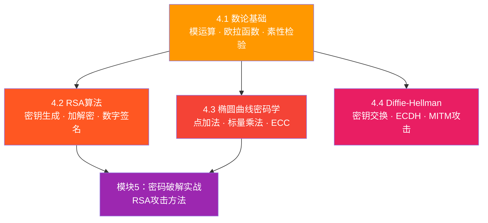
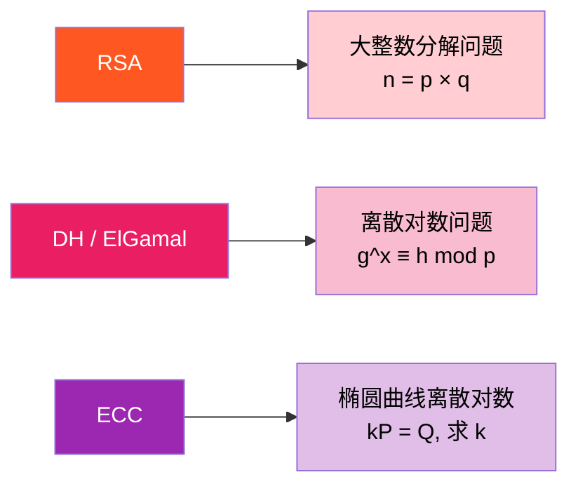

# :material-key-variant: 模块4 — 非对称加密与数论

> **Asymmetric Encryption & Number Theory**

非对称加密（公钥密码学）是现代密码学的基石。它解决了对称加密中最困难的问题——**密钥分发**。本模块从数论基础出发，逐步深入 RSA、椭圆曲线和密钥交换协议。

---

## :material-map: 学习路线

---

## :material-book-open-variant: 主题概览

=== "🔢 4.1 数论基础"

    **数论基础**

    掌握非对称加密所需的数学工具：模运算、最大公约数、模逆元、欧拉函数、费马小定理和素性检验。

    **核心知识点：**

    - 模运算的定义与性质
    - 欧几里得算法（GCD）
    - 模逆元的存在条件与计算
    - 欧拉函数 φ(n)
    - 费马小定理与欧拉定理
    - Miller-Rabin 素性检验

    [:octicons-arrow-right-24: 开始学习](01-number-theory.md)

=== "🔐 4.2 RSA算法"

    **RSA算法全流程详解**

    深入理解世界上第一个也是最广泛使用的公钥加密算法。从密钥生成到加解密，从数学证明到实际应用。

    **核心知识点：**

    - RSA 密钥生成的五个步骤
    - 加密：$C = M^e \bmod n$
    - 解密：$M = C^d \bmod n$
    - 数学正确性证明
    - OpenSSL 实际操作
    - RSA 数字签名

    [:octicons-arrow-right-24: 开始学习](02-rsa.md)

=== "📐 4.3 椭圆曲线"

    **椭圆曲线密码学**

    用更短的密钥实现同等甚至更高的安全性。理解椭圆曲线上的点运算和离散对数问题。

    **核心知识点：**

    - 椭圆曲线方程 $y^2 = x^3 + ax + b$
    - 点加法的几何与代数定义
    - 标量乘法与离散对数问题（ECDLP）
    - 常用曲线：secp256k1、P-256
    - ECC vs RSA 密钥长度对比

    [:octicons-arrow-right-24: 开始学习](03-ecc.md)

=== "🤝 4.4 密钥交换"

    **Diffie-Hellman 密钥交换**

    学习如何在不安全的信道上安全地协商共享密钥，理解中间人攻击及其防御。

    **核心知识点：**

    - DH 协议的完整流程
    - 离散对数问题的安全性
    - 中间人攻击（MITM）
    - ECDH（椭圆曲线 DH）
    - 前向保密（Forward Secrecy）

    [:octicons-arrow-right-24: 开始学习](04-dh.md)

---

## :material-tools: 本模块使用的工具

| 工具 | 用途 | 安装方式 |
|------|------|----------|
| **SageMath** | 数论计算、椭圆曲线运算 | 见[环境搭建](../getting-started.md) |
| **OpenSSL** | RSA/ECC 密钥生成、加解密 | 系统自带或安装包 |
| **Python** | 脚本演示（sympy、cryptography） | `pip install sympy cryptography` |
| **CyberChef** | RSA 解密可视化 | 浏览器打开 HTML 文件 |

---

## :material-key-chain: 核心概念对比

| 特性 | 对称加密 | 非对称加密 |
|------|---------|-----------|
| 密钥数量 | 1 个共享密钥 | 2 个（公钥 + 私钥） |
| 速度 | 快（100-1000x） | 慢 |
| 密钥分发 | 困难（需要安全信道） | 容易（公钥可公开） |
| 典型用途 | 数据加密 | 密钥交换、数字签名 |
| 代表算法 | AES、ChaCha20 | RSA、ECC、DH |
| 安全基础 | 替换与置换 | 数论难题（大数分解、离散对数） |

!!! tip "混合加密"

    实际应用中，非对称加密通常**不直接加密大量数据**，而是用于：
    
    1. **密钥交换**：用 DH/RSA 协商一个对称密钥
    2. **数字签名**：用 RSA/ECC 验证消息的真实性
    3. **对称加密**：用协商出的密钥加密实际数据
    
    这就是 **混合加密**（Hybrid Encryption），TLS/HTTPS 的核心思想。

---

## :material-chart-bar: 安全性基础

非对称加密的安全性依赖于以下**计算困难问题**：

!!! info "单向函数"

    这些问题都有一个共同特征：**正向计算容易，逆向计算困难**。
    
    - 正向：$n = p \times q$（容易）
    - 逆向：给定 $n$，找到 $p$ 和 $q$（困难）
    
    这种"单向陷门函数"（Trapdoor One-Way Function）是公钥密码学的理论基础。

---

## :material-clock-outline: 预计学习时间

| 主题 | 预计时间 | 难度 |
|------|---------|------|
| 4.1 数论基础 | 3-4 小时 | ⭐⭐⭐ |
| 4.2 RSA 算法 | 3-4 小时 | ⭐⭐⭐⭐ |
| 4.3 椭圆曲线密码学 | 2-3 小时 | ⭐⭐⭐⭐ |
| 4.4 Diffie-Hellman 密钥交换 | 2-3 小时 | ⭐⭐⭐ |
| **合计** | **10-14 小时** | |

---

## :material-arrow-right: 开始学习

建议按照 4.1 → 4.2 → 4.3 → 4.4 的顺序学习，因为每个主题都建立在前一个的基础之上。

[:octicons-arrow-right-24: **4.1 数论基础**](01-number-theory.md){ .md-button .md-button--primary }
