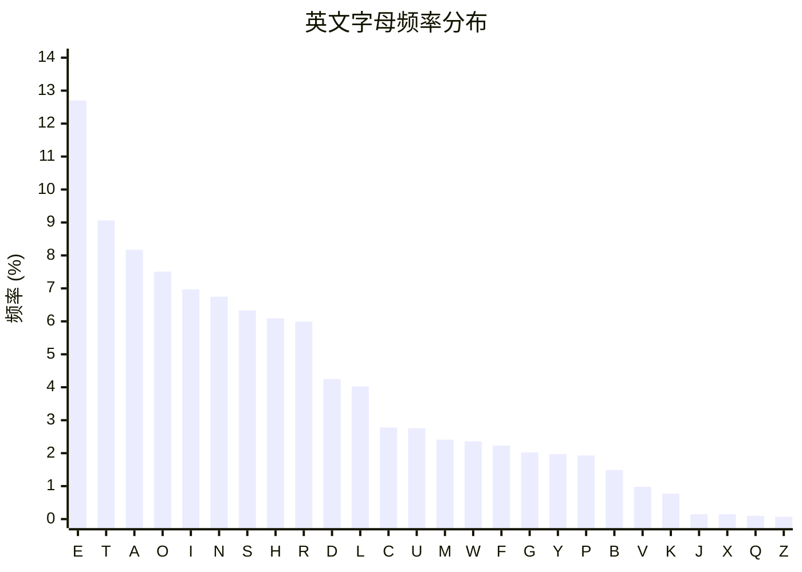
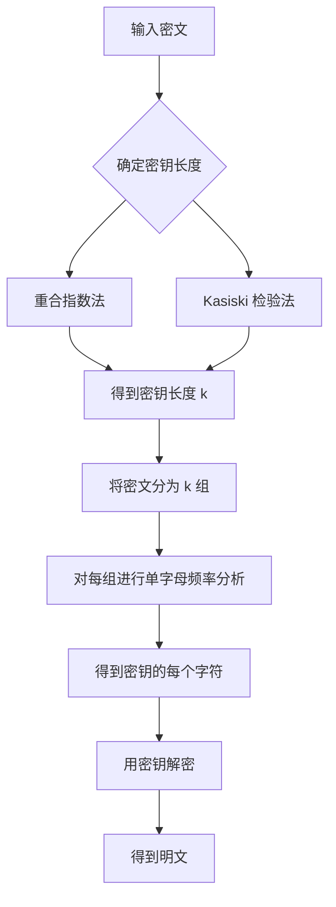

# 5.1 频率分析

## 学习目标

- 理解自然语言中字母出现频率不均匀的特性
- 掌握英文字母频率表及其在密码分析中的应用
- 学会使用频率分析破解单表替换密码
- 了解 Bigram 和 Trigram 分析的进阶技巧
- 理解频率分析如何扩展到多表密码（先确定密钥长度）

## 前置知识

- 凯撒密码和单表替换密码的原理（参见模块1）
- 基本的 Python 编程能力
- 百分比和统计的基本概念

---

## 核心概念与术语

### 单表替换密码（Monoalphabetic Substitution Cipher）

单表替换密码将明文中的每个字母替换为密文字母表中的固定字母。与凯撒密码不同，替换映射可以是任意的排列，而不仅仅是移位。

例如，以下是一个随机的替换映射：

```
明文字母: A B C D E F G H I J K L M N O P Q R S T U V W X Y Z
密文字母: Q W E R T Y U I O P A S D F G H J K L Z X C V B N M
```

### 为什么频率分析有效？

!!! note "核心原理"

    自然语言中，字母的出现频率**不是均匀分布**的。在英文文本中：

    - **E** 出现频率最高（约 12.7%）
    - **T** 次之（约 9.1%）
    - **Z** 出现频率最低（约 0.07%）

    单表替换密码虽然打乱了字母的映射关系，但**保留了频率分布的统计特征**。通过统计密文中各字母的出现频率，并与标准英文频率对比，就可以推测出替换映射。

### 英文字母频率表

下表展示了英文中各字母的标准出现频率（基于大量英文语料统计）：

| 字母 | 频率 (%) | 字母 | 频率 (%) | 字母 | 频率 (%) |
|------|----------|------|----------|------|----------|
| E    | 12.70    | H    | 6.09     | W    | 2.36     |
| T    | 9.06     | R    | 5.99     | F    | 2.23     |
| A    | 8.17     | D    | 4.25     | G    | 2.02     |
| O    | 7.51     | L    | 4.03     | Y    | 1.97     |
| I    | 6.97     | C    | 2.78     | P    | 1.93     |
| N    | 6.75     | U    | 2.76     | B    | 1.49     |
| S    | 6.33     | M    | 2.41     | V    | 0.98     |
|      |          |      |          | K    | 0.77     |
|      |          |      |          | J    | 0.15     |
|      |          |      |          | X    | 0.15     |
|      |          |      |          | Q    | 0.10     |
|      |          |      |          | Z    | 0.07     |

!!! tip "记忆口诀"

    英文中最常见的字母可以记住：**ETAOIN SHRDLU**（发音类似 "etaoin shrdlu"）。这是英文排版工人在铅字排版时代用来填充剩余行的常用序列。

### 频率分布的可视化



---

## 动手实践

### 实验1：用 Python 脚本进行频率分析攻击

我们将使用配套脚本 `freq_attack.py` 来演示完整的频率分析攻击流程。

**攻击步骤：**

1. 统计密文中每个字母的出现频率
2. 将密文字母按频率从高到低排序
3. 与标准英文频率排序对比，建立推测的替换映射
4. 用推测的映射解密密文
5. 人工微调解密结果（因为频率排序不会完全精确）

**使用 Python 脚本：**

```bash
python scripts/freq_attack.py
```

**预期输出：**

```
=== Frequency Analysis Attack ===

--- Ciphertext ---
GUVF VF N GRFG ZRFFNTR GUNG VF HFRQ GB QVRZR...

--- Letter Frequencies in Ciphertext ---
T: 14.2%  ████████████████
G:  9.8%  ███████████
R:  8.5%  █████████
F:  7.3%  ████████
U:  6.9%  ███████
V:  6.1%  ███████
...

--- Standard English Frequencies ---
E: 12.7%  ██████████████
T:  9.1%  ██████████
A:  8.2%  █████████
O:  7.5%  ████████
I:  7.0%  ███████
N:  6.8%  ███████
...

--- Proposed Substitution Mapping ---
Cipher -> Plain
   T   ->    E
   G   ->    T
   R   ->    A
   F   ->    O
   U   ->    I
   V   ->    N
...

--- Decryption Result ---
THIS IS A TEST MESSAGE THAT IS USED TO DETERMINE...

--- Accuracy: 95.2% ---
```

!!! tip "关于准确率"

    纯频率分析的准确率通常在 70%-90% 之间。结合上下文和人工判断，可以进一步提高到接近 100%。短文本的分析效果会明显下降，因为统计样本不够。

### 实验2：使用 CyberChef 进行频率分析

CyberChef 内置了频率分析功能，可以在浏览器中快速完成分析。

**操作步骤：**

1. 在浏览器中打开 CyberChef：
   ```
   F:\Users\code_data\vibe\cryptography_learn\CyberChef_v10.19.4\CyberChef_v10.19.4.html
   ```

2. 在 **Input** 区域粘贴密文

3. 在 **Operations** 中搜索 `Frequency Distribution`，拖入工作区

4. 查看输出区域的频率统计结果

5. 使用 `Substitute` 操作手动建立替换映射并解密

!!! note "CyberChef 的优势"

    CyberChef 提供了可视化的频率柱状图，可以直观地看到每个字母的出现次数。对于初学者来说，这是理解频率分布最直观的方式。

### 实验3：Bigram 和 Trigram 分析

单字母频率分析有时不足以精确破解，尤其是短文本。此时可以结合双字母组（Bigram）和三字母组（Trigram）分析。

**常见的英文 Bigram：**

| Bigram | 频率 | Bigram | 频率 |
|--------|------|--------|------|
| TH     | 3.56% | IN     | 2.33% |
| HE     | 3.07% | AN     | 2.13% |
| IN     | 2.43% | ER     | 2.07% |
| ER     | 2.05% | ON     | 1.77% |
| AN     | 1.99% | RE     | 1.60% |

**常见的英文 Trigram：**

| Trigram | 频率 |
|---------|------|
| THE     | 3.51% |
| AND     | 0.64% |
| ING     | 0.61% |
| HER     | 0.34% |
| HAT     | 0.31% |

!!! tip "Bigram 分析的用法"

    如果你发现密文中 `TG` 出现频率很高，结合单字母频率分析（T→E, G→T 的可能性），可以推测 `TG` 对应 `TH`，从而确认 G→H 的映射。

**使用 Python 进行 Bigram 分析：**

```python
from collections import Counter

def bigram_analysis(ciphertext):
    """Perform bigram frequency analysis."""
    text = ''.join(c for c in ciphertext.upper() if c.isalpha())
    bigrams = [text[i:i+2] for i in range(len(text) - 1)]
    freq = Counter(bigrams)
    total = sum(freq.values())
    
    print("Top 10 Bigrams:")
    for bigram, count in freq.most_common(10):
        pct = count / total * 100
        print(f"  {bigram}: {count} ({pct:.2f}%)")

# Usage:
# bigram_analysis(ciphertext)
```

---

## 进阶：对多表密码的频率分析

### 从多表到单表的降维

!!! warning "多表密码的挑战"

    维吉尼亚密码等多表替换密码使用多个替换字母表交替加密，这会**均匀化**字母频率，使得直接频率分析失效。但只要密钥长度有限，频率分析仍然可以攻击——关键是先确定密钥长度。

### 确定密钥长度的方法

=== "重合指数法（Index of Coincidence）"

    **重合指数（IC）** 衡量一段文本中两个随机选取的字母相同的概率。

    - 英文明文的 IC 约为 **0.067**
    - 随机文本的 IC 约为 **0.038**（即 1/26）

    **攻击步骤：**

    1. 假设密钥长度为 $k$
    2. 将密文按每隔 $k$ 个字母分组，得到 $k$ 个子序列
    3. 计算每个子序列的 IC
    4. 如果某个 $k$ 使得所有子序列的 IC 都接近 0.067，那么 $k$ 就是正确的密钥长度

    $$
    IC = \frac{\sum_{i=A}^{Z} f_i(f_i - 1)}{N(N-1)}
    $$

    其中 $f_i$ 是字母 $i$ 的出现次数，$N$ 是总字母数。

=== "Kasiski 检验法"

    **Kasiski 检验法** 通过寻找密文中的重复片段来推测密钥长度。

    **攻击步骤：**

    1. 在密文中寻找重复出现的字母序列（长度 ≥ 3）
    2. 计算重复片段之间的距离
    3. 对所有距离求最大公约数（GCD）
    4. GCD 或其因子很可能就是密钥长度

    **原理：** 如果明文中的相同片段恰好在密钥的相同位置被加密，就会产生相同的密文片段。重复片段之间的距离必然是密钥长度的倍数。

### 完整的多表密码破解流程



---

## 安全分析与思考

!!! danger "单表替换密码的根本缺陷"

    单表替换密码的密钥空间虽然很大（$26! \approx 4 \times 10^{26}$ 种可能的映射），但由于自然语言的统计特征，实际安全性极低。即使密钥空间再大，只要密文保留了明文的频率特征，就可以通过统计分析破解。

**关键教训：**

1. **密钥空间大不等于安全**——安全性取决于攻击者能否利用密文的统计特征
2. **增加替换表的数量**（如维吉尼亚密码）可以部分抵御频率分析，但仍然可以被破解
3. **现代密码算法**（如 AES）确保密文的统计分布与随机噪声无法区分，从而彻底免疫频率分析

!!! info "频率分析的历史"

    频率分析最早由阿拉伯学者 **Al-Kindi**（约 801-873 年）在《密码学手稿》中描述。这是密码学历史上第一个已知的密码分析技术，标志着密码学从单纯的加密技术发展为包含攻击分析的完整学科。

---

## 练习题

### 练习1：手动频率分析

给定以下密文（单表替换加密），尝试用频率分析破解：

```
XJWWQ BWXJW QFXXM WJFXX MWJFX XMWJF
XXMWJ FXXMW JFXXM WJFXX MWJFX XMWJF
```

提示：先统计每个字母的出现次数，然后与标准频率对比。

### 练习2：编写频率分析脚本

修改 `freq_attack.py` 脚本，使其：

1. 支持输入文件作为参数
2. 同时显示 Bigram 和 Trigram 的频率统计
3. 对解密结果进行自动评分（与英文单词词典对比）

### 练习3：重合指数计算

编写 Python 函数计算给定文本的重合指数（IC），并用以下文本验证：

- 英文明文（IC 应接近 0.067）
- 随机字母序列（IC 应接近 0.038）
- 维吉尼亚密码密文（IC 应介于两者之间）

### 练习4：CyberChef 实战

使用 CyberChef 的 Frequency Distribution 功能分析以下密文，尝试还原明文：

```
WKLV LV D QRQ WULYLDO H[DPSOH IRU IUHTXHQF DQDOVLV
```

---

## 延伸阅读

- Simon Singh, 《密码故事》（The Code Book）— 第2章详细介绍了频率分析的历史
- [Practical Cryptography - Frequency Analysis](http://practicalcryptography.com/cryptanalysis/letter-frequencies-french-and-german/)
- [dCode - Frequency Analysis](https://www.dcode.fr/frequency-analysis)
- Al-Kindi 的原始论文翻译：[Manuscript on Deciphering Cryptographic Messages](https://arxiv.org/abs/1609.06021)
