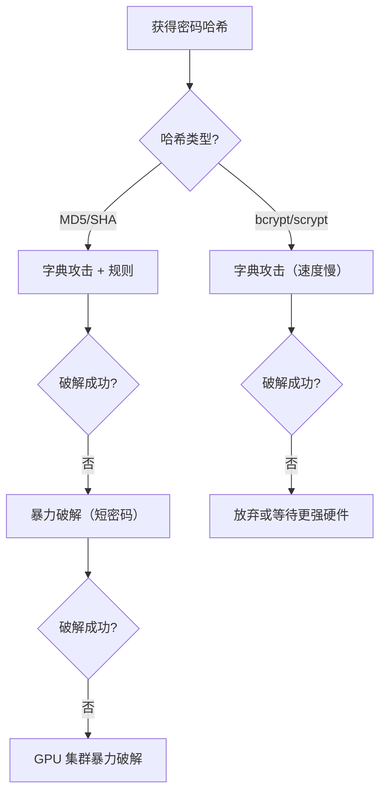

# 5.2 字典攻击与暴力破解

## 学习目标

- 理解字典攻击和暴力破解的原理与区别
- 掌握密码哈希破解的基本流程
- 学会使用 hashcat 进行字典攻击和暴力破解
- 学会使用 John the Ripper 进行密码破解
- 能够计算不同攻击方式的时间复杂度
- 理解密码强度与破解时间的关系

## 前置知识

- 哈希函数的基本概念（参见模块2）
- 密码哈希与盐值（参见模块2.4）
- 命令行基本操作

---

## 核心概念与术语

### 字典攻击（Dictionary Attack）

字典攻击使用预先准备好的**常见密码列表**（字典）逐一尝试，将每个候选密码进行哈希运算后与目标哈希值对比。

!!! note "字典攻击的原理"

    ```mermaid
    flowchart LR
        A["字典文件"] --> B["取下一个候选密码"]
        B --> C["计算哈希值"]
        C --> D{"哈希值匹配?"}
        D -->|是| E["密码破解成功!"]
        D -->|否| B
    ```

    **核心思想：** 人们倾向于使用有规律的、可预测的密码。一个包含数百万常见密码的字典文件，往往能破解相当比例的密码哈希。

**常见的字典来源：**

| 字典文件 | 来源 | 大小 |
|----------|------|------|
| rockyou.txt | 2009年RockYou数据泄露 | 1400万条 |
| SecLists | GitHub安全字典集合 | 多种分类 |
| hashcat自带 | hashcat内置示例 | 基础 |
| CrackStation | 常见密码集合 | 15亿条 |

### 暴力破解（Brute Force Attack）

暴力破解穷举所有可能的字符组合，逐一尝试直到找到匹配的密码。

!!! warning "暴力破解的复杂度"

    暴力破解的搜索空间大小为：

    $$
    N = |\Sigma|^L
    $$

    其中 $|\Sigma|$ 是字符集大小，$L$ 是密码长度。

    | 字符集 | 大小 | 6位密码空间 | 8位密码空间 |
    |--------|------|-------------|-------------|
    | 数字 (0-9) | 10 | $10^6 = 100万$ | $10^8 = 1亿$ |
    | 小写字母 | 26 | $26^6 \approx 3亿$ | $26^8 \approx 2千亿$ |
    | 字母+数字 | 62 | $62^6 \approx 568亿$ | $62^8 \approx 218万亿$ |
    | 全部可打印字符 | 95 | $95^6 \approx 7350亿$ | $95^8 \approx 6.6千万亿$ |

### 字典攻击 vs 暴力破解

| 特性 | 字典攻击 | 暴力破解 |
|------|----------|----------|
| **速度** | 快（取决于字典大小） | 慢（取决于搜索空间） |
| **成功率** | 对常见密码高 | 理论上100%（时间足够） |
| **适用场景** | 富码使用常见模式 | 富码较短或字符集小 |
| **资源消耗** | 低 | 高（CPU/GPU密集） |

---

## 动手实践

### 实验1：准备密码哈希文件

首先，我们需要创建一些密码哈希用于破解练习。

**使用 OpenSSL 创建 MD5 哈希：**

```bash
# Windows 下使用 OpenSSL（如果已安装）
echo -n "password123" | openssl dgst -md5
```

**预期输出：**

```
(stdin)= 482c811da5d5b4bc6d497ffa98491e38
```

**使用 Python 创建哈希文件：**

```python
import hashlib

passwords = {
    "password123": hashlib.md5(b"password123").hexdigest(),
    "admin": hashlib.md5(b"admin").hexdigest(),
    "letmein": hashlib.md5(b"letmein").hexdigest(),
    "qwerty": hashlib.md5(b"qwerty").hexdigest(),
    "P@ssw0rd!": hashlib.md5(b"P@ssw0rd!").hexdigest(),
}

# Write to hashcat format (hash only)
with open("hashes.txt", "w") as f:
    for pwd, h in passwords.items():
        f.write(f"{h}\n")

# Write to John format (username:hash)
with open("hashes_john.txt", "w") as f:
    for i, (pwd, h) in enumerate(passwords.items()):
        f.write(f"user{i}:{h}\n")
```

!!! tip "hashcat 与 John the Ripper 的格式差异"

    - **hashcat**：每行一个哈希值，通过 `-m` 参数指定哈希类型
    - **John the Ripper**：通常使用 `username:hash` 格式，需要指定 `--format` 参数（如 `--format=Raw-MD5`）

### 实验2：使用 hashcat 进行字典攻击

hashcat 是目前最快的密码破解工具之一，支持 GPU 加速。

**基本语法：**

```bash
hashcat [选项] 哈希文件 字典文件
```

**关键参数说明：**

| 参数 | 说明 | 示例 |
|------|------|------|
| `-m` | 哈希类型 | `-m 0` (MD5), `-m 1000` (NTLM), `-m 1400` (SHA-256) |
| `-a` | 攻击模式 | `-a 0` (字典), `-a 3` (暴力), `-a 6` (混合) |
| `-r` | 规则文件 | `-r rules/best64.rule` |
| `--show` | 显示已破解的密码 | |
| `--force` | 忽略警告（测试用） | |

**字典攻击示例：**

```bash
hashcat -m 0 -a 0 hash.txt example.dict --force
```

**预期输出：**

```
hashcat (v7.1.2) starting...

OpenCL API (OpenCL 3.0) - Platform #1 [NVIDIA CUDA]
================================================================
* Device #1: NVIDIA GeForce RTX 3060, 3072/12288 MB (2048 MB allocatable), 28MCU

Minimum password length supported by kernel: 0
Maximum password length supported by kernel: 256

Hashes: 5 digests; 5 unique digests, 1 unique salt
Bitmaps: 16 bits, 65536 entries, 0x0000ffff mask, 262144 bytes, 5/13 rotates
Rules: 1

Host memory required for this attack: 0 MB

Dictionary cache built:
* Filename..: example.dict
* Passwords.: 989
* Bytes.....: 8988
* Keyspace..: 989

482c811da5d5b4bc6d497ffa98491e38:password123
21232f297a57a5a743894a0e4a801fc3:admin
0d107d09f5bbe40cade3de5c71e9e9b7:letmein

Session..........: hashcat
Status...........: Cracked
Hash.Mode........: 0 (MD5)
Hash.Target......: hash.txt
Time.Started.....: ...
Time.Utilized....: 0 secs
Speed.#1.........:  1234.5 kH/s
Recovered........: 3/5 (60.00%) Digests
```

**查看已破解的密码：**

```bash
hashcat -m 0 hash.txt --show
```

### 实验3：使用 hashcat 进行暴力破解

暴力破解（掩码攻击）使用 `-a 3` 模式，通过掩码定义字符集和长度。

**常用掩码：**

| 掩码 | 含义 |
|------|------|
| `?l` | 小写字母 (a-z) |
| `?u` | 大写字母 (A-Z) |
| `?d` | 数字 (0-9) |
| `?s` | 特殊字符 |
| `?a` | 所有可打印字符 |
| `?b` | 0x00-0xff |

**示例：破解6位纯数字密码：**

```bash
hashcat -m 0 -a 3 hash.txt ?d?d?d?d?d?d --force
```

**示例：破解小写字母+数字的6位密码：**

```bash
hashcat -m 0 -a 3 hash.txt ?l?l?l?l?l?l --force
```

**示例：破解以 "pass" 开头后跟两位数字的密码：**

```bash
hashcat -m 0 -a 3 hash.txt "pass?d?d" --force
```

!!! tip "暴力破解的速度估算"

    以 RTX 3060 为例，MD5 暴力破解速度约 **5 GH/s**（每秒50亿次哈希）。

    - 6位数字（$10^6$ 种）：约 0.0002 秒
    - 6位小写字母（$26^6$ 种）：约 0.06 秒
    - 8位小写字母（$26^8$ 种）：约 41 秒
    - 8位字母+数字（$62^8$ 种）：约 66 分钟
    - 10位字母+数字（$62^{10}$ 种）：约 42 天

### 实验4：使用 John the Ripper

John the Ripper 是另一款经典的密码破解工具，特点是自动检测哈希格式。

**基本语法：**

```bash
john [选项] 哈希文件
```

**字典攻击：**

```bash
john --wordlist=example.dict --format=Raw-MD5 hashes_john.txt
```

**预期输出：**

```
Using default input encoding: UTF-8
Loaded 5 password hashes with no different salts (Raw-MD5 [MD5 256/256 AVX2 8x3])
Warning: no OpenMP support for this hash type, consider --fork=12
Press 'q' or Ctrl-C to abort, almost any other key for status
admin            (user1)
letmein          (user2)
qwerty           (user3)
3g 0:00:00:00 DONE (2026-06-12 15:53) 111.1g/s 4756Kp/s 4756Kc/s 17931KC/s zx1368..zzzzzzzzzzz
Use the "--show --format=Raw-MD5" options to display all of the cracked passwords reliably
Session completed
```

**查看已破解的密码：**

```bash
john --show --format=Raw-MD5 hashes_john.txt
```

**预期输出：**

```
user1:admin
user2:letmein
user3:qwerty

3 password hashes cracked, 2 left
```

**增量模式（暴力破解）：**

```bash
john --incremental --format=Raw-MD5 hashes_john.txt
```

!!! warning "John 的增量模式"

    John 的增量模式（`--incremental`）是一种智能暴力破解，它基于字符频率统计来优先尝试更可能的组合，比纯随机暴力破解效率更高。

### 实验5：常见哈希类型的 hashcat 模式

| 哈希类型 | hashcat `-m` 值 | 常见用途 |
|----------|-----------------|----------|
| MD5 | 0 | 旧网站、文件校验 |
| SHA-1 | 100 | Git、旧系统 |
| SHA-256 | 1400 | 现代系统、区块链 |
| SHA-512 | 1800 | Linux shadow文件 |
| NTLM | 1000 | Windows密码 |
| bcrypt | 3200 | 现代Web应用 |
| WPA/WPA2 | 22000 | WiFi密码 |

**破解 NTLM 哈希（Windows 密码）：**

```bash
hashcat -m 1000 -a 0 ntlm_hashes.txt rockyou.txt --force
```

**破解 SHA-256 哈希：**

```bash
hashcat -m 1400 -a 0 sha256_hashes.txt rockyou.txt --force
```

---

## 密码强度与破解时间对照表

下表基于 **RTX 3060 GPU** 的破解速度估算（单卡）：

| 密码类型 | 示例 | 搜索空间 | MD5 破解时间 | bcrypt 破解时间 |
|----------|------|----------|-------------|----------------|
| 6位纯数字 | 123456 | $10^6$ | 瞬间 | 瞬间 |
| 8位纯数字 | 12345678 | $10^8$ | 瞬间 | ~10 分钟 |
| 6位小写字母 | abcdef | $26^6$ | 瞬间 | ~2 小时 |
| 8位小写字母 | abcdefgh | $26^8$ | ~40 秒 | ~3 天 |
| 8位字母+数字 | abc12345 | $62^8$ | ~1 小时 | ~1 年 |
| 8位混合字符 | A1b2C3!@ | $95^8$ | ~10 小时 | ~15 年 |
| 10位混合字符 | A1b2C3!@#$ | $95^{10}$ | ~90 天 | ~13万年 |
| 12位混合字符 | A1b2C3!@#$%^ | $95^{12}$ | ~2200年 | ~12亿年 |

!!! danger "bcrypt 的防御效果"

    注意 bcrypt 破解时间比 MD5 长数万倍。这就是为什么现代系统应该使用 bcrypt、scrypt 或 Argon2 等专用密码哈希算法，而不是 MD5 或 SHA-256。参见模块2.4。

---

## 安全分析与思考

!!! note "防御字典攻击和暴力破解的方法"

    1. **使用强密码**：长度至少12位，包含大小写字母、数字和特殊字符
    2. **使用密码哈希算法**：bcrypt、scrypt、Argon2（而非 MD5/SHA-256）
    3. **加盐（Salt）**：为每个密码使用唯一的随机盐值，阻止彩虹表攻击
    4. **密钥拉伸（Key Stretching）**：增加哈希计算的迭代次数
    5. **账户锁定**：限制登录尝试次数
    6. **多因素认证（MFA）**：即使密码泄露也有额外保护

!!! tip "密码管理器是最好的防御"

    使用密码管理器（如 Bitwarden、1Password）为每个网站生成并存储唯一的随机密码。这样即使一个网站的密码泄露，其他账户仍然安全。

**攻击者的选择策略：**



---

## 练习题

### 练习1：创建并破解自己的哈希

1. 用 Python 创建以下密码的 MD5 哈希：`security`, `trustno1`, `hello123`, `MyP@ss!`
2. 将哈希保存到文件
3. 使用 hashcat 或 John the Ripper 破解

### 练习2：比较不同哈希类型的破解速度

1. 分别创建相同密码的 MD5 和 bcrypt 哈希
2. 使用字典攻击破解两者
3. 记录并比较破解时间，解释差异原因

### 练习3：估算破解时间

假设有一台每秒能计算 $10^{10}$ 次 MD5 哈希的计算机，估算破解以下密码所需的时间：

- 8位纯数字密码
- 10位小写字母密码
- 12位字母+数字密码
- 16位包含所有可打印字符的密码

### 练习4：字典质量分析

1. 下载 rockyou.txt 字典文件（或使用 hashcat 自带的 example.dict）
2. 统计字典中密码的长度分布
3. 分析哪些长度范围的密码最多
4. 思考：为什么这些长度的密码最常见？

---

## 延伸阅读

- [hashcat 官方 Wiki](https://hashcat.net/wiki/) — 完整的哈希模式和攻击模式文档
- [John the Ripper 官方文档](https://www.openwall.com/john/doc/) — John 的所有功能说明
- [SecLists](https://github.com/danielmiessler/SecLists) — 安全测试常用的字典集合
- [Have I Been Pwned](https://haveibeenpwned.com/) — 检查你的密码是否在数据泄露中出现
- [How Secure Is My Password?](https://howsecureismypassword.net/) — 密码强度估算工具
