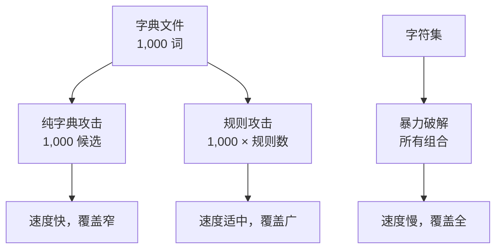
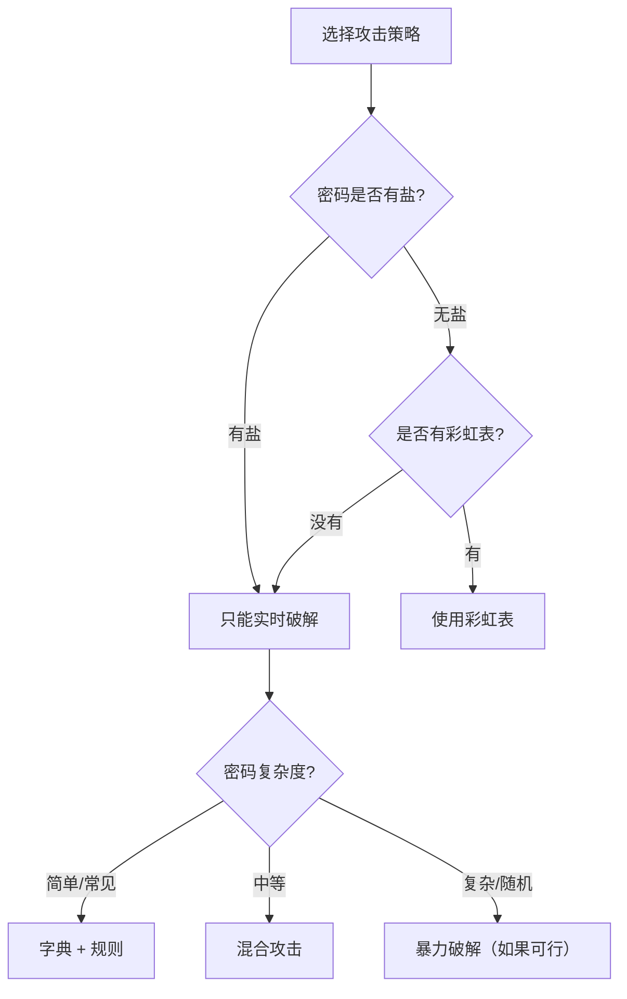

# 5.3 规则攻击与彩虹表

## 学习目标

- 理解规则攻击如何在字典基础上扩展搜索空间
- 掌握 hashcat 规则语法并能编写自定义规则
- 理解彩虹表的预计算原理和时间-存储权衡
- 了解盐值如何防御彩虹表攻击
- 能够评估不同攻击方式的适用场景

## 前置知识

- 字典攻击和暴力破解的基本概念（参见5.2）
- 哈希函数的基本性质（参见模块2）
- 密码哈希与盐值（参见模块2.4）

---

## 核心概念与术语

### 规则攻击（Rule-based Attack）

规则攻击是字典攻击的增强版。它在字典中的每个候选密码上应用**变换规则**，生成密码的变体，从而用较小的字典覆盖更多的密码模式。

!!! note "为什么需要规则攻击？"

    很多人的密码虽然不是字典中的原词，但遵循可预测的变换模式：

    - `password` → `Password` （首字母大写）
    - `password` → `password123` （追加数字）
    - `password` → `p@ssw0rd` （字符替换）
    - `password` → `PASSWORD!` （全大写+特殊字符）
    - `password` → `123password` （前置数字）

    规则攻击通过自动化这些变换，将一个包含 1000 个词的字典扩展为数百万个候选密码。

**规则攻击 vs 纯字典攻击 vs 暴力破解：**



### hashcat 规则语法

hashcat 使用一套简洁的规则语法来描述密码变换。以下是最常用的规则函数：

| 规则函数 | 说明 | 示例 | 输入 → 输出 |
|----------|------|------|-------------|
| `:` | 不做变换 | `:` | password → password |
| `l` | 转小写 | `l` | PASSword → password |
| `u` | 转大写 | `u` | password → PASSWORD |
| `c` | 首字母大写 | `c` | password → Password |
| `C` | 首字母小写其余大写 | `C` | PASSWORD → pASSWORD |
| `t` | 大小写翻转 | `t` | Password → pASSWORD |
| `r` | 反转 | `r` | password → drowssap |
| `d` | 复制 | `d` | pass → passpass |
| `$X` | 追加字符X | `$1` | password → password1 |
| `^X` | 前置字符X | `^1` | password → 1password |
| `[` | 删除首字符 | `[` | password → assword |
| `]` | 删除尾字符 | `]` | password → passwor |
| `DN` | 删除位置N的字符 | `D3` | password → pasword |
| `iNX` | 在位置N插入字符X | `i4!` | pass → pass!word |
| `oNX` | 覆盖位置N的字符X | `o4@` | password → pass@ord |
| `sXY` | 替换字符X为Y | `sa@` | password → p@ssword |
| `@X` | 删除所有字符X | `@s` | password → paword |

**组合规则示例：**

```
# 首字母大写并追加 "123"
c $1 $2 $3

# 全大写并追加 "!"
u $!

# 首字母大写，替换 a 为 @，追加数字
c sa@ $1 $2 $3

# 反转并首字母大写
r c
```

### 彩虹表（Rainbow Table）

彩虹表是一种**预计算的时间-存储权衡攻击**技术。

!!! info "彩虹表的核心思想"

    彩虹表不是简单地存储所有明文-哈希对（那需要太大的存储空间），而是存储**哈希链的起点和终点**。通过在链中进行查找，可以在时间和空间之间取得平衡。

**哈希链的构建过程：**

$$
\text{明文}_0 \xrightarrow{H} \text{哈希}_0 \xrightarrow{R_1} \text{明文}_1 \xrightarrow{H} \text{哈希}_1 \xrightarrow{R_2} \text{明文}_2 \xrightarrow{H} \cdots
$$

其中 $H$ 是哈希函数，$R_i$ 是**归约函数**（将哈希值映射回明文空间的函数）。


**彩虹表只存储起点和终点！** 一条长度为 $k$ 的链只需要存储 2 个值，但覆盖了 $k$ 个明文。

**彩虹表的查找过程：**

1. 目标哈希值：假设要破解哈希 $H_x$
2. 对 $H_x$ 应用归约函数和哈希，检查是否等于彩虹表中的某个终点
3. 如果匹配，从对应的起点重建整条链，找到 $H_x$ 对应的明文

### 彩虹表 vs 暴力破解 vs 字典攻击

| 特性 | 暴力破解 | 字典攻击 | 彩虹表 |
|------|----------|----------|--------|
| **时间** | 慢（实时计算） | 快 | 快（预计算） |
| **存储** | 无 | 字典文件 | 大（GB-TB级） |
| **预计算** | 无 | 无 | 需要 |
| **盐值防御** | 无效 | 无效 | **有效** |
| **适用场景** | 短密码 | 常见密码 | 无盐哈希 |

### 盐值如何防御彩虹表

!!! danger "盐值使彩虹表失效"

    盐值（Salt）是为每个密码附加的唯一随机字符串。加盐后：

    $$
    \text{存储} = \text{salt} \| H(\text{salt} + \text{password})
    $$

    由于每个用户的盐值不同，即使两个用户使用相同的密码，其哈希值也完全不同。这意味着攻击者必须为每个盐值重新构建彩虹表，使得预计算攻击完全失效。

    **结论：** 只要使用了唯一盐值，彩虹表攻击就无法实施。这就是为什么现代密码存储方案（bcrypt、scrypt、Argon2）都内置了盐值机制。

---

## 动手实践

### 实验1：使用 hashcat 规则攻击

首先准备测试环境：

**创建哈希文件：**

```bash
# 使用 Python 创建测试哈希
python -c "
import hashlib
passwords = ['Password1', 'password!', 'P@ssword', 'PASS1234', 'Welcome1']
with open('hashes.txt', 'w') as f:
    for p in passwords:
        f.write(hashlib.md5(p.encode()).hexdigest() + '\n')
print('Hashes created.')
"
```

**创建自定义规则文件 `custom.rule`：**

```
# 首字母大写
c

# 首字母大写 + 追加数字
c $1
c $2
c $1 $2 $3

# 全大写
u

# 字符替换
sa@
se3
si1
so0

# 首字母大写 + 字符替换
c sa@
c se3
c si1
c so0

# 首字母大写 + 替换 + 追加数字
c sa@ $1
c se3 $1 $2 $3
```

**运行规则攻击：**

```bash
hashcat -m 0 -a 0 hashes.txt example.dict -r custom.rule --force
```

**使用内置规则文件：**

```bash
# 使用 hashcat 自带的 best64 规则（最常见的64条规则）
hashcat -m 0 -a 0 hashes.txt example.dict -r rules/best64.rule --force

# 使用更大的规则集
hashcat -m 0 -a 0 hashes.txt example.dict -r rules/d3ad0ne.rule --force
```

!!! tip "规则文件的选择"

    hashcat 自带了多个规则文件，覆盖不同的变换策略：

    - `best64.rule`：最常用的64条规则，适合快速扫描
    - `d3ad0ne.rule`：约 35000 条规则，覆盖面广
    - `rockyou-30000.rule`：基于 rockyou 数据集统计的前 30000 条规则

### 实验2：使用 hashcat 混合攻击

混合攻击将字典和暴力破解结合：

**混合模式 6：字典 + 掩码（字典在前）**

```bash
# 在字典词后追加两位数字
hashcat -m 0 -a 6 hashes.txt example.dict ?d?d --force
```

**混合模式 7：掩码 + 字典（掩码在前）**

```bash
# 在两位数字后接字典词
hashcat -m 0 -a 7 hashes.txt ?d?d example.dict --force
```

### 实验3：Python 模拟彩虹表

使用配套脚本演示彩虹表的基本原理：

```bash
python scripts/rainbow_demo.py
```

以下是一个简化的彩虹表模拟脚本：

```python
import hashlib

def hash_func(plaintext):
    """Simple hash function (MD5, truncated for demo)."""
    return hashlib.md5(plaintext.encode()).hexdigest()[:8]

def reduce_func(hash_val, chain_pos):
    """Reduction function: maps hash to a plaintext."""
    chars = 'abcdefghijklmnopqrstuvwxyz0123456789'
    num = int(hash_val, 16) + chain_pos
    result = []
    for _ in range(5):
        result.append(chars[num % len(chars)])
        num //= len(chars)
    return ''.join(result)

def build_chain(start, length):
    """Build a hash-reduction chain."""
    current = start
    for i in range(length):
        h = hash_func(current)
        current = reduce_func(h, i)
    return current  # Return endpoint

def build_rainbow_table(starts, chain_length):
    """Build rainbow table from starting points."""
    table = {}
    for start in starts:
        endpoint = build_chain(start, chain_length)
        table[endpoint] = start
    return table

def lookup(target_hash, table, chain_length):
    """Look up a hash in the rainbow table."""
    # Try each possible position in the chain
    for start_pos in range(chain_length - 1, -1, -1):
        current = reduce_func(target_hash, start_pos)
        for i in range(start_pos + 1, chain_length):
            h = hash_func(current)
            current = reduce_func(h, i)
        if current in table:
            # Rebuild chain from start to find the plaintext
            chain_start = table[current]
            current = chain_start
            for i in range(chain_length):
                h = hash_func(current)
                if h == target_hash:
                    return current
                current = reduce_func(h, i)
    return None

# Demo
if __name__ == '__main__':
    starts = ['abcde', 'fghij', 'klmno', 'pqrst', 'uvwxy']
    chain_length = 10

    print("Building rainbow table...")
    table = build_rainbow_table(starts, chain_length)
    print(f"Table size: {len(table)} entries (covers {len(starts) * chain_length} passwords)")

    # Try to crack a password
    target = 'password'
    target_hash = hash_func(target)
    print(f"\nTarget: '{target}' -> hash: {target_hash}")

    result = lookup(target_hash, table, chain_length)
    if result:
        print(f"Cracked! Plaintext: '{result}'")
    else:
        print("Not found (password not in table coverage)")
```

### 实验4：盐值防御效果演示

```python
import hashlib
import os

def hash_without_salt(password):
    """Hash without salt - vulnerable to rainbow tables."""
    return hashlib.md5(password.encode()).hexdigest()

def hash_with_salt(password):
    """Hash with random salt - resistant to rainbow tables."""
    salt = os.urandom(16).hex()
    combined = salt + password
    hash_val = hashlib.sha256(combined.encode()).hexdigest()
    return salt, hash_val

# Demonstration
print("=== Without Salt ===")
# Same password produces same hash - rainbow table works
h1 = hash_without_salt("password")
h2 = hash_without_salt("password")
print(f"  User1: {h1}")
print(f"  User2: {h2}")
print(f"  Same hash: {h1 == h2}  (vulnerable!)")

print("\n=== With Salt ===")
# Same password produces different hashes - rainbow table fails
salt1, h3 = hash_with_salt("password")
salt2, h4 = hash_with_salt("password")
print(f"  User1: salt={salt1}, hash={h3}")
print(f"  User2: salt={salt2}, hash={h4}")
print(f"  Same hash: {h3 == h4}  (protected!)")
```

---

## 安全分析与思考

!!! warning "规则攻击的局限性"

    规则攻击的效果取决于规则集的质量和覆盖范围。如果用户的密码不遵循任何常见的变换模式，规则攻击可能失败。但实践中，绝大多数人类选择的密码都遵循可预测的模式。

**攻击策略选择指南：**



**实际建议：**

1. **优先使用字典 + 规则**：这是性价比最高的攻击方式
2. **规则集越大越好**：但要注意时间成本
3. **彩虹表只对无盐哈希有效**：现代系统都使用盐值，彩虹表的价值在下降
4. **GPU 是关键**：hashcat 的 GPU 加速可以将破解速度提升数百倍

---

## 练习题

### 练习1：编写自定义规则

编写 hashcat 规则文件，实现以下变换：

1. 首字母大写 + 替换所有 `a` 为 `@` + 追加 `!`
2. 全大写 + 删除最后一个字符 + 追加 `123`
3. 反转 + 首字母大写

### 练习2：彩虹表参数分析

给定以下条件：

- 明文空间：6位小写字母（$26^6 \approx 3亿$）
- 链长度：10000
- 存储一个条目需要 20 字节

计算：

1. 完整覆盖明文空间需要多少条链？
2. 彩虹表的总存储大小是多少？
3. 如果增加链长度到 100000，存储大小变为多少？查找时间有什么变化？

### 练习3：盐值分析

分析以下密码存储方案的安全性：

1. 全局盐值（所有用户使用相同的盐值）
2. 每用户唯一盐值
3. 每用户唯一盐值 + bcrypt（10轮迭代）

分别讨论它们对彩虹表攻击、字典攻击和暴力破解的防御效果。

### 练习4：hashcat 实战挑战

使用 hashcat 破解以下 NTLM 哈希（`-m 1000`），字典使用 rockyou.txt：

```
a4f49c406510bdcab6824ee7c30fd852
f6b0e0d1e7c06e5a4f1e0b2d6f3a8c90
```

提示：先尝试字典攻击，再尝试规则攻击。

---

## 延伸阅读

- [hashcat Rule-based Attack](https://hashcat.net/wiki/doku.php?id=rule_based_attack) — 完整的规则语法参考
- [Rainbow Table - Wikipedia](https://en.wikipedia.org/wiki/Rainbow_table) — 彩虹表的数学原理
- [Ophcrack](https://ophcrack.sourceforge.io/) — 使用彩虹表破解 Windows 密码的工具
- [Security StackExchange - How does a salt protect against rainbow table attacks?](https://security.stackexchange.com/questions/17421/how-does-a-salt-protect-against-rainbow-table-attacks)
