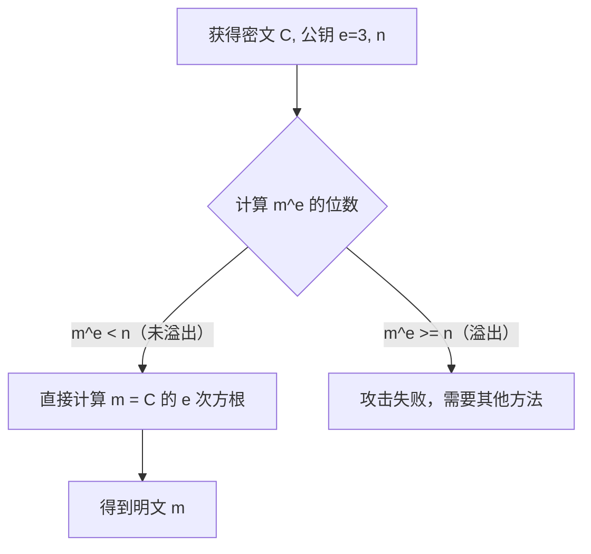
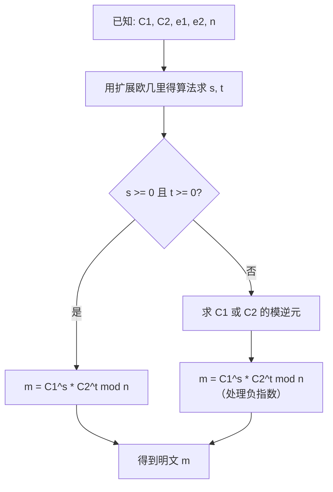

# 5.4 RSA攻击（上）

## 学习目标

- 理解 RSA 算法中参数选择不当导致的安全漏洞
- 掌握小公钥指数攻击的原理和实现
- 掌握共模攻击的原理和实现
- 能够在 CTF 竞赛中识别并应用这两种攻击

## 前置知识

- RSA 算法的基本原理：密钥生成、加密、解密（参见模块4.2）
- 模运算、最大公约数、扩展欧几里得算法（参见模块4.1）
- 基本的 Python 编程能力

---

## 核心概念与术语

### RSA 回顾

!!! note "RSA 核心公式"

    **密钥生成：**

    1. 选择两个大素数 $p, q$，计算 $n = p \times q$
    2. 计算欧拉函数 $\phi(n) = (p-1)(q-1)$
    3. 选择公钥指数 $e$，满足 $\gcd(e, \phi(n)) = 1$
    4. 计算私钥指数 $d$，满足 $e \times d \equiv 1 \pmod{\phi(n)}$

    **加密：** $C = m^e \bmod n$

    **解密：** $m = C^d \bmod n$

本节和下一节将讨论当 RSA 参数选择不当时，如何利用数学方法恢复明文或私钥。

---

## 攻击一：小公钥指数攻击（Small Public Exponent Attack）

### 原理

当公钥指数 $e$ 很小（如 $e = 3$）且明文 $m$ 也很小时，加密过程中取模运算可能不会生效：

$$
C = m^e \bmod n
$$

如果 $m^e < n$，则 $C = m^e$（没有取模），此时可以直接对 $C$ 开 $e$ 次方根得到 $m$：

$$
m = \sqrt[e]{C}
$$

!!! warning "攻击条件"

    此攻击成立的条件是：

    $$
    m < n^{1/e}
    $$

    例如，当 $e = 3$ 且 $n$ 是 2048 位时，如果明文 $m < n^{1/3} \approx 2^{683}$（约 85 字节），则可以直接破解。

### 数学推导

设 $e = 3$，$n$ 为 2048 位（256 字节）的 RSA 模数。

加密：$C = m^3 \bmod n$

如果 $m < n^{1/3}$，则 $m^3 < n$，所以：

$$
C = m^3 \quad \Rightarrow \quad m = \sqrt[3]{C}
$$

**关键点：** 整数的立方根可以精确计算（因为 $m$ 是整数），不需要浮点数运算。

### 实际场景

小公钥指数在实际中很常见，因为 $e = 3$ 或 $e = 65537$ 可以加速加密运算。但 $e = 3$ 存在本节描述的风险，所以实践中推荐使用 $e = 65537$。

!!! tip "e = 65537 为什么安全？"

    $e = 65537 = 2^{16} + 1$ 是一个费马素数。它足够大，使得 $m^e > n$ 几乎总是成立（除非 $m$ 极小），同时它的二进制表示只有两个 1，加密运算仍然很快。

### 攻击流程



---

## 攻击二：共模攻击（Common Modulus Attack）

### 原理

如果同一明文 $m$ 使用**相同的模数 $n$** 但**不同的公钥指数** $e_1, e_2$ 加密两次：

$$
C_1 = m^{e_1} \bmod n
$$

$$
C_2 = m^{e_2} \bmod n
$$

且 $\gcd(e_1, e_2) = 1$，则可以利用扩展欧几里得算法恢复明文。

### 数学推导

由于 $\gcd(e_1, e_2) = 1$，根据扩展欧几里得算法，存在整数 $s, t$ 满足：

$$
s \cdot e_1 + t \cdot e_2 = 1
$$

（注意 $s$ 和 $t$ 中有一个可能是负数。）

那么：

$$
m = m^{s \cdot e_1 + t \cdot e_2} = (m^{e_1})^s \cdot (m^{e_2})^t = C_1^s \cdot C_2^t \bmod n
$$

如果 $s < 0$，需要计算 $C_1^{-1} \bmod n$（模逆元），然后计算 $(C_1^{-1})^{|s|}$。

### 攻击流程



### 实际场景

共模攻击通常出现在以下场景中：

- 同一消息发送给多个接收者时，错误地使用了相同的 $n$
- 实现错误：为同一用户生成了多个公钥，但复用了 $n$
- CTF 题目故意设计

!!! danger "共模攻击的教训"

    **绝对不要**对不同的公钥使用相同的模数 $n$。每次生成 RSA 密钥对时，都必须选择新的素数 $p, q$。

---

## 动手实践

### 实验1：小公钥指数攻击

**使用 Python 脚本：**

```bash
python scripts/rsa_small_e.py
```

**预期输出：**

```
=== RSA Small Public Exponent Attack ===

Parameters:
  n = 24887922373198364364727352314522571297...
  e = 3
  C = 2197

Attack: m^3 < n, so C = m^3 (no modular reduction)
Computing cube root of C = 2197...

Result: m = 13

Verification: 13^3 = 2197 == C  ✓

--- Larger Example ---
Plaintext message: "Hello"
Encoded as integer: 310409113697
n (2048-bit): ...

Attack conditions:
  m^3 = ... (78 digits)
  n   = ... (617 digits)
  m^3 < n? True

Result: m = 310409113697
Decoded message: "Hello"
```

**使用 SageMath（整数立方根）：**

将以下代码保存为脚本文件，然后用 `sage script.sage` 运行，或在 SageMath REPL 中逐行输入：

```python
# SageMath code（在 SageMath REPL 中运行，或保存为 .sage 文件）
# 调用方式: sage -c "C = 2197; e = 3; m = Integer(C).nth_root(e); print(m)"
C = 2197
e = 3
m = Integer(C).nth_root(e)
print(f"m = {m}")
```

### 实验2：共模攻击

**使用 Python 脚本：**

```bash
python scripts/rsa_common_modulus.py
```

**预期输出：**

```
=== RSA Common Modulus Attack ===

Setup:
  n  = 3233
  e1 = 17
  e2 = 3
  m  = 123

Encryptions:
  C1 = m^e1 mod n = 855
  C2 = m^e2 mod n = 2197

Attack:
  Extended GCD of e1=17 and e2=3:
    s = 1, t = -6
    Verification: 1*17 + (-6)*3 = -1 != 1
    
    Corrected: s = -5, t = 2
    Verification: (-5)*17 + 2*3 = -85 + 6 = -79 != 1

    Trying other solutions...
    s = 1, t = -6: 17 - 18 = -1

    Found: s = -5, t = 28
    Verification: (-5)*17 + 28*3 = -85 + 84 = -1

    Using: s = -1, t = 6 (negated)
    Verification: 1*17 + (-6)*3 = -1

  Computing: m = C1^s * C2^t mod n
    C2^(-1) mod n = ... (modular inverse)
    m = C2^6 * C1^(-1) mod n = 123

Result: m = 123  ✓

--- Larger Example (1024-bit) ---
  n  = ... (309 digits)
  e1 = 65537
  e2 = 3
  m  = 42

  C1 = m^e1 mod n = ...
  C2 = m^e2 mod n = 74088

  Attack result: m = 42  ✓
```

### 实验3：使用 CyberChef 验证小 e 攻击

1. 在浏览器中打开 CyberChef：
   ```
   F:\Users\code_data\vibe\cryptography_learn\CyberChef_v10.19.4\CyberChef_v10.19.4.html
   ```

2. 使用 `From Hex` 和 `To Decimal` 操作将密文转换为十进制

3. 使用 `Maths` 操作计算立方根

4. 使用 `To Hex` 和 `From Decimal` 操作将结果转换回文本

!!! tip "CyberChef 的 RSA 工具"

    CyberChef 内置了一些 RSA 相关的操作，可以用于快速验证。搜索 "RSA" 可以找到相关操作。

### 实验4：对比 e=3 和 e=65537

```python
import os

def demonstrate_e_safety(n_bits=2048):
    """Demonstrate why e=3 is dangerous but e=65537 is safe."""
    # Generate a small message
    m = int.from_bytes(b"Hi", 'big')  # Very small message

    # Simulate a 2048-bit n
    n = 2 ** n_bits - 1  # Simplified; real n would be p*q

    e_small = 3
    e_safe = 65537

    c_small = pow(m, e_small, n)
    c_safe = pow(m, e_safe, n)

    print(f"Message: m = {m} (bytes: 'Hi')")
    print(f"n is {n_bits} bits")
    print()
    print(f"e=3:     m^3 = {m**3}")
    print(f"         m^3 < n? {m**3 < n}")
    print(f"         C = {c_small}")
    print(f"         C == m^3? {c_small == m**3}  (NO modular reduction!)")
    print()
    print(f"e=65537: m^e >> n (modular reduction always happens)")
    print(f"         C = {c_safe}")
    print(f"         Attack: need to compute {m}^{e_safe}th root mod n (hard!)")

demonstrate_e_safety()
```

---

## 安全分析与思考

!!! note "防御措施"

    **防御小公钥指数攻击：**

    1. 使用 $e = 65537$（或更大的随机奇数）
    2. 加密前对明文进行 OAEP 填充（RSA-OAEP），确保 $m$ 足够大
    3. 不要加密裸消息（raw RSA），始终使用填充方案

    **防御共模攻击：**

    1. 不同用户必须使用不同的 $n$
    2. 不要为同一用户生成多个公钥指数而复用 $n$
    3. 使用标准的 RSA 库（如 OpenSSL），避免自行实现

**CTF 中的识别模式：**

| 线索 | 可能的攻击 |
|------|-----------|
| $e = 3$ 且密文较小 | 小公钥指数攻击 |
| 同一 $n$，两个公钥 $(e_1, n)$ 和 $(e_2, n)$ | 共模攻击 |
| $d$ 很小 | Wiener 攻击（下一节） |
| $p \approx q$ | Fermat 分解（下一节） |

---

## 练习题

### 练习1：手动计算

给定 RSA 参数：$n = 3233$，$e = 3$，$C = 8$

1. 验证 $C = m^e \bmod n$ 是否存在取模运算
2. 计算 $m$ 的值
3. 验证 $m^3 = C$

### 练习2：扩展小 e 攻击

修改 `rsa_small_e.py` 脚本，使其：

1. 支持 $e = 3, 5, 7, 17$ 等小公钥指数
2. 自动检测 $m^e < n$ 是否成立
3. 如果 $m^e < n$ 不成立，提示 "攻击不适用"

### 练习3：共模攻击推导

给定：$n = 35$，$e_1 = 5$，$e_2 = 3$，$C_1 = 10$，$C_2 = 5$

1. 使用扩展欧几里得算法求 $s, t$ 使得 $5s + 3t = 1$
2. 计算 $m = C_1^s \times C_2^t \bmod 35$（注意处理负指数）
3. 验证结果

### 练习4：CTF 实战

分析以下 CTF 题目，判断应使用哪种攻击：

```
# Challenge 1
n = 0xb255c7b76e7a...
e = 3
c = 0x48656c6c6f

# Challenge 2
n = 0xa1b2c3d4e5f6...
e1 = 65537
e2 = 17
c1 = 0x9f8e7d6c5b4a...
c2 = 0x1a2b3c4d5e6f...
```

---

## 延伸阅读

- [CryptoBook - RSA Attacks](http://www.crypto-it.net/eng/attacks/rsa.html) — RSA 攻击的综合参考
- [CTF Wiki - RSA](https://ctf-wiki.org/crypto/asymmetric/rsa/rsa_theory/) — CTF 中的 RSA 攻击总结
- [Howgrave-Graham & Seifert, "Boneh-Durfee Attack Revisited"](https://link.springer.com/chapter/10.1007/3-540-48295-9_16)
- [RSACTFTool](https://github.com/RsaCtfTool/RsaCtfTool) — 自动化 RSA CTF 攻击工具
