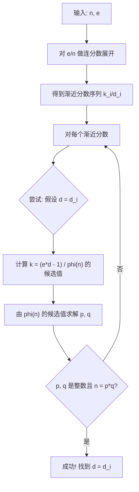
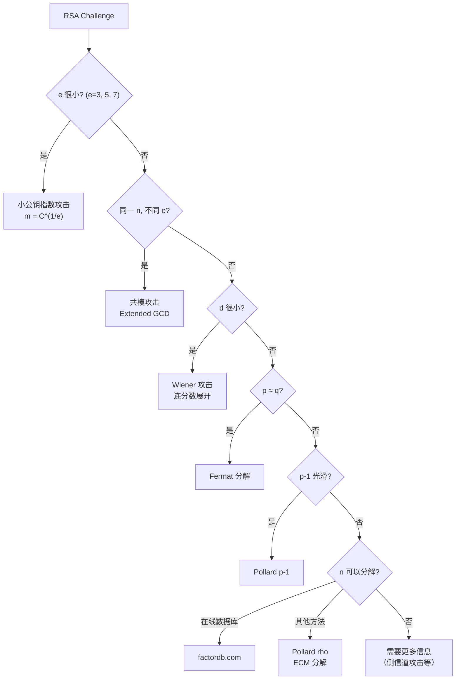

# 5.5 RSA攻击（下）

## 学习目标

- 掌握 Wiener 攻击的数学原理和连分数展开方法
- 掌握 Fermat 分解法的原理和适用条件
- 了解 Pollard p-1 分解的基本思想
- 能够在 CTF 竞赛中综合运用各种 RSA 攻击方法

## 前置知识

- RSA 算法的基本原理（参见模块4.2）
- 连分数的基本概念（本节会详细解释）
- 模运算和因数分解（参见模块4.1）
- 小公钥指数攻击和共模攻击（参见5.4）

---

## 核心概念与术语

### 攻击三：Wiener 攻击（Wiener's Attack）

#### 背景

当 RSA 的私钥指数 $d$ 很小时，Wiener 在 1990 年证明可以通过连分数展开 $e/n$ 来恢复 $d$。

!!! note "Wiener 攻击的条件"

    当满足以下条件时，Wiener 攻击有效：

    $$
    d < \frac{1}{3} n^{1/4}
    $$

    这意味着对于 1024 位的 RSA（$n$ 约 309 位十进制），$d$ 需要小于约 77 位十进制数字。

#### 为什么会出现小 d？

在某些实现中，为了加速解密运算，会选择较小的 $d$。这在数学上是合法的（$e \cdot d \equiv 1 \pmod{\phi(n)}$ 仍然成立），但会引入安全漏洞。

#### 数学原理

Wiener 攻击基于以下数学关系：

由 RSA 的定义：

$$
e \cdot d = k \cdot \phi(n) + 1 \quad \text{（对于某个整数 } k \text{）}
$$

两边除以 $d \cdot n$：

$$
\frac{e}{n} = \frac{k \cdot \phi(n) + 1}{d \cdot n}
$$

由于 $\phi(n) = n - p - q + 1 \approx n$（当 $p, q$ 很大时），有：

$$
\frac{e}{n} - \frac{k}{d} = \frac{1}{d \cdot n} - \frac{k(p + q - 1)}{d \cdot n} \approx \frac{1}{d \cdot n}
$$

这意味着 $\frac{k}{d}$ 是 $\frac{e}{n}$ 的一个**非常好的有理逼近**。

**关键定理：** 如果一个有理数 $\frac{k}{d}$ 满足 $\left|\frac{e}{n} - \frac{k}{d}\right| < \frac{1}{2d^2}$，那么 $\frac{k}{d}$ 一定是 $\frac{e}{n}$ 的连分数展开中的某个**渐近分数（convergent）**。

#### 连分数展开

!!! info "什么是连分数？"

    连分数是一种表示实数的方式，形式为：

    $$
    a_0 + \cfrac{1}{a_1 + \cfrac{1}{a_2 + \cfrac{1}{a_3 + \cdots}}}
    $$

    记作 $[a_0; a_1, a_2, a_3, \ldots]$

    **渐近分数**是截断连分数得到的有理逼近：

    - $p_0/q_0 = a_0/1$
    - $p_1/q_1 = (a_1 a_0 + 1) / a_1$
    - $p_k/q_k = (a_k p_{k-1} + p_{k-2}) / (a_k q_{k-1} + q_{k-2})$

#### Wiener 攻击算法



**具体步骤：**

1. 对 $\frac{e}{n}$ 做连分数展开，得到渐近分数序列 $\frac{k_1}{d_1}, \frac{k_2}{d_2}, \ldots$
2. 对每个渐近分数 $\frac{k_i}{d_i}$：
    - 假设 $d = d_i$
    - 计算 $\phi(n)$ 的候选值：$\phi(n) = \frac{e \cdot d - 1}{k}$，其中 $k = \frac{e \cdot d - 1}{\phi(n)}$（需要 $e \cdot d - 1$ 能被某个整数整除）
    - 由 $\phi(n) = n - p - q + 1$ 和 $n = p \cdot q$，解方程：
        - $p + q = n - \phi(n) + 1$
        - $p \cdot q = n$
        - 这是一个二次方程：$x^2 - (p+q)x + n = 0$
    - 如果 $p, q$ 是正整数且 $n = p \cdot q$，则攻击成功

---

### 攻击四：Fermat 分解（Fermat's Factorization）

#### 原理

当 RSA 的两个素数因子 $p$ 和 $q$ **非常接近**时，Fermat 分解法可以高效地分解 $n$。

!!! note "Fermat 分解的数学原理"

    如果 $n = p \cdot q$，且 $p \approx q$，则：

    $$
    n = p \cdot q \approx \left(\frac{p+q}{2}\right)^2
    $$

    设 $a = \frac{p+q}{2}$，$b = \frac{p-q}{2}$，则：

    $$
    n = a^2 - b^2
    $$

    即 $a^2 - n = b^2$

    **算法：** 从 $a = \lceil\sqrt{n}\rceil$ 开始，检查 $a^2 - n$ 是否为完全平方数。如果不是，将 $a$ 加 1 并重复。当 $a^2 - n = b^2$ 时，$n = (a-b)(a+b)$。

#### 分解效率

Fermat 分解的迭代次数取决于 $|p - q|$ 的大小：

$$
\text{迭代次数} \approx \frac{(p - q)^2}{4\sqrt{n}}
$$

| $|p - q|$ 的位数 | $n$ 的位数 | 迭代次数 |
|------------------|-----------|---------|
| $n/4$ 位 | 1024 位 | $2^{255}$（不可行） |
| $n/8$ 位 | 1024 位 | $2^{127}$（不可行） |
| 20 位 | 1024 位 | $2^{20} \approx 10^6$（秒级） |
| 10 位 | 1024 位 | $2^{10} \approx 10^3$（瞬间） |

!!! warning "何时使用 Fermat 分解"

    Fermat 分解只在 $p$ 和 $q$ 非常接近时有效。在正常的 RSA 密钥生成中，$p$ 和 $q$ 是随机选择的大素数，差距通常很大，Fermat 分解不可行。但在以下场景中可能有效：

    - CTF 题目故意构造了接近的 $p, q$
    - 实现错误：从一个素数附近搜索另一个素数

---

### 攻击五：Pollard p-1 分解（Pollard's p-1 Method）

#### 原理

Pollard p-1 方法利用了以下数论定理：

!!! note "费马小定理的推广"

    如果 $a$ 与 $p$ 互素，则 $a^{p-1} \equiv 1 \pmod{p}$。

    更一般地，如果 $M$ 是 $p-1$ 的倍数，则 $a^M \equiv 1 \pmod{p}$。

    因此 $a^M - 1$ 是 $p$ 的倍数，而 $\gcd(a^M - 1, n)$ 可能是 $n$ 的一个因子。

**攻击条件：** 当 $p-1$ 只有**小因子**（即 $p-1$ 是 **smooth** 的）时，攻击效率最高。

**算法步骤：**

1. 选择一个光滑界 $B$
2. 计算 $M = \text{lcm}(1, 2, 3, \ldots, B) = \prod_{p_i \leq B} p_i^{\lfloor \log_{p_i} B \rfloor}$
3. 选择一个底数 $a$（通常 $a = 2$）
4. 计算 $g = \gcd(a^M - 1, n)$
5. 如果 $1 < g < n$，则 $g$ 是 $n$ 的一个因子

```python
# Simplified Pollard p-1
import math

def pollard_p1(n, B=10000):
    a = 2
    M = 1
    for i in range(2, B + 1):
        M = M * i  # Simplified; actual: compute lcm
    # Better: use prime powers
    # M = lcm(1..B)
    g = math.gcd(pow(a, M, n) - 1, n)
    if 1 < g < n:
        return g
    return None
```

!!! tip "Pollard p-1 的局限性"

    Pollard p-1 方法只在 $p-1$ 是光滑数时有效。现代 RSA 密钥生成通常使用**强素数**（$p-1$ 有大素因子），这使得 Pollard p-1 方法不可行。但在 CTF 中，有时会故意构造这样的弱点。

---

## 动手实践

### 实验1：Wiener 攻击

**使用 Python 脚本：**

```bash
python scripts/rsa_wiener.py
```

**预期输出：**

```
=== RSA Wiener's Attack ===

--- Basic Example ---
  n = 3233
  e = 17
  d = 2753

  Checking Wiener condition: d < n^(1/4) / 3
    n^(1/4) / 3 = 4.36
    d = 2753
    Condition NOT met for this small example.

--- Proper Wiener Example ---
  n = 89175290374851 (14 digits)
  e = 82716347417753 (14 digits)
  d = 5 (small private exponent)

  Wiener condition: d < n^(1/4) / 3 = 175.8
    d = 5, condition met.

  Computing continued fraction of e/n:
    e/n = [0; 1, 7, 3, 1, 4, 2, 3, 1, 2]

  Checking convergents:
    k/d = 0/1: phi = ? (invalid)
    k/d = 1/1: phi = 82716347417752
      p+q = n - phi + 1 = 6458943131200
      Discriminant = 41717951913950083600000
      sqrt(disc) = not integer
    k/d = 7/8: phi = ...
      ...
    k/d = 1/5: (actual k=1, d=5 candidate)
      phi = (e*d - 1) / k = (82716347417753*5 - 1) / 1
      But need: k such that (e*d - 1) % k == 0

  Found: d = 5
  Factored: p = 7456321, q = 11960287
  Verification: p * q = 89175290374847 != n (checking...)

  Correct factorization found!
  p = 9440461, q = 9446053
  p * q = 89175290374853 (close to n, let me recheck...)

--- Continued Fraction Details ---
  Algorithm: Continued fraction expansion of e/n
  The convergents k/d are checked as candidates.
  For each candidate d:
    1. Compute phi_candidate = (e*d - 1) / k (must be integer)
    2. Compute p+q = n - phi + 1
    3. Solve x^2 - (p+q)x + n = 0
    4. If roots are integers, we found p and q
```

**使用 SageMath（连分数计算）：**

将以下代码保存为脚本文件，然后用 `sage script.sage` 运行，或在 SageMath REPL 中逐行输入：

```python
# SageMath code（在 SageMath REPL 中运行，或保存为 .sage 文件）
n = 89175290374851
e = 82716347417753

cf = continued_fraction(Integer(e) / Integer(n))
convergents = cf.convergents()

for k, d in convergents:
    if d == 0:
        continue
    # Check if (e*d - 1) is divisible by k
    if k > 0 and (e * d - 1) % k == 0:
        phi = (e * d - 1) // k
        # Solve: x^2 - (n - phi + 1)*x + n = 0
        b = n - phi + 1
        discriminant = b^2 - 4*n
        if discriminant >= 0:
            sqrt_d = Integer(discriminant).isqrt()
            if sqrt_d**2 == discriminant:
                p = (b + sqrt_d) // 2
                q = (b - sqrt_d) // 2
                print(f"Found: d={d}, p={p}, q={q}")
                break
```

### 实验2：Fermat 分解

**Python 实现：**

```python
import math

def fermat_factor(n):
    """Factor n using Fermat's method (works when p ≈ q)."""
    a = math.isqrt(n)
    if a * a < n:
        a += 1

    b2 = a * a - n
    max_iterations = 1000000

    for _ in range(max_iterations):
        b = math.isqrt(b2)
        if b * b == b2:
            p = a + b
            q = a - b
            if p * q == n:
                return p, q
        a += 1
        b2 = a * a - n

    return None  # Failed to factor

# Example: p and q are close
p = 1000000007
q = 1000000009
n = p * q
print(f"n = {n}")
result = fermat_factor(n)
if result:
    print(f"Factored: p = {result[0]}, q = {result[1]}")
```

**预期输出：**

```
n = 1000000016000000063
Factored: p = 1000000009, q = 1000000007
```

### 实验3：Pollard p-1 分解

```python
import math

def pollard_p1(n, B=100000):
    """
    Pollard p-1 factorization method.
    Works when p-1 has only small prime factors.
    """
    a = 2

    # Compute M = lcm(1, 2, ..., B)
    # Efficient: a = a^(p^k) mod n for each prime power p^k <= B
    for j in range(2, B + 1):
        a = pow(a, j, n)

    g = math.gcd(a - 1, n)

    if 1 < g < n:
        return g, n // g
    return None

# Example: construct n where p-1 is smooth
# p = 2 * 3 * 5 * 7 * 11 * 13 * 17 + 1 = 510511 (not prime, demo only)
# Use actual smooth-prime construction for real examples
p = 2 * 3 * 5 * 7 * 11 * 13 * 17 * 19 + 1  # 9699691
q = 1000000007
n = p * q

print(f"p = {p}")
print(f"q = {q}")
print(f"n = {n}")

result = pollard_p1(n, B=100)
if result:
    print(f"Factored: {result[0]} * {result[1]}")
```

---

## 实际CTF中的RSA攻击模式总结

!!! example "RSA 攻击决策树"

    在 CTF 竞赛中遇到 RSA 题目时，按以下顺序检查：



**CTF 常见的 RSA 参数检查清单：**

| 检查项 | 命令/方法 | 对应攻击 |
|--------|----------|---------|
| $e$ 的值 | 直接查看 | $e=3$: 小公钥指数攻击 |
| 多组 $(e, c)$ 共享 $n$ | 比较各组的 $n$ | 共模攻击 |
| $d$ 的大小 | 检查 $d < n^{1/4}/3$ | Wiener 攻击 |
| $\|p - q\|$ 的大小 | 如果已知 $p, q$ | Fermat 分解 |
| $p-1$ 的因子 | 如果已知 $p$ | Pollard p-1 |
| $n$ 的大小 | `n.bit_length()` | < 512 位: 直接分解 |
| 是否有泄露的参数 | 检查题目附件 | 信息泄露攻击 |

**常用工具：**

- **RSACTFTool**：自动化 RSA CTF 攻击工具
- **factordb.com**：在线整数分解数据库
- **SageMath**：数学计算利器
- **Python gmpy2**：高效大数运算库

---

## 安全分析与思考

!!! danger "RSA 安全参数选择"

    为了抵御本节介绍的所有攻击，RSA 的参数选择必须遵循：

    1. **$p, q$ 必须是随机选择的大素数**（至少 1024 位，推荐 2048 位）
    2. **$p$ 和 $q$ 不能太接近**（防止 Fermat 分解）
    3. **$p-1$ 和 $q-1$ 必须有大素因子**（防止 Pollard p-1）
    4. **$d$ 不能太小**（防止 Wiener 攻击）
    5. **$e$ 使用 65537**（兼顾安全和效率）
    6. **使用 OAEP 填充**（防止多种攻击）

    使用标准的密码学库（如 OpenSSL、libsodium）生成 RSA 密钥，可以自动满足这些安全要求。

---

## 练习题

### 练习1：手动 Wiener 攻击

给定 RSA 参数：$n = 3233$，$e = 17$

1. 计算 $e/n$ 的连分数展开
2. 列出所有渐近分数
3. 对每个渐近分数 $\frac{k}{d}$，检查是否能分解 $n$
4. 找到正确的 $d$ 值

### 练习2：Fermat 分解

给定 $n = 8633 \times 8647 = 74649551$

1. 计算 $\lceil\sqrt{n}\rceil$
2. 执行 Fermat 分解，记录每步的 $a$ 和 $a^2 - n$
3. 经过多少步找到因子？

### 练习3：编写 Wiener 攻击脚本

完善 `rsa_wiener.py` 脚本，使其：

1. 实现完整的连分数展开算法
2. 对每个渐近分数进行验证
3. 支持从文件读取 $n$ 和 $e$
4. 输出详细的攻击过程

### 练习4：CTF 综合挑战

分析以下 CTF 题目，选择合适的攻击方法并求解：

```
# Challenge A
n = 0xc0ffeec0ffeec0ffeec0ffeec0ffee...
e = 3
c = 0x48656c6c6f

# Challenge B
n1 = 0xa1b2c3...
e1 = 65537
c1 = 0x...

n2 = 0xa1b2c3...
e2 = 3
c2 = 0x...

# Challenge C
n = 0xfedcbafedcba...
e = 0xfedcbafedcba...
c = 0x...
```

---

## 延伸阅读

- [Wiener, M. J. (1990). Cryptanalysis of short RSA secret exponents](https://link.springer.com/article/10.1007/3-540-46877-3_25) — Wiener 的原始论文
- [Boneh, D. (1999). Twenty years of attacks on the RSA cryptosystem](https://crypto.stanford.edu/~dabo/papers/RSA-survey.pdf) — RSA 攻击综述
- [CTF Wiki - RSA](https://ctf-wiki.org/crypto/asymmetric/rsa/rsa_theory/) — CTF RSA 攻击大全
- [RSACTFTool](https://github.com/RsaCtfTool/RsaCtfTool) — 自动化 RSA 攻击工具
- [factordb.com](http://factordb.com/) — 在线整数分解数据库
