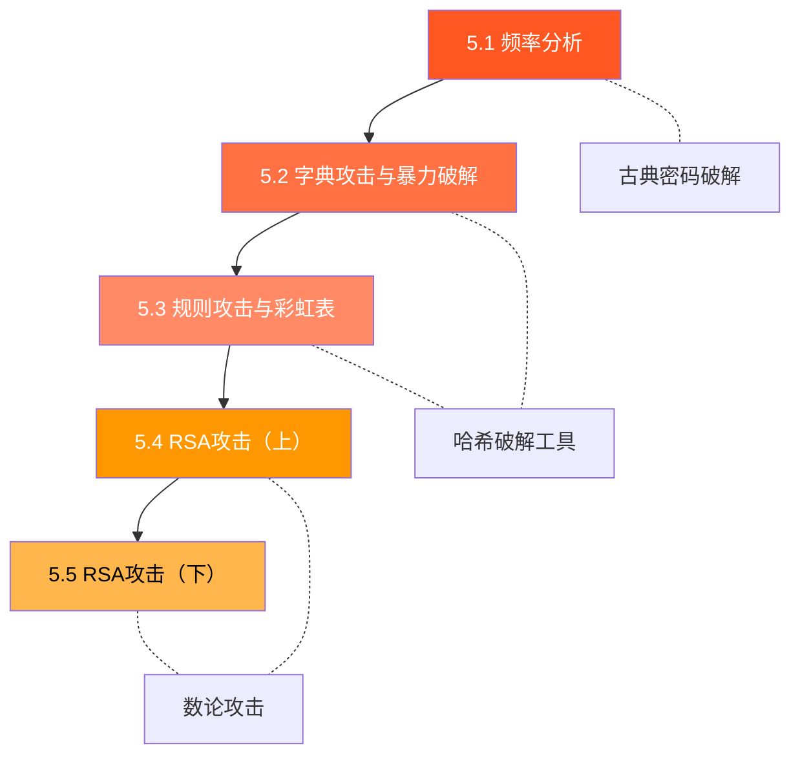

# :material-sword-cross: 模块5 — 密码破解实战

> **Cryptanalysis in Practice**

理解密码系统的安全性，最好的方式就是亲自尝试破解它。本模块将带你从古典密码的频率分析出发，逐步深入到现代哈希破解工具的实战使用，最终探索 RSA 算法的多种数学攻击方法。

---

## :material-map: 本模块内容

---

## :material-school: 主题列表

| # | 主题 | 关键词 | 难度 |
|---|------|--------|------|
| 5.1 | [频率分析](01-frequency.md) | 单表替换、字母频率、Bigram | ⭐⭐ |
| 5.2 | [字典攻击与暴力破解](02-dictionary.md) | hashcat、John the Ripper、MD5 | ⭐⭐⭐ |
| 5.3 | [规则攻击与彩虹表](03-rules.md) | 变换规则、预计算、盐值 | ⭐⭐⭐ |
| 5.4 | [RSA攻击（上）](04-rsa-attacks-1.md) | 小公钥指数、共模攻击 | ⭐⭐⭐⭐ |
| 5.5 | [RSA攻击（下）](05-rsa-attacks-2.md) | Wiener攻击、Fermat分解、Pollard | ⭐⭐⭐⭐⭐ |

---

## :material-tools: 本模块使用的工具

=== "hashcat"

    **GPU 加速的密码哈希破解工具**

    - 路径：`F:\Users\code_data\vibe\cryptography_learn\hashcat-7.1.2\hashcat.exe`
    - 支持 300+ 种哈希类型
    - 支持字典攻击、暴力破解、规则攻击等多种模式

=== "John the Ripper"

    **经典密码破解工具**

    - 路径：`F:\Users\code_data\vibe\cryptography_learn\john-1.9.0-jumbo-1-win64\run\john.exe`
    - 自动检测哈希格式
    - 支持增量模式和字典模式

=== "CyberChef"

    **Web 端编码分析瑞士军刀**

    - 路径：`F:\Users\code_data\vibe\cryptography_learn\CyberChef_v10.19.4\CyberChef_v10.19.4.html`
    - 浏览器中打开即可使用
    - 内置频率分析、编码转换等功能

=== "Python"

    **脚本编写与数学计算**

    - 用于编写自定义攻击脚本
    - `gmpy2` 库支持大数运算
    - `pycryptodome` 库提供密码学原语

---

## :material-school: 学习目标

完成本模块后，你将能够：

- [ ] 理解频率分析的原理，并能用 Python 脚本破解单表替换密码
- [ ] 使用 hashcat 和 John the Ripper 进行字典攻击和暴力破解
- [ ] 理解规则攻击和彩虹表的工作原理
- [ ] 掌握 RSA 的小公钥指数攻击和共模攻击
- [ ] 掌握 RSA 的 Wiener 攻击、Fermat 分解和 Pollard p-1 分解
- [ ] 在 CTF 竞赛中识别并应用常见的 RSA 攻击模式

---

!!! warning "安全声明"

    本模块中的所有密码破解技术**仅用于教育和授权测试目的**。未经授权对他人系统进行密码破解是违法行为。请在合法的实验环境中练习这些技术。

---

## :material-book-open: 前置知识

在开始本模块之前，你应该已经完成：

- **模块1**：了解古典密码（凯撒密码、替换密码、维吉尼亚密码）的基本原理
- **模块2**：理解哈希函数的特性（单向性、抗碰撞性）
- **模块3**：了解对称加密的基本概念
- **模块4**：掌握 RSA 算法的加解密流程和数论基础（模运算、欧拉函数、扩展欧几里得算法）
