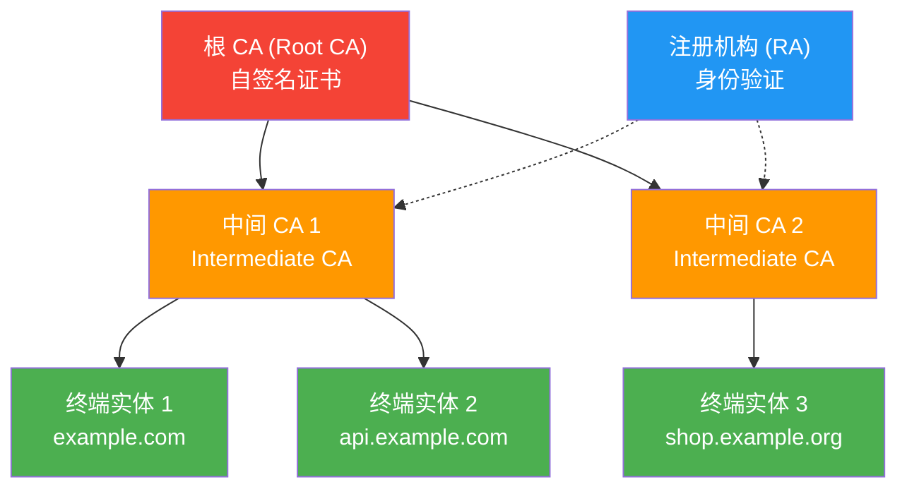
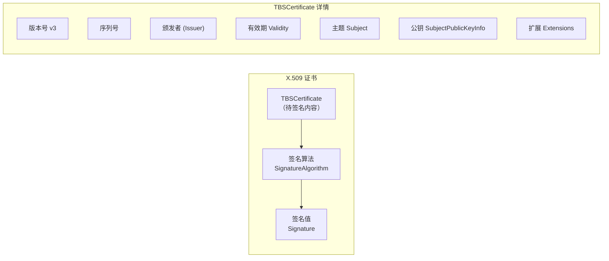
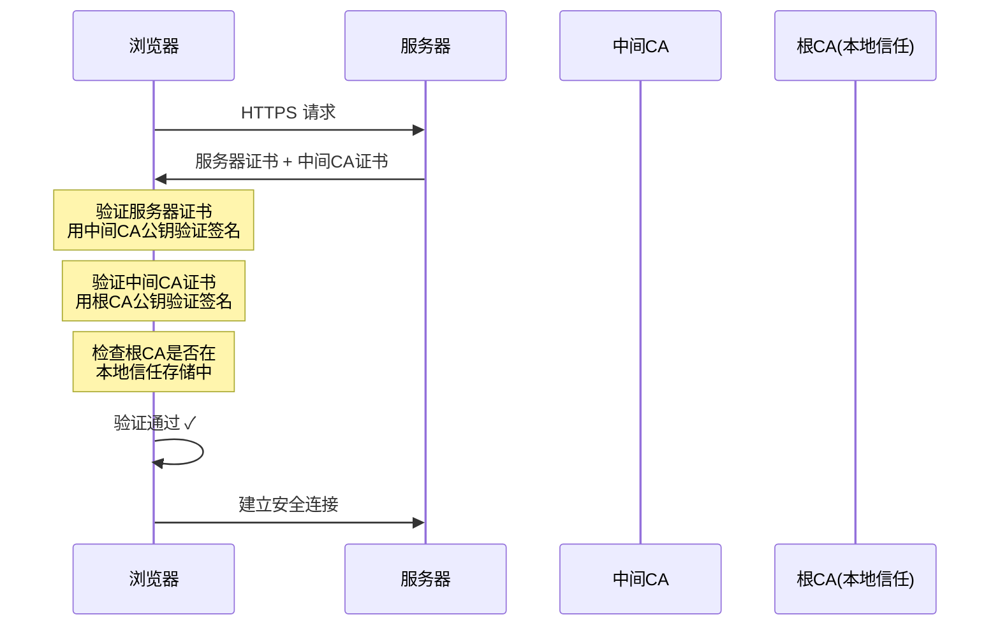

# 6.2 PKI与X.509证书体系

## 学习目标

- 理解为什么需要 PKI（公钥基础设施）以及它解决的核心问题
- 掌握 PKI 体系中各角色的职责：CA、RA、终端实体
- 理解 X.509 证书的结构和各字段含义
- 能够使用 OpenSSL 创建自签名证书和 CA 签发的证书
- 了解证书链的验证过程和 Let's Encrypt 的工作原理

## 前置知识

- 数字签名原理（6.1 节）
- 公钥/私钥概念（模块4）
- 哈希函数（模块2）

## 核心概念与术语

### 为什么需要 PKI？

在数字签名一节中，我们学习了如何用私钥签名、公钥验证。但这里存在一个关键问题：

> **你怎么知道某个公钥真的属于它声称的所有者？**

想象这个场景：

1. Alice 想给 Bob 发送加密消息
2. Alice 在网上找到了"Bob 的公钥"
3. 但这个公钥可能是 Eve 伪造的！
4. Alice 用 Eve 的公钥加密消息
5. Eve 截获消息并用自己的私钥解密

这就是 **公钥绑定问题** —— PKI 的核心就是解决这个问题。

!!! info "PKI 的核心任务"
    PKI（Public Key Infrastructure，公钥基础设施）的核心任务是：**将公钥与身份安全地绑定在一起**。

### PKI 体系架构



#### 各角色职责

| 角色 | 全称 | 职责 |
|------|------|------|
| **根 CA** | Root Certificate Authority | 信任锚点，签发中间 CA 证书 |
| **中间 CA** | Intermediate CA | 签发终端实体证书，隔离根 CA 风险 |
| **RA** | Registration Authority | 验证申请者身份，向 CA 推荐签发 |
| **终端实体** | End Entity | 持有证书的服务器、用户或设备 |

!!! warning "根 CA 的安全性"
    根 CA 的私钥是最关键的信任锚。一旦泄露，整个 PKI 体系崩溃。因此：

    - 根 CA 通常离线存储（air-gapped）
    - 使用硬件安全模块（HSM）保护私钥
    - 根 CA 证书有效期通常 10-20 年
    - 中间 CA 有效期较短（1-5 年），便于轮换

### X.509 证书结构

X.509 是最广泛使用的公钥证书标准。每个证书本质上是一个经 CA 数字签名的数据结构。



#### 证书字段详解

| 字段 | 说明 | 示例 |
|------|------|------|
| **Version** | 证书版本（通常 v3） | v3 (0x2) |
| **Serial Number** | CA 分配的唯一序列号 | `0x04:f2:a3:...` |
| **Signature Algorithm** | CA 签名使用的算法 | SHA256WithRSA |
| **Issuer** | 颁发者（CA 的 DN） | `CN=Let's Encrypt Authority` |
| **Validity** | 有效期（Not Before / Not After） | 2024-01-01 ~ 2024-04-01 |
| **Subject** | 证书持有者的 DN | `CN=example.com` |
| **Subject Public Key** | 持有者的公钥 | RSA 2048-bit key |
| **Extensions** | 扩展信息（v3 特有） | Key Usage, SAN, ... |
| **Signature** | CA 对以上内容的数字签名 | 256-byte RSA signature |

#### 关键扩展字段

| 扩展 | OID | 说明 |
|------|-----|------|
| **Subject Alternative Name (SAN)** | 2.5.29.17 | 域名列表（现代浏览器主要检查此字段） |
| **Key Usage** | 2.5.29.15 | 密钥用途（数字签名、密钥加密等） |
| **Extended Key Usage** | 2.5.29.37 | 扩展用途（服务器认证、客户端认证等） |
| **Basic Constraints** | 2.5.29.19 | 是否为 CA 证书、路径长度限制 |
| **CRL Distribution Points** | 2.5.29.31 | 证书吊销列表地址 |
| **Authority Info Access** | 1.3.6.1.5.5.7.1.1 | CA 信息和 OCSP 地址 |

### 证书链验证

当客户端（如浏览器）收到一个服务器证书时，需要沿着证书链向上验证，直到找到信任的根 CA。

**验证步骤：**

1. 检查服务器证书的签名是否由中间 CA 的公钥验证通过
2. 检查中间 CA 证书的签名是否由根 CA 的公钥验证通过
3. 检查根 CA 是否在本地信任存储中
4. 检查每个证书的有效期
5. 检查证书是否被吊销（CRL 或 OCSP）
6. 检查证书的用途是否匹配



### Let's Encrypt 与 ACME 协议

Let's Encrypt 是一个免费、自动化的证书颁发机构，彻底改变了 Web 加密的普及程度。

**ACME (Automatic Certificate Management Environment)** 协议的核心流程：

1. **注册账号**：服务器向 Let's Encrypt 注册一个 ACME 账号
2. **申请证书**：提交证书签名请求（CSR）
3. **域名验证**：Let's Encrypt 通过 HTTP-01 或 DNS-01 挑战验证域名控制权
4. **签发证书**：验证通过后签发证书（有效期 90 天）
5. **自动续期**：通过 certbot 等工具自动续期

!!! tip "域名验证方式"

    === "HTTP-01"

        Let's Encrypt 向 `http://example.com/.well-known/acme-challenge/<token>` 发送请求，服务器必须返回指定的内容。

    === "DNS-01"

        申请者在 DNS 中添加一条 `_acme-challenge.example.com` TXT 记录。适用于通配符证书。

## 动手实践

### 实验1：创建自签名 CA 和服务器证书

**Step 1：创建根 CA**

```bash
# 生成 CA 私钥
openssl genrsa -out ca_key.pem 2048

# 创建自签名 CA 证书（有效期 10 年）
openssl req -x509 -new -key ca_key.pem -out ca_cert.pem \
    -days 3650 -subj "/C=CN/ST=Beijing/O=MyCA/CN=My Root CA"
```

**Step 2：创建服务器密钥和证书签名请求（CSR）**

```bash
# 生成服务器私钥
openssl genrsa -out server_key.pem 2048

# 创建 CSR
openssl req -new -key server_key.pem -out server.csr \
    -subj "/C=CN/ST=Beijing/O=Example Inc/CN=example.com"

# 查看 CSR 内容
openssl req -in server.csr -text -noout | head -20
```

**Step 3：CA 签发服务器证书**

```bash
# 创建扩展文件（添加 SAN）
cat > server_ext.cnf << EOF
[v3_req]
subjectAltName = DNS:example.com,DNS:www.example.com
keyUsage = digitalSignature, keyEncipherment
extendedKeyUsage = serverAuth
EOF

# CA 签发证书
openssl x509 -req -in server.csr -CA ca_cert.pem -CAkey ca_key.pem \
    -CAcreateserial -out server_cert.pem -days 365 \
    -extfile server_ext.cnf -extensions v3_req
```

**Step 4：查看和验证证书**

```bash
# 查看服务器证书详情
openssl x509 -in server_cert.pem -text -noout

# 验证证书链
openssl verify -CAfile ca_cert.pem server_cert.pem

# 查看证书有效期
openssl x509 -in server_cert.pem -dates -noout
```

预期输出：

```console
Certificate:
    Data:
        Version: 3 (0x2)
        Serial Number:
            04:f2:a3:...
    Signature Algorithm: sha256WithRSAEncryption
        Issuer: C=CN, ST=Beijing, O=MyCA, CN=My Root CA
        Validity
            Not Before: Jan  1 00:00:00 2024 GMT
            Not After : Jan  1 00:00:00 2025 GMT
        Subject: C=CN, ST=Beijing, O=Example Inc, CN=example.com
        ...
            X509v3 Subject Alternative Name:
                DNS:example.com, DNS:www.example.com
```

### 实验2：查看真实网站的证书

```bash
# 连接 Google 并查看证书
openssl s_client -connect google.com:443 -servername google.com </dev/null 2>/dev/null | \
    openssl x509 -text -noout
```

```bash
# 仅查看关键信息
openssl s_client -connect google.com:443 -servername google.com </dev/null 2>/dev/null | \
    openssl x509 -noout -subject -issuer -dates -ext subjectAltName
```

预期输出（示例）：

```console
subject=CN = www.google.com
issuer=C = US, O = Google Trust Services LLC, CN = GTS CA 1C3
notBefore=Nov 20 08:45:15 2024 GMT
notAfter=Feb 12 08:45:14 2025 GMT
X509v3 Subject Alternative Name:
    DNS:www.google.com, DNS:*.google.com, ...
```

### 实验3：证书吊销检查

```bash
# 查看证书的 CRL 分发点
openssl x509 -in server_cert.pem -noout -ext crlDistributionPoints

# 查看 OCSP 响应器地址
openssl x509 -in server_cert.pem -noout -ext authorityInfoAccess
```

```bash
# 对真实网站执行 OCSP 检查
# 1. 获取服务器证书和中间CA证书
openssl s_client -connect google.com:443 -servername google.com \
    -showcerts </dev/null 2>/dev/null > chain.pem

# 2. 提取 OCSP URI
openssl x509 -in chain.pem -noout -ocsp_uri

# 3. 发送 OCSP 请求
openssl ocsp -issuer chain.pem -cert chain.pem \
    -url <OCSP_URI> -resp_text
```

## 安全分析与思考

### PKI 的信任模型

PKI 采用 **层次化信任模型**，其安全性依赖于以下假设：

1. 根 CA 的私钥绝对安全
2. 中间 CA 遵守安全策略
3. 域名验证是充分的身份证明

**已知的安全事件：**

| 事件 | 年份 | 影响 |
|------|------|------|
| DigiNotar 入侵 | 2011 | 攻击者签发了 google.com 的伪造证书 |
| Symantec 证书问题 | 2015-2017 | 多次违规签发，最终被所有主要浏览器不信任 |
| Let's Encrypt 证书召回 | 2020 | 因验证 bug 召回 300 万张证书 |

### 证书透明度 (Certificate Transparency)

为防止恶意 CA 签发未经授权的证书，业界引入了 **证书透明度 (CT)** 机制：

- 所有公开信任的证书必须记录在公开的 CT 日志中
- 域名所有者可以监控是否有未经授权的证书被签发
- 浏览器要求新签发的证书必须包含 SCT（Signed Certificate Timestamp）

### Certificate Pinning

一些高安全场景使用 **证书固定** 来限制可接受的 CA：

- 仅信任特定的 CA 或特定的公钥
- Google Chrome 曾使用 HPKP（已废弃）
- 移动应用常用证书固定来防止 MITM 攻击

## 练习题

1. **概念题**：解释为什么根 CA 通常离线存储，而中间 CA 在线运行？

2. **实验题**：使用 OpenSSL 创建一个完整的三级证书链（根 CA → 中间 CA → 服务器证书），并验证整个链条。

3. **分析题**：查看你常用网站的证书（如 `github.com`），记录以下信息：
   - 颁发者（Issuer）
   - 有效期
   - 证书链长度
   - 使用的签名算法
   - SAN 列表中的域名

4. **安全题**：如果一个 CA 被攻破（私钥泄露），攻击者可以做什么？证书透明度如何帮助检测这种攻击？

5. **研究题**：了解 Certificate Authority Authorization (CAA) DNS 记录，解释它如何限制哪些 CA 可以为特定域名签发证书。

## 延伸阅读

- [RFC 5280 - Internet X.509 PKI Certificate and CRL Profile](https://datatracker.ietf.org/doc/html/rfc5280)
- [RFC 8555 - Automatic Certificate Management Environment (ACME)](https://datatracker.ietf.org/doc/html/rfc8555)
- [Let's Encrypt How It Works](https://letsencrypt.org/how-it-works/)
- [Certificate Transparency RFC 6962](https://datatracker.ietf.org/doc/html/rfc6962)
- [Mozilla's Included CA Certificate List](https://wiki.mozilla.org/CA)
