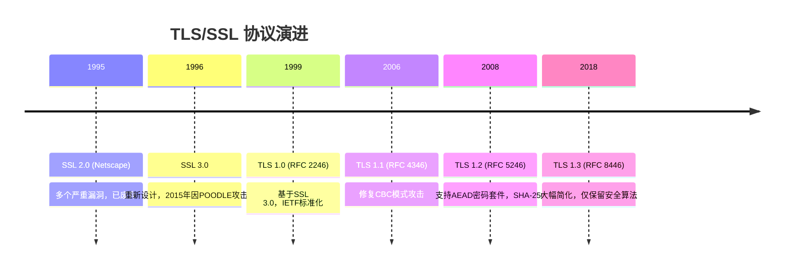
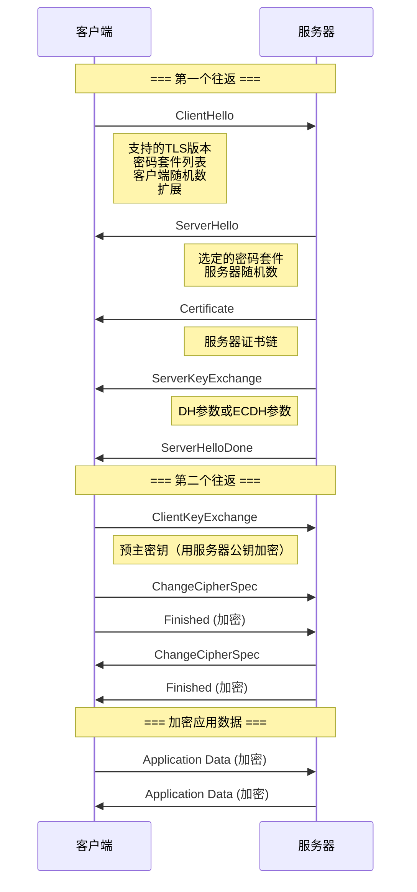
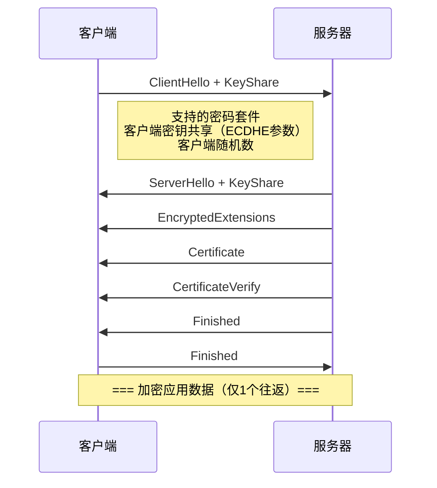
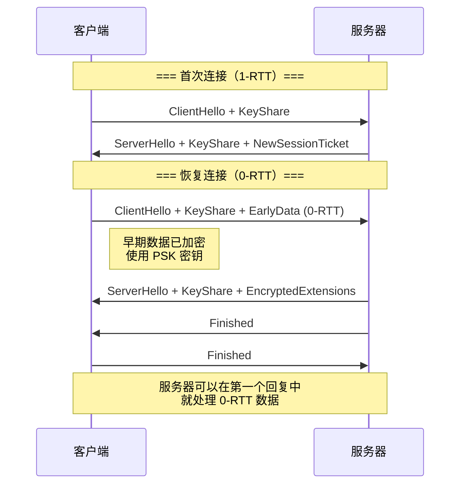

# 6.3 TLS/SSL协议分析

## 学习目标

- 了解 TLS/SSL 协议的历史演进及其安全改进
- 深入理解 TLS 1.2 的完整握手过程
- 掌握 TLS 1.3 的关键改进：1-RTT 握手、移除弱算法、0-RTT 恢复
- 能够使用 OpenSSL 分析 TLS 连接和密码套件
- 了解历史上的重大 TLS 漏洞及其教训

## 前置知识

- 对称加密与非对称加密（模块3、模块4）
- 数字签名（6.1 节）
- PKI 与证书（6.2 节）
- Diffie-Hellman 密钥交换（模块4）

## 核心概念与术语

### TLS 协议的历史

TLS（Transport Layer Security）是保护互联网通信最重要的协议。每次你看到浏览器地址栏的锁头图标，背后就是 TLS 在工作。



### TLS 的分层架构

TLS 协议由多个子协议组成：

| 子协议 | 功能 | 说明 |
|--------|------|------|
| **Handshake Protocol** | 握手协议 | 协商密码套件、验证身份、交换密钥 |
| **Record Protocol** | 记录协议 | 加密和分片应用数据 |
| **Alert Protocol** | 警报协议 | 传输错误和关闭通知 |
| **ChangeCipherSpec** | 变更密码规范 | 信号切换到加密通信（TLS 1.2） |

### TLS 1.2 握手过程

TLS 1.2 的完整握手需要 **两个往返（2-RTT）**：



#### 握手各步骤详解

**1. ClientHello**

客户端向服务器发送：

- 支持的 TLS 版本
- 客户端随机数（32 字节，用于密钥生成）
- 支持的密码套件列表（按优先级排序）
- 扩展列表（SNI、ALPN 等）

**2. ServerHello**

服务器选择并回复：

- 协商的 TLS 版本
- 服务器随机数（32 字节）
- 选定的密码套件
- 选定的扩展

**3. Certificate**

服务器发送证书链（服务器证书 + 中间 CA 证书）。

**4. ServerKeyExchange**

发送密钥交换参数（取决于密码套件）：

- **ECDHE**：椭圆曲线参数和临时公钥
- **DHE**：DH 参数和临时公钥
- **RSA**：此步骤省略（直接用证书中的公钥加密预主密钥）

**5. ClientKeyExchange**

客户端发送密钥交换材料：

- ECDHE/DHE：客户端的临时公钥
- RSA：用服务器公钥加密的预主密钥

**6. ChangeCipherSpec**

通知对方后续消息将使用协商的密钥和算法加密。

**7. Finished**

第一个加密消息，包含所有握手消息的哈希值，用于验证握手完整性。

#### 密钥派生

TLS 1.2 使用 **PRF (Pseudorandom Function)** 从预主密钥派生会话密钥：

$$
\text{master\_secret} = \text{PRF}(\text{pre\_master\_secret}, \text{"master secret"}, \text{ClientRandom} + \text{ServerRandom})
$$

然后派生：

$$
\text{key\_block} = \text{PRF}(\text{master\_secret}, \text{"key expansion"}, \text{ServerRandom} + \text{ClientRandom})
$$

从中提取：客户端写 MAC 密钥、服务器写 MAC 密钥、客户端写加密密钥、服务器写加密密钥、客户端写 IV、服务器写 IV。

### TLS 1.3 的关键改进

TLS 1.3 是一次重大升级，带来了显著的安全性和性能提升。

#### 1. 简化握手：1-RTT



**关键变化**：

- 密钥共享（KeyShare）在第一条消息中就发送
- 服务器在 ServerHello 之后的消息全部加密
- 证书也加密传输（增强隐私）

#### 2. 移除不安全的算法

TLS 1.3 **仅保留**以下密码学原语：

| 类型 | 保留的算法 |
|------|-----------|
| 密钥交换 | ECDHE、DHE（仅有限域 DH） |
| 身份认证 | RSA、ECDSA、Ed25519 |
| 对称加密 | AES-128-GCM、AES-256-GCM、ChaCha20-Poly1305 |
| 哈希 | SHA-256、SHA-384 |

**移除的算法**：

- RSA 密钥传输（非前向保密）
- 静态 DH
- 所有 CBC 模式密码套件
- RC4、3DES
- MD5、SHA-1
- 压缩
- 重协商

#### 3. 0-RTT 恢复



!!! warning "0-RTT 的安全限制"
    0-RTT 数据 **没有前向保密**，且可能被 **重放攻击**。因此：

    - 不应使用 0-RTT 发送非幂等请求（如 POST 请求）
    - 服务器应实现重放检测
    - 敏感操作不应使用 0-RTT

### TLS 密码套件

#### TLS 1.2 密码套件格式

```
TLS_ECDHE_RSA_WITH_AES_128_GCM_SHA256
  │     │      │        │     │    │
  │     │      │        │     │    └─ PRF 哈希
  │     │      │        │     └─ 认证标签
  │     │      │        └─ 分组模式
  │     │      └─ 对称加密算法
  │     └─ 身份认证算法
  └─ 密钥交换算法
```

#### TLS 1.3 密码套件格式（简化）

```
TLS_AES_256_GCM_SHA384
  │       │      │
  │       │      └─ HKDF 哈希
  │       └─ 分组模式 + 认证标签
  └─ 对称加密算法
```

密钥交换和身份认证在 TLS 1.3 中通过扩展协商，不再编码在密码套件名中。

## 动手实践

### 实验1：使用 OpenSSL 建立 TLS 连接

**连接到远程服务器**

```bash
# 建立 TLS 连接并显示握手信息
openssl s_client -connect example.com:443 -servername example.com
```

连接成功后，你会看到类似以下输出：

```console
CONNECTED(00000005)
depth=2 C = US, O = DigiCert Inc, CN = DigiCert Global Root G3
verify return:1
depth=1 C = US, O = DigiCert Inc, CN = ...
verify return:1
depth=0 CN = www.example.org
verify return:1
---
Certificate chain
 0 s:CN = www.example.org
   i:C = US, O = DigiCert Inc, CN = ...
 1 s:C = US, O = DigiCert Inc, CN = ...
   i:C = US, O = DigiCert Inc, CN = DigiCert Global Root G3
---
Server certificate
-----BEGIN CERTIFICATE-----
...
-----END CERTIFICATE-----
subject=CN = www.example.org
issuer=C = US, O = DigiCert Inc, CN = ...
---
No client certificate CA names sent
Peer signing digest: SHA256
Peer signature type: ECDSA
Server Temp Key: ECDH, prime256v1, 256 bits
---
SSL handshake has read 3211 bytes and written 412 bytes
Verification: OK
---
New, TLSv1.3, Cipher is TLS_AES_256_GCM_SHA384
...
```

**指定 TLS 版本**

```bash
# 强制使用 TLS 1.2
openssl s_client -connect example.com:443 -tls1_2

# 强制使用 TLS 1.3
openssl s_client -connect example.com:443 -tls1_3
```

**查看支持的密码套件**

```bash
# 列出所有支持的密码套件
openssl ciphers -v

# 仅显示 TLS 1.3 密码套件
openssl ciphers -v -ciphersuites 'TLS_AES_256_GCM_SHA384:TLS_CHACHA20_POLY1305_SHA256:TLS_AES_128_GCM_SHA256'
```

**指定密码套件连接**

```bash
# 使用特定密码套件
openssl s_client -connect example.com:443 \
    -cipher ECDHE-RSA-AES256-GCM-SHA384
```

### 实验2：分析 TLS 握手细节

**捕获握手过程中的扩展信息**

```bash
# 使用 -msg 显示原始握手消息
openssl s_client -connect example.com:443 -msg 2>&1 | head -50

# 使用 -tlsextdebug 显示 TLS 扩展
openssl s_client -connect example.com:443 -tlsextdebug
```

**检查会话恢复**

```bash
# 第一次连接，保存会话
openssl s_client -connect example.com:443 -sess_out session.pem

# 第二次连接，恢复会话
openssl s_client -connect example.com:443 -sess_in session.pem
```

### 实验3：Node.js HTTPS 服务器演示

**使用配套脚本创建简单的 HTTPS 服务器：**

首先，使用前面实验中创建的证书（或创建新的自签名证书）：

```bash
# 创建自签名证书（如果还没有的话）
openssl req -x509 -newkey rsa:2048 -keyout server_key.pem -out server_cert.pem \
    -days 365 -nodes -subj "/CN=localhost"
```

创建 Node.js HTTPS 服务器脚本 `scripts/https_server.js`：

```javascript
const https = require('https');
const fs = require('fs');
const path = require('path');

const options = {
    key: fs.readFileSync('server_key.pem'),
    cert: fs.readFileSync('server_cert.pem'),
};

const server = https.createServer(options, (req, res) => {
    res.writeHead(200, { 'Content-Type': 'text/plain' });
    res.end('Hello from HTTPS server!\nTLS version: ' + req.socket.getProtocol() +
            '\nCipher: ' + JSON.stringify(req.socket.getCipher()));
});

server.listen(8443, () => {
    console.log('HTTPS server running at https://localhost:8443');
    console.log('Test with: curl -k https://localhost:8443');
});
```

```bash
# 启动服务器
node scripts/https_server.js

# 在另一个终端测试
curl -k https://localhost:8443
```

预期输出：

```console
Hello from HTTPS server!
TLS version: TLSv1.3
Cipher: {"name":"TLS_AES_256_GCM_SHA384","standardName":"TLS_AES_256_GCM_SHA384","version":"TLSv1.3"}
```

## 安全分析与思考

### 历史上的重大 TLS 漏洞

| 漏洞 | 年份 | 影响 | 攻击方式 |
|------|------|------|----------|
| **BEAST** | 2011 | TLS 1.0 CBC 模式 | 已知明文攻击，利用 IV 预测 |
| **CRIME** | 2012 | TLS 压缩 | 基于压缩的侧信道攻击 |
| **POODLE** | 2014 | SSL 3.0 | 降级攻击，强制使用 SSL 3.0 |
| **Heartbleed** | 2014 | OpenSSL | 内存越界读取，泄露私钥和敏感数据 |
| **FREAK** | 2015 | Export 密码套件 | 降级到 512-bit RSA |
| **Logjam** | 2015 | DHE | 降级到 512-bit DH |
| **ROBOT** | 2017 | RSA 密钥传输 | Bleichenbacher 攻击变种 |

!!! danger "Heartbleed (CVE-2014-0160)"
    Heartbleed 是影响最深远的 TLS 漏洞之一：

    - OpenSSL 的 TLS 心跳扩展实现中存在缓冲区越界读取
    - 攻击者可以读取服务器内存中的敏感数据（包括私钥）
    - 影响约 17% 的 HTTPS 服务器（约 50 万个）
    - 修复：升级 OpenSSL，撤销旧证书，更换密钥对

### TLS 最佳实践

1. **使用 TLS 1.3**：优先支持 TLS 1.3，回退到 TLS 1.2
2. **禁用弱算法**：不要使用 RC4、3DES、MD5、SHA-1
3. **前向保密**：使用 ECDHE 密钥交换
4. **HSTS**：启用 HTTP Strict Transport Security
5. **证书管理**：自动化证书续期（Let's Encrypt + certbot）
6. **定期扫描**：使用 SSL Labs 等工具定期检查配置

### 前向保密 (Forward Secrecy)

前向保密确保即使长期私钥泄露，过去的会话密钥仍然安全：

- **RSA 密钥传输**：无前向保密 —— 私钥泄露可解密所有历史流量
- **ECDHE**：有前向保密 —— 每次会话使用临时密钥对

$$
\text{ECDHE}: \text{临时私钥} \xrightarrow{\text{用后销毁}} \text{会话密钥安全}
$$

## 练习题

1. **概念题**：TLS 1.3 将握手从 2-RTT 减少到 1-RTT 的关键改变是什么？

2. **实验题**：使用 OpenSSL 连接到三个不同的网站，记录它们使用的 TLS 版本和密码套件。哪些网站使用了 TLS 1.3？

3. **安全分析题**：解释为什么 TLS 1.3 移除了 RSA 密钥传输模式。如果一个服务器只支持 `TLS_RSA_WITH_AES_128_GCM_SHA256`，有什么安全风险？

4. **实验题**：使用 Wireshark 捕获一次 TLS 握手过程，标记出 ClientHello、ServerHello、Certificate 等消息。

5. **研究题**：了解 TLS 1.3 的 0-RTT 重放攻击场景。设计一个协议让服务器检测 0-RTT 数据是否被重放。

## 延伸阅读

- [RFC 8446 - The Transport Layer Security (TLS) Protocol Version 1.3](https://datatracker.ietf.org/doc/html/rfc8446)
- [RFC 5246 - The Transport Layer Security (TLS) Protocol Version 1.2](https://datatracker.ietf.org/doc/html/rfc5246)
- [A Detailed Look at RFC 8446 (aka TLS 1.3)](https://blog.cloudflare.com/rfc-8446-aka-tls-1-3/)
- [SSL Labs TLS Best Practices](https://github.com/ssllabs/research/wiki/SSL-and-TLS-Deployment-Best-Practices)
- [Let's Debug TLS](https://www.ssllabs.com/ssltest/)
