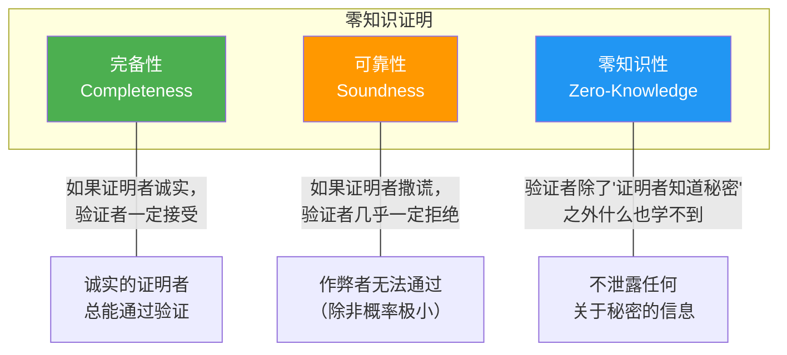
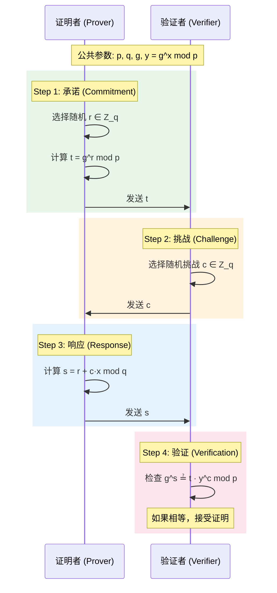
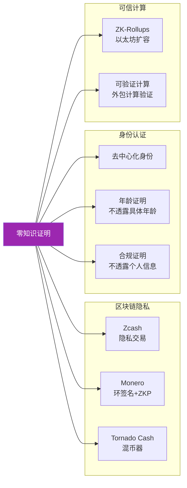

# 6.4 零知识证明入门

## 学习目标

- 理解零知识证明的三个核心性质：完备性、可靠性、零知识性
- 掌握 Schnorr 身份认证协议的完整流程
- 能够实现简单的 Schnorr 协议演示
- 了解零知识证明在区块链和隐私保护中的应用
- 初步了解 zk-SNARKs 的概念和应用场景

## 前置知识

- 模运算和离散对数问题（模块4）
- 数字签名概念（6.1 节）
- 哈希函数（模块2）

## 核心概念与术语

### 什么是零知识证明？

零知识证明（Zero-Knowledge Proof, ZKP）是一种密码学协议，允许 **证明者（Prover）** 向 **验证者（Verifier）** 证明自己知道某个秘密，而 **不泄露关于该秘密的任何信息**。

这个概念最初由 Goldwasser、Micali 和 Rackoff 在 1985 年提出，彻底改变了我们对"证明"的理解。

!!! info "直觉理解"
    想象你要向朋友证明你知道一个保险箱的密码，但你不想告诉朋友密码是什么。零知识证明就是让你能够"证明你知道密码"但"不透露密码本身"的数学方法。

### 三大核心性质

一个零知识证明协议必须满足三个性质：



#### 1. 完备性 (Completeness)

如果证明者确实知道秘密，那么诚实执行协议的验证者 **一定接受** 证明。

$$
P[\text{Verifier accepts} \mid \text{Prover knows } x] = 1
$$

#### 2. 可靠性 (Soundness)

如果证明者不知道秘密，那么无论采用什么策略，验证者接受的概率 **极低**（可忽略不计）。

$$
P[\text{Verifier accepts} \mid \text{Prover doesn't know } x] \leq \text{negligible}
$$

#### 3. 零知识性 (Zero-Knowledge)

验证者在协议执行结束后，除了"证明者知道秘密"这一事实之外，**学不到任何其他信息**。

形式化定义：对于任何验证者 $V^*$，存在一个 **模拟器（Simulator）** $S$，能够在不知道秘密的情况下生成与真实交互不可区分的对话记录。

### 经典比喻：阿里巴巴的洞穴

这是 Jean-Jacques Quisquater 等人在 1989 年提出的著名比喻：

```
        入口
         |
    ┌────┴────┐
    |         |
    |   ←A→   |
    |         |
    ═══════════════  ← 魔法门（需要密码才能通过）
    |         |
    |   ←B→   |
    |         |
    └─────────┘
```

**场景**：一个环形洞穴，中间有一道魔法门。阿里巴巴知道开门的密码。

1. 阿里巴巴随机走入 A 侧或 B 侧
2. 验证者在洞口喊出"从 A 出来"或"从 B 出来"
3. 如果阿里巴巴知道密码，他总能穿过魔法门从指定方向出来
4. 如果阿里巴巴不知道密码，他有 50% 的概率猜对方向

重复 20 次后，不知道密码的人全部猜对的概率为 $(1/2)^{20} \approx 10^{-6}$，几乎不可能。

**零知识性**：验证者只看到阿里巴巴"从指定方向出来"，但不知道密码是什么。

### Schnorr 身份认证协议

Schnorr 协议是最经典、最优雅的零知识证明协议之一，由 Claus-Peter Schnorr 在 1991 年提出。

#### 协议设置

- 公共参数：大素数 $p$，子群阶 $q$（$q \mid (p-1)$），生成元 $g$（$g$ 的阶为 $q$）
- 证明者的私钥：$x \in \mathbb{Z}_q$（秘密）
- 证明者的公钥：$y = g^x \bmod p$（公开）

**证明目标**：证明者向验证者证明自己知道 $x$（满足 $y = g^x$），但不泄露 $x$。

#### 协议流程



#### 为什么它是正确的？

如果证明者知道 $x$，那么：

$$
g^s = g^{r + cx} = g^r \cdot g^{cx} = g^r \cdot (g^x)^c = t \cdot y^c \pmod{p}
$$

验证者检查 $g^s \stackrel{?}{=} t \cdot y^c \bmod p$，如果相等则接受。

#### 为什么它是安全的？

**可靠性**：如果证明者不知道 $x$，他需要在看到挑战 $c$ 之前就提交 $t$。由于 $c$ 是随机的，作弊者猜中正确响应的概率仅为 $1/q$。

**零知识性**：验证者可以自己模拟整个对话（选择随机 $s$ 和 $c$，计算 $t = g^s \cdot y^{-c}$），所以对话记录不包含关于 $x$ 的任何信息。

### Schnorr 协议与数字签名

Schnorr 协议可以转化为数字签名方案（Fiat-Shamir 变换）：

1. 将挑战 $c$ 替换为哈希值：$c = H(m \| t)$
2. 签名为 $(c, s)$ 或 $(t, s)$
3. 验证者可以自行计算 $c$ 并验证

这就是 **Schnorr 签名** 的基础，被广泛应用于：

- 比特币的 Taproot 升级（BIP 340）
- Ed25519 签名方案

### zk-SNARKs 简介

**zk-SNARKs**（Zero-Knowledge Succinct Non-Interactive Arguments of Knowledge）是更高级的零知识证明系统：

| 特性 | 说明 |
|------|------|
| **Zero-Knowledge** | 不泄露任何信息 |
| **Succinct** | 证明很小（几百字节），验证很快 |
| **Non-Interactive** | 无需交互，一次生成证明 |
| **Argument** | 计算可靠性（需要假设计算困难） |
| **Knowledge** | 证明者必须"知道"见证 |

#### zk-SNARKs 的工作原理（简化）

1. **算术电路化**：将要证明的陈述转化为算术电路
2. **R1CS 转换**：转化为 Rank-1 Constraint System
3. **QAP 转换**：转化为 Quadratic Arithmetic Program
4. **可信设置**：生成公共参数（CRS）
5. **证明生成**：证明者生成简洁证明
6. **验证**：验证者通过配对检查验证证明

!!! warning "zk-SNARKs 的局限性"
    - **可信设置**：需要生成公共参考字符串（CRS），如果设置参数泄露，可以伪造证明
    - **电路复杂性**：每个要证明的计算都需要预先转换为电路
    - **量子威胁**：基于椭圆曲线配对，量子计算机可能破解

    新方案如 **zk-STARKs** 不需要可信设置，且具有后量子安全性，但证明更大。

### 零知识证明的应用



## 动手实践

### 实验1：Python 实现 Schnorr 协议

使用配套脚本完整实现 Schnorr 零知识证明协议：

```bash
python scripts/zkp_demo.py
```

预期输出：

```console
============================================================
  Schnorr Zero-Knowledge Proof Demonstration
============================================================

[1] Generating protocol parameters (128-bit q for speed)...
    p = 219071536262913977343863907959790888546177...
    g = 219071536262913977343863907959790888546177...
    q = 109535768131456988671931953979895444273088...
    (p = 2q + 1, safe prime)

[2] Prover's secret x = 73829164572381947...
    (In practice, this stays hidden forever)

[3] Running Schnorr Protocol
--------------------------------------------------
    Public key y = g^x mod p = 18273645192837465...

    [Step 1] Prover -> Verifier: t = 98712364519283746...
    [Step 2] Verifier -> Prover: c = 45678912345678901...
    [Step 3] Prover -> Verifier: s = 34567890123456789...
    [Step 4] Verifier checks: g^s == t * y^c mod p
      g^s    = 123456789012345678...
      t*y^c  = 123456789012345678...
      Result: ACCEPT (proof valid)

    Running 10 more rounds (non-verbose)...
    All 10 rounds: PASS

[4] Soundness Test — Cheating Prover
--------------------------------------------------
    After 1000 random attempts: 0 successes
    Success rate: 0/1000 = 0.0000%
    Cheater cannot pass verification without knowing x!

[5] Zero-Knowledge Test — Transcript Simulation
--------------------------------------------------
    Generating REAL transcript (with knowledge of x)...
    Generating SIMULATED transcript (WITHOUT x)...

    Real transcript valid:       True
    Simulated transcript valid:  True
    Both are valid — transcripts are indistinguishable!
    => The verifier learns NOTHING about x from the transcript
```

### 实验2：理解协议交互

手动运行协议的简化版本，理解每一步的数学关系：

```python
# 简化的 Schnorr 协议交互（Python 交互式）
# 使用小参数以便于理解

p = 23      # 小素数（仅用于演示，实际需要 2048+ 位）
q = 11      # 子群阶
g = 2       # 生成元（g^q mod p = 1）

# 证明者的秘密
x = 7
y = pow(g, x, p)  # y = 2^7 mod 23 = 128 mod 23 = 13

# Step 1: 承诺
import random
r = random.randint(1, q-1)
t = pow(g, r, p)

# Step 2: 挑战
c = random.randint(1, q-1)

# Step 3: 响应
s = (r + c * x) % q

# Step 4: 验证
lhs = pow(g, s, p)
rhs = (t * pow(y, c, p)) % p
print(f"g^s mod p = {lhs}")
print(f"t * y^c mod p = {rhs}")
print(f"Valid: {lhs == rhs}")
```

### 实验3：Schnorr 签名（Fiat-Shamir 变换）

将交互式 Schnorr 协议转化为非交互式签名：

```python
import hashlib

# 使用相同参数
p, q, g = 23, 11, 2
x = 7
y = pow(g, x, p)

# 签名过程
r = random.randint(1, q-1)
t = pow(g, r, p)
message = b"Hello, Schnorr!"
c = int(hashlib.sha256(message + str(t).encode()).hexdigest(), 16) % q
s = (r + c * x) % q

# 验证过程
c_check = int(hashlib.sha256(message + str(t).encode()).hexdigest(), 16) % q
lhs = pow(g, s, p)
rhs = (t * pow(y, c_check, p)) % p
print(f"Signature valid: {lhs == rhs}")
```

## 安全分析与思考

### 零知识证明的效率权衡

| 类型 | 证明大小 | 验证时间 | 交互性 | 可信设置 |
|------|----------|----------|--------|----------|
| **Schnorr** | ~64 bytes | 快 | 交互式 | 无 |
| **zk-SNARKs** | ~200 bytes | 很快 | 非交互 | 需要 |
| **zk-STARKs** | ~50 KB | 快 | 非交互 | 无 |
| **Bulletproofs** | ~1 KB | 较慢 | 非交互 | 无 |

### 交互式 vs 非交互式

- **交互式**：需要证明者和验证者实时通信（Schnorr 协议）
- **非交互式**：证明者生成一个证明，任何人都可以验证（通过 Fiat-Shamir 变换或 zk-SNARKs）

非交互式证明在区块链中尤为重要，因为需要让所有节点都能验证。

### 零知识证明的前沿发展

- **Plonk**：通用 zk-SNARK 系统，只需一次可信设置
- **Halo 2**：递归证明，无需可信设置
- **Nova**：增量可验证计算（IVC）
- **证明聚合**：将多个证明合并为一个，降低验证成本

## 练习题

1. **概念题**：用自己的话解释零知识证明的三个性质。举一个日常生活中的类比。

2. **数学题**：在 Schnorr 协议中，假设 $p = 23, q = 11, g = 2$，证明者的秘密 $x = 5$。
   - 计算公钥 $y$
   - 如果 $r = 3$，计算承诺 $t$
   - 如果挑战 $c = 7$，计算响应 $s$
   - 验证 $g^s \stackrel{?}{=} t \cdot y^c \bmod p$

3. **编程题**：修改 `zkp_demo.py`，实现以下功能：
   - 支持多次协议执行并统计验证成功率
   - 实现 Fiat-Shamir 变换将交互式协议转为签名方案
   - 使用更大的参数（256-bit q）

4. **思考题**：为什么零知识证明的模拟器存在性意味着验证者学不到任何信息？

5. **研究题**：了解 Zcash 如何使用 zk-SNARKs 实现隐私交易。解释 "shielded transaction" 的工作原理。

## 延伸阅读

- [How to Explain Zero-Knowledge Protocols to Your Children](https://pages.cs.wisc.edu/~mkowalcz/628.pdf) — 经典的阿里巴巴洞穴比喻
- [ZKP MOOC by Dan Boneh](https://zk-learning.org/) — 斯坦福大学零知识证明课程
- [Zcash Protocol Specification](https://zips.z.cash/protocol/protocol.pdf)
- [Vitalik Buterin's ZK-SNARKs Introduction](https://vitalik.eth.limo/general/2021/01/26/snarks.html)
- [Schnorr Signatures in Bitcoin (BIP 340)](https://github.com/bitcoin/bips/blob/master/bip-0340.mediawiki)
