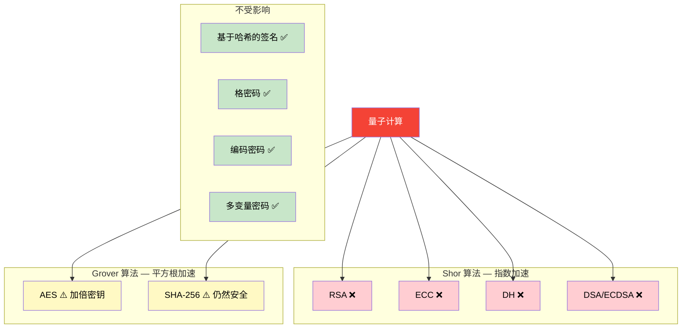
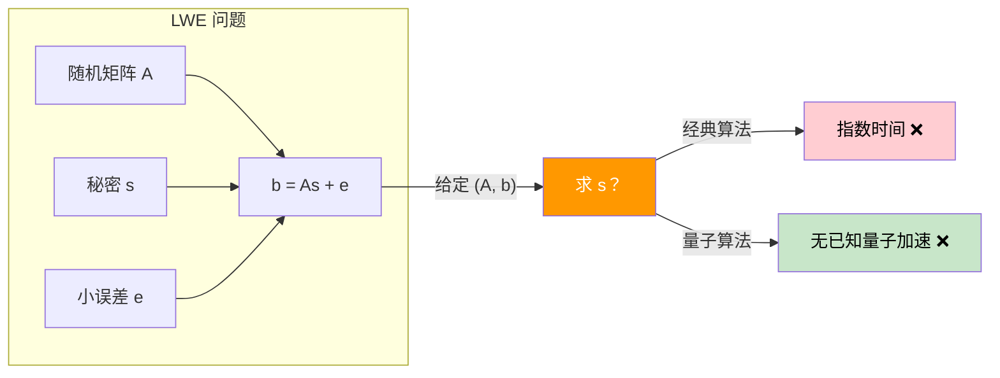
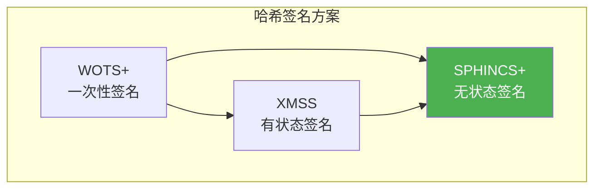
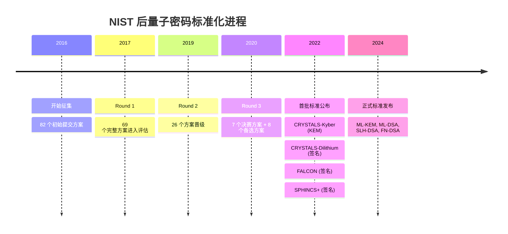

# 6.5 后量子密码学概述

## 学习目标

- 理解量子计算对现有密码体系的威胁（Shor 算法和 Grover 算法）
- 了解后量子密码学的主要候选方案及其数学基础
- 掌握格密码（Lattice-based）的核心概念：LWE 问题
- 了解 NIST 后量子密码标准化的进展和最终标准
- 能够用 Python 演示 LWE 问题的基本实例

## 前置知识

- RSA 算法和离散对数问题（模块4）
- 哈希函数的性质（模块2）
- 基本的线性代数知识（矩阵运算）
- 基本的概率论知识

## 核心概念与术语

### 量子计算的威胁

量子计算机不是"更快的经典计算机"，而是一种利用量子力学原理（叠加态、纠缠）进行计算的全新计算范式。虽然目前的量子计算机还不够强大，但理论上它们对密码学有深远的影响。

#### Shor 算法

1994 年，Peter Shor 提出了在量子计算机上高效分解大整数和求解离散对数的算法。

| 问题 | 经典计算机 | 量子计算机（Shor） |
|------|-----------|-------------------|
| 分解 $n$ 位整数 | $O(e^{n^{1/3}})$ — 次指数时间 | $O(n^3)$ — **多项式时间** |
| 离散对数 | $O(e^{n^{1/2}})$ — 指数时间 | $O(n^3)$ — **多项式时间** |

$$
\text{Shor算法}: N = p \times q \xrightarrow{\text{量子多项式时间}} p, q
$$

**受影响的算法**：

| 算法 | 依赖的数学问题 | Shor 算法威胁 |
|------|---------------|--------------|
| **RSA** | 大整数分解 | 直接威胁，可分解模数 |
| **ECC** | 椭圆曲线离散对数 | 直接威胁，可求私钥 |
| **DH** | 离散对数 | 直接威胁，可求私钥 |
| **DSA/ECDSA** | 离散对数 | 直接威胁，可伪造签名 |

!!! danger "Shor 算法的影响"
    一旦大规模量子计算机建成，**所有基于整数分解和离散对数的密码系统都将被破解**。这包括：

    - RSA（所有密钥长度）
    - ECC（所有曲线）
    - Diffie-Hellman 密钥交换
    - DSA / ECDSA 签名

    这不仅仅是"需要更长的密钥"的问题 —— 这些算法的数学基础本身就被量子算法击破了。

#### Grover 算法

1996 年，Lov Grover 提出了在量子计算机上搜索无序数据库的算法，提供 **平方根加速**。

$$
\text{Grover}: \text{搜索} N \text{个元素} \xrightarrow{\text{经典}} O(N) \xrightarrow{\text{量子}} O(\sqrt{N})
$$

**对密码学的影响**：

| 算法类型 | 经典安全级别 | 量子后等效安全级别 |
|----------|------------|------------------|
| AES-128 | 128 bits | 64 bits |
| AES-256 | 256 bits | 128 bits |
| SHA-256 (碰撞) | 128 bits | 85 bits |
| SHA-256 (原像) | 256 bits | 128 bits |

!!! tip "Grover 的影响相对有限"
    Grover 算法只提供平方根加速，可以通过 **加倍密钥长度** 来应对：

    - AES-128 → AES-256（128-bit 量子安全）
    - SHA-256 仍然足够安全（128-bit 量子原像抗性）

    这与 Shor 算法的影响完全不同 —— Shor 算法是指数级加速，无法通过增加密钥长度来防御。

### 量子威胁总结



### 后量子密码学候选方案

后量子密码学（Post-Quantum Cryptography, PQC）研究的是 **即使在量子计算机存在的情况下仍然安全** 的密码算法。

#### 1. 格密码 (Lattice-based)

格密码是目前最有前途的后量子密码方案，也是 NIST 标准化的主要方向。

**核心数学问题：Learning With Errors (LWE)**

给定矩阵 $A \in \mathbb{Z}_q^{n \times n}$，秘密向量 $\mathbf{s} \in \mathbb{Z}_q^n$，小误差向量 $\mathbf{e} \in \mathbb{Z}_q^n$：

$$
\mathbf{b} = A\mathbf{s} + \mathbf{e} \pmod{q}
$$

**问题**：给定 $(A, \mathbf{b})$，求 $\mathbf{s}$。



**为什么 LWE 对量子计算机也很难？**

- LWE 问题等价于在格中寻找最近向量（CVP）的困难版本
- 目前没有已知的量子算法能比经典算法显著更快地解决格问题
- 格问题被认为是"后量子安全"的最佳候选

**LWE 的直觉理解**：

想象一个线性方程组 $A\mathbf{s} = \mathbf{b}$，在没有误差时可以用高斯消元法求解。但 LWE 在每个方程中都加入了小误差 $\mathbf{e}$，使得：

- 高斯消元法无法精确求解
- 误差很小，使得 $\mathbf{b}$ "接近" $A\mathbf{s}$，但不知道确切的偏差
- 找到 $\mathbf{s}$ 等价于解决一个困难的格问题

#### 2. 哈希签名 (Hash-based)

基于哈希函数的签名方案不依赖数论问题，安全性仅依赖哈希函数的抗碰撞性。

**SPHINCS+ (SLH-DSA)**：

- NIST 标准化方案之一
- 基于哈希函数的无状态签名
- 签名较大（~7-50 KB），但安全性假设最简单
- 只需要哈希函数是安全的



| 特性 | SPHINCS+ (SLH-DSA) |
|------|---------------------|
| 安全性基础 | 仅依赖哈希函数 |
| 密钥大小 | ~64 bytes |
| 签名大小 | ~7-50 KB |
| 签名速度 | 较慢 |
| 验证速度 | 快 |
| 优势 | 安全性假设最保守 |

#### 3. 编码密码 (Code-based)

基于纠错码的困难问题。

**McEliece 加密方案（1978）**：

- 使用 Goppa 码作为陷门
- 公钥是随机化的生成矩阵
- 秘密是 Goppa 码的结构

$$
\text{加密}: \mathbf{c} = \mathbf{m}G' + \mathbf{e}
$$

其中 $G'$ 是公钥（随机化的生成矩阵），$\mathbf{e}$ 是随机错误向量。

| 特性 | McEliece (ML-KEM) |
|------|-------------------|
| 安全性基础 | 解码随机线性码的困难性 |
| 密钥大小 | 很大（~260 KB 到几 MB） |
| 密文大小 | 较大 |
| 优势 | 经过 40+ 年的密码分析 |

#### 4. 多变量密码 (Multivariate)

基于求解多变量二次方程组的困难性（MQ 问题）。

给定 $m$ 个二次多项式 $p_1, \ldots, p_m$ 在 $n$ 个变量上，找到 $\mathbf{x}$ 使得：

$$
p_1(\mathbf{x}) = p_2(\mathbf{x}) = \cdots = p_m(\mathbf{x}) = 0
$$

一般情况下这是 NP-完全问题，但特定构造可以设计陷门。

### NIST 后量子标准化

NIST（美国国家标准与技术研究院）从 2016 年开始征集后量子密码标准，经过多轮评估：



#### 最终标准方案

| 标准名称 | 原始名称 | 类型 | 数学基础 | 用途 |
|----------|----------|------|----------|------|
| **ML-KEM** | CRYSTALS-Kyber | 密钥封装 | 模格 LWE | 密钥交换 |
| **ML-DSA** | CRYSTALS-Dilithium | 数字签名 | 模格 LWE | 通用签名 |
| **SLH-DSA** | SPHINCS+ | 数字签名 | 哈希函数 | 保守选择 |
| **FN-DSA** | FALCON | 数字签名 | NTRU 格 | 紧凑签名 |

#### 各方案参数对比

| 方案 | 公钥大小 | 私钥大小 | 密文/签名大小 |
|------|----------|----------|--------------|
| ML-KEM-768 | 1,184 B | 2,400 B | 1,088 B |
| ML-DSA-65 | 1,952 B | 4,032 B | 3,293 B |
| SLH-DSA-128s | 32 B | 64 B | 7,856 B |
| FN-DSA | 897 B | 1,281 B | 666 B |
| RSA-2048 (对比) | 256 B | 256 B | 256 B |
| ECDSA P-256 (对比) | 64 B | 32 B | 64 B |

!!! warning "后量子方案的代价"
    后量子密码方案普遍比传统方案需要更大的密钥和签名：

    - ML-DSA 签名是 ECDSA 的 ~50 倍
    - SLH-DSA 签名是 ECDSA 的 ~120 倍
    - FN-DSA 签名是 ECDSA 的 ~10 倍（最紧凑）

    这对带宽、存储和性能都有影响，需要在安全性与效率之间权衡。

### 量子密钥分发 (QKD)

除了后量子密码算法，还有一类基于物理原理的安全通信方式：

**QKD (Quantum Key Distribution)** 利用量子力学原理（测量会扰动量子态）来安全地分发密钥。

**BB84 协议**（Bennett 和 Brassard, 1984）：

1. Alice 随机选择基（直线基 $\{|0\rangle, |1\rangle\}$ 或对角基 $\{|+\rangle, |-\rangle\}$）
2. Alice 发送编码了比特的光子给 Bob
3. Bob 随机选择基测量
4. 双方公开比较基的选择（不公开比特值）
5. 保留基相同的部分作为密钥
6. 如果有窃听者（Eve），错误率会异常升高

!!! info "QKD vs PQC"
    | 特性 | QKD | PQC (后量子算法) |
    |------|-----|------------------|
    | 安全性基础 | 物理定律 | 数学困难问题 |
    | 需要特殊硬件 | 是（光子发射/检测器） | 否（纯软件） |
    | 距离限制 | ~100 km（光纤） | 无限制 |
    | 成本 | 很高 | 低（软件升级） |
    | 成熟度 | 部分商用 | 标准化完成 |

    两者不是竞争关系，而是互补的。

### 现在就应该开始迁移吗？

**答案是：是的。**

!!! danger "先收集，后解密 (Harvest Now, Decrypt Later)"
    攻击者可以现在收集加密的通信数据，等量子计算机成熟后再解密。对于需要长期保密的数据（如政府机密、医疗记录、知识产权），**现在就应该使用后量子密码**。

迁移建议：

1. **混合模式**：同时使用传统算法和后量子算法（如 ECDHE + ML-KEM）
2. **优先迁移**：先迁移长期保密的数据和通信
3. **密钥轮换**：增加密钥轮换频率
4. **库存盘点**：识别系统中所有使用密码学的组件
5. **敏捷性**：确保密码系统可以灵活更换算法

## 动手实践

### 实验1：Python 演示 LWE 问题

使用配套脚本演示格密码的基本概念：

```bash
python scripts/lattice_demo.py
```

预期输出（部分）：

```console
============================================================
  Part 2: Learning With Errors (LWE)
============================================================

    --- Small Example ---
    Dimension n = 4, Modulus q = 23
    Secret s = [3 7 2 5]
    Random matrix A:
      [1 4 6 2]
      [8 3 1 7]
      [5 9 2 4]
      [3 6 8 1]
    Error e = [ 0 -1  1  0]
    b = A*s + e mod q = [ 9  3  2  8]

    Given (A, b), finding s is the LWE problem.
    The small error e makes this hard!

    --- LWE Encryption Demo ---
    Parameters: n=64, q=97, error_bound=1

    Encrypting and decrypting bits:
      Plaintext: 0 -> Decrypted: 0 [OK]
      Plaintext: 1 -> Decrypted: 1 [OK]
      ...
    All decryptions correct: True
```

### 实验2：SageMath 格基约化

如果你安装了 SageMath，可以运行以下代码演示 LLL 格基约化算法：

将以下代码保存为 `lll_demo.sage` 文件，然后用 `sage lll_demo.sage` 运行：

```bash
# 保存为 lll_demo.sage，然后运行: sage lll_demo.sage
# SageMath: LLL 格基约化演示

# 定义一个整数矩阵作为格基
B = matrix(ZZ, [
    [19, 2, 32, 46, 3],
    [15, 42, 11, 0, 23],
    [43, 15, 0, 24, 42],
    [20, 44, 45, 0, 21],
    [0, 46, 34, 15, 5]
])

print("Original basis:")
print(B)
print()

# 行范数（向量长度）
print("Original vector norms:")
for i in range(B.nrows()):
    print(f"  ||b{i}|| = {B[i].norm().n():.2f}")

# LLL 约化
B_reduced = B.LLL()

print("\nReduced basis (LLL):")
print(B_reduced)
print()

print("Reduced vector norms:")
for i in range(B_reduced.nrows()):
    print(f"  ||b{i}|| = {B_reduced[i].norm().n():.2f}")

# 对比
print(f"\nShortest original vector:  {min(B[i].norm() for i in range(B.nrows())).n():.2f}")
print(f"Shortest reduced vector:   {min(B_reduced[i].norm() for i in range(B_reduced.nrows())).n():.2f}")
```

### 实验3：理解 LWE 加密

```python
import numpy as np

# LWE 加密解密演示
np.random.seed(42)

n = 16     # 维度
q = 97     # 模数
sigma = 1  # 噪声标准差

# 密钥生成
s = np.random.randint(0, q, size=n)

# 生成公钥 (A, b)
A = np.random.randint(0, q, size=(n, n))
e = np.round(np.random.normal(0, sigma, size=n)).astype(int)
b = (A @ s + e) % q

# 加密比特 1
m = 1
r = np.random.randint(0, 2, size=n)
u = (A.T @ r) % q
v = (b @ r + m * (q // 2)) % q

# 解密
result = (v - s @ u) % q
if result > q // 2:
    result -= q
decrypted = 0 if abs(result) < q // 4 else 1

print(f"Original bit: {m}")
print(f"Decrypted bit: {decrypted}")
print(f"Match: {m == decrypted}")
```

## 安全分析与思考

### 后量子迁移的挑战

1. **性能开销**：后量子方案的密钥和签名更大，计算更慢
2. **兼容性**：现有协议和系统需要更新
3. **混合部署**：过渡期需要同时支持传统和后量子算法
4. **不确定性**：新的密码分析可能发现后量子方案的弱点
5. **监管合规**：各国政府正在制定后量子迁移时间表

### 后量子密码的时间线

| 时间 | 事件 |
|------|------|
| 2024 | NIST 正式发布首批 PQC 标准 |
| 2025-2030 | 主要云服务商和浏览器开始支持 PQC |
| 2030 | NIST 建议弃用 RSA-2048 和 ECC P-256 |
| 2035 | 预计 RSA 和 ECC 被完全淘汰 |
| 2040+ | 大规模量子计算机可能成为现实 |

!!! tip "行动建议"
    - **开发者**：关注 `liboqs`、`pqcrypto` 等库，开始在测试环境中使用 PQC
    - **企业**：进行密码库存盘点，制定迁移计划
    - **个人**：使用支持 PQC 的 TLS 库（如 OpenSSL 3.x 已支持实验性 PQC）

## 练习题

1. **概念题**：解释 Shor 算法和 Grover 算法的区别。为什么说 Grover 算法的影响可以通过增加密钥长度来缓解，而 Shor 算法不行？

2. **数学题**：在 LWE 问题中，假设 $n=3, q=17$，秘密 $\mathbf{s} = (2, 5, 3)$。给定矩阵 $A$ 和误差 $\mathbf{e}$：
   $$
   A = \begin{pmatrix} 4 & 7 & 1 \\ 9 & 3 & 6 \\ 2 & 8 & 5 \end{pmatrix}, \quad \mathbf{e} = (0, 1, -1)
   $$
   计算 $\mathbf{b} = A\mathbf{s} + \mathbf{e} \pmod{17}$。然后尝试不使用 $\mathbf{s}$ 直接求解，体会困难性。

3. **实验题**：修改 `lattice_demo.py`，增加以下功能：
   - 测试不同维度 $n$ 和模数 $q$ 对解密正确率的影响
   - 可视化 LWE 噪声分布
   - 比较 LWE 和 Ring-LWE 的效率

4. **研究题**：了解 NIST 的 ML-KEM (Kyber) 方案。它的密钥封装过程与传统的 ECDHE 密钥交换有什么异同？

5. **思考题**：如果你是一家银行的首席安全官，你会在什么时候开始后量子密码迁移？列出优先级和步骤。

## 延伸阅读

- [NIST Post-Quantum Cryptography Standardization](https://csrc.nist.gov/projects/post-quantum-cryptography)
- [NIST FIPS 203 - ML-KEM](https://csrc.nist.gov/pubs/fips/203/final)
- [NIST FIPS 204 - ML-DSA](https://csrc.nist.gov/pubs/fips/204/final)
- [The Lattice-Based Cryptography Survey](https://eprint.iacr.org/2015/939)
- [Post-Quantum Cryptography for the Long Term](https://blog.cloudflare.com/post-quantum-for-all/)
- [liboqs - Open Quantum Safe](https://openquantumsafe.org/)
- [A Gentle Introduction to Lattice-Based Cryptography](https://cims.nyu.edu/~regev/papers/pqc.pdf)
