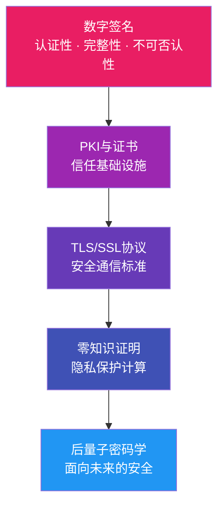
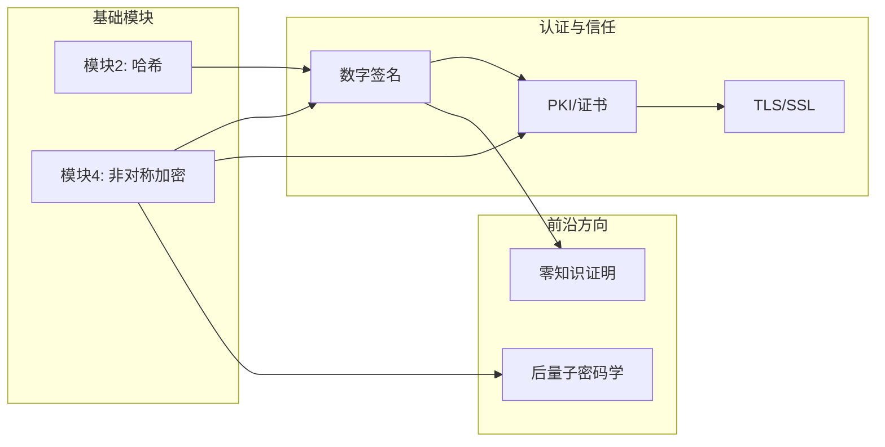

# 模块6：高级应用与现代密码学

> **Module 6: Advanced Applications & Modern Cryptography**

---

## 模块概述

在前五个模块中，我们学习了密码学的基础构件——哈希函数、对称加密、非对称加密和密码分析技术。本模块将把这些知识 **串联** 起来，探索它们在真实世界中的高级应用，并展望密码学的未来方向。



---

## 学习路线

| 课时 | 主题 | 关键词 | 难度 |
|:----:|------|--------|:----:|
| 6.1 | [数字签名](01-signatures.md) | RSA签名、ECDSA、不可否认性 | ⭐⭐⭐ |
| 6.2 | [PKI与X.509证书体系](02-pki.md) | CA、证书链、信任锚 | ⭐⭐⭐ |
| 6.3 | [TLS/SSL协议分析](03-tls.md) | 握手过程、密码套件、TLS 1.3 | ⭐⭐⭐⭐ |
| 6.4 | [零知识证明入门](04-zkp.md) | Schnorr协议、zk-SNARKs、隐私 | ⭐⭐⭐⭐ |
| 6.5 | [后量子密码学概述](05-post-quantum.md) | 格密码、NIST标准化、量子威胁 | ⭐⭐⭐⭐⭐ |

---

## 前置知识

在学习本模块之前，你应该已经掌握：

- :material-check: **模块2**：哈希函数的性质与应用（SHA-256、HMAC）
- :material-check: **模块4**：RSA算法、椭圆曲线密码学（ECC）、Diffie-Hellman密钥交换
- :material-check: 基本的数论知识（模运算、离散对数）

!!! tip "建议"
    如果你对 RSA 或 ECC 还不熟悉，建议先完成 [模块4](../04-asymmetric/index.md) 的学习。

---

## 工具准备

本模块使用的工具：

| 工具 | 用途 | 安装方式 |
|------|------|----------|
| **OpenSSL** | 证书管理、TLS连接、数字签名 | 系统自带或 [openssl.org](https://www.openssl.org/) |
| **Python 3** | 签名算法实现、ZKP演示、格密码 | [python.org](https://www.python.org/) |
| **SageMath** | 格基约化计算 | [sagemath.org](https://www.sagemath.org/) |
| **Node.js** | HTTPS服务器/客户端演示 | [nodejs.org](https://nodejs.org/) |

Python 依赖安装：

```bash
pip install cryptography pycryptodome numpy
```

---

## 配套脚本

本模块包含以下 Python 演示脚本：

| 脚本 | 说明 | 对应课时 |
|------|------|----------|
| `scripts/rsa_signature.py` | RSA 数字签名演示 | 6.1 |
| `scripts/ecdsa_demo.py` | ECDSA 签名演示 | 6.1 |
| `scripts/zkp_demo.py` | Schnorr 零知识证明协议演示 | 6.4 |
| `scripts/lattice_demo.py` | 格密码（LWE）入门演示 | 6.5 |

---

## 学习目标

完成本模块后，你将能够：

1. **理解数字签名** 的原理，区分 RSA 签名与 ECDSA 签名的异同
2. **掌握 PKI 体系** 的运作方式，能够创建和验证 X.509 证书
3. **分析 TLS 协议** 的握手过程，理解 TLS 1.3 的关键改进
4. **解释零知识证明** 的三大性质，实现简单的 Schnorr 协议
5. **评估量子计算** 对现有密码体系的威胁，了解后量子密码学的候选方案

---

## 模块总览图



---

!!! info "关于本模块"
    本模块涵盖的内容从工程实践（数字签名、PKI、TLS）到学术前沿（零知识证明、后量子密码学），难度逐步递增。建议按顺序学习，每个主题都配有动手实验和 Python 脚本，确保理论与实践结合。
